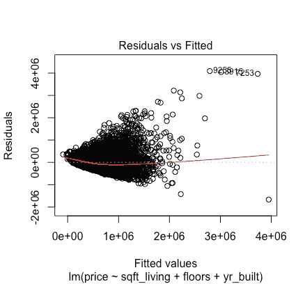
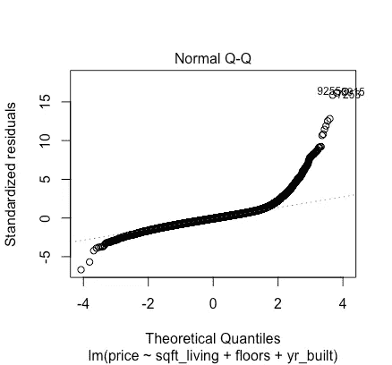
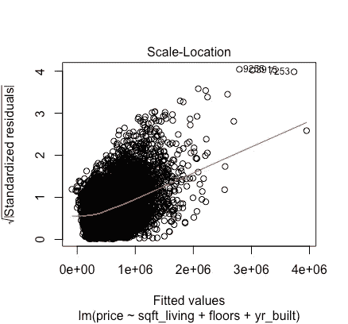
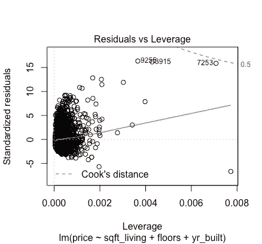
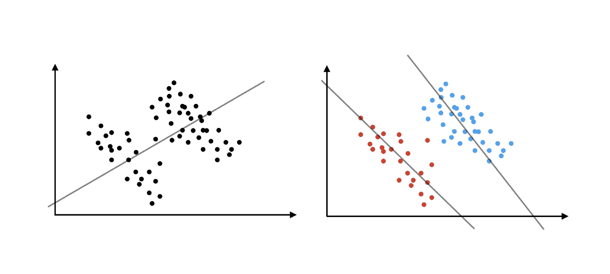

# 线性回归:深入挖掘

> 原文：<https://towardsdatascience.com/linear-regression-digging-deeper-b82672f168ce?source=collection_archive---------17----------------------->

## 如何发现和解决大多数与线性回归相关的问题

# 快速介绍

在我们关于线性回归的第一篇文章中，我们介绍了一种最简单但功能强大的机器学习形式的基础知识。在教程中，数据通常是精心选择的，以满足我们的需求，而不会带来很多困难。然而，在现实生活中，事情并不总是那么简单:我们经常遇到违反许多基本理论假设的数据，而这些假设是我们的线性模型有意义所必需的。当我们遇到这样的数据时，我们该怎么办？我们就这么放弃了吗？当然不是！根据出现的问题，我们可以使用许多技术来使我们的线性回归可行。在本文中，我们将讨论一些您应该注意的警告，以及如何解决它们。

# 重要的事情先来

我们现在将继续我们为预测房价建立的最后一个模型。如果你没有读过[我们之前关于线性回归基础的文章](https://medium.com/dataseries/linear-regression-the-basics-4daad1aeb845)，这是一个使用房屋面积、楼层数和建造年份来估计房价的模型。

首先，让我们看看当我们运行回归模型时，如何解释 R 生成的每个图，这样我们就可以发现其中的一些问题。当我们使用线性回归模型运行命令 *plot()* 时，它返回 4 个图，每个图有不同的解释:

```
**IN:**
path = 'insert you file path here'
data = read.csv(paste(path,'kc_house_data.csv', sep = ""))
model3 = lm(price ~ sqft_living + floors + yr_built, data = data)
plot(model3)
```



## **曲线 1:残差与拟合值的对比**

在该图中，X 轴上是*拟合值*(由我们的模型估计的值)，Y 轴上是*残差*(估计值和实际值之间的差值)。红线给出的图的形状表明我们的数据实际上是否是线性的(这是线性回归的一个基本条件)。在这种情况下，直线是一个很好的迹象，表明相对线性的形状。如果那条线是一条大曲线或抛物线，那将表明我们的数据遵循非线性模式。如果是这样的话，我们就需要另一种回归，这取决于曲线的形状，比如多项式回归。

## **图 2:正常 Q-Q**



在这个图中，我们可以检查我们的残差是否正态分布，这是线性模型的另一个假设。在这种情况下，我们有一个问题:这些点应该遵循一条或多或少的直线，但在这里显然不是这样。从图中，我们还可以看到，我们有一些大的离群值，我们的分布是偏斜的，它有“重尾”。通常，这不是一个大问题:如果你的样本足够大，你可以忽略它，因为它不会对你的预测产生太大的影响。关于这个情节的更多细节，请查看[这个链接](https://data.library.virginia.edu/understanding-q-q-plots/)。

## **剧情三:规模定位**



在标度-位置图中，我们检查异方差/同方差:线性回归的假设之一是残差具有恒定方差(同方差)。当这个假设被违反时，我们说存在异方差问题。同方差是线性回归模型的一个关键假设，为了确保满足这个假设，我们希望图上的红线或多或少是直的和水平的，但这里显然不是这样。如果你不确定你有一条直线，你也可以运行一个 Breusch-Pagan 测试，包括在 lmtest 库中，为了更精确:

```
**IN**:
library(lmtest)
bptest(model3)**OUT**:

 studentized Breusch-Pagan testdata:  model3
BP = 2633.3, df = 3, p-value < 2.2e-16
```

简单来说，一个非常小的 p 值(例如小于 0.05)表示异方差(你可以在这里了解更多关于这个测试的信息)。

好的，那么我们如何调整我们的模型来考虑这种偏差呢？在进行回归分析时，我们必须考虑这些不同的标准偏差范围。有一些方法可以做到这一点，其中之一是稳健回归(这也有助于解决离群值)。幸运的是，在一个名为 robust 的包中有一个函数可以帮我们做到这一点:

```
**IN:**
library(robust)
model4 = lmRob(price ~ sqft_living + floors + yr_built, data = data)
summary(model4)**OUT:**
lmRob(formula = price ~ sqft_living + floors + yr_built, data = data)Residuals:
    Min      1Q  Median      3Q     Max 
-794793  -99349    6057  122207 5111794Coefficients:
              Estimate Std. Error t value Pr(>|t|)    
(Intercept)  4.033e+06  9.036e+04   44.64   <2e-16 ***
sqft_living  1.895e+02  1.556e+00  121.83   <2e-16 ***
floors       7.777e+04  2.548e+03   30.53   <2e-16 ***
yr_built    -2.054e+03  4.699e+01  -43.72   <2e-16 ***
---
Signif. codes:  0 ‘***’ 0.001 ‘**’ 0.01 ‘*’ 0.05 ‘.’ 0.1 ‘ ’ 1Residual standard error: 162500 on 21609 degrees of freedom
Multiple R-Squared: 0.317Test for Bias:
            statistic p-value
M-estimate      161.7       0
LS-estimate    4830.0       0
```

正如我们所看到的，我们的剩余标准误差降低了，我们的 R 平方提高了，这是一个好迹象。

## **图表 4:残差与杠杆**



这是帮助我们发现异常值的图，这些异常值与其他观察值相差甚远，以至于扰乱了我们的回归。我们观察图的右角，发现红色虚线。过去的一切可能会使我们的模型产生偏差。通常，我们可以通过它们的行号(标绘的)来识别这些点，并在没有它们的情况下重新运行我们的回归。

# 等等，还有呢！

那么，除了非线性、非正态分布的残差、异方差、异常值，线性回归中实际上还有其他棘手的方面吗？的确，其中一些非常相关。

## 多重共线性

这违反了线性回归中一个非常重要的假设，这个假设经常被忽略:解释变量必须是独立的。如果不是，我们就说模型中存在多重共线性。检查的方法之一是计算模型的 VIF(方差膨胀因子)。粗略地说，它告诉我们，与没有多重共线性的假设情况相比，估计量的方差被夸大了多少。

```
**IN:**
vif(model3)**OUT:**
sqft_living      floors    yr_built 
   1.180454    1.395073    1.357629
```

没有硬性规定，但一般来说，我们可以说，如果 VIF 是 1，那么没有相关性，如果它在 1 和 5 之间，有中度相关性，如果它大于 5，有高度相关性(所以我们的模型应该是好的)。当存在高度相关性时，我们应该寻找高度相关的变量，并从模型中移除其中一个。

处理多重共线性的更好方法是进行岭回归、套索回归或弹性网回归。一般来说，他们会增加解释变量的权重，以确保不相关的变量获得较小的权重。另一种类型的回归称为逐步回归，它也有助于选择变量:它尝试不同的特征组合，然后根据一些标准选择最佳模型。

## 辛普森悖论

这是一个非常有趣的统计悖论，如下图所示。



If we only sample the red group or the blue group, we might have the wrong idea about our data

虽然当我们在不同的组中测试时，我们的数据可能呈现负相关，但总体的关系可能是相反的。当我们的模型中没有考虑第三个变量时(在图中，这是由颜色表示的变量)，这个问题就出现了，这表明选择正确的特征是至关重要的。

## 型号选择标准

即使在尝试了几种不同的模型并确保它们都符合我们的假设之后，我们仍然可能最终得到几个运行良好的模型。那么，如何才能选出最好的呢？嗯，有一些比较线性回归模型的经典标准，主要的是[赤池信息标准(AIC)](https://en.wikipedia.org/wiki/Akaike_information_criterion) ，它衡量每个模型丢失了多少信息。从定义上来说，模型是对现实的简化，因此它总是会丢失一些信息。AIC 所做的是比较这些模型，看看哪一个丢失的信息更少，因此，AIC 越小越好。

```
**IN:**
AIC(model1, model2, model3)**OUT:**
       df      AIC
model1  3 600540.6
model2  4 600540.4
model3  5 598739.3
```

在我们的例子中，模型 3 具有最小的 AIC，因此，根据这个标准，它是最好的模型。

# 结论

正如我们所见，尽管这是一个相对简单的过程，但做线性回归有许多微妙之处。这些是你在做这些事情时可能遇到的主要问题，以及一些可能的解决方案。显然，事情远不止如此，如果你想进一步研究，这里有一些有用的信息来源:

## 总体理解线性回归

[https://en.wikipedia.org/wiki/Linear_regression](https://en.wikipedia.org/wiki/Linear_regression)

https://learningstatisticswithr.com/book/regression.html

## 了解线性回归图

【https://data.library.virginia.edu/diagnostic-plots/ 

## 线性回归陷阱

[https://www . clock back ward . com/2009/06/18/普通-最小二乘-线性-回归-缺陷-问题-陷阱/](https://www.clockbackward.com/2009/06/18/ordinary-least-squares-linear-regression-flaws-problems-and-pitfalls/)

你可以访问完整的 R 脚本[这里](https://github.com/arthurmello/statistics/tree/master/1.%20Linear%20regression)。