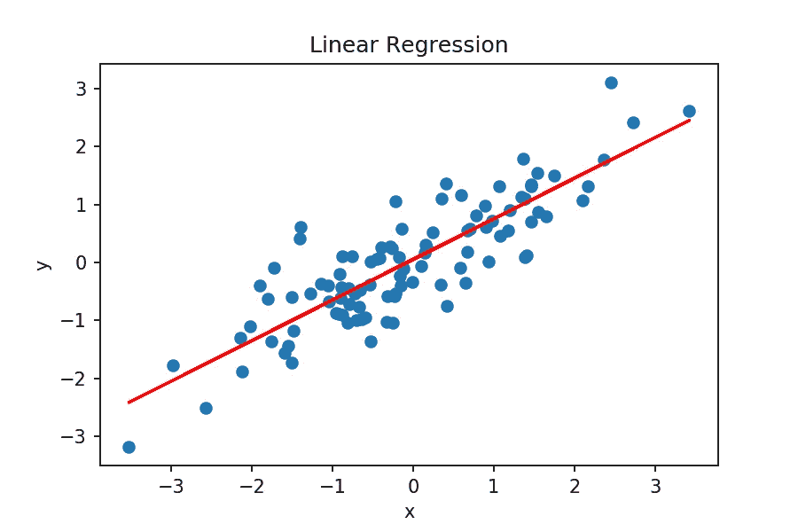
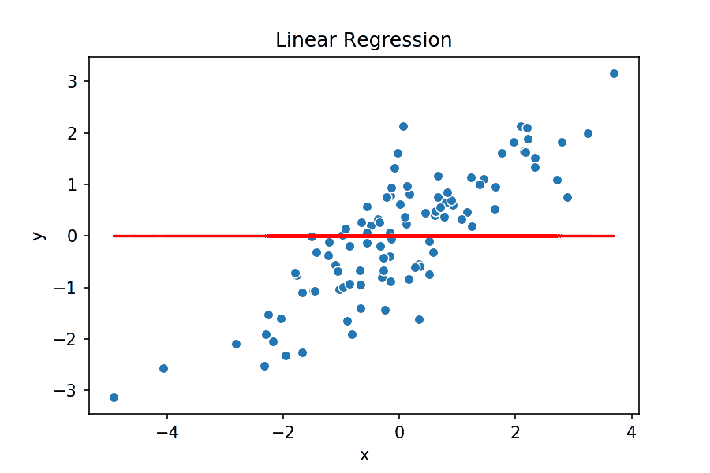

# 从头开始线性回归

> 原文：<https://towardsdatascience.com/linear-regression-from-scratch-977cd3a1db16?source=collection_archive---------9----------------------->

在过去的几周里，我一直在快速学习 Goodfellow 和 Bengio 的深度学习。我从中学到了很多。这本书探索了广泛的机器学习+深度学习主题，并深入研究了这些技术背后的数学。这是一个很好的资源，可以让你对这个领域有一个基本的了解。

为了巩固我正在阅读的内容，我决定用 vanilla Python 和 numpy 对我正在研究的模型进行编码。如果可能的话，我还会创建一些正在发生的事情的基本可视化。

在这里，我将从本书的第一个也是最基本的模型开始:线性回归。事不宜迟，以下是我所做工作的概要。

# 动机

在我进入实现的肮脏细节之前，我想首先给出为什么要使用线性回归的一般概念。我们正在做的事情的动机是什么？

嗯，一般来说，线性回归是一个很好的预测连续变量的模型， **y** ，基于一个连续的(有时是离散的)输入， **x** 。线性回归模型将输入 **x** 组合在一起，对输出 **y** 进行良好的预测。例如，我们可以使用一个线性回归模型来预测房子的价格， **y** ，基于一些输入特征， **x** (例如，平方英尺、卧室数量等。).

*需要注意的一点是，首先需要数据(* ***x*** *，* ***y*** *对)来训练线性回归模型，然后才能做出准确的预测。稍后我们将详细讨论这是如何实现的。*

# **实现！**

线性回归模型的实施有 **5 个主要组成部分**:模型、成本函数、参数、梯度和优化算法(如正常方程、梯度下降)。我们将在下面更深入地探讨每一个问题。

*注意，这种实现推广到更高维度的空间。换句话说，它可以用(* ***x* ₁** *，* ***y*** *)数据做线性回归，用(* ***x* ₁** *，* ***x* ₂** *，* ***y*** *)* ***x* ₂** *，* ***x* ₃** *，****y****)4 个维度的数据，以此类推。 通常，我们的模型将(n-1)维超平面拟合到 n 维空间中的数据。*

## 模型

该模型由一个权重矩阵 **W** 与我们的数据 **X** 的基本线性组合来定义，其中添加了一个偏差项 **b** 以使我们的预测偏离原点。

*这里注意@符号是矩阵乘法的。*

## 成本函数

成本函数设定线性回归的目标。它定义了我们想要达到的目标。一般来说，清楚地定义你的成本函数是很重要的。你不能击中一个目标，直到你定义它是什么，对不对？这里，我们将成本函数定义为所有训练示例中我们对 **y** 的预测和 **y** 的实际值之间的平均平方距离。

## 参数

我们需要初始参数的值。参数不需要接近完美，只是一些开始预测的东西。这里，我们将初始化 **W** 为一个零向量，并将 **b** 初始化为 0。参数初始化有点像你刚出生时的知识。你真的不知道发生了什么，但这是一个开始！

## **坡度**

我们使用梯度来学习我们的参数应该取什么值，以便最小化我们的成本函数。梯度公式是通过对我们的成本函数相对于 **W** 和 **b** 求导得到的。梯度为我们提供了移动 **W** 和 **b** 的方向，以便最小化我们的成本函数。请记住:通过最小化我们的成本函数，根据定义*，减少我们的模型对我们的训练数据的 T84 预测 T85 和地面真实值**y**之间的平方距离。*

## *优化算法*

*我将在这里介绍两种优化算法:**梯度下降**，和**正常方程**。*

*梯度下降包括使用梯度在多次连续迭代中最小化成本函数，直到它收敛(即，达到它的最低点)。梯度下降有两个需要调整的主要参数:历元数(即迭代次数)和学习速率(一个调整我们的 **W** 和 **b** 值的速率的值)。如果历元数和学习率设置充分，梯度下降应收敛于 **W** 和 **b** 的值。*

*法线方程是求解 **W** 和 **b** 的替代技术。注意这个算法是 *O* (n)其中 n 是训练样本的数量。*

## *把它放在一起*

*让我们把它们放在一起，运行模型！首先，我们将初始化参数， **W** 和 **b** 。然后，我们将使用这些参数、和我们的训练数据、 **X** 和 **y** 运行梯度下降，给出我们训练的 **W** 和 **b** 。由此，我们可以计算所有训练示例的平均成本。下面是我们的模型可以做什么的例子！*

**

# *回顾这次演习*

*当我第一次从头开始编写线性回归代码时，我没有条理，老实说，我对这个问题没有很好的理解。我是说这能有多难？只是*基本的*线性回归。所以我开始写代码。*

*嗯，我肯定是搬起石头砸了自己的脚，以为这很容易。我没有制定一个很好的计划来保持我的数据和我的模型的兼容性，也没有真正计划好模型的每一部分如何组合在一起。*

*这导致了一些抛出错误的 bug，这些 bug 很容易修复，但是其他的 bug 就不那么容易了。例如，我在我的代码中发现的最后一个错误发生在 numpy 会[在整个 **W** 矩阵中广播](https://docs.scipy.org/doc/numpy-1.15.0/user/basics.broadcasting.html)一个错误计算的 d **W** 值时。*

*因此，这里的经验教训是:(1)保持你的维度有组织，并有一个如何将你的模型和你的数据结合在一起的计划，(2)不要假设数据科学是容易的。*

*总的来说，实施线性回归确实有助于巩固和构建我对该主题的理论理解。我期待将来实现更复杂的模型！*