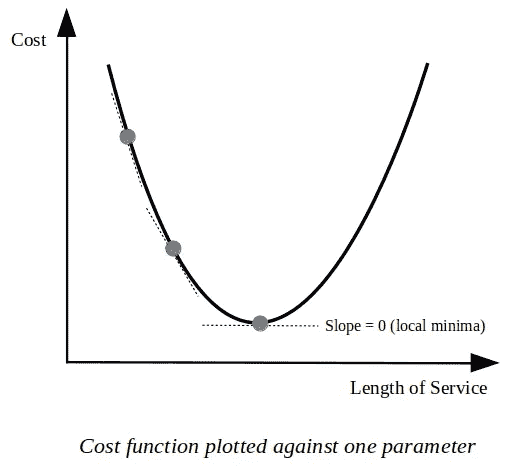

# 使用 NumPy 直觉从零开始进行线性回归

> 原文：<https://towardsdatascience.com/linear-regression-from-scratch-with-numpy-5485abc9f2e4?source=collection_archive---------14----------------------->

欢迎来到 NumPy 系列的*线性回归的第一篇文章，在这篇文章中，我将尝试解释线性回归背后的直觉，这是一种流行的机器学习算法，并展示如何使用 Python 和`numpy`包来实现它。*

自然，我们将使用其他有用的包，例如`matplotlib`，但是，它们的使用可能仅限于数据可视化、数据操作和/或加载数据集(例如`sklearn.datasets`)，因此我们在为机器学习模型本身编写实际代码时不会走任何捷径。

总结一下，我们将从零开始实现一个机器学习算法！

这难道不令人兴奋，同时又有点让人不知所措吗？

我提到过它也非常有趣吗？

由于线性回归是机器学习宇宙中的" *hello world* "算法，所以用 ***NumPy*** 来实现它会非常容易。

如果你认为你对线性回归算法的底层原理了解的足够多，想马上跳到编码部分，请便，从[这里](https://link.medium.com/LabLwL1YOY)开始阅读实现部分，否则继续阅读！

# 线性回归直觉

在我们编写实现线性回归的代码之前，首先我们需要了解什么是线性回归。有许多有用的资源可以让我们很容易理解回归，尤其是线性回归背后的概念，因此，我不会在这里讨论数学细节，而是尝试以更实用的方式解释算法背后的逻辑。

通过挖掘目标值和数据特征之间的关系，线性回归用于对我们手头的数据进行某种意义上的分析*。当我们知道这个关系时，我们可以对我们以前没有见过的数据进行预测，换句话说，我们可以从特征值中推断出目标值。让我们举个例子:*

假设我们想了解一家名为 **X** 的特定公司是如何决定向其员工支付薪酬的。

可能有很多因素会影响到这个决定，所以我们四处询问在那里工作的大多数员工。

经过大量的窥探和偷偷摸摸，结果是:

*   他们中的一些人收入很高，因为他们已经在 X 公司工作了一段时间，
*   他们中的一些人比大多数人挣得高，只是因为他们和老板相处得很好
*   有些人因为他们的资历和才能而收入更高。

这三个指标似乎是主要指标，因此我们将在实施中使用它们。

现在，根据我们收集的信息，我们希望了解这些因素与当前支付给员工的工资之间的潜在关系。我们想出了这个过于简单的等式:

**工资** =(？x ***资历*** ) +(？x**工龄 T9)+(？x ***与上司相处*****

从上面的等式中我们可以看出，工资受 3 个属性的影响。这些属性也被称为 ***特征*** ，它们根据自己的权重影响工资，这些权重在等式中用问号表示，因为我们实际上并不知道这些权重是什么。

现在，让我们想象一下，如果我们确切地知道这些重量，会发生什么。然后，如果我们不知道某个员工的工资，我们可以使用这些特征(资格、服务年限等)。)来预测员工的工资，也就是说，*我们会明白这些特性和目标值(工资)是如何相关的。*

原来，线性回归就是用来做这件事的！它用于获得对这些权重的良好估计，以便它们可以用于预测未知数据的目标值。在机器学习领域，这些权重通常被称为**参数**，因此从现在开始，我们在这里也将采用这个术语。

# 梯度下降算法

既然我们已经掌握了*什么是*线性回归，我们可以进入*如何*的部分。这个算法是如何工作的？如何才能算出线性回归的这些参数呢？

在机器学习中，还有另一个著名的算法叫做**梯度下降**，它被广泛使用，不仅用于估计线性回归的参数，也用于其他优化问题。在梯度下降算法中，从参数的初始值开始，在每一步迭代地改变模型的参数。

再次提醒我们，参数(权重)是决定每个特性对目标值影响程度的数值。

我们想要确切地知道这些参数值，但是在现实生活中这是不可能的，因为可能有其他特征(因此，也有那些特征的参数)影响目标值。

但是，我们希望他们预测的目标值尽可能接近实际值。由于上式中的问号代表参数值，我们可以用如下值替换它们:

**工资**=(1000*x***资历**)+(200*x****工龄***)+(500*x****与上司相处*** )

在这里，很明显，资格特征比其他特征对工资的影响更大，因为它的参数值高于其他特征。

请记住，我们已经直观地选择了这些参数值，我们将使用它们作为我们的初始参数值，然而这些初始值将在算法的每一步朝着它们的最优值变化。

按照我们的类比，假设我们对这些特性的参数有一个初步的估计，我们四处走访，向我们能找到的第一个员工问了这些问题:

*   你在这里工作多久了？
*   你有什么资格申请这个职位？
*   你和你的老板相处得怎么样？(你的老板看起来是喜欢你还是不喜欢你？)

对于第一个问题，我们告诉该员工，我们将接受几年后的答案(1 年、2 年、5 年等)。).

对于第二个问题，我们告诉该员工，答案可以是 1 到 10 之间的任意数字(1 表示最不符合条件，10 表示最符合条件)。

对于最后一个问题，答案将是一个从-5 到 5 的数字。在这里，负号代表员工和老板之间关系的消极性。因此，-5 意味着老板很不喜欢这个员工，0 意味着老板甚至不认识这个员工和/或两人之间没有互动，而+5 意味着他们两个相处得很好。

当我们问员工这些问题时，我们得到的回答是:

*   我已经在这里工作 10 年了。
*   老实说，对于这份工作来说，我大材小用了。所以我给它打 9 分。
*   我的老板似乎讨厌我。每当我在他身边，我都能看到他眼中的仇恨。所以我给它打 a -4。

请记住，我们希望根据我们选择的参数和我们从员工那里得到的答案来预测工资。在仅仅根据这些答案预测了工资后，我们问雇员她的实际工资是多少。

*预测值和实际值之间的差异决定了我们对这些参数(权重)的估计有多成功。梯度下降算法的工作就是让这个差异(预测-实际)尽可能的小！。*

让我们将这个差异称为 ***误差*** ，因为它表示实际值与预测值的差异。现在，让我们将从第一名员工的回答中得到的数字代入我们的等式:

**工资**=(1000*x***10**)+(200*x****9***)+(500*x****-4***)

因此，这表明我们对工资的预测是:

*预测* **薪资** = 12800

现在，在从雇员那里获得实际工资值后，我们计算实际工资值和预测工资值之间的误差:

*实际* **工资** = 9800

**误差** = *预测* **薪资-** *实际* **薪资** = 12800 - 9800 = 3000

我们看到我们的误差是 *3000* ，我们想通过适当调整参数值使这个误差尽可能小。但是我们怎么做呢？

我们如何决定改变参数值的正确方法？

显然，我们可以直观地进行猜测，改变参数值(增大或减小)，使误差足够小。然而，如果我们有一百个特性，而不是只有三个，这是不切实际的。一百个特征意味着一百个参数值，记得吗？

显然，我们必须找到比这更好的方法。

此外，还有一个问题需要考虑。这个错误不能只代表一个雇员，换句话说，我们不能只改变一个雇员的参数值，因为我们希望这个模型代表在 x 公司工作的所有雇员。

我们必须从每个员工那里得到答案，并将这些值代入等式，找出错误并相应地更改参数。

我们这里使用的误差函数(误差=预测-实际)是机器学习中最基本的函数之一，它有一定的局限性。因此，在实现线性回归时，我们将使用一个更复杂的版本，称为 ***误差平方和(SSE)*** ，它只是实际值和预测值之间的平方差之和。

现在，快速改变符号是为了。术语 ***成本*** 经常被用来代替 ***误差*** 我们在这里也会用到，因为*成本*会让我们与实际值相差一些。如果预测值等于实际值，成本将为零。

因此，成本函数用于衡量模型在估计要素值和目标值之间关系的能力方面有多差。

在确定使用哪个成本函数之后，我们现在可以继续。 ***梯度下降算法的整点就是最小化代价函数*** *。*当我们最小化成本函数时，我们实际上是在确保尽可能低的误差，同时提高我们模型的准确性。我们迭代地检查数据集，同时在每一步更新参数。

回到我们的类比，记得我们有三个参数(资历、服务年限、与老板相处)我们想要 ***朝最小化成本函数*** *的方向改变。*因此，检查我们数据集中的每个数据点基本上意味着向在 X 公司工作的每个员工询问我们形成的 3 个问题，将我们从答案中提取的值插入成本函数，并决定下一步应该采取的方向，以便最小化成本函数。

现在，我们如何决定我们应该朝哪个方向前进以降低总成本呢？

微积分在这里对我们有帮助。当我们想最小化一个函数时，我们对一个变量求导，然后用这个导数来决定方向。

在我们的类比中，我们选择的参数实际上是我们的成本函数的**变量**，因为成本函数随着每个参数的变化而变化(因此，变量，咄！).

我们必须对每个参数求导，并用这些导数值更新参数。在下图中，我们可以看到一个参数(服务年限)的成本函数图。

现在，当我们计算成本函数仅关于这个参数的偏导数时，我们得到了我们需要为这个参数移动的方向，以便达到斜率等于 0 的局部最小值。

当我们对每个参数求导并找到我们需要前进的方向时，我们同时更新每个参数:

*更新* **工龄** = *旧* **工龄-** (学习率 *x* 偏导数 w.r.t .工龄)

该**更新规则**分别应用于所有使用偏导数的参数。

当我们应用更新规则一次时，意味着我们正在迭代数据集一次。

这里，**学习率**，也称为学习步长，是学习期间参数更新的量。学习率是一个可配置的超参数，通常在 0.0 和 1.0 之间选择，它定义了模型学习的速率或速度。

*   如果学习率足够高，模型学习得很快。
*   如果太高，我们可能会在学习过程中错过最佳值，因为我们可能已经迈出了一大步。
*   如果太低，那么模型将花费大量时间来收敛到最低成本函数值。

***显然，调优这个超参数在机器学习中是非常重要的！。***

因此，一次迭代意味着只向每个雇员问一次这三个问题(或者检查一次数据集)，并相应地更新参数值。

在多次迭代数据集之后，当我们到达一个点*时，迭代停止，在这个点上，成本足够低，我们可以决定停止算法*，并使用到目前为止更新的参数值。然后，我们可以使用那些**优化的**值来预测新特征值的新目标值。

这里我们所说的优化是什么意思？好了，在我们已经为我们的三个特征找到参数值之后，现在他们可以以最低的可能误差预测新的目标值。

因此，我们在模型中优化了这些参数。*这就是机器学习真正发生的地方*。我们**学习**最小化我们的成本函数的参数。

既然我们已经对线性回归模型有了相当深刻的理解，那么是时候用我们可爱的 Python 编程语言对它进行编码了。

你可以从[这里](https://medium.com/@leventbas92/linear-regression-from-scratch-with-numpy-implementation-finally-8e617d8e274c)阅读编码部分，也可以查看我的 [GitHub 简介](https://github.com/leventbass/linear_regression)沿着 *jupyter 笔记本*阅读或者简单地使用代码来实现。

编码快乐！

## 有问题吗？评论？通过[leventbas92@gmail.com](http://leventbas92@gmail.com)或 [GitHub](https://github.com/leventbass) 联系我。