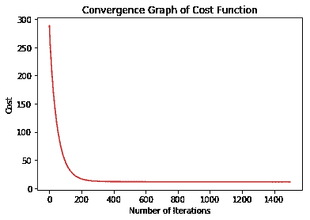
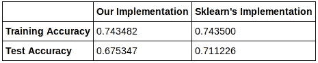

# 使用 NumPy 从头开始线性回归—实现(最终！)

> 原文：<https://towardsdatascience.com/linear-regression-from-scratch-with-numpy-implementation-finally-8e617d8e274c?source=collection_archive---------3----------------------->


欢迎使用 NumPy 系列从零开始学习*线性回归的第二部分！在解释了线性回归背后的直觉之后，现在是时候深入研究实现线性回归的代码了。如果你想了解线性回归的直觉，你可以从[这里](https://medium.com/@leventbas92/linear-regression-from-scratch-with-numpy-5485abc9f2e4)阅读本系列的前一部分。现在，让我们把手弄脏吧！*

首先，我们首先导入必要的库来帮助我们。正如我之前提到的，我们不会使用任何给我们已经实现的算法模型的包，比如`sklearn.linear_model`，因为它不会帮助我们掌握实现算法的基本原理，因为它是一个开箱即用的(因此是现成的)解决方案。我们想用强硬的方式，而不是简单的方式。

此外，请注意，我们可以使用`sklearn`包(或其他包)来利用它的有用功能，例如加载数据集，只要我们不使用它已经实现的算法模型。

我们将使用:

*   `numpy`(显然)在数据集上进行所有的矢量化数值计算，包括算法的实现，
*   `matplotlib`借助一些视觉辅助工具绘制图表，以便更好地理解手头的问题，
*   `sklearn.datasets`加载一个玩具数据集来玩我们写的代码。

```
Total samples in our dataset is: 506
```

现在，是时候加载我们将在本文中使用的数据集了。`sklearn.datasets`包提供了一些玩具数据集来说明一些算法的行为，我们将使用`load_boston()`函数返回一个回归数据集。这里，`dataset.data`代表特征样本，`dataset.target`返回目标值，也称为**标签**。

值得注意的是，当我们加载目标值时，我们向数据添加了一个新的维度(`dataset.target[:,np.newaxis]`)，这样我们就可以将数据用作列向量。记住，线性代数区分了行向量和列向量。

然而，在 **NumPy** 中，只有 n 维数组，本质上没有行列向量的概念。我们可以使用形状为`(n, 1)`的数组来模拟列向量，使用`(1, n)`来模拟行向量。因此，我们可以通过显式添加一个轴，将形状`(n, )`的目标值用作形状`(n, 1)`的列向量。幸运的是，我们可以用 **NumPy** 自己的`newaxis`函数来做到这一点，该函数用于在使用一次后将数组的维度增加一个维度。

我们已经选择了( *1/2) x 均方误差(MSE)* 作为我们的成本函数，所以我们将在这里实现它。`h`表示我们的假设函数，它只是我们从输入(`X`)到输出(`y`)的映射的候选函数。

当我们用参数(`X @ params`)取我们的特征的内积时，我们明确地声明我们将从其他机器学习算法的广泛列表中为我们的假设使用线性回归，也就是说，我们已经决定特征和目标值之间的关系最好由线性回归来描述。

我们现在可以实现梯度下降算法。这里，`n_iters`表示梯度下降的迭代次数。我们希望保存每次迭代中由成本函数返回的成本历史，因此我们使用了一个 **NumPy** 数组`J_history`来实现这个目的。

关于更新规则，`1/n_samples) * X.T @ (X @ params - y)`对应于成本函数相对于参数的偏导数。因此，`params`根据更新规则保存更新的参数值。

在我们对数据集运行梯度下降算法之前，我们对数据进行标准化。标准化是一种技术，通常作为机器学习管道中数据准备的一部分，通常意味着将值重新调整到`[0,1]`的范围内，以提高我们的准确性，同时降低成本(误差)。另外，请注意，我们将参数(`params`)初始化为零。

```
Initial cost is:  296.0734584980237 Optimal parameters are: 
 [[22.53279993]
 [-0.83980839]
 [ 0.92612237]
 [-0.17541988]
 [ 0.72676226]
 [-1.82369448]
 [ 2.78447498]
 [-0.05650494]
 [-2.96695543]
 [ 1.80785186]
 [-1.1802415 ]
 [-1.99990382]
 [ 0.85595908]
 [-3.69524414]] Final cost is:  [11.00713381]
```



你有它！我们已经成功地运行了该算法，因为我们可以清楚地看到，成本从 296 急剧下降到 11。`gradient_descent`函数返回最佳参数值，因此，我们现在可以使用它们来预测新的目标值。

# 线性回归的类实现

最后，从零开始实现线性回归后，我们可以重新安排我们到目前为止编写的代码，添加更多的代码，进行一些修改，并将其转换为一个类实现，这样我们就有了自己的线性回归模块！给你:

请注意我们的实现和`sklearn`自己的线性回归实现之间的相似之处。

当然，我是故意这样做的，向您展示我们可以编写一个广泛使用的模块的简化版本，其工作方式类似于`sklearn`的实现。

不过，我这么做主要是为了好玩！

# 将我们的实现与 Sklearn 的线性回归进行比较



我们在实施方面做得很好，不是吗？我们的训练精度几乎和`sklearn`的精度一样。此外，与`sklearn`的测试精度相比，测试精度并不差。

毫无疑问，这很有趣。我鼓励你在读完这篇文章后自己编写代码。

你也可以查看我的 [GitHub 简介](https://github.com/leventbass/linear_regression)，沿着 *jupyter 笔记本*阅读代码，或者简单地使用代码来实现。

将来我会带着更多的实现和博客文章回来。

编码快乐！

## 有问题吗？评论？通过[leventbas92@gmail.com](http://leventbas92@gmail.com)和 [GitHub](https://github.com/leventbass) 联系我。