# python 生态系统中的线性回归

> 原文：<https://towardsdatascience.com/linear-regression-in-a-python-ecosystem-71db2bb1afc0?source=collection_archive---------22----------------------->

Photo by [Steve Johnson](https://unsplash.com/@steve_j?utm_source=unsplash&utm_medium=referral&utm_content=creditCopyText) on [Unsplash](https://unsplash.com/s/photos/art?utm_source=unsplash&utm_medium=referral&utm_content=creditCopyText)

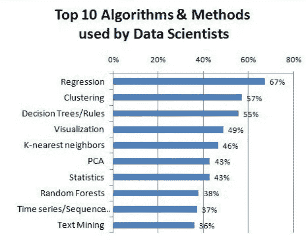

最受欢迎的监督机器学习算法之一是线性回归。线性回归在统计学领域根深蒂固，因此必须检查模型的*拟合优度。*

线性回归是预测定量反应的简单而有用的工具。回归的总体思想是检查两件事。首先，它检验一组独立变量(X)是否能很好地预测一个结果变量(Y)。其次，它决定了哪些变量是结果变量的重要预测因素，以及它们如何通过β估计值的大小和符号来表明结果变量的影响。这些线性回归估计用于解释一个因变量之间的关系。数学上，线性回归估计线性回归函数，定义为:

y = c + b*x+b

> 其中 y =估计的因变量得分，c =常数，b =回归系数，x =自变量得分。

回归技术有多种形式——线性、非线性、有毒、基于树的，但核心思想在整个范围内几乎是相似的，可以应用于各种数据驱动的分析问题，无论是在金融、医疗保健、服务、制造、农业等领域。线性回归是基本技术，[，它深深植根于久经考验的统计学习和推理理论](/linear-regression-using-python-b136c91bf0a2)，并为现代数据科学管道中使用的所有基于回归的算法提供支持。

然而，[线性回归模型的成功还取决于一些基本假设](https://www.jmp.com/en_us/statistics-knowledge-portal/what-is-regression/simple-linear-regression-assumptions.html) **:** 它试图建模的基础数据的性质。

通过验证这些假设是否合理地满足*来检查您的线性回归模型的质量是至关重要的(一般来说，视觉分析方法*被用于检查假设，这取决于解释*)。*

> **问题在于，检查模型质量通常是数据科学管道中优先级较低的一个方面，其他优先级占主导地位，如预测、缩放、部署和模型调整。**

*我们经常使用 [**statsmodels** 库](http://www.statsmodels.org/devel/index.html)通过运行[拟合优度测试](https://www.statisticshowto.datasciencecentral.com/goodness-of-fit-test/)来检查模型？在基于 Python 的数据科学学习课程中，这样的情况很常见:*

**

*通常，有很多关于[正则化](/regularization-in-machine-learning-76441ddcf99a)、[偏差/方差权衡](http://scott.fortmann-roe.com/docs/BiasVariance.html)或可扩展性(学习和复杂性曲线)图的讨论。但是，围绕以下情节和列表有足够的讨论吗？*

*   *残差与预测变量图*
*   *拟合与残差图*
*   *归一化残差的直方图*
*   *归一化残差的 Q-Q 图*
*   *残差的夏皮罗-维尔克正态性检验*
*   *残差的库克距离图*
*   *预测特征的方差膨胀因子(VIF)*

# *Scikit-learn 的问题*

*可以有把握地假设，大多数由统计学家转变为数据科学家的人定期对他们的回归模型进行拟合优度测试。*

*但是，对于数据驱动的建模，许多新手数据科学家严重依赖于像 **Scikit-learn** 这样的以 ML 为中心的包，尽管这些包是一个令人敬畏的库，并且实际上是机器学习和预测任务的[银弹](https://medium.com/analytics-vidhya/scikit-learn-a-silver-bullet-for-basic-machine-learning-13c7d8b248ee)，但是它们不支持基于标准统计测试的简单快速的模型质量评估。*

> **因此，除了使用 Scikit-learn 等以 ML 为中心的库之外，一个良好的数据科学管道还必须包括一些标准化的代码集，以使用统计测试来评估模型的质量。**

*这篇文章试图展示一个多元线性回归问题的标准评估集。我们将使用 statsmodels 库进行回归建模和统计测试。*

*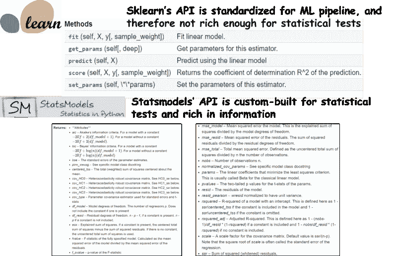*

# *线性回归假设概述*

*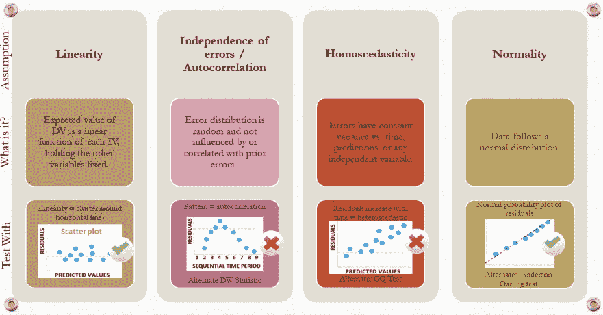*

*对于多元线性回归，从统计推断的角度来看，判断**多重共线性**(相关变量)也很关键。这种假设假设预测变量之间的线性相关性最小或没有线性相关性。*

***异常值**也可能是一个影响模型质量的问题，因为它对估计的模型参数具有不成比例的影响。
以下是一段视频回顾:*

*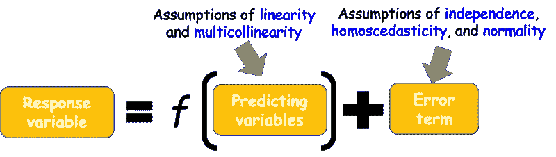*

***有哪些地块可以查？**所以，错误术语非常重要。*

> *但是有一个坏消息。不管我们有多少数据，我们永远无法知道真正的错误。我们只能对产生数据的分布进行估计和推断。*

*因此，**真实误差的代理是残差**，残差就是观测值和拟合值之差。*

> *底线-我们需要绘制残差图，检查它们的随机性质、方差和分布，以评估模型质量。**这是线性模型**拟合优度估计所需的视觉分析。*

*除此之外，多重共线性可以通过相关矩阵和热图进行检查，数据中的异常值(残差)可以通过所谓的**库克距离图**进行检查。*

# *回归模型质量评估*

*我们使用来自 UCI ML 门户网站的[混凝土抗压强度预测](https://archive.ics.uci.edu/ml/datasets/Concrete+Compressive+Strength)问题。混凝土抗压强度是龄期和成分的高度复杂的函数。我们能从这些参数的测量值预测强度吗？本帖的代码回购可以在作者的 [*Github*](https://github.com/2series/Machine-Learning-With-Python/blob/master/Regression/Regression-Goodness%20of%20fit.ipynb) *上查看。**

***检验线性的独立变量散点图**
我们可以简单地通过目测线性假设来检验散点图。*

*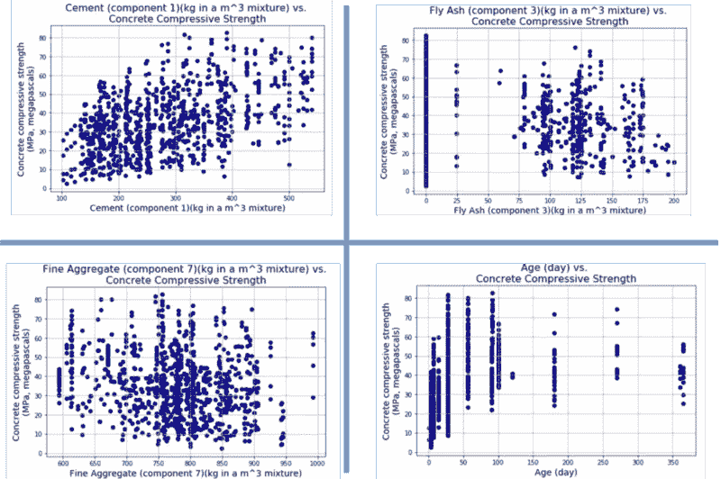*

***成对散点图和相关热图用于检查多重共线性**
我们可以使用 **seaborn** 库中的 [**pairplot** 函数来绘制所有组合的成对散点图。](https://seaborn.pydata.org/generated/seaborn.pairplot.html)*

*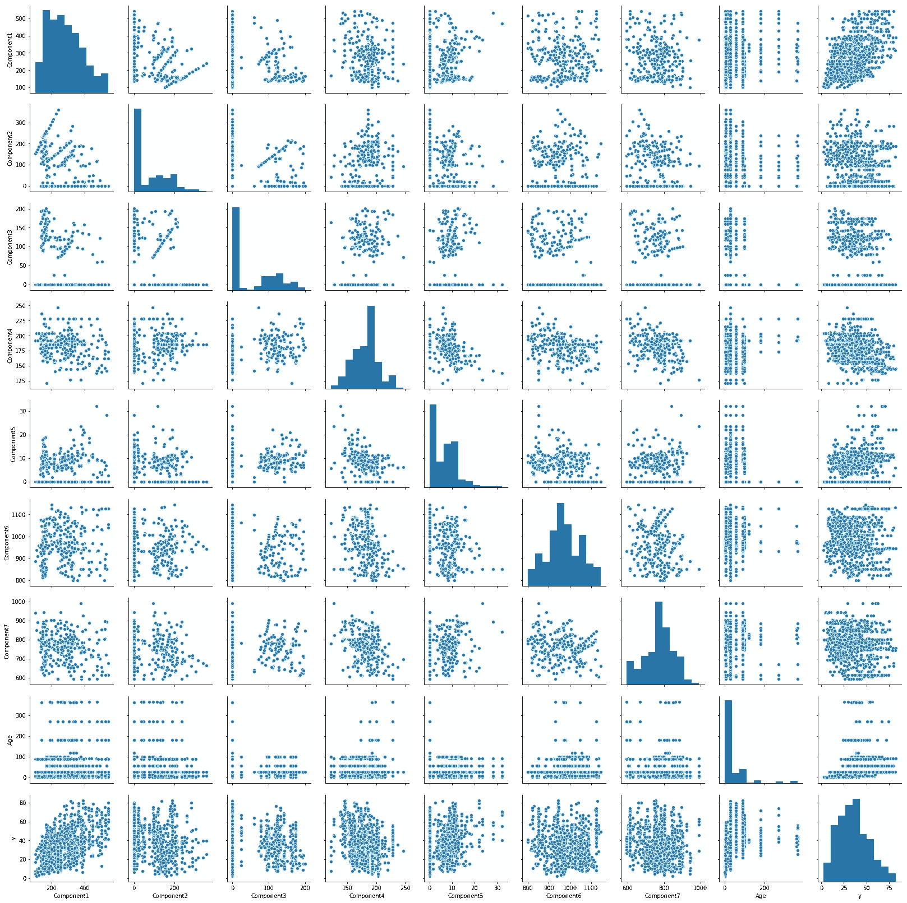*

*使用 Pandas，我们可以轻松计算关联矩阵，并将其传递到 statsmodels 的[特殊绘图功能，将关联可视化为热图。](https://www.statsmodels.org/stable/generated/statsmodels.graphics.correlation.plot_corr.html#statsmodels.graphics.correlation.plot_corr)*

*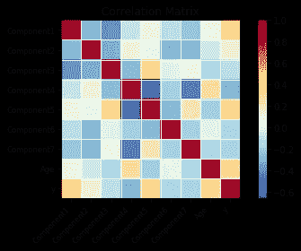*

***使用 statsmodel.ols()函数进行模型拟合**
使用 statsmodels 进行主模型拟合。OLS 方法。这是一个线性模型拟合实用程序，感觉非常像 R 中强大的“lm”函数。最棒的是，它接受 R 风格的公式来构建完整或部分模型(即涉及所有或部分自变量)。*

*在大数据时代，为什么要费心创建一个局部模型，而不把所有数据都扔进去呢？这是因为数据中可能存在混杂或隐藏的偏差，这只能通过 [**控制某些因素**](https://stats.stackexchange.com/questions/78816/how-do-you-control-for-a-factor-variable) 来解决。*

*简而言之，通过该模型拟合的模型已经提供了关于该模型的丰富的统计信息，例如对应于所有自变量的 t 统计量和 p 值、R 平方和调整的 R 平方、AIC 和 BIC 等。*

*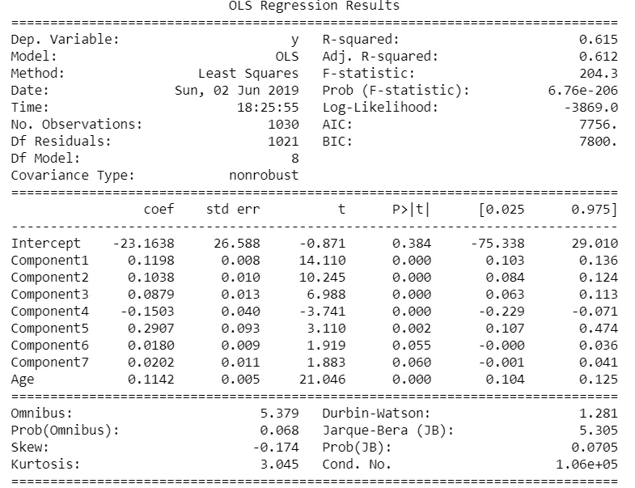*

***残差与独立变量的关系图**
接下来，我们可以绘制残差与每个独立变量的关系图，以寻找独立性假设。**如果残差围绕零个 x 轴均匀随机分布，并且不形成特定的集群**，则假设成立。在这个特殊的问题中，我们观察到一些集群。*

*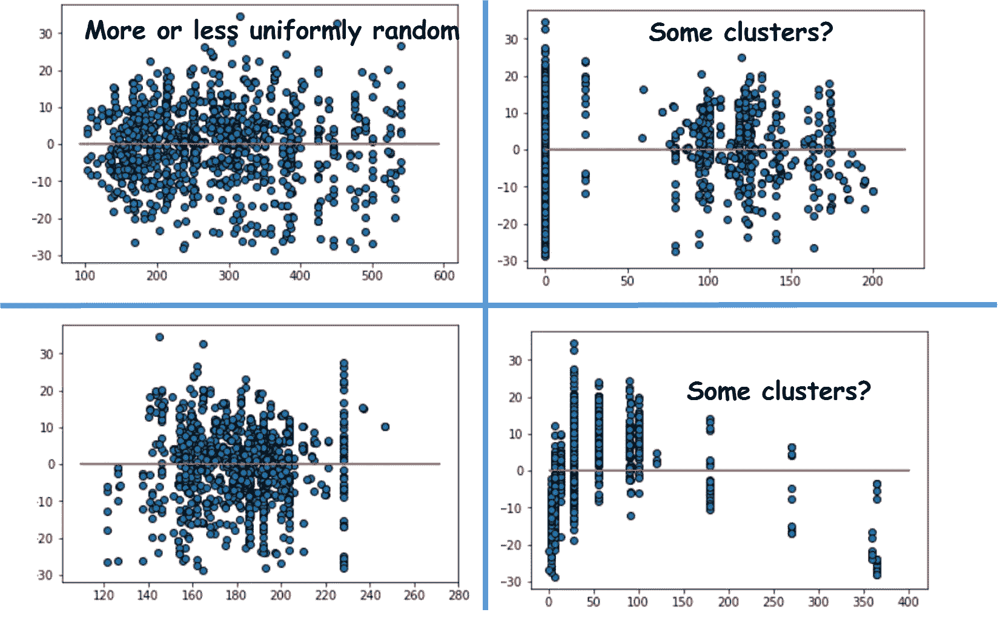*

***拟合与残差图检查同方差**
当我们绘制拟合响应值(根据模型)与残差图时，我们清楚地观察到残差的**方差随着响应变量幅度**的增加而增加。因此，该问题不考虑同质性，可能需要某种变量变换来提高模型质量。*

*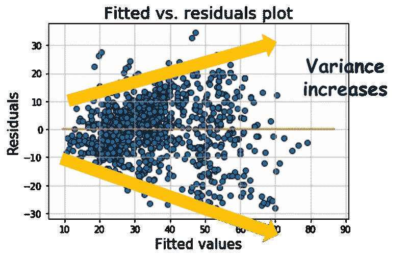*

***归一化残差的直方图和 Q-Q 图**
为了检查数据生成过程的正态性假设，我们可以简单地绘制归一化残差的直方图和 Q-Q 图。*

*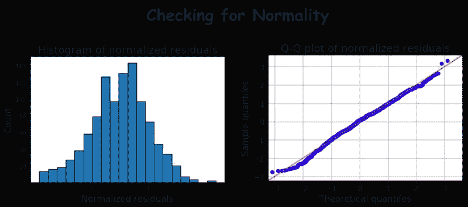*

*此外，我们可以对残差进行夏皮罗-维尔克检验，以检查正态性。*

***使用库克距离图的异常值检测**
库克距离本质上是测量删除给定观察的效果。需要仔细检查 Cook 距离较大的点是否为潜在的异常值。我们可以使用 statsmodels 中的特殊[异常值影响类来绘制厨师的距离。](http://www.statsmodels.org/devel/generated/statsmodels.stats.outliers_influence.OLSInfluence.summary_frame.html)*

*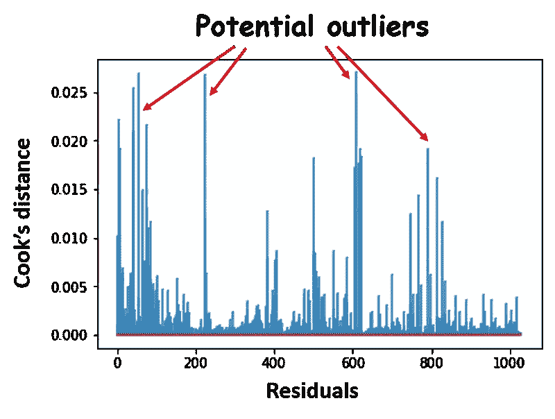*

***方差影响因素-VIF**
此数据集的 OLS 模型摘要显示了多重共线性的警告。但是如何检查是哪些因素造成的呢？
我们可以计算每个自变量的[方差影响因子](https://en.wikipedia.org/wiki/Variance_inflation_factor)。它是有多个项的模型的方差除以只有一个项的模型的方差的比率。同样，我们利用了 statsmodels 中的[特殊异常值影响类](https://www.statsmodels.org/stable/generated/statsmodels.stats.outliers_influence.variance_inflation_factor.html)。*

*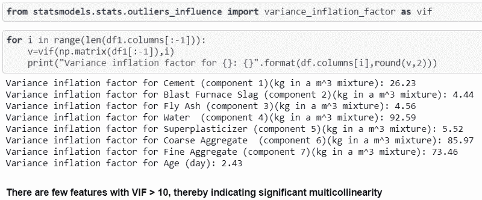*

***其他残差诊断**
Statsmodels 有多种其他诊断测试用于检查模型质量。*请随意查看这些资源:**

*   *[剩余诊断测试](https://www.statsmodels.org/stable/stats.html#module-statsmodels.stats.stattools)*
*   *[拟合优度测试](https://www.statsmodels.org/stable/stats.html#goodness-of-fit-tests-and-measures)*

# *结论*

*在本文中，我们介绍了如何在线性回归中添加**用于模型质量评估的基本可视化分析**——各种残差图、正态性测试和多重共线性检查。*

*目前，scikit-learn 没有用于模型质量评估的详细统计测试或绘图功能， [Yellowbrick](https://www.scikit-yb.org/en/latest/) 是一个很有前途的 Python 库，它可以在 scikit-learn 对象上添加直观的可视化功能。我们希望在不久的将来，统计测试可以直接添加到 scikit-learn ML 估计量中。*

**感谢你阅读我的帖子。**