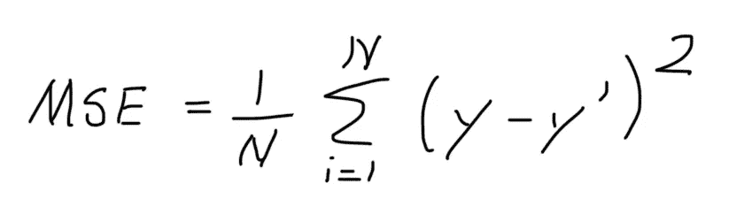
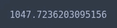

# Python 中的线性回归

> 原文：<https://towardsdatascience.com/linear-regression-in-python-64679ab58fc7?source=collection_archive---------7----------------------->


[https://www.pexels.com/photo/concentrated-black-kid-doing-sums-5905857/](https://www.pexels.com/photo/concentrated-black-kid-doing-sums-5905857/)

所以你决定学习机器学习。无论你是出于职业原因还是纯粹出于好奇，你都来对地方了。在接下来的文章中，我们将了解机器学习的*“Hello World”*、**线性回归**。

# 算法

在机器学习的背景下，当人们谈到模型时，他们指的是在给定一组输入( *x1，x2，x3…* )的情况下用于预测因变量( *y* )的函数。在线性回归的情况下，模型采用 ***y = wx + b*** 的形式。

假设我们绘制了学习时间和期末考试成绩之间的关系。


接下来，假设我们为我们的模型**任意选择了 ***y = 3x + 2*** 。如果我们画一条相应的线，它可能看起来像这样。**


线性回归的目标是找到最佳拟合线，其中最佳拟合线由具有最小可能损失的线定义。最常用的损失函数之一是均方误差(MSE)。它的方程式写如下。



我们通过从一个数据点减去另一个数据点来计算从直线到给定数据点的距离。我们取误差的平方，因为我们不希望低于实际值的预测值被高于实际值的预测值抵消。换句话说，我们想消除负面影响。你还会看到人们使用平均绝对误差(MAE ),只要你在比较模型时坚持使用一个，使用一个比另一个没有任何优势。我们对距离求和，以获得整个数据集的总误差。然后我们将它除以样本总数，因为当你比较模型时，样本越多的数据集误差越大，因为它的样本越多。

在前面的图像中，从直线到每个点的距离被绘制为红色箭头。


## 梯度下降

如果我们画一个曲线图，描述斜率 w 和总损耗 T23 之间的关系，它看起来如下。


它呈现抛物线形状，因为当斜率 w 接近无穷大时，损耗趋于无穷大。


此外，随着斜率 w 接近负无穷大，损耗趋于无穷大。


当损失最小时，最佳拟合线的斜率将等于 *w* 的值。


我们可以利用**梯度下降算法**向全局最小值收敛，而不是以伪随机方式选择斜率值(即查看图表并进行有根据的猜测)。

*梯度*是微积分中一个众所周知的概念。*梯度*是偏导数的向量，它总是指向**最陡上升**的方向(在 *f(x)* 中最大增加的方向)。


然而，在我们的例子中，我们正在寻找使我们的损失函数最小化的方向，因此“ ***【下降】******【梯度下降】。***

为了确定损失函数曲线上的下一个点，梯度下降算法将梯度大小的一部分添加到起始点，如下图所示。


梯度的大小乘以一个叫做**学习率**的东西。学习率决定了算法的步长。

例如，如果幅度梯度(偏导数)为 10，学习率为 0.01，那么梯度下降算法将选择距离前一个点 0.1 的下一个点。

如果我们有大量的数据，并且选择的学习率太小，那么训练我们的模型可能需要很长时间。从表面上看，这听起来没那么糟糕，但是一个需要花几天时间训练的模型很难进行调整和实验。


如果学习率太大，我们可能会错过全局最小值。


对于每个回归问题，都有一个既不太大也不太小的金发女孩学习率。数据科学家的部分工作是处理**超参数**(即学习率和迭代次数)，否则学习过程可能会花费太长时间和/或最终结果不佳。


让我们看看梯度下降的数学基础。我保证没那么糟。首先，我们用直线方程代替回归线的 y 值。


然后我们计算斜率和 y 轴截距的偏导数。


为了确定每个变量的新值，我们在每次迭代中重复这个过程。正如我们之前提到的，我们将梯度乘以一个叫做学习率的常数。值得一提的是，方程是单独写的，但更多的时候你会看到它被写成一个向量。


在训练了我们的线性回归模型( ***y = wx + b*** )之后，我们获得了我们的数据集的最佳拟合线。


然后，我们可以使用我们的模型，根据学生学习的小时数来预测他们的成绩。


# 密码

让我们看看如何使用 Python 从头开始实现线性回归。首先，导入以下库。

```
from sklearn.datasets import make_regression
from matplotlib import pyplot as plt
from sklearn.linear_model import LinearRegression
import seaborn as sns
sns.set()
```

我们可以使用`scikit-learn`库来生成非常适合回归的样本数据。

```
x, y = make_regression(n_samples=50, n_features=1, n_informative=1, n_targets=1, noise=5)
```

很多时候，你需要某种基准来衡量你的模型的性能，通常对于回归问题，我们使用平均值。

```
starting_slope = 0
starting_intercept = float(sum(y)) / len(y)
```

我们利用`matplotlib`来绘制数据和平均值。

```
plt.scatter(x, y)
plt.plot(x, starting_slope * x + starting_intercept, c='red')
```


接下来，我们编写一个函数来计算均方差。

```
def mse(y_actual, y_pred):
    error = 0

    for y, y_prime in zip(y_actual, y_pred):
        error += (y - y_prime) ** 2

    return error
```

均方差越高，模型越差。想象一下从直线到每个数据点的箭头。

```
mse(y, starting_slope * x + starting_intercept)
```


接下来，让我们看看如何从头开始实现梯度下降。

我们创建一个函数来计算斜率和截距的偏导数。

```
def calculate_partial_derivatives(x, y, intercept, slope):
    partial_derivative_slope = 0
    partial_derivative_intercept = 0
    n = len(x) for i in range(n):

        xi = x[i]
        yi = y[i] partial_derivative_intercept += - (2/n) * (yi - ((slope * xi) +      intercept))
    partial_derivative_slope += - (2/n) * xi * (yi - ((slope * xi) + intercept))

    return partial_derivative_intercept, partial_derivative_slope
```

然后，我们定义一个函数，通过向解决方案迈出一小步来迭代改进我们的模型。

```
def train(x, y, learning_rate, iterations, intercept, slope):for i in range(iterations):

        partial_derivative_intercept, partial_derivative_slope = calculate_partial_derivatives(x, y, intercept, slope)

        intercept = intercept - (learning_rate * partial_derivative_intercept)
        slope = slope - (learning_rate * partial_derivative_slope)

    return intercept, slope
```

我们任意选择学习率和迭代次数。对于额外的练习，我建议您尝试替换一些其他值，并观察模型的行为。

```
learning_rate = 0.01
iterations = 300
```

接下来，我们训练模型并获得最佳拟合线的截距和斜率值。

```
intercept, slope = train(x, y, learning_rate, iterations, starting_intercept, starting_slope)
```

我们使用列表理解来获得沿着我们的线的每个 x 值对应的 y 值。

```
linear_regression_line = [slope * xi + intercept for xi in x]
```

我们绘制数据来看看我们做得如何。

```
plt.scatter(x, y)
plt.plot(x, linear_regression_line, c='red')
```


看起来比平均水平好多了。然而，在比较模型时，有时使用更具体的东西会有所帮助。

```
mse(y, linear_regression_line)
```


如我们所见，均方误差比平均值产生的误差低得多。

我们可以使用`scikit-learn`库提供的预定义类，而不是每次都从头开始实现梯度下降算法。首先，我们创建一个类`LinearRegression`的实例。

```
lr = LinearRegression()
```

然后，我们通过调用`fit`方法来训练模型。

```
lr.fit(x, y)
```

为了获得沿线的值，我们调用`predict`函数。

```
y_pred = lr.predict(x)
```

正如我们所看到的，我们得到或多或少相同的结果。

```
plt.scatter(x, y)
plt.plot(x, y_pred, c='red')
```


均方误差略好于我们的实现。我鼓励你检查源代码，找到我们的原因。

```
mse(y, y_pred)
```

