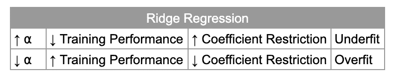
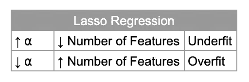

# 线性回归模型

> 原文：<https://towardsdatascience.com/linear-regression-models-4a3d14b8d368?source=collection_archive---------3----------------------->

## 使用 Python 和 SciKit 更好地理解线性回归模型的指南-学习


Photo by [Benjamin Smith](https://unsplash.com/@ifbdesign?utm_source=unsplash&utm_medium=referral&utm_content=creditCopyText) on [Unsplash](https://unsplash.com/s/photos/graph?utm_source=unsplash&utm_medium=referral&utm_content=creditCopyText)

可以说，回归任务的最佳起点是线性模型:它们可以快速训练并易于解释。

线性模型使用输入要素的线性函数进行预测。在这里，我们将探索 Scikit-Learn 中一些流行的[线性模型。](https://scikit-learn.org/stable/modules/linear_model.html)

完整的 Jupyter 笔记本可以在这里找到[。](https://github.com/terrah27/ml_guides/blob/master/linear_models_regression.ipynb)

## 数据

这里我们将使用 [SciKit-Learn 糖尿病数据集](https://scikit-learn.org/stable/datasets/index.html)来回顾一些流行的线性回归算法。

该数据集包含 10 个特征(已经过均值居中和缩放)和一个目标值:基线后一年疾病进展的量度。

我们导入数据并为建模做准备:

```
from sklearn.datasets import load_diabetes
from sklearn.model_selection import train_test_split# load regression dataset
diabetes, target = load_diabetes(return_X_y=True)
diabetes = pd.DataFrame(diabetes)# Prepare data for modeling
# Separate input features and target
y = target
X = diabetes# setting up testing and training sets
X_train, X_test, y_train, y_test = train_test_split(X, y, test_size=0.25, random_state=27)
```

## 评估指标:R

r 平方，或决定系数，是我们的模型所解释的目标变量的变化量。

值的范围从 0 到 1。较高的值表示模型具有高度预测性。例如，R 值为 0.80 意味着模型解释了数据中 80%的可变性。

一般来说，R 值越高越好。低值表明我们的模型不太擅长预测目标。然而，需要注意的是，过高的 R 可能是过度拟合的迹象。

我们将使用以下函数来获取模型的交叉验证分数:

```
from sklearn.model_selection import cross_val_score# function to get cross validation scores
def get_cv_scores(model):
    scores = cross_val_score(model,
                             X_train,
                             y_train,
                             cv=5,
                             scoring='r2')

    print('CV Mean: ', np.mean(scores))
    print('STD: ', np.std(scores))
    print('\n')
```

## 线性回归(普通最小二乘法)

线性回归找出使预测值和目标值之间的均方误差或残差最小的参数。

均方误差定义为预测值和真实值之间的平方差之和除以样本总数。

为了生成线性回归，我们使用 Scikit-Learn 的`LinearRegression`类:

```
from sklearn.linear_model import LinearRegression# Train model
lr = LinearRegression().fit(X_train, y_train)# get cross val scores
get_cv_scores(lr)[out]
### CV Mean:  0.4758231204137221
### STD:  0.1412116836029729
```

我们得到 0.48 的 R 值和 0.14 的标准偏差。低 R 值表明我们的模型不是很精确。标准偏差值表明我们可能过度拟合了训练数据。

当模型对已知数据的预测比对未知数据的预测好得多时，就会发生过度拟合。该模型开始记忆训练数据，并且不能推广到看不见的测试数据。

克服过度拟合的一个选择是简化模型。我们将尝试通过引入正则化来简化我们的线性回归模型。

正则化可以定义为明确地限制模型以防止过度拟合。

由于线性回归没有参数，所以没有办法控制模型的复杂程度。我们将在下面探索一些增加正则化的变化。

## 岭回归(L2 正则化)

岭回归使用 L2 正则化来最小化系数的大小。它减少了系数的大小，有助于降低模型的复杂性。

我们用正则化参数⍺.来控制模型的复杂性

较高的⍺值迫使系数向零移动，并增加了对模型的限制。这降低了训练性能，但也增加了模型的可推广性。将⍺设置得太高可能会导致模型过于简单，数据不足。



Ridge Regression

⍺值越低，系数受到的限制就越少。当⍺很小时，模型变得更类似于上面的线性回归，我们有过度拟合的风险。

让我们看看是否可以使用 Scikit-Learn 的`Ridge`类来提高性能:

```
**from** sklearn.linear_model **import** Ridge*# Train model with default alpha=1* ridge **=** Ridge(alpha**=**1).fit(X_train, y_train)*# get cross val scores* get_cv_scores(ridge)[out]
### CV Mean:  0.3826248703036134
### STD:  0.09902564009167607
```

平均 R 值为 0.38 意味着我们只能用岭回归模型解释 38%的方差——与上面的线性回归相比，肯定没有改进。然而，我们的标准差降低了，这表明我们不太可能过度拟合。

我们在上面使用了 alpha 的默认值，这可能不会给出最好的性能。α的最佳值将随每个数据集而变化。

让我们看看是否可以通过调整 alpha 值来提高 R 值。我们将使用[网格搜索](/hyperparameter-tuning-c5619e7e6624)来找到一个最佳的 alpha 值:

```
# find optimal alpha with grid search
alpha = [0.001, 0.01, 0.1, 1, 10, 100, 1000]
param_grid = dict(alpha=alpha)grid = GridSearchCV(estimator=ridge, param_grid=param_grid, scoring='r2', verbose=1, n_jobs=-1)
grid_result = grid.fit(X_train, y_train)print('Best Score: ', grid_result.best_score_)
print('Best Params: ', grid_result.best_params_)[out]
### Best Score:  0.4883436188936269
### Best Params:  {'alpha': 0.01}
```

我们的 R 分数通过为 alpha 优化而增加！但是 0.48 的 R 分还是不太好。让我们看看是否可以使用其他类型的正则化来进一步改善这一点。

## 拉索回归(L1 正则化)

Lasso 回归使用 L1 正则化来强制某些系数恰好为零。这意味着模型完全忽略了一些特征。这可以被认为是一种自动特征选择！

当我们有大量的特征，但期望只有少数特征是重要的时，Lasso 可以是一个很好的模型选择。这样可以让模型更容易解读，揭示最重要的特征！

较高的⍺值会迫使更多的系数为零，从而导致拟合不足。



Lasso Regression

alpha 值越低，非零特征越少，并可能导致过度拟合。非常低的 alpha 值将导致模型类似于线性回归。

让我们在糖尿病数据集上尝试 Lasso 回归:

```
from sklearn.linear_model import Lasso# Train model with default alpha=1
lasso = Lasso(alpha=1).fit(X_train, y_train)# get cross val scores
get_cv_scores(lasso)[out]
### CV Mean:  0.3510033961713952
### STD:  0.08727927390128883
```

我们在上面使用了 alpha 的默认值，这可能不会给出最好的性能。α的最佳值将随每个数据集而变化。

让我们看看可以通过调整阿尔法值来提高 R 值。我们将使用[网格搜索](/hyperparameter-tuning-c5619e7e6624)来找到一个最佳的 alpha 值:

```
# find optimal alpha with grid search
alpha = [0.001, 0.01, 0.1, 1, 10, 100, 1000]
param_grid = dict(alpha=alpha)grid = GridSearchCV(estimator=lasso, param_grid=param_grid, scoring='r2', verbose=1, n_jobs=-1)
grid_result = grid.fit(X_train, y_train)print('Best Score: ', grid_result.best_score_)
print('Best Params: ', grid_result.best_params_)[out]
### Best Score:  0.48813139496070573
### Best Params:  {'alpha': 0.01}
```

通过优化 alpha，我们的分数提高了！

我们可以检查这些系数，看看是否有任何系数被设置为零:

```
# match column names to coefficients
for coef, col in enumerate(X_train.columns):
    print(f'{col}:  {lasso.coef_[coef]}')[out]
age:  20.499547879943435
sex:  -252.36006394772798
bmi:  592.1488111417586
average_bp:  289.434686266713
s1:  -195.9273869617746
s2:  0.0
s3:  -96.91157736328506
s4:  182.01914264519363
s5:  518.6445047270033
s6:  63.76955009503193
```

`s2`的系数为零。完全被模型忽略了！

我们将尝试最后一种类型的回归，看看我们是否可以进一步提高 R 分数。

## 弹性网回归

弹性网是一个线性回归模型，结合了套索和山脊的惩罚。

我们使用`l1_ratio`参数来控制 L1 和 L2 正则化的组合。当`l1_ratio = 0`我们有 L2 正则化(岭)，当`l1_ratio = 1`我们有 L1 正则化(套索)。介于 0 和 1 之间的值给出了 L1 正则化和 L2 正则化的组合。

我们首先用默认参数拟合弹性网，然后使用网格搜索找到`alpha`和`l1_ratio`的最佳值:

```
from sklearn.linear_model import ElasticNet# Train model with default alpha=1 and l1_ratio=0.5
elastic_net = ElasticNet(alpha=1, l1_ratio=0.5).fit(X_train, y_train)# get cross val scores
get_cv_scores(elastic_net)[out]
### CV Mean:  -0.05139208284143739
### STD:  0.07297997198698156# find optimal alpha with grid search
alpha = [0.001, 0.01, 0.1, 1, 10, 100, 1000]
l1_ratio = [0, 0.1, 0.2, 0.3, 0.4, 0.5, 0.6, 0.7, 0.8, 0.9, 1]
param_grid = dict(alpha=alpha, l1_ratio=l1_ratio)grid = GridSearchCV(estimator=elastic_net, param_grid=param_grid, scoring='r2', verbose=1, n_jobs=-1)
grid_result = grid.fit(X_train, y_train)print('Best Score: ', grid_result.best_score_)
print('Best Params: ', grid_result.best_params_)[out]
### Best Score:  0.48993062619187755
### Best Params:  {'alpha': 0.001, 'l1_ratio': 0.8}
```

同样，在找到最佳超参数值后，我们的 R 值增加了。

## 结论

我们探索了四种不同的线性回归模型:

*   线性回归
*   山脉
*   套索
*   弹性网

我们通过正则化简化了我们的模型。不幸的是，我们的 R 分数仍然很低。

在以后的文章中，我们将探索线性回归的假设和更多提高模型性能的方法。