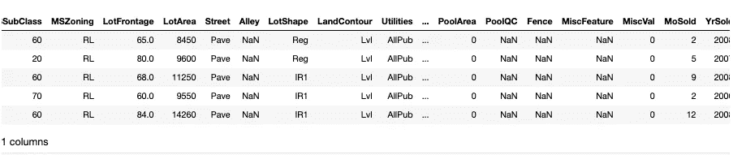
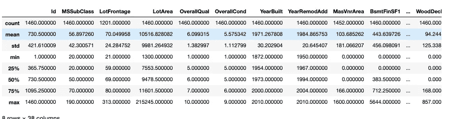
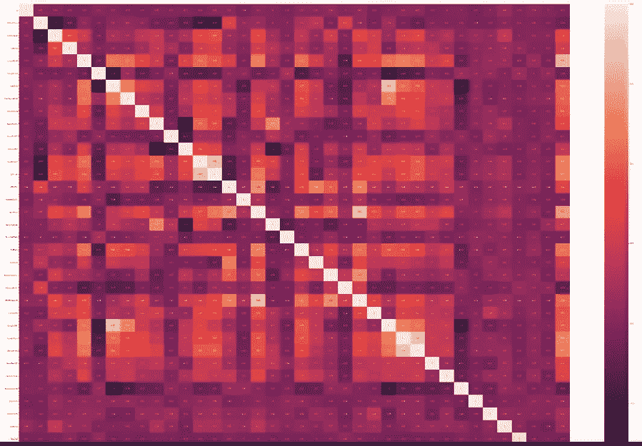
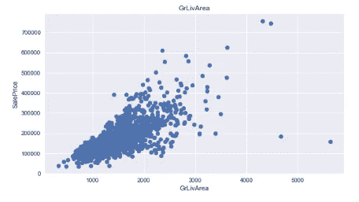
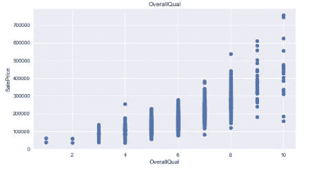
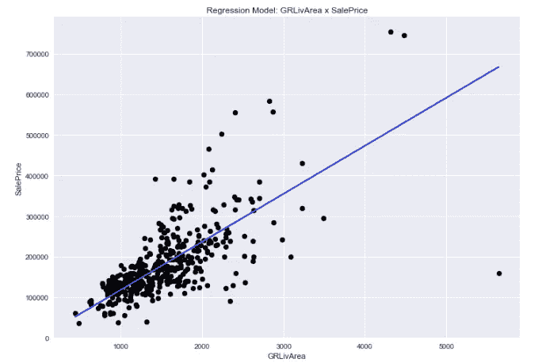
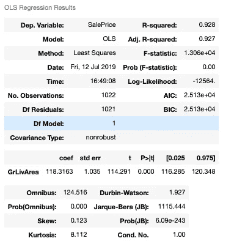

# Python 中的线性回归

> 原文：<https://towardsdatascience.com/linear-regression-on-housing-dataset-a57ef8bf2e60?source=collection_archive---------22----------------------->

线性回归可以说是数据科学中最重要和最常用的模型之一。在这篇博文中，我将带您浏览创建线性回归模型的过程，并向您展示一些很酷的数据可视化技巧。

我们将使用埃姆斯住房数据集，这是经常被引用的波士顿住房数据集的扩展版本。该数据集大约有 1，700 行和 81 列，目标是预测市场上的销售价格。

# 我们开始吧！

就像任何其他项目一样，第一步是导入所有的库。当您找到构建模型所需的所有工具时，您可以导入更多的库。

现在，在我们处理或更改数据之前，让我们先了解一下我们在处理什么。



数据集的简短描述向我们展示了它包含各种数据类型和空值。在我们处理数据和构建模型时，记住这一点很重要。

# 数据预处理

现实世界中的数据集从来都不是完美的。总会有遗漏值和异常值扭曲数据集，影响我们预测模型的准确性。这就是为什么在开始构建模型之前清理数据总是一个好主意。

之前，我提到过这个数据集有 1，700 行和 81 列。如果某一列中缺少某个值，删除整行是不明智的，因为我们还会在其他列中丢失一个数据点。有两种方法可以解决这个问题:

1.  用特定列的中值替换给定列中的每个空值。(这仅适用于带有数值的列)
2.  计算您的统计数据，同时忽略所有空值。(我将在博客的后面告诉你使用什么方法)。

我选择了第二种方法，所以我保留了数据集中的空值。

# 计算异常值

有多种方法可以计算异常值-z 值、四分位间距(IQR)和 Tukey 方法只是其中的几种方法。我选择使用 IQR。出于各种意图和目的，我假设您熟悉 IQR 的概念，所以我将只介绍如何用 Python 对其进行编码。如果你觉得你可以用一个简短的概述，这篇博文[做了一个非常扎实的工作，解释了四分位数间距背后的关键思想。](https://medium.com/datadriveninvestor/finding-outliers-in-dataset-using-python-efc3fce6ce32)

为了计算第一个和第三个四分位数，我对数据集使用了 describe()函数。

```
summary = data_set.describe()
```



describe()函数生成一个简洁明了的数据框，其中包含来自原始数据集的每个数字列的重要统计数据。正如你在上面的图片中看到的，我现在只需要一行代码就可以访问平均值、标准差和百分位值了！

现在，我存储数据序列中每一列的统计数据。这允许我迭代地访问所有列中的百分比值。

现在让我们潜入深水区。在我将代码转储到这里之前，我将首先解释一下我是如何计算 IQR 的。

1.  我创建了一个 for 循环来遍历每个数字列，因为我想计算所有列的 iqr 值。
2.  在 for 循环中，我首先使用 summary _ 25%和 summary _ 75%系列来访问我的 q1 和 q3 值。
3.  然后我计算了一下我的 iqr 范围(q3-q1)。
4.  之后我计算了下界和上界。
5.  接下来，我计算了给定列的第 98 和第 2 百分位值。我们将用这些值替换异常值。因为我们之前没有删除空值，所以我们将使用 nanpercentile()函数来计算百分位数，同时忽略空值。
6.  最后，使用下限和上限来识别异常值，并用计算出的百分位值替换它们。

# 识别特征

现在我们已经处理了我们的数据，是时候创建我们的模型了，但是我们有 80 个潜在的独立变量。我们如何确定哪一个与目标变量 SalePrice 的相关性最强？

我为数据集中的每个变量和其他变量创建了一个关联矩阵。



相关矩阵太大了，无法在一张截图中捕捉到，所以这个缩小的模糊版本就足够了——尽管你已经明白了要点。从相关矩阵中，我发现变量“总体质量”和“GrLivArea”与销售价格的相关性最高。

为了再次确认，我绘制了两个变量的散点图。



在这两种情况下，显然存在线性关系，所以我们可以开始了！

# 创建模型

若要创建模型，请将 X 和 y 设置为各自的列。使用 *train_test_split()* 函数，将数据集拆分为模型的训练和测试数据集。函数中的参数 *test_size* 表示应该为测试保留多少百分比的数据集。标准是 30%

## 测绘

线性回归在视觉上最有意义——当你实际上可以看到最佳拟合线的时候。下面是我用来绘制下图的代码，在图的下面，你会发现一个包含所有重要统计数据的模型摘要。



# 结论

我希望这次演练对您有所帮助！如果您有任何问题或建议，请随时留下您的评论！