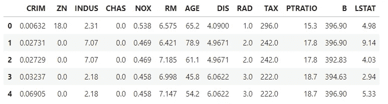
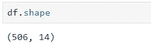
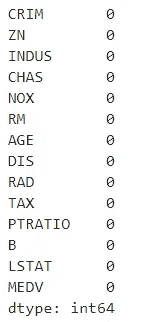
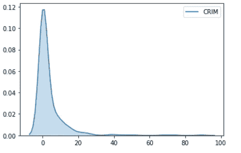
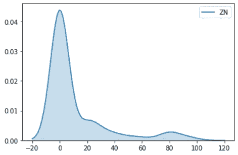
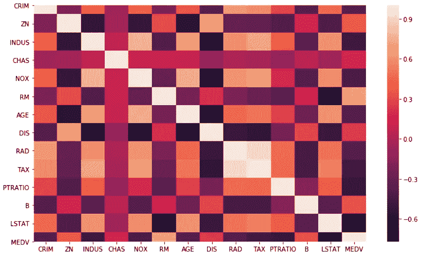
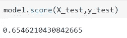
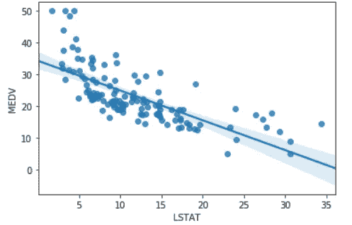

# 线性回归

> 原文：<https://towardsdatascience.com/linear-regression-part-1-7f4b2f43ed11?source=collection_archive---------34----------------------->

## 通过实用的方法进行温和的介绍


Photo by [Ryan Stone](https://unsplash.com/@rstone_design?utm_source=medium&utm_medium=referral) on [Unsplash](https://unsplash.com?utm_source=medium&utm_medium=referral)

线性回归是最古老但仍然非常强大的算法之一。在解决任何回归问题时，任何数据科学从业者想到的第一个想法都是创建线性回归模型。在本文中，我将借助一个简单的例子，通过使用一个样本数据集实现这个算法来解释这个强大的算法。其背后的详细数学原理将在另一篇文章中介绍。敬请关注。(我建议您在阅读本文时实现代码)

我们开始吧！

导入所有必需的库。

我们首先导入将用于解决这个问题的所有基本库。我将在本文中使用“波士顿房价”数据集。该数据集在 scikit learn 中作为样本数据集提供。

现在我们已经导入了库，让我们创建我们的数据框架。

```
boston = load_boston()
```

这将返回一个包含特定键和值的 python 字典。要查看字典中的关键字，您可以执行以下操作:

```
print(boston.keys())
```

这将产生以下结果:

```
dict_keys(['data', 'target', 'feature_names', 'DESCR', 'filename'])
```

要查看数据集描述，可以使用 *boston。DESCR* ，描述数据集中的每个特征。

```
**CRIM**: Per capita crime rate by town
**ZN**: Proportion of residential land zoned for lots over 25,000 sq. ft
**INDUS**: Proportion of non-retail business acres per town
**CHAS**: Charles River dummy variable (= 1 if tract bounds river; 0 otherwise)
**NOX**: Nitric oxide concentration (parts per 10 million)
**RM**: Average number of rooms per dwelling
**AGE**: Proportion of owner-occupied units built prior to 1940
**DIS**: Weighted distances to five Boston employment centers
**RAD**: Index of accessibility to radial highways
**TAX**: Full-value property tax rate per $10,000
**PTRATIO**: Pupil-teacher ratio by town
**B**: 1000(Bk — 0.63)², where Bk is the proportion of [people of African American descent] by town
**LSTAT**: Percentage of lower status of the population
**MEDV**: Median value of owner-occupied homes in $1000s
```

花点时间，试着阅读并清楚地理解每个变量的描述。我们必须始终清楚地了解我们正在处理的数据。

在这里，MEDV 是我们的目标变量，我们需要预测，其余的是我们的特征。

现在我们知道了数据的描述，让我们快速准备数据框架，开始动手做吧！

```
df = pd.DataFrame(boston.data,columns=boston.feature_names)
df.head()
```



First five records of the Boston dataset

您可能已经注意到缺少目标 MEDV，所以让我们创建一个名为“MEDV”的新列，并将目标添加到其中。

```
df['MEDV'] = boston.target
```

# 探索性数据分析和数据预处理

加载数据后，第一步是执行 EDA(探索性数据分析)来探索数据(是的，EDA 这个术语是不言自明的！)并了解数据。这是一个至关重要的部分，通常会占用大部分时间。一个适当和广泛的 EDA 将揭示有趣的模式，并有助于以更好的方式准备数据！(我会写一个单独的帖子，介绍在执行 EDA 时要遵循的最佳实践，我保证！)

首先，让我们检查一下我们正在处理的数据集的大小。



Size of the dataset

我们可以看到总共有 506 行和 14 列或特性。

接下来，让我们检查数据集中是否有任何缺失值。

```
df.isna().sum()
```



Column-wise count of missing values

耶！没有缺失值！这意味着需要处理的麻烦更少了。确保我们的数据没有任何缺失值是很重要的，尤其是在线性回归的情况下，因为如果数据有缺失值，线性回归将不起作用。

现在，让我们继续做一些基本的 EDA 来理解我们的数据。我将在这篇文章中做一个基本的和最小的 EDA。请随意使用您的数据。执行深入的 EDA 总是明智的，这在特性工程阶段很有帮助。(更多信息请见 EDA 上的另一篇文章！)



Probability density function (PDF) of CRIM

从图中可以明显看出，卷曲是*右偏*或*正偏*。从上面的图表中我们可以看到，CRIM 的大部分值位于 0.01 和 0.3 之间，并且具有较大的分布(std。偏差= 8.6)，因为超过 20，就很少有值，它们可能被认为是异常值。(更多信息在另一篇文章中，让我们把这篇文章局限于线性回归)

PDF(概率密度函数)在一张图中给出了很多信息(是的，这是我的最爱！)而且最好先看一下 PDF。

继续，ZN 的 PDF 有点类似。

我鼓励你继续下去，多摆弄一下数据，检查数据是如何分布的，并试图理解图表所传达的信息。因为这篇文章是关于线性回归的，所以我不会偏离主题去详细讨论 EDA。

(提示:使用多个图表，如箱线图、PDF、散点图、条形图等。以获得更好的直觉)



PDF of ZN

相关性分析是构建任何机器学习模型的关键部分。让我们计算我们的特征之间的相关性，并在热图中绘制出来。

```
correlation = df.corr()
sns.heatmap(correlation)
```

对于那些不太熟悉统计术语*相关性的人来说，*它是两个变量之间线性相关性的度量。换句话说，它解释了一个特性如何受到另一个特性的影响。

下面我计算了数据中不同变量之间的相关性，并绘制了相关矩阵。(太多颜色了！！)



Correlation matrix

很漂亮，不是吗？！

在这里，我们可以观察到我们的目标 MEDV 与 LSTAT 高度负相关。这意味着 LSTAT 的减少导致 MEDV 的增加。我鼓励你仔细看看这个矩阵，找到其中的关系。

我们已经看到在卷曲特征中有许多异常值(还记得我们谈论的 PDF 吗？).消除这些极端观察值的最简单方法之一是对要素应用对数变换。这减少了离群值对我们模型的影响。

(如果你想让数据集完全吻合，你还有很多工作要做！)

完成必要的转换和数据清理后，您就可以部署您的第一个机器学习模型了！刚果！

但是等等！我的模型在哪里？

让我们导入 scikit 学习库中可用的线性回归模型。(是啊，scikit learn 太酷了！)

```
from sklearn.linear_model import LinearRegression
```

就这么简单！让我们初始化我们的模型并拟合数据。

```
model = LinearRegression()
```

我不会在本文中深入研究数学，但我会给你一个线性回归方程的基本直觉，我们将在后面的帖子中探讨它。

> ɛ

这里 *y* 是我们的因变量。x 是我们的特征矩阵，**是参数向量(也称为权重，如果你喜欢这样)，ɛ 是误差向量。**

**我们的线性回归试图通过找到**值**值**值**来拟合一条穿过数据的直线，使得误差最小。**

****

***Image source: Wikipedia***

**如果你没有得到上面的数学，没问题！你可以继续写这篇文章。我将单独写一篇更详细的帖子，特别是关于这个美丽算法背后的所有数学知识。**

**现在我们的模型已经准备好了，我们可以训练它了。但是在训练我们的模型之前，将数据分成训练和测试数据集，使用训练数据来训练和测试数据来验证我们的模型，这总是一个好的做法。那么，让我们继续分割数据集。谢天谢地，scikit learn 又来帮忙了。**

```
from sklearn.model_selection import train_test_splitX = df.drop(['MEDV'],axis=1)
y = df['MEDV']X_train,X_test,y_train,y_test = train_test_split(X,y,test_size = 0.2)
```

**这里 X 是我们的独立变量(特性)列表，y 是我们的目标变量。我已经从特性中去掉了 MEDV，也就是说，我使用除了目标变量之外的所有东西作为我的特性。**

**在 train_test_split 中，test_size 表示测试数据集的大小。这里我传递了一个值 0.2，这意味着我们的整个数据现在分为 80%的训练数据和 20%的测试数据。**

**现在是你期待已久的一步！训练模型。**

**使用极其强大的 scikit learn，训练一个模型就像编写一行代码一样简单！**

```
model.fit(X_train,y_train)
```

**我们现在已经成功地训练了我们的线性回归模型。但是我们如何检查它的性能呢？**

**还记得我们从数据集中分离出来的测试数据吗？我们将用它来评估我们模型的性能。**

```
model.score(X_test,y_test)
```

****

**Checking the accuracy of our model**

***model.score(X_test，y_test)* 所做的是预测输入集“X”的“y”值，并将它们与真实的 y 值进行比较，即“y_test”**

**0.6546 ≈ 65%精度。这并不坏，考虑到我们已经保持我们的预处理和功能工程非常少。**

****

**Scatterplot of “LSTAT” vs “MEDV”**

**我们可以看到我们的回归线很好地拟合了数据:)**

**现在我们有了一些关于如何实现线性回归的实践经验。**

**你们中的一些人可能会对我在这里实现的一些机器学习概念感到困惑，比如 train_test_split，但是我们将在另一篇文章中讨论所有这些概念。**

**这篇文章只是模型构建的一个精华，还有很多东西在等着我们呢！我将涉及每个主题，一次一个，并附有易于理解的例子。**

**在那之前，继续练习，一切顺利😊**