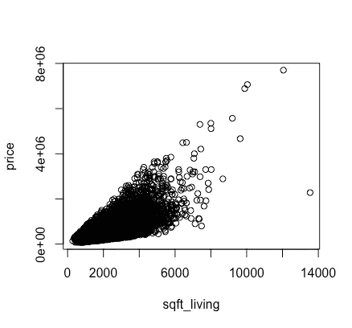

# 线性回归:基础

> 原文：<https://towardsdatascience.com/linear-regression-the-basics-4daad1aeb845?source=collection_archive---------19----------------------->

了解线性回归技术的基础

回归技术帮助您测量变量的相关程度。例如，它们允许你说“房子每平方米要多花 6000 美元”(在这种情况下，这些变量是房子的面积和价格)。

线性回归是当关系是线性时我们所做的回归类型。在我们的例子中，情况可能是这样的:额外的平方米总会或多或少地增加房价。现在让我们考虑一下每间浴室的房价:虽然给你的房子增加第二间浴室会增加它的价格，但第 12 间浴室不太可能对一间已经有 11 间浴室的房子有多大影响。

在回归技术中，我们总是有我们的目标数值变量(Y)和我们的解释变量(X1，X2，…).在这种情况下，由于我们试图解释房价，这就是我们的 y。在第一个例子中，我们的 X 是房屋面积，在第二个例子中，它是浴室的数量。我们也可能有多个 X(例如，如果我们取面积、浴室数量和最近一次翻新的年份)。

现在让我们使用 r 进行第一次回归。我们将使用来自美国金县房屋销售数据的公共数据集，此处[提供](https://www.kaggle.com/harlfoxem/housesalesprediction/downloads/housesalesprediction.zip/1)。然后我们可以加载它，看看变量:

```
**IN:**
path = 'insert you file path here'
data = read.csv(paste(path,'kc_house_data.csv', sep = ""))
colnames(data)**OUT:**
 [1] "id"            "date"          "price"         "bedrooms"      "bathrooms"     "sqft_living"  
 [7] "sqft_lot"      "floors"        "waterfront"    "view"          "condition"     "grade"        
[13] "sqft_above"    "sqft_basement" "yr_built"      "yr_renovated"  "zipcode"       "lat"          
[19] "long"          "sqft_living15" "sqft_lot15"
```

所以这里有*价格*和*平方英尺 _ 居住面积*(居住面积平方英尺)。让我们来看看这两个变量的共同表现:

```
**IN:**
attach(data)
plot(sqft_living,price)
```



这里我们有一个散点图，每个点代表一栋房子，X 轴是它的面积，Y 轴是它的价格。不出所料，看起来房子越大越贵。此外，这种关系看起来或多或少是线性的。我们的第一个线性回归方程如下所示:

*Y = a + b*X*

其中 **Y** 是房价( *price* )， **X** 是其面积( *sqft_living* )， **a** 是基准值，是房子的最低价格，不管它有多小， **b** 是解释两个变量之间关系的系数(“f *或房子的每平方米，将多花*美元

让我们建立第一个线性模型:

```
**IN:**
model1 = lm(price ~ sqft_living, data = data)
summary(model1)**OUT:**
Call:
lm(formula = price ~ sqft_living, data = data)Residuals:
     Min       1Q   Median       3Q      Max 
-1476062  -147486   -24043   106182  4362067Coefficients:
              Estimate Std. Error t value Pr(>|t|)    
(Intercept) -43580.743   4402.690  -9.899   <2e-16 ***
sqft_living    280.624      1.936 144.920   <2e-16 ***
---
Signif. codes:  0 ‘***’ 0.001 ‘**’ 0.01 ‘*’ 0.05 ‘.’ 0.1 ‘ ’ 1Residual standard error: 261500 on 21611 degrees of freedom
Multiple R-squared:  0.4929, Adjusted R-squared:  0.4928 
F-statistic: 2.1e+04 on 1 and 21611 DF,  p-value: < 2.2e-16
```

*lm()* 函数允许我们构建模型，而 *summary()* 函数允许我们查看模型的结果。现在让我们试着解释这些结果:

**残差**:显示残差的分布，残差是模型估计的价格与实际观察到的价格之间的差异。显然，我们希望我们的估计尽可能接近真实值，这意味着非常小的残差。理想情况下，它们将非常接近零，并且对称分布。

**系数**:“估计”字段从我们的模型中给出了 **a** 和 **b** ，其中“截距”是 **a** 而“平方英尺生活”是 **b** (在我们的例子中，每平方英尺的居住面积意味着房价增加了 280 美元)。另一个相关字段是“Pr( > |t|)”，它给出了各自的 p 值。粗略地说，p 值意味着我们对估计的系数有多大的把握。p 值为 5%意味着我们对结果有 95%的信心。所以 p 值越小越好。通常情况下，如果小于 5%或 1%，这是令人满意的。在我们的例子中，p 值比这小得多，所以我们可以认为我们的系数是重要的。

**R 平方**:它告诉我们目标变量(价格)的变化有多少是由我们的模型解释的，从 0 到 1。显然，越多越好。然而，有一个警告:当我们考虑一个以上的解释变量时，我们应该看一下**调整的** r 平方。在我们的例子中，它大约是 0.49，这意味着我们的模型解释了大约一半的房价变化。

让我们看看这个模型产生的线:


这条线显示，对于任何给定的房屋面积，根据我们的模型，它的估计价格。看起来没什么印象吧？现在我们知道如何阅读我们的模型摘要，让我们尝试改进它。我们可以尝试添加更多的变量，比如浴室的数量，例如:

```
**IN**:
model2 = lm(price ~ sqft_living + bathrooms, data = data)
summary(model2)**OUT**:
Call:
lm(formula = price ~ sqft_living + bathrooms, data = data)Residuals:
     Min       1Q   Median       3Q      Max 
-1483123  -147387   -24190   105951  4359876Coefficients:
              Estimate Std. Error t value Pr(>|t|)    
(Intercept) -39456.614   5223.129  -7.554 4.38e-14 ***
sqft_living    283.892      2.951  96.194  < 2e-16 ***
bathrooms    -5164.600   3519.452  -1.467    0.142    
---
Signif. codes:  0 ‘***’ 0.001 ‘**’ 0.01 ‘*’ 0.05 ‘.’ 0.1 ‘ ’ 1Residual standard error: 261400 on 21610 degrees of freedom
Multiple R-squared:  0.4929, Adjusted R-squared:  0.4929 
F-statistic: 1.05e+04 on 2 and 21610 DF,  p-value: < 2.2e-16
```

正如我们所见，调整后的 R 平方几乎保持不变，浴室系数的 p 值太大，这意味着这个变量似乎无法解释房价。然后，让我们尝试第三个模型，去掉浴室，并添加其他可能相关的变量:

```
**IN**:
model3 = lm(price ~ sqft_living + floors + yr_built, data = data)
summary(model3)**OUT**:
Call:
lm(formula = price ~ sqft_living + floors + yr_built, data = data)Residuals:
     Min       1Q   Median       3Q      Max 
-1669759  -134816   -16331   102089  4092350Coefficients:
              Estimate Std. Error t value Pr(>|t|)    
(Intercept)  5.595e+06  1.304e+05   42.92   <2e-16 ***
sqft_living  2.948e+02  2.018e+00  146.10   <2e-16 ***
floors       7.517e+04  3.731e+03   20.15   <2e-16 ***
yr_built    -2.933e+03  6.767e+01  -43.35   <2e-16 ***
---
Signif. codes:  0 ‘***’ 0.001 ‘**’ 0.01 ‘*’ 0.05 ‘.’ 0.1 ‘ ’ 1Residual standard error: 250800 on 21609 degrees of freedom
Multiple R-squared:  0.5335, Adjusted R-squared:  0.5334 
F-statistic:  8237 on 3 and 21609 DF,  p-value: < 2.2e-16
```

这一次，我们将调整后的 R 平方提高到 0.53，所有系数都是相关的。请注意， *sqft_living* 的系数已经改变:现在大约是 294。yr _ build 的系数也很有趣，因为它是负的。这意味着你建造的的价值越大，也就是说，房子越新，花费就越少。换句话说，旧房子往往更贵。

好吧，那下一步是什么？我们如何使用这个模型？嗯，我们可以用它来估计一栋新房子的销售价格，这不在我们的数据库中:

```
**IN**:
new_house = data.frame(
  sqft_living = 2080, floors = 1, yr_built = 1997
  )
predict(model3,newdata = new_house)**OUT**:
1 
426715.9
```

因此，对于一栋建于 1997 年的房子，有 2080 平方英尺的居住空间和一层楼，我们预计它的价格约为 426716 美元。

因此，我们已经了解了如何创建线性模型，如何评估和改进它，以及如何使用它进行预测。我们的模型仍然有许多改进的机会，我们将在下一个线性回归教程中解决，例如修复异方差(我发誓这仍然是英语)和多重共线性，但现在我们对这些模型如何工作以及如何使用它们有了基本的了解。

你可以在这里访问完整的 R 脚本[。](https://github.com/arthurmello/statistics/tree/master/1.%20Linear%20regression)