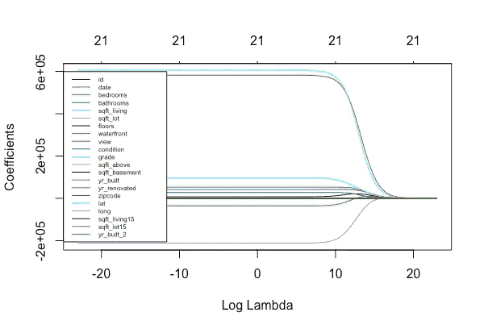

# 线性回归:最后的前沿

> 原文：<https://towardsdatascience.com/linear-regression-the-final-frontier-5a4dbda23317?source=collection_archive---------31----------------------->

先进的技术，让你的线性回归游戏更上一层楼


Photo by [Jeremy Thomas](https://unsplash.com/@jeremythomasphoto?utm_source=medium&utm_medium=referral) on [Unsplash](https://unsplash.com?utm_source=medium&utm_medium=referral)

# 快速介绍

本文旨在介绍一些更高级的线性回归技术，它们可以极大地改善您的模型结果。如果你还没有掌握线性回归的基础知识，我建议另外两篇文章可以帮助你:[第一篇](https://medium.com/dataseries/linear-regression-the-basics-4daad1aeb845)介绍了一些理解线性回归的基本概念，而[第二篇](https://medium.com/dataseries/linear-regression-digging-deeper-b82672f168ce)解释了如何发现并纠正线性回归中出现的一些常见问题。

# 多项式回归

顾名思义，线性回归意味着两个变量之间的线性关系，形式为 y = ax + b。但是，通常情况下，这两个变量之间的关系不是线性的，而是遵循某个其他函数，该函数采用 x 的平方(或某个其他幂)值。在这种情况下，一个简单的解决方案是向解释变量添加一个要检查的所有变换的列表(x 的平方，x 的三次方，等等)。这决定了你的多项式的次数(例如，如果你到 x 的五次方，你有一个五次多项式)。一旦你有了解释变量的完整列表，你就可以像往常一样进行线性回归了。这是一个简单的转换，但它可以产生一些非常好的结果。

# 固定过度配合

## 里脊回归

岭回归是一种特殊类型的线性回归，它试图通过对一些参数应用权重来减少过度拟合，从而减少实际上可能不重要的参数的影响。

为了在 R 中做到这一点，我们使用函数 glmnet()，并指定参数 alpha = 0，使其成为岭回归。我们还必须指定正则化参数 lambda，它将决定我们的回归对其给出的权重有多“严格”。使用交叉验证可以找到最佳值:

```
**IN:** library(glmnet)
library(tidyverse)y = data$price
x = data %>% select(sqft_living, floors, yr_built, yr_built_2) %>% data.matrix()model6 = glmnet(x, y, alpha = 0)lambdas = 10^seq(10, -10, by = -.2)
cv_fit = cv.glmnet(x, y, alpha = 0, lambda = lambdas)
plot(cv_fit)
```


This plot indicates us the lambda that minimises the error, but we can also fetch it directly.

```
**IN:**
opt_lambda = cv_fit$lambda.min
opt_lambda**OUT:**
6.309573e-07**IN:** model6 = cv_fit$glmnet.fitplot(model6, xvar = "lambda")
legend("left", lwd = 1, col = 1:6, legend = colnames(x), cex = .5)
```



This plot shows how the coefficients weights evolve for each variable, according to the value of lambda.

## 套索回归

套索回归的工作方式与岭回归类似，只是它不是对不重要的参数赋予小的权重，而是赋予它们 0 的权重，这意味着它将它们从回归中剔除。

在 R 中，我们还将使用 glmnet()函数，但这次将 alpha 设置为 1，以使其成为套索回归:

```
**IN:**
cv_fit = cv.glmnet(x, y, alpha = 1, lambda = lambdas)
opt_lambda = cv_fit$lambda.minmodel7 = cv_fit$glmnet.fit
plot(model7, xvar = "lambda")
legend("left", lwd = 1, col = 1:6, legend = colnames(x), cex = .5)
```


This is basically the same as the previous plot, but notice how the convergence of the weights to zero is more abrupt.

## 弹性网

弹性网络正则化本质上是岭回归和套索回归的两个正则化参数的线性组合。在实践中，这意味着将 alpha 值设置在 0 和 1 之间，这将把一些系数设置为 0，就像在 LASSO 回归中一样，并把一些系数设置为权重，就像在 Ridge 回归中一样。

```
**IN:**
library(caret)
set.seed(111)
model8 = train(
  price ~., data = data, method = "glmnet",
  trControl = trainControl("cv", number = 10),
  tuneLength = 10
)model8$bestTune**OUT:**
   alpha   lambda
94     1 1468.049
```

## 逐步回归

在前面的方法中，我们为每个参数分配权重以减少过度拟合。在逐步回归中，我们尝试参数的多种组合，并排除那些不重要的参数。一种方法是从所有变量开始，然后一个一个地去掉不太重要的变量。另一种方法是从一个变量开始，然后一个接一个地添加重要的变量。最后，我们可以将两种方法结合起来。这种选择可以通过在 stepAIC 函数中设置参数“方向”来实现，该参数可以取以下值:“*向后“*、“*向前”*、“*都”*。变量的重要性可以用许多不同的方法来衡量，所以这里我们将研究其中的一种方法，它是由 stepAIC()函数计算的，该函数研究 Akaike 信息标准。

```
**IN:**
library(MASS)
model8 = lm(price~., data = data)
model8 = stepAIC(model8, direction = "both", 
                      trace = FALSE)
summary(model8)**OUT:**
Call:
lm(formula = price ~ id + bedrooms + bathrooms + sqft_living + 
    sqft_lot + floors + waterfront + view + condition + grade + 
    sqft_above + yr_built + yr_renovated + zipcode + lat + long + 
    sqft_living15 + sqft_lot15 + yr_built_2, data = data)Residuals:
     Min       1Q   Median       3Q      Max 
-1317688   -99197    -9464    76111  4340354Coefficients:
                Estimate Std. Error t value Pr(>|t|)    
(Intercept)    9.177e+07  7.674e+06  11.958  < 2e-16 ***
id            -1.485e-06  4.812e-07  -3.086 0.002032 ** 
bedrooms      -3.298e+04  1.900e+03 -17.358  < 2e-16 ***
bathrooms      3.554e+04  3.276e+03  10.846  < 2e-16 ***
sqft_living    1.510e+02  4.371e+00  34.537  < 2e-16 ***
sqft_lot       1.244e-01  4.783e-02   2.601 0.009307 ** 
floors        -1.376e+04  3.974e+03  -3.463 0.000536 ***
waterfront     5.860e+05  1.730e+04  33.868  < 2e-16 ***
view           5.474e+04  2.138e+03  25.599  < 2e-16 ***
condition      3.053e+04  2.371e+03  12.876  < 2e-16 ***
grade          9.579e+04  2.146e+03  44.640  < 2e-16 ***
sqft_above     3.033e+01  4.346e+00   6.979 3.05e-12 ***
yr_built      -8.830e+04  7.167e+03 -12.320  < 2e-16 ***
yr_renovated   2.263e+01  3.652e+00   6.196 5.89e-10 ***
zipcode       -6.053e+02  3.293e+01 -18.382  < 2e-16 ***
lat            6.099e+05  1.072e+04  56.908  < 2e-16 ***
long          -2.203e+05  1.312e+04 -16.785  < 2e-16 ***
sqft_living15  2.175e+01  3.436e+00   6.330 2.51e-10 ***
sqft_lot15    -3.518e-01  7.330e-02  -4.800 1.60e-06 ***
yr_built_2     2.189e+01  1.831e+00  11.955  < 2e-16 ***
---
Signif. codes:  0 ‘***’ 0.001 ‘**’ 0.01 ‘*’ 0.05 ‘.’ 0.1 ‘ ’ 1Residual standard error: 200600 on 21593 degrees of freedom
Multiple R-squared:  0.7018, Adjusted R-squared:  0.7016 
F-statistic:  2675 on 19 and 21593 DF,  p-value: < 2.2e-16
```

我们只剩下一些初始变量，它们都是有意义的。

你可以在这里访问完整的脚本[。](https://github.com/arthurmello/statistics/tree/master/1.%20Linear%20regression)