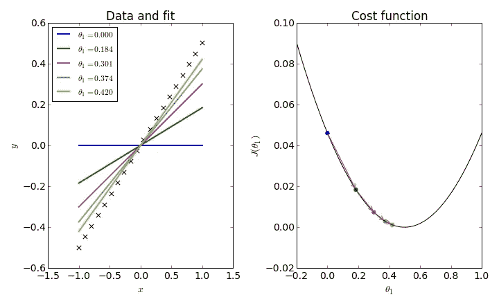

# 使用 TensorFlow 进行简单的线性回归

> 原文：<https://towardsdatascience.com/linear-regression-using-tensorflow-fd732e1b690d?source=collection_archive---------22----------------------->

# 目标和重要概念

在本文结束时，您应该能够成功理解在 TensorFlow 中执行简单线性回归的过程，以获得并绘制由线性关系描述的某些数据集的最佳拟合线。此外，获得预测的解释将在最后给出，以阐明最佳拟合线的使用。

## **线性回归**

线性回归是通过将线性方程拟合到数据点来描述两个变量之间关系的过程。这条线通常被称为“最佳拟合线”，是通过最小二乘回归方法获得的。

[https://www.google.com/search?q=linear+regression+in+tensorflow&source=lnms&tbm=isch&sa=X&ved=0ahUKEwjx1IKJhNPiAhXSs1kKHQ6RBNMQ_AUIESgC&biw=1680&bih=939&dpr=2#imgrc=_xHshSPnhNG1oM:](https://www.google.com/search?q=linear+regression+in+tensorflow&source=lnms&tbm=isch&sa=X&ved=0ahUKEwjx1IKJhNPiAhXSs1kKHQ6RBNMQ_AUIESgC&biw=1680&bih=939&dpr=2#imgrc=_xHshSPnhNG1oM:)

## 最小二乘法

最小二乘回归线或方法是最小化回归线和数据集中每个数据点之间垂直距离的线。这条线最小化了数据中的方差，也就是所谓的损失。在 TensorFlow 甚至其他环境中，最小二乘回归线是通过两个过程确定的:代价函数和梯度下降法。

[https://www.google.com/search?q=least+squares+regression&source=lnms&tbm=isch&sa=X&ved=0ahUKEwjZrNXGhNPiAhUOZN8KHc9FA_wQ_AUIESgC&biw=1680&bih=890&dpr=2#imgdii=Jr3voN86OP8v2M:&imgrc=y54-2EX4O_2KQM:](https://www.google.com/search?q=least+squares+regression&source=lnms&tbm=isch&sa=X&ved=0ahUKEwjZrNXGhNPiAhUOZN8KHc9FA_wQ_AUIESgC&biw=1680&bih=890&dpr=2#imgdii=Jr3voN86OP8v2M:&imgrc=y54-2EX4O_2KQM:)

## 成本函数和梯度下降

TensorFlow 中线性回归的工作方式是选择一个占位符斜率和 y 截距来启动该过程。在迭代 n 的循环中，计算成本函数或误差平方和，如果没有最小化，则调整最佳拟合线的斜率和 y 截距，并再次计算成本函数，直到其最小。梯度下降或梯度下降算法是计算和调整成本函数、斜率和 y 截距值的整个过程。幸运的是，TensorFlow 有预先制作的函数来运行梯度下降过程，并在每次迭代时计算成本函数。

[https://www.google.com/search?q=linreg1d&tbm=isch&source=iu&ictx=1&fir=zIsDdzISOI_EYM%253A%252Cm3PAo_HTKbKCsM%252C_&vet=1&usg=AI4_-kSxBE2bzXqM-Fx0jSGtMmW8VmRzZw&sa=X&ved=2ahUKEwic7J_UhdPiAhURWN8KHQuDDH8Q9QEwBHoECAMQBA#imgrc=zIsDdzISOI_EYM:](https://www.google.com/search?q=linreg1d&tbm=isch&source=iu&ictx=1&fir=zIsDdzISOI_EYM%253A%252Cm3PAo_HTKbKCsM%252C_&vet=1&usg=AI4_-kSxBE2bzXqM-Fx0jSGtMmW8VmRzZw&sa=X&ved=2ahUKEwic7J_UhdPiAhURWN8KHQuDDH8Q9QEwBHoECAMQBA#imgrc=zIsDdzISOI_EYM:)

# 进入线性回归过程

## 数据

用于通过 TensorFlow 进行线性回归的数据集是研究生入学数据。该数据集有许多重要的参数，这些参数在申请硕士课程时非常重要。这些参数是:

1.  GRE 成绩(满分 340 分)
2.  托福成绩(满分 120 分)
3.  大学评级(满分 5 分)
4.  目的陈述和推荐信强度(满分 5 分)
5.  本科 GPA(满分 10 分)
6.  研究经验(0 或 1)
7.  录取机会(范围从 0 到 1)

就本文的目的而言，被认为可以得出线性回归线的两个因素是 GRE 分数和录取机会。

## 数据探索

在选择 GRE 分数作为线性回归的变量之前，我分析了数据集中提供的所有要素之间的关系和相关性。以下是数据集中所有要素的配对图:

Figure 1: The relationships between GRE_Score, TOEFL_Score, CGPA, and Chance_Of_Admit are all linear

为了进一步挖掘 GRE_Score、TOEFL_Score 和 Chance _ Of _ admission 之间的关系，我们使用了一个三维散点图来对此进行可视化:

Figure 2: This scatterplot shows that an increase in GRE_Scores and TOEFL_Scores lead to relatively linear increases in Chance_Of_Admit

最后，为了巩固我使用 GRE_Scores 作为线性回归独立变量的选择，我们创建了一个关联热图来可视化关联:

Figure 3: between GRE_Score and TOEFL_Score, GRE_Score has a higher correlation to Chance_Of_Admit

## 使用张量流的线性回归

线性回归的第一步是将数据集上传到文件中。其代码如下所示:

并非数据集中的所有列都具有相同的数据类型。GRE_Score、TOEFL_Score 和 University_Rating 都是字符串数据类型。尽管 TOEFL_Score 和 University_Rating 不会用于线性回归，但保持要素的数据类型不变是一种很好的做法。下面显示了数据类型转换代码:

最后，我们可以开始线性回归过程的核心。首先，自变量和因变量的列需要放入一个列表中。在这个例子中，我们将 GRE_Score 转换为 x 列表，将 Chance_Of_Admit 转换为 y 列表。这方面的代码如下所示:

接下来的几个步骤都被打包成一个函数，我称之为 linearregression()。在这个函数中，我们首先定义将被输入到模型中的两组数据。这些集合最初用随机的浮点数填充，但是当输入到模型中时，它们被上面声明的 x 和 y 数据占据。接下来，我们声明两个变量 W 和 b，并给它们分配随机数。w 用作最佳拟合线的斜率，而 b 用作最佳拟合线的 y 截距。最后，y_pred 和 loss 也在这个函数中定义。y_pred 的值是通过将 W 乘以 x1，然后加上 b 得到的，就像数学课上学过的等式一样。这个函数的代码如下所示。

最后的步骤包括在设计的 run()方法中运行梯度下降函数。GradientDescentOptimizer()函数用于创建步长为 0.000005 的优化器对象。然后，在优化器对象上使用 minimize()函数来返回成本函数的最小值。最后，将数据输入模型，并在散点图上绘制最佳拟合线。run()方法的代码如下所示:

## 结果

线性回归函数的最终结果给了我们一条最佳拟合线，它与 Seaborn 上的 regplot 生成的线极其相似。两者如下所示:

Figure 4: Loss value for this line of best fit is 0.0068259086

Figure 5: This is the regplot that was generated with the Seaborn package in python

# 结论

这篇文章是关于在 TensorFlow 中进行线性回归的。执行此操作的主要步骤是使用 TensorFlow 提供的梯度下降函数建立一个优化器，然后使用 minimize 函数确保返回最低成本函数值。要完全理解线性回归，必须了解梯度下降过程和成本函数。梯度下降是通过一个步长值调整函数的斜率和 y 截距，直到找到最小成本函数的渐进过程。成本函数本质上是绘制的每条最佳拟合线的最小平方和。有了这两个工具和上面的文章，你现在应该能够制作自己的线性回归函数了！