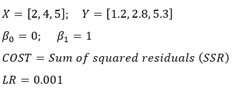

# Numpy 中从零开始的梯度下降线性回归

> 原文：<https://towardsdatascience.com/linear-regression-with-gradient-descent-from-scratch-in-numpy-d894a800a2ca?source=collection_archive---------15----------------------->

Image by [Elias Sch.](https://pixabay.com/users/EliasSch-3372715/?utm_source=link-attribution&utm_medium=referral&utm_campaign=image&utm_content=2127669) from [Pixabay](https://pixabay.com/?utm_source=link-attribution&utm_medium=referral&utm_campaign=image&utm_content=2127669)

几天前，我写了一篇介绍梯度下降的文章，介绍了一些基本的数学和逻辑知识，在文章的最后，我要求你尝试用一个简单的线性回归来实现它。

 [## 梯度下降在 5 分钟内揭开神秘面纱

### 学习梯度下降是如何工作的，只需要一点点数学知识和很多常识。

towardsdatascience.com](/gradient-descent-demystified-in-5-minutes-f02966704e35) 

我承认——这个要求有点过分，尤其是如果那篇文章是你第一次接触梯度下降的话。这就是为什么今天我想自己从头开始实现**，先借助一些数学，再借助 Python。读完这篇文章后，你会完全理解梯度下降，并能够用它来解决任何线性回归问题。**

# **手动梯度下降**

**我强烈建议你阅读上面链接的文章。它将为这个主题奠定基础，另外一些数学知识已经在这里讨论过了。**

**首先，我将定义我的数据集—只有三个呈线性关系的点。我选择这么少的点只是因为**数学将会更短**——不用说，对于更长的数据集，数学不会更复杂，它只会更长，我不想犯一些愚蠢的算术错误。**

**然后，我将系数*β0*和*β1*设置为某个常数，并将成本函数定义为*残差平方和(SSR/SSE)* 。最后，我将把**学习率**设置为一个小值，比如 0.001:**

****

**通过使用**线方程**，很容易计算模型的预测值:**

****

**如前所述，成本函数将是*残差平方和*:**

****

**如果你懂一些微积分，你可以计算出成本函数相对于 *beta 0* 和 *beta 1* 的**偏导数**。如果没有，就拿着这些方程，试着在网上搜索“多元微分”和“链式法则”:**

****

**接下来要做的是计算β0 和β1 的成本。这归结为基本的算术，很容易手工完成。**

****beta 0 的成本:****

****

****beta 1 的成本:****

****

**一旦获得这两个数字，就可以通过将计算出的成本乘以学习率来计算这两个系数的步长:**

****

**最后一步是通过从旧值中减去各自的步长来计算新的*β0*和*β1*:**

****

**现在你可以使用这些新的系数值，重复整个过程大约 10000 次。出于明显的原因**，你不应该手动操作**——然而，知道算法是如何工作的是很好的。**

**差不多就是这样，现在你可以简单地重复同样的逻辑，不断更新你的系数。让我们看看如何在 Python 中实现梯度下降。**

# **Python 中的梯度下降**

**从实现开始，让我们首先定义成本函数，并使用[***Sympy***](https://www.sympy.org/)*获取导数:***

******

***不知道怎么用 Sympy？查看这篇文章:***

*** [## 在 Python 中取导数

### 学习如何处理机器学习中的微积分部分

towardsdatascience.com](/taking-derivatives-in-python-d6229ba72c64) 

您可以看到计算出的导数与之前手动计算出的是一样的——Sympy 只做了乘法来去掉括号( *ish* )。

现在您可以将 ***x*** 和 ***y*** 都定义为变量并绘制它们:

你拥有了所需的一切——这意味着接下来是梯度下降。因为我已经在数学部分解释了发生了什么，所以我不会在这里做太多的细节，我将只概述这个过程:

1.  将*β0*和*β1*系数初始化为某个值
2.  初始化学习率和所需的周期数
3.  制作一个循环的*，它将运行 n 次，其中 n 是历元数*
4.  初始化保存当前时期误差的变量
5.  使用直线方程进行预测
6.  将平方差追加到误差数组
7.  计算数据集中当前行的两个系数的偏导数
8.  增加系数的成本
9.  重新计算系数值

这听起来像是很多步骤，确实如此，但是如果你已经阅读了我以前的文章，并遵循了数学，你可以看到这里没有发生任何复杂的事情。下面是 Python 实现的代码:

Gradient Descent — [https://gist.github.com/dradecic/cb1a3b0a68f8b8e0307dba754de08113](https://gist.github.com/dradecic/cb1a3b0a68f8b8e0307dba754de08113)

一旦代码单元执行完毕，你就可以检查你的系数的最终值，并用它们来做预测:

现在使用 ***y_preds*** 你可以添加一条回归线到先前绘制的图中:

还记得你是如何记录纪元误差的吗？

看起来 10000 个时期有点太多了，但是尽管如此，在大约 1000 个时期之后，误差被最小化，并且在剩余的运行中保持不变。

我在梯度下降的代码单元中添加了一串打印语句，所以每次迭代都被打印出来(*我只运行了 1 个时期来验证数学工作*)，下面是我得到的结果:

这只是一次迭代，但它是数学如前所述起作用的决定性证据。你现在可以在更大的数据集上使用相同的逻辑，只是为了好玩。*** 

# ***最后的话***

***梯度下降一开始可能看起来像一个令人生畏的算法，但它背后的逻辑相当简单，数学也没有你以前可能认为的那么复杂。***

***我希望你现在能从理论、数学和代码上看到清晰的画面。我如何实现梯度下降只是一个想法，肯定还有改进的空间-您可以将系数值保存在列表中-如果您的数据集中有多个要素，这将非常方便。现在，您已经拥有了自己进一步探索所需的所有工具。***

***请随意分享您的想法，如果有任何不清楚的地方，请随时联系我。***

****喜欢这篇文章吗？成为* [*中等会员*](https://medium.com/@radecicdario/membership) *继续无限制学习。如果你使用下面的链接，我会收到你的一部分会员费，不需要你额外付费。****

*** [## 通过我的推荐链接加入 Medium-Dario rade ci

### 作为一个媒体会员，你的会员费的一部分会给你阅读的作家，你可以完全接触到每一个故事…

medium.com](https://medium.com/@radecicdario/membership)***