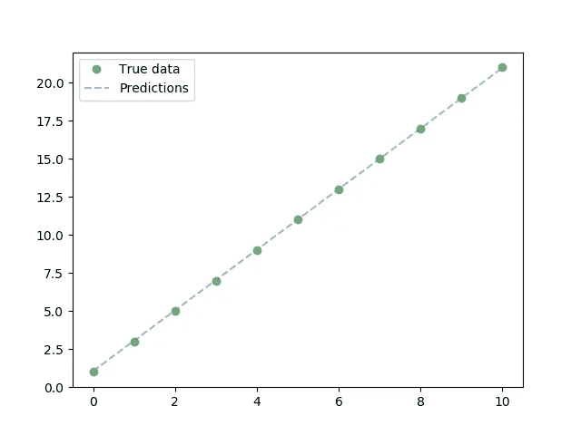

# PyTorch 线性回归

> 原文：<https://towardsdatascience.com/linear-regression-with-pytorch-eb6dedead817?source=collection_archive---------2----------------------->

线性回归是一种方法，它试图通过最小化距离来找到因变量和自变量**之间的线性关系，如下所示。**


Taken from [https://www.youtube.com/watch?v=zPG4NjIkCjc](https://www.youtube.com/watch?v=zPG4NjIkCjc)

在这篇文章中，我将展示如何使用 PyTorch 实现一个简单的线性回归模型**。**

让我们考虑一个非常基本的线性方程，即 **y=2x+1** 。这里，‘x’是自变量，y 是因变量。我们将使用此等式创建一个虚拟数据集，用于训练此线性回归模型。下面是创建数据集的代码。

```
import numpy as np*# create dummy data for training* x_values = [i **for** i **in** range(11)]
x_train = np.array(x_values, dtype=np.float32)
x_train = x_train.reshape(-1, 1)

y_values = [2*i + 1 **for** i **in** x_values]
y_train = np.array(y_values, dtype=np.float32)
y_train = y_train.reshape(-1, 1)
```

一旦我们创建了数据集，我们就可以开始为我们的模型编写代码。首先要定义模型架构。我们使用下面这段代码来实现。

```
import torch
from torch.autograd import Variable**class** linearRegression(torch.nn.Module):
    **def** __init__(self, inputSize, outputSize):
        super(linearRegression, self).__init__()
        self.linear = torch.nn.Linear(inputSize, outputSize)

    **def** forward(self, x):
        out = self.linear(x)
        **return** out
```

我们为线性回归定义了一个类，它继承了 **torch.nn.Module** ，后者是包含所有必需函数的基本神经网络模块。我们的线性回归模型只包含一个简单的线性函数。

接下来，我们使用下面的代码实例化这个模型。

```
inputDim = 1        *# takes variable 'x'* outputDim = 1       *# takes variable 'y'* learningRate = 0.01 
epochs = 100

model = linearRegression(inputDim, outputDim)
*##### For GPU #######* **if** torch.cuda.is_available():
    model.cuda()
```

之后，我们初始化损失(**均方误差**)和优化(**随机梯度下降**)函数，我们将在该模型的训练中使用这些函数。

```
criterion = torch.nn.MSELoss() 
optimizer = torch.optim.SGD(model.parameters(), lr=learningRate)
```

完成所有初始化后，我们现在可以开始训练我们的模型。下面是训练模型的代码。

```
**for** epoch **in** range(epochs):
    *# Converting inputs and labels to Variable* **if** torch.cuda.is_available():
        inputs = Variable(torch.from_numpy(x_train).cuda())
        labels = Variable(torch.from_numpy(y_train).cuda())
    **else**:
        inputs = Variable(torch.from_numpy(x_train))
        labels = Variable(torch.from_numpy(y_train))

    *# Clear gradient buffers because we don't want any gradient from previous epoch to carry forward, dont want to cummulate gradients* optimizer.zero_grad()

    *# get output from the model, given the inputs* outputs = model(inputs)

    *# get loss for the predicted output* loss = criterion(outputs, labels)
    print(loss)
    *# get gradients w.r.t to parameters* loss.backward()

    *# update parameters* optimizer.step()

    print(**'epoch {}, loss {}'**.format(epoch, loss.item()))
```

现在我们的线性回归模型已经训练好了，让我们来测试一下。由于这是一个非常简单的模型，我们将在现有的数据集上进行测试，并绘制原始输出与预测输出的对比图。

```
**with** torch.no_grad(): *# we don't need gradients in the testing phase* **if** torch.cuda.is_available():
        predicted = model(Variable(torch.from_numpy(x_train).cuda())).cpu().data.numpy()
    **else**:
        predicted = model(Variable(torch.from_numpy(x_train))).data.numpy()
    print(predicted)

plt.clf()
plt.plot(x_train, y_train, **'go'**, label=**'True data'**, alpha=0.5)
plt.plot(x_train, predicted, **'--'**, label=**'Predictions'**, alpha=0.5)
plt.legend(loc=**'best'**)
plt.show()
```

这绘制了下图。



看起来我们的模型已经正确地计算出了自变量和因变量之间的线性关系。

如果你已经理解了这一点，你应该试着为一个稍微复杂一点的**有多个独立变量的线性方程训练一个线性回归模型。**