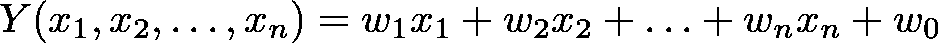
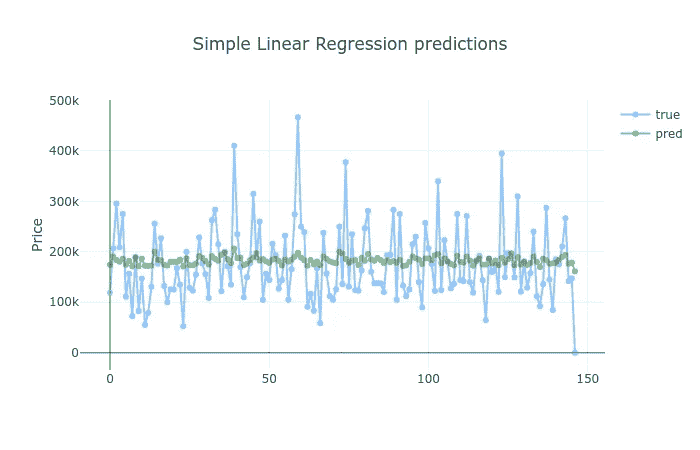

# 利用 TensorFlow.js 进行线性回归的房价预测

> 原文：<https://towardsdatascience.com/linear-regression-with-tensorflow-js-e7b39713572?source=collection_archive---------6----------------------->

## 使用 TensorFlow.js 构建线性回归模型，并用于预测房价

Photo by Geran de Klerk

> *TL；DR 在 TensorFlow.js 建立线性回归模型，预测房价。了解如何处理分类数据和进行要素缩放。*

又下雨了。自从你最后一次见到太阳已经三个星期了。你已经厌倦了这种寒冷、不愉快的孤独和忧郁的感觉。

你脑子里的声音越来越大。

——“动”。

好了，你准备好了。去哪里？你记得你几乎破产了。

你的一个朋友告诉了你爱荷华州的埃姆斯这个地方，它深深地印在了你的脑海里。快速搜索后，你发现一年中天气宜人，也有一些雨水，但不多。兴奋！

幸运的是，你知道 Kaggle 上的这个数据集，它可能会帮助你找出你梦想中的房子可能要花多少钱。我们开始吧！

**在浏览器中运行本教程的完整源代码:**

# 房价数据

我们的数据来自 Kaggle 的[房价:高级回归技术](https://www.kaggle.com/c/house-prices-advanced-regression-techniques/data)挑战。

> 有 79 个解释变量描述了(几乎)爱荷华州埃姆斯住宅的每个方面，这个比赛挑战你预测每个家庭的最终价格。

以下是我们将在模型中使用的数据子集:

*   `OverallQual` -对房屋的整体材料和装饰进行评级(0 - 10)
*   `GrLivArea` -地上(地面)以上居住面积平方英尺
*   `GarageCars` -车库容量大小
*   `TotalBsmtSF` -地下室总面积平方英尺
*   `FullBath` -地面以上的全浴室
*   `YearBuilt` -原始施工日期
*   `SalePrice` -以美元为单位的房产销售价格(我们正在尝试预测)

让我们使用 [Papa Parse](https://www.papaparse.com/) 来加载训练数据:

# 探测

让我们更好地理解我们的数据。首先—每栋房屋的质量得分:

大多数房子质量一般，但“好”的比“坏”的多。

让我们看看它们有多大(她是这么说的):

大多数房子的价格在 1，000-2，000 英镑之间，我们也有一些更大的。

让我们看看它们是哪一年建造的:

尽管有很多房子是最近建造的，但我们的分布范围要广得多。

年份和价格有多大关系？

似乎新房子更贵，没有人喜欢旧的和造得好的房子？

哦，好吧，但是高质量应该等于高价格，对吗？

一般可以，但是看质量 10。其中一些相对便宜。知道为什么会这样吗？

房子越大就等于价格越高吗？

似乎是这样，我们可以从居住区开始我们的价格预测模型！

# 线性回归

线性回归模型假设因变量`Y`和一个或多个解释变量`X`之间存在线性关系(可以用直线建模)。

在我们的例子中，我们将使用像`living area` (X)这样的特征来预测房子的`sale price` (Y)。

## 简单线性回归

简单线性回归是一种只有一个独立变量`X`的模型。它由下式给出:

其中 a 和 b 是在我们的模型训练期间学习的参数。 *X* 是我们将要用来训练我们的模型的数据， *b* 控制斜率， *a* 与 *y* 轴的交点。

## 多元线性回归

多元线性回归模型是简单线性回归模型的自然延伸。它由下式给出:

其中，x1，x2，…，xn 是数据集的特征，w1，w2，…，wn 是学习参数。

## 损失函数

我们将使用[均方根误差](https://en.wikipedia.org/wiki/Root-mean-square_deviation)来衡量我们的预测与实际房价的差距。它由下式给出:

其中假设/预测 *hw* 由下式给出:

# 数据预处理

目前，我们的数据存放在一个 JS 对象数组中。我们需要把它变成张量，并用它来训练我们的模型。下面是代码:

我们将特征存储在`X`中，将标签存储在`y`中。然后，我们将数据转换为张量，并将其分成训练和测试数据集。

## 分类特征

我们数据集中的一些要素是分类的/可枚举的。例如，`GarageCars`可以在 0-5 的范围内。

在我们的数据集中用整数表示类别可能会引入隐含的排序依赖。不存在分类变量的事物。

我们将使用 TensorFlow 的[一键编码](https://en.wikipedia.org/wiki/One-hot)为每个值创建一个整数向量，以打破排序。首先，让我们指定每个类别有多少不同的值:

我们将使用 [tf.oneHot()](https://js.tensorflow.org/api/latest/#oneHot) 将单个值转换成一个 Hot 表示:

注意，`createDataSets()`函数接受一个名为`categoricalFeatures`的参数，它应该是一个集合。我们将使用它来检查我们是否应该将该特征作为分类来处理。

## 特征缩放

[特征缩放](https://en.wikipedia.org/wiki/Feature_scaling)用于将特征值转换到一个(相似的)范围内。[特征缩放将帮助我们的模型学习得更快](https://arxiv.org/abs/1502.03167)，因为我们使用[梯度下降](https://en.wikipedia.org/wiki/Gradient_descent)来训练它。

让我们使用一种最简单的特征缩放方法—最小-最大归一化:

此方法在[0，1]的范围内重新调整值的范围。

# 预测房价

既然我们知道了线性回归模型，我们就可以根据现有的数据来预测房价。让我们从简单的开始:

## 构建简单的线性回归模型

我们将把培训过程封装在一个函数中，以便在未来的模型中重用:

`trainLinearModel`接受我们模型的特性和标签。让我们使用 TensorFlow 定义一个线性回归模型:

由于 TensorFlow.js 不提供 RMSE 损失函数，我们将使用 MSE，并在稍后计算它的平方根。我们还将跟踪预测价格和实际价格之间的平均绝对误差(MAE ):

以下是培训过程:

我们针对 *100* 个时期进行训练，预先对数据进行洗牌，并使用其中的 *10%* 进行验证。RMSE 和梅在每一个时代之后都是可视化的。

## 培养

我们的简单线性回归模型使用了 *GrLivArea* 特性:

我们没有明确的特征，所以我们让这个集合为空。让我们来看看表演:

## 建立多元线性回归模型

我们还有很多没用过的数据。让我们看看这是否有助于改善预测:

我们使用数据集中的所有要素，并传递一组分类要素。我们做得更好吗？

总的来说，这两种型号的性能大致相同。这一次，增加模型的复杂性并没有给我们带来更好的准确性。

# 估价

评估我们模型的另一种方法是对照测试数据检查它们的预测。让我们从简单的线性回归开始:

添加更多的数据是如何改善预测的？

但事实并非如此。同样，用更多数据训练更复杂的模型并不能提供更好的性能。

# 结论

你做到了！您构建了两个线性回归模型，根据一组特征预测房价。你也做到了:

-特征缩放以加快模型训练

-将分类变量转换为一键表示

-实施 RMSE(基于 MSE)进行精度评估

**在浏览器中运行本教程的完整源代码:**

是时候学习神经网络了吗？

# 参考

[处理机器学习模型中的分类数据](https://www.pluralsight.com/guides/handling-categorical-data-in-machine-learning-models)

[关于特征缩放和归一化](https://sebastianraschka.com/Articles/2014_about_feature_scaling.html)

[RMSE:均方根误差](https://www.statisticshowto.datasciencecentral.com/rmse/)

*最初发表于*[*https://www.curiousily.com*](https://www.curiousily.com/posts/predicting-house-prices-using-linear-regression-with-tensorflow-js/)*。*

建立机器学习模型(特别是深度神经网络)，可以轻松地与现有或新的 web 应用程序集成。想想您的 ReactJs、Vue 或 Angular 应用程序通过机器学习模型的强大功能得到了增强:

 [## JavaScript 黑客的深度学习

### 建立机器学习模型(特别是深度神经网络)，您可以轻松地与现有或新的网络集成…

leanpub.com](https://leanpub.com/deep-learning-for-javascript-hackers)