# 简单线性回归与多项式回归

> 原文：<https://towardsdatascience.com/linear-vs-polynomial-regression-walk-through-83ca4f2363a3?source=collection_archive---------5----------------------->

## 蓝鳃鱼:根据年龄预测长度

鱼越老越大。鱼的长度(厘米)与年龄(年)有多大的预测性？这种关系是否最适合简单的线性回归？


Source of image: Kelly [Sikkema](https://unsplash.com/photos/92ef3opsrLU)

# **目录**

1.  获取数据、可视化和初步分析
2.  线性回归分析
3.  二次和高次多项式回归分析
4.  将数据分为训练和测试
5.  每种回归类型的测试模型(线性、二次、六次)

# **第一部分:获取数据，可视化，和初步分析**

首先，让我们引入数据和几个重要模块:

```
%matplotlib inline
import numpy as np
import pandas as pd
from sklearn.metrics import r2_score
import matplotlib.pyplot as plt
from scipy import stats
import seaborn as snsdata = pd.read_excel(r”C:\Users\...\fish polynomial.xlsx”)
df = data[[‘age’,’length’]]
df
```

数据集中有 77 个实例。下面是头部的原始数据:

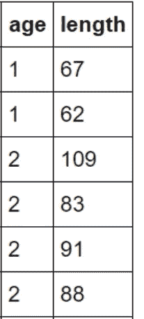

现在让我们来想象散点图。我们将尝试根据年龄来预测长度，因此坐标轴位于各自的位置:

```
x = df['age']
y = df['length']
plt.xlabel('Age (yr)')
plt.ylabel('Length (cm)')
plt.title('Scatterplot of Length vs Age')
plt.scatter(x,y)
plt.show()
```

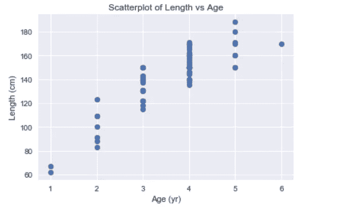

这似乎是一种趋势。随着鱼年龄的增长，似乎和长度有关系。为了获得更深入的视角，让我们将每个轴分解成它自己的单变量分布直方图。

**Y——鱼的长度:**

```
stdy = y.std()
meany = y.mean()
plt.hist(y)
plt.xlabel('Length (cm)')
plt.ylabel('Quantity')
plt.title('Length Distribution Histogram')
print ("The std of y is: " + str(stdy) + " The mean of y is: " + str(meany))
```

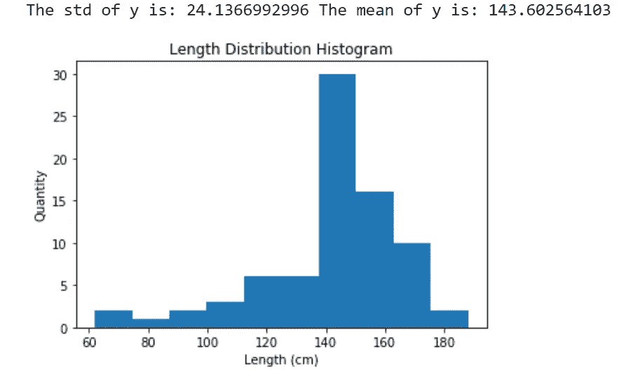

**X——鱼的年龄:**

```
stdx = x.std()
meanx = x.mean()
plt.hist(x)
plt.xlabel('Age (yr)')
plt.ylabel('Quantity')
plt.title('Age Distribution Histogram')
print ("The std of x is: " + str(stdx) + " The mean of x is: " + str(meanx))
```

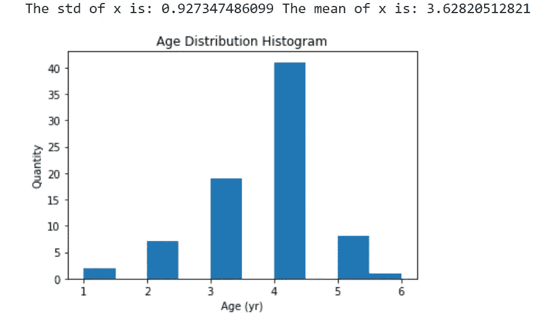

我们可以看到，平均长度为 143.6 厘米，平均年龄为 3.6 岁。年龄的标准偏差成比例地高于长度的标准偏差，这意味着年龄分布的总体分布更大。这是尽管长度分布具有更高的范围。

# **第二部分:简单线性回归**

简单线性回归是预测模型的基本类型之一。简而言之，它通过对数据拟合线性方程来衡量两个变量之间的关系。一个变量被认为是解释性的(年龄)，另一个被认为是依赖性的(长度)。回归模型最小化直线和每个数据点之间的距离，以找到最佳拟合。

下面，我们使用 scipy stats 模块来计算我们产品线的关键指标。下面输出的分别是截距和斜率。

```
slope, intercept, r_value, p_value, std_err = stats.linregress(x,y)
intercept,slope
```

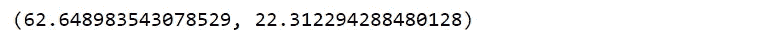

现在，我们将通过线性方程运行 x 的每个值，在原始散点图上绘制这条线: **y = b0 + b1x**

```
sns.set(color_codes=True)def linefitline(b):
    return intercept + slope * bline = linefitline(x)
plt.scatter(x,y)
plt.xlabel('Age (yr)')
plt.ylabel('Length (cm)')
plt.title('Scatterplot of Length vs Age - Linear Regression')
plt.plot(x,line, c = 'g')
plt.show()
```

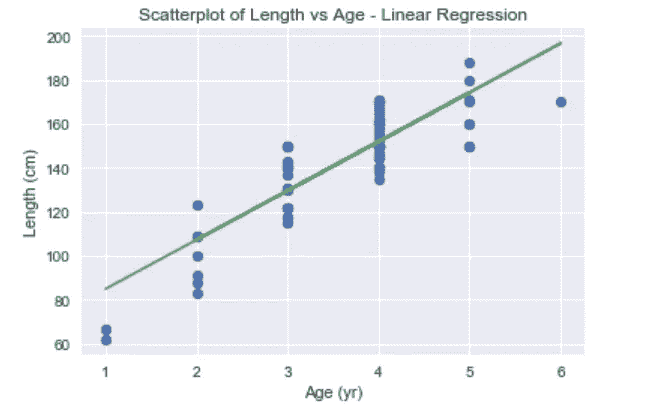

```
r2_lin = r_value * r_valueprint('The rsquared value is: ' + str(r2_lin))
```

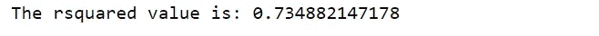

这条回归线的平方值显示年龄解释了 73%的长度变化。R-squared 计算回归线与其拟合的数据的相似程度。我写了另一篇关于 rsquared 的文章，你可以在这里参考。

> 其他可以解释剩余的 27%长度差异的独立变量可能是食物可用性、水质、阳光、鱼类遗传等。如果我们有所有这些属性的数据，我们可以运行多元回归，并有一个更好的模型。但是，唉，我们生活在一个数据有限的世界。

直观上，我们的简单线性模型并不经过 y 点的每个簇的中间点。对于第 1 年、第 2 年、第 5 年和第 6 年，它都高于该组的中间值。这很有可能是因为大多数样本是 3 岁和 4 岁的孩子，正如我们前面看到的。这将向上移动线条。

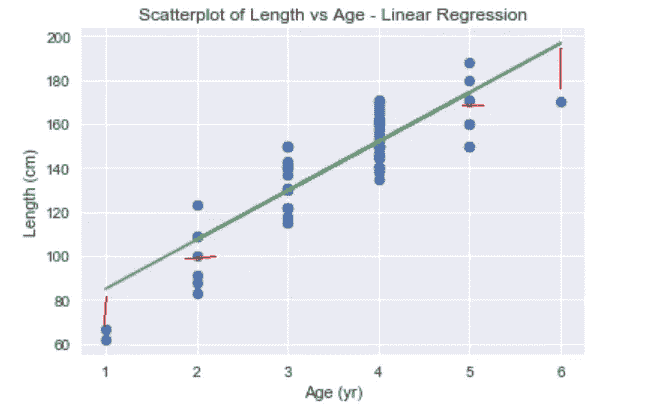

似乎最佳曲线需要弯曲以更准确地匹配数据。这就是多项式回归的用武之地。

# **第三部分:二次和高次多项式回归分析**

简单来说，多项式回归模型可以弯曲。它们可以构造到 n 次，以最小化平方误差，最大化 rsquared。取决于 n 次，最佳拟合的线可以有更多或更少的曲线。指数越高，曲线越多。

下面我们有一些代码来创建新的线，并在我们的散点图上绘制它。这条线是一个二次函数，因为它只有二次幂。二次线只能弯曲一次。正如我们在下图中看到的，新的多项式模型更准确地匹配了数据。

```
x = df['age']
y = df['length']
plt.xlabel('Age (yr)')
plt.ylabel('Length (cm)')
plt.title('Scatterplot of Length vs Age')
p = np.poly1d(np.polyfit(x,y,2))
xp = np.linspace(1,6,100)
plt.plot(xp,p(xp),c = 'r')
plt.scatter(x,y)
plt.show()
```

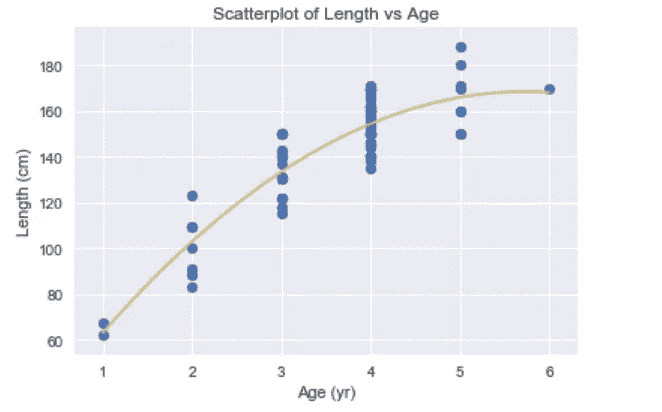

```
r2 = r2_score(y, p(x))print('The rsquared value is: ' + str(r2))
```

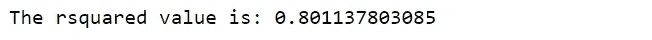

> 与我们在简单线性模型中看到的 0.73 值相比，rsquared 值为 0.80。这意味着在这个新模型中，80%的长度是由它们的年龄来解释的。

我们现在可以尝试改变模型的第 n 个值，看看我们是否能找到一个更好的拟合线。然而，我们必须记住，我们走得越高，我们面临的风险就越大。

下面是一个提升到**6 次**的多项式的例子:

```
x = df['age']
y = df['length']
plt.xlabel('Age (yr)')
plt.ylabel('Length (cm)')
plt.title('Scatterplot of Length vs Age')
p = np.poly1d(np.polyfit(x,y,6))
xp = np.linspace(1,6,100)
plt.plot(xp,p(xp),c = 'b')
plt.scatter(x,y)
plt.show()
```

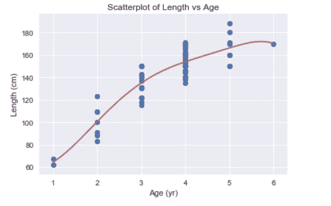

它对异常值的迎合有点过于极端，而且与数据过于接近。这个模型的平方值是 0.804，比二次模型高不了多少。

对于这个数据集，大多数人会同意二次函数最匹配。

# **第 4 部分:将数据分割成训练和测试**

我们如何知道二次多项式回归直线可能是这个数据集的最佳拟合？这就是测试我们的数据的概念的来源！

首先，让我们打乱数据集。然后我们需要把它分成训练和测试部分。训练数据用于创建我们的模型；测试数据用于查看模型的匹配程度。有一个[经验法则](https://dataandbeyond.wordpress.com/2017/08/24/split-of-train-and-test-data/)来划分 70%的培训和 30%的测试。因为这是一个相对较小的鱼样本量(n = 78)，所以我决定在测试方面多做一点。我做了 50 次作为训练，最后 28 次作为测试。那是 65/35 的分成。

```
shuffled = df.sample(frac=1).reset_index(drop=True)
shuffx = shuffled['age']
shuffy = shuffled['length']
trainX = shuffx[:50]
testX = shuffx[50:]
trainY = shuffy[:50]
testY = shuffy[50:]
plt.scatter(trainX, trainY)
plt.xlabel('Age (yr)')
plt.ylabel('Length (cm)')
plt.title('Testing Data - Length vs Age')
axes = plt.axes()
axes.set_xlim([1,6])
axes.set_ylim([50, 200])
plt.show()
plt.scatter(testX, testY)
plt.xlabel('Age (yr)')
plt.ylabel('Length (cm)')
plt.title('Testing Data - Length vs Age')
axes = plt.axes()
axes.set_xlim([1,6])
axes.set_ylim([50, 200])
plt.show()
```

与测试相比，训练图中有更多的点，这是由于我们的 65/35 分割:

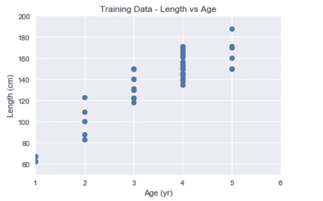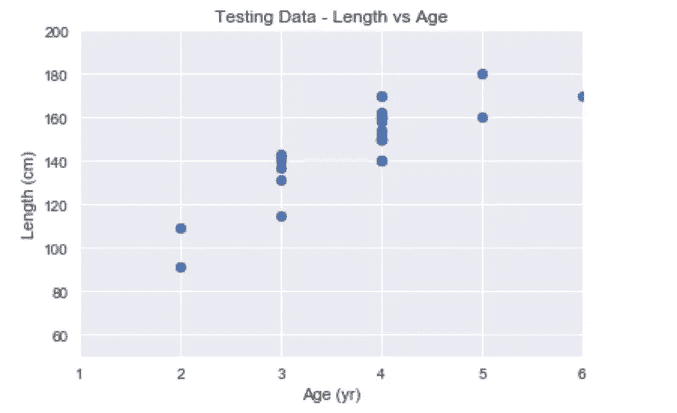

# **第 5 部分:每个回归类型的测试模型**

**线性模型测试:**

现在，我们将根据训练数据创建一个线性模型:

```
p1 = np.poly1d(np.polyfit(trainx, trainy, 1))
xp = np.linspace(0, 6, 100)
axes = plt.axes()
axes.set_xlim([1,6])
axes.set_ylim([50, 200])
plt.scatter(trainx, trainy)
plt.xlabel('Age (yr)')
plt.ylabel('Length (cm)')
plt.title('Training Linear Regression')
plt.plot(xp, p1(xp), c='r')
plt.show()
```

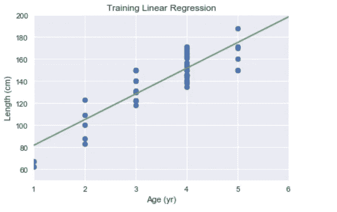

这条线与训练集非常匹配。“0.75”的平方值相当不错:

```
r2_train = r2_score(trainy, p1(trainx))
print('The rsquared value is: ' + str(r2_train))
```

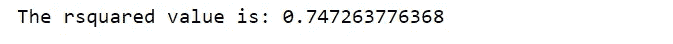

现在让我们看看这条线如何与我们保存的测试数据相匹配:

```
xp = np.linspace(0, 6, 100)
axes = plt.axes()
axes.set_xlim([1,6])
axes.set_ylim([50, 200])
plt.scatter(testx, testy)
plt.xlabel('Age (yr)')
plt.ylabel('Length (cm)')
plt.title('Testing Linear Regression')
plt.plot(xp, p1(xp), c='r')
plt.show()
```

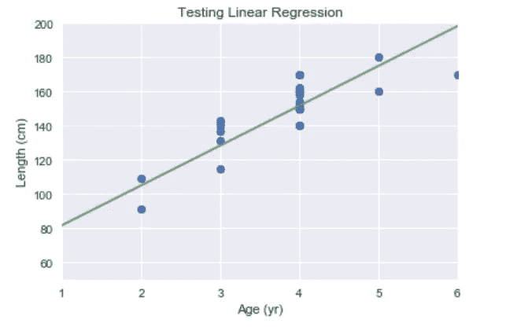

这个模型看起来不错。它没有考虑 6 岁时的异常值，而且相对于每个年龄组的中值长度来说，它看起来也有点低。这些担心在较低的平方值中是合理的:

```
r2_test = r2_score(testy, p1(testx))
print('The rsquared value is: ' + str(r2_test))
```

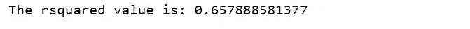

**二次模型测试:**

让我们看看二次回归与简单线性回归的比较。这些计算的代码与上面的计算非常相似，在 numpy.polyfit 方法中定义回归时，只需将中的“1”更改为“2 ”:

***p2****= NP . poly 1d(NP . poly fit(trainx，trainy，* ***2*** *))。*

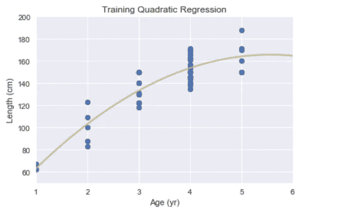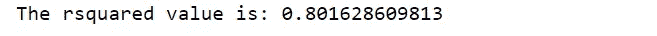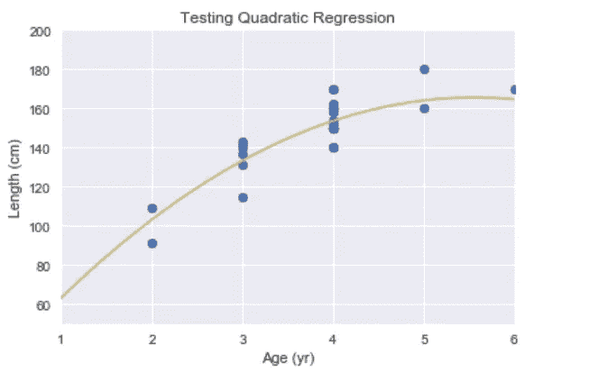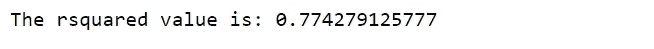

二次回归具有较高的训练方差。此外，与测试数据相比，它几乎没有下降多少。

**性别(n6)回归检验:**

最后，让我们看看高次多项式回归是如何执行的:

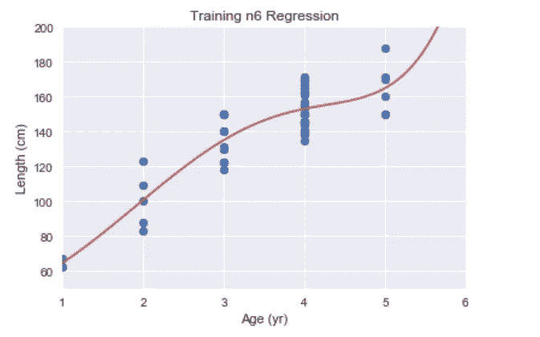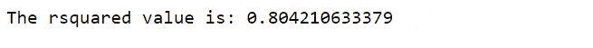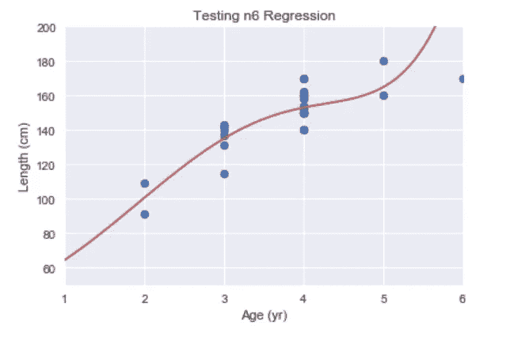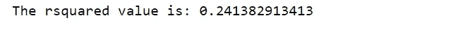

该模型以最高的训练平方值开始，但是当实际测试时，它直线下降。这是[过度装配](https://www.investopedia.com/terms/o/overfitting.asp)的症状。

# **结论:**

二次回归最适合本例中的数据。然而，在训练/测试分割之前的混洗会影响这些结果。根据哪些行结束于哪个段，rsquared 结果可能会略有不同。对于像这样的小数据集来说尤其如此。

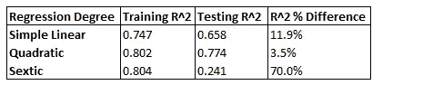

原始数据来源:[宾夕法尼亚州立大学](https://newonlinecourses.science.psu.edu/stat501/node/325/)。

如果你觉得这有帮助，请订阅、鼓掌或评论。

感谢阅读！

我的其他文章，如果你想了解更多:

## 点击了解逻辑回归

## 点击了解有关 rsquared [的信息:](/r-squared-recipe-5814995fa39a)