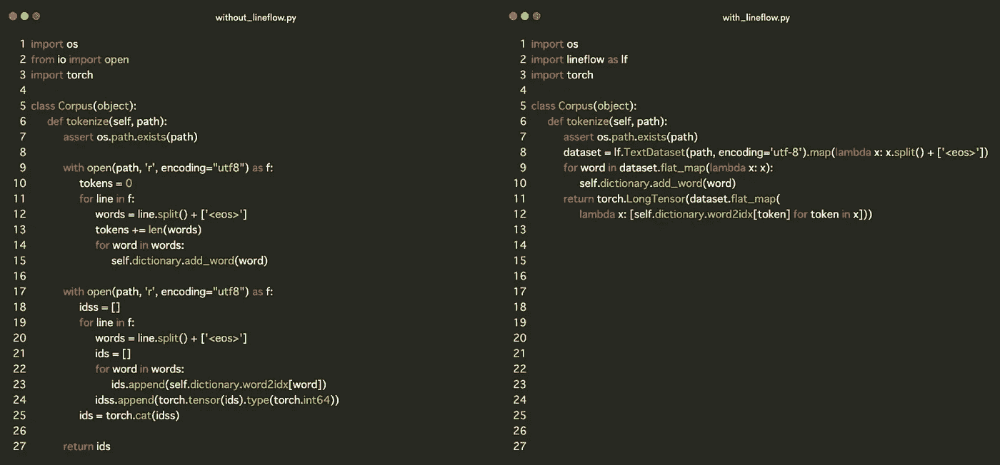
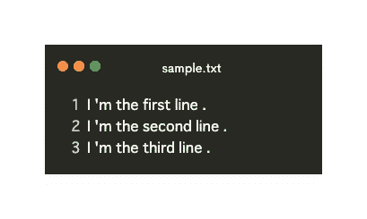
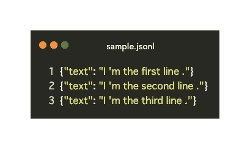
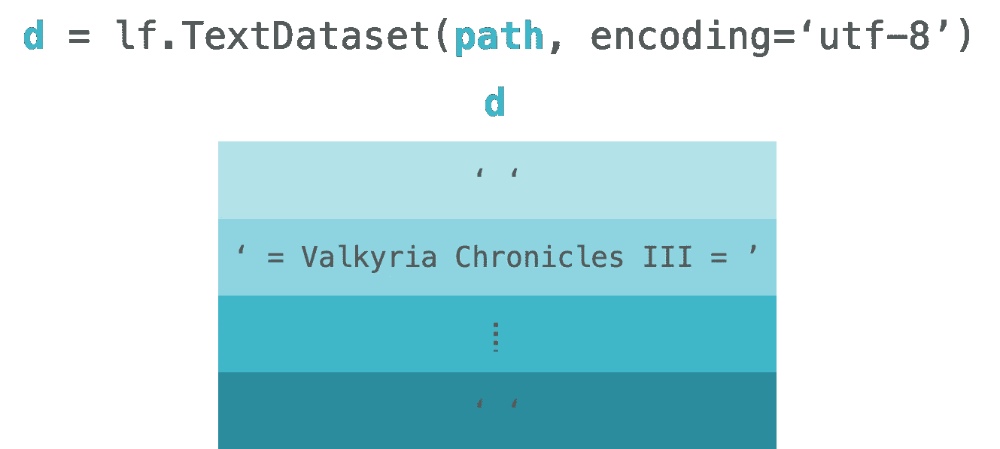
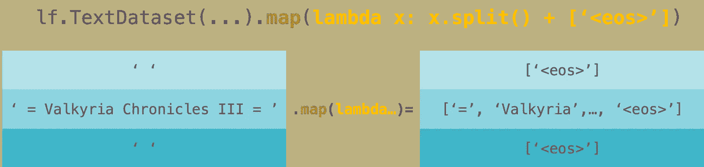
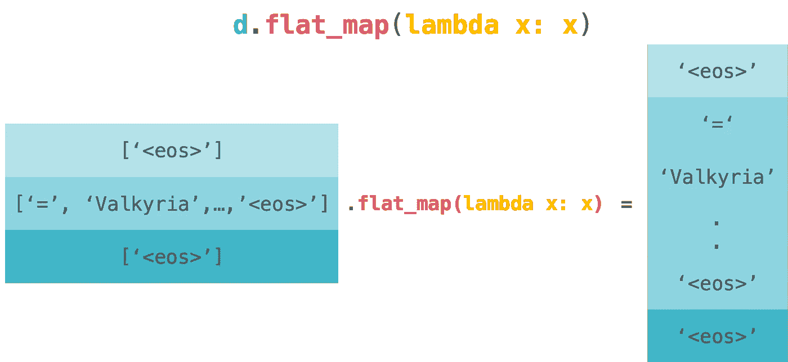
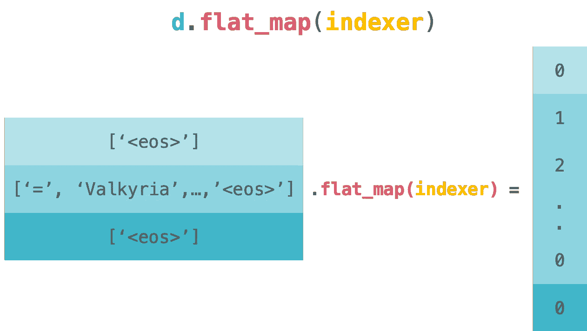

# line flow:py torch 或任何框架的简单 NLP 数据集处理程序

> 原文：<https://towardsdatascience.com/lineflow-introduction-1caf7851125e?source=collection_archive---------20----------------------->

## 代码越少，痛苦越少


Photo by [Ferenc Horvath](https://unsplash.com/@designhorf?utm_source=unsplash&utm_medium=referral&utm_content=creditCopyText) on [Unsplash](https://unsplash.com/?utm_source=unsplash&utm_medium=referral&utm_content=creditCopyText)

对于 NLP 任务，您可能需要在预处理中标记文本或构建词汇表。而且你大概也体验过，预处理代码跟你的桌子一样乱。原谅我，如果你的桌子很干净:)我也有这样的经历。这就是为什么我创造了 [LineFlow](https://github.com/tofunlp/lineflow) 来减轻你的痛苦！它会让你的“桌子”尽可能的干净。真正的代码是什么样的？看一下下图。预处理包括标记化、构建词汇表和索引。



I used [Codeimg.io](https://codeimg.io) for this picture.

左边部分是来自 [PyTorch 官方示例库](https://github.com/pytorch/examples/blob/master/word_language_model/data.py#L20)的示例代码，它对文本数据进行常见的预处理。右边部分用 LineFlow 编写，实现完全相同的处理。你应该明白线条流是如何减轻你的疼痛的。你可以从[这个链接](https://gist.github.com/yasufumy/ba73b587bd3c516b66fb94b3a90bac71)查看完整代码。

在这篇文章中，我将详细解释右边部分的代码，并向您展示 LineFlow 的用法。让我们开始一个干净的“办公桌”生活吧！

# 1.加载您的文本数据

加载文本数据是通过上面代码的第 8 行完成的。稍后我会解释地图。`lf.TextDataset`将文本文件的路径作为参数并加载它。

```
dataset = lf.TextDataset(path, encoding='utf-8').map(...)
```

`lf.TextDataset`期望的数据格式是每行对应一个数据。如果您的文本数据满足这个条件，您可以加载任何类型的文本数据。



**加载后，将文本数据转换为列表。列表中的项目对应于文本数据中的行。**看下图。这是对`lf.TextDataset`的直观形象。图中的`d`代表代码中的`dataset`。



LineFlow 已经提供了一些公开的数据集。所以你可以立即使用它。您可以在此查看提供的数据集[。](https://github.com/tofunlp/lineflow#datasets)

# 2.标记化

第 8 行也完成了文本标记化。`map`将作为参数传递的处理应用于文本数据的每一行。

```
dataset = lf.TextDataset(...).map(lambda x: x.split() + ['<eos>'])
```

看下图。这是`lf.TextDataset.map`的直观形象。图中的`d`代表代码中的`dataset`。



下面让我们深入实际的处理过程。

```
lambda x: x.split() + ['<eos>']
```

这里，我们用空格将文本数据中的每一行分割成标记，然后在这些标记的末尾添加`<eos>`。我们按照 [WikiText 官方页面](https://blog.einstein.ai/the-wikitext-long-term-dependency-language-modeling-dataset/)的处理方式。

此时，我们使用`str.split`进行标记化。我们可以使用其他标记化方法，如 [spaCy](https://github.com/explosion/spaCy) 、 [StanfordNLP](https://github.com/stanfordnlp/stanfordnlp) 和 [Bling Fire](https://github.com/microsoft/BlingFire) 等。例如，如果你想使用 Bling Fire，我们会得到下面的代码。

```
>>> from blingfire import text_to_words
>>> d = lf.TextDataset('/path/to/your/text')
>>> d.map(text_to_words).map(str.split)
```

此外，我们可以做任何我们想要的处理，只要我们的处理将每行文本数据作为参数。例如，我们可以计算令牌的数量。在下面的代码中，标记的数量在第二个元素中定义。

```
>>> d = lf.TextDataset('/path/to/text')
>>> d.map(tokenize).map(lambda x: (x, len(x)))
```

当我们想要制作注意力机制或 LSTM 的面具时，这种处理是很有用的。

# 3.索引

从第 9 行到第 12 行完成索引。这些线条如下图所示。在这个代码块中，我们构建了词汇表和索引。让我们按顺序来看这些。

```
for word in dataset.flat_map(lambda x: x):
    self.dictionary.add_word(word)
return torch.LongTensor(dataset.flat_map(...))
```

首先，我们将看到构建词汇的模块。在下面的代码块中，我们构建了词汇表。`flat_map`将作为参数传递的处理应用于数据中的每一行，然后将其展平。所以我们会在`dataset.flat_map(lambda x: x)`后得到个人令牌。

```
for word in dataset.flat_map(lambda x: x):
    self.dictionary.add_word(word)
```

看下图。这是对`dataset.flat_map(lambda x: x)`的直观形象。图中的`d`代表代码中的`dataset`。



`flat_map`有点令人困惑，但它相当于下面的代码。

```
>>> from itertools import chain
>>> chain.from_iterable(map(lambda x: x, dataset))
>>>
>>> dataset.flat_map(lambda x: x) # same as above
```

在使用`flat_map`提取每个标记之后，我们将标记传递给`self.dictionary.add_word`，后者构建词汇表。我不解释它是如何工作的，因为它与这篇文章无关。但是如果你对它的内部实现感兴趣，请查看[这个链接](https://github.com/pytorch/examples/blob/master/word_language_model/data.py#L10)。

```
self.dictionary.add_word(word)
```

接下来，我们将看到索引的代码块。索引由下面的块完成。这里，我们还使用`flat_map`来索引每个令牌并将其展平。这是因为 PyTorch 的例子需要平坦记号的张量。所以我们跟着它。

```
dataset.flat_map(
    [lambda x: self.dictionary.word2idx[token] for token in x)])
```

看下图。这是`dataset.flat_map(indexer)`的直观形象。图中的`d`代表代码中的`dataset`。



这个代码等同于下面的代码。

```
>>> from itertools import chain
>>> chain.from_iterable(map(indexer, dataset))
>>>
>>> dataset.flat_map(indexer) # same as above
```

最后，我们用`torch.LongTensor`把它包裹起来，使之成为张量。我们完成了文本数据的加载。

```
return torch.LongTensor(dataset.flat_map(...))
```

我们可以在下面查看到的全部代码。

解释到此为止。LineFlow 通过对文本数据进行矢量化来完成较少的循环和较少的嵌套代码。我们可以通过使用 Python 的地图来做同样的事情。但是 LineFlow 为我们提供了可读和干净的代码，因为它像管道一样构建处理([流畅接口](https://en.wikipedia.org/wiki/Fluent_interface))。

如果你喜欢 LineFlow 并想了解更多，请访问下面的知识库。

 [## tofunlp/lineflow

### 此时您不能执行该操作。您已使用另一个标签页或窗口登录。您已在另一个选项卡中注销，或者…

github.com](https://github.com/tofunlp/lineflow/tree/master/examples) 

感谢您的阅读！