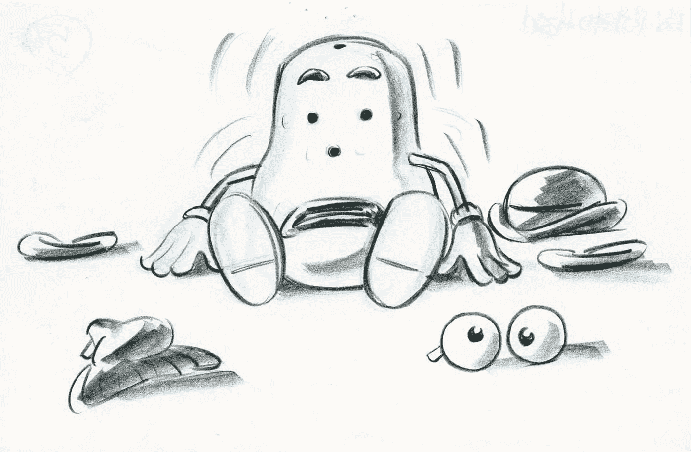
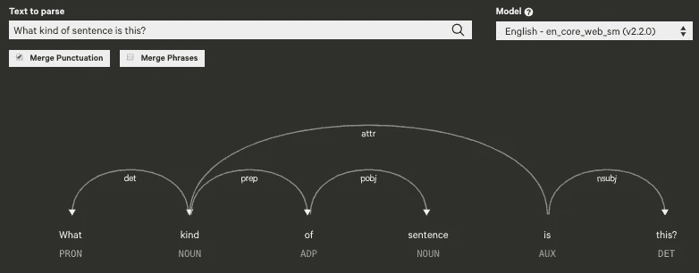
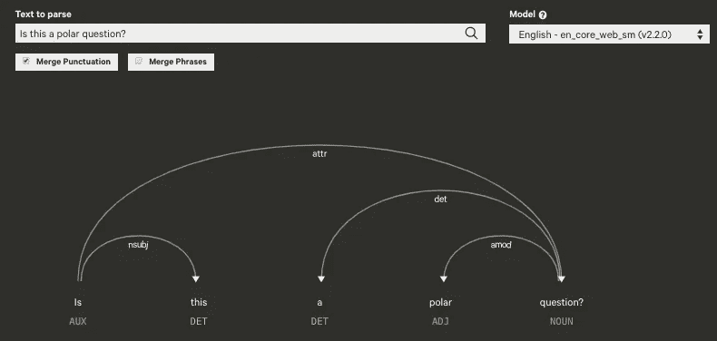

# 为自然语言处理编写语言规则

> 原文：<https://towardsdatascience.com/linguistic-rule-writing-for-nlp-ml-64d9af824ee8?source=collection_archive---------4----------------------->

## 用 spaCy 提取问题类型的指南


Source: This LA Times [article](https://www.latimes.com/entertainment/la-et-toy-story-4-don-rickles-mr-potato-head-rex-20190619-story.html)

## 目录

1.  一位语言学家的沉思
2.  [一种解决方案:基于规则的句法特征提取](#762b)
3.  [一个例子:使用 spaCy 的问题类型抽取](#8a27)

# 🌳一位语言学家的沉思

当我在语言学博士项目接近尾声时开始探索数据科学时，我很高兴地发现了语言学的作用——具体来说，是语言学的*特征*——在 NLP 模型的开发中。与此同时，我有点困惑，为什么很少有人谈论利用*句法*特征(例如，从句嵌入的程度、并列的存在、言语行为的类型等等)。)相比于其他类型的特征，比如某个单词在文本中出现了多少次(词汇特征)，单词相似度度量(语义特征)，甚至单词或短语在文档中出现的位置(位置特征)。

例如，在情感分析任务中，我们可以使用实词列表(形容词、名词、动词和副词)作为特征来预测用户反馈的语义取向(即，积极或消极)。在另一个反馈分类任务中，我们可以管理特定领域的单词或短语列表，以训练可以将用户评论引导到适当的支持部门的模型，例如，计费、技术或客户服务。

这两项任务都需要预先构建的词典来进行特征提取，并且有许多这样的词典供公众使用，例如由媒体作者管理的 [SocialSent](https://nlp.stanford.edu/projects/socialsent/) 和[这些](https://medium.com/@datamonsters/sentiment-analysis-tools-overview-part-1-positive-and-negative-words-databases-ae35431a470c)。(也可以查看这篇研究文章，它讨论了建立情感词典的不同方法)。虽然**词法特征**在许多 NLP 应用程序的开发中发挥了重要作用，但是涉及**句法特征**使用的工作相对较少(一个大的例外可能是在语法错误检测领域)。

对我这样一个来自语言学传统的人来说，这很令人困惑(也有一点讨厌),因为在语法的总体架构中，语法比语义和音位学更“优越”。当然，这并不是说语言学家认为句法在某些方面比语言学的其他分支更重要——而是说它在许多语法模型中占据首要地位，这些模型假设句法形式是在语义或语音解释实现之前得到的。习惯了语言学理论中句法模块的这种“中心性”,我很难理解 NLP 中对句法结构的不冷不热的态度，这与 NLP 开发人员对词汇内容作为特征的巨大信心形成了鲜明的对比。

NLP 所想象的语言，有时让我想到一个支离破碎的土豆脑袋先生——散落在一本涂色书的一页上的二维身体部分，彼此没有关系的单词。



Source: [https://www.pixar.com/feature-films/toy-story](https://www.pixar.com/feature-films/toy-story)

*当我了解到机器学习/深度学习的“魔力”时，我对这种明显过度简化的语言(在我最早的理解中，它是一个单词包)感到的一些不安最终消散了:即使没有显式编码，“它也能学习语法。”(具有讽刺意味的是，这也是[一个孩子在没有明确指导的情况下习得语言的方式](https://link.springer.com/referenceworkentry/10.1007%2F978-3-319-02240-6_7)。)*

但是，作为一名语言学家(特别是一名形态合成学家)，老实说，我仍然有点担心句法特征在 NLP/ML 中没有获得像词汇特征那样多的关注，我倾向于将这种不对称归因于以下原因:

## **1。重复暴露于去强调结构**的预处理流水线并对其进行规范化

作为 NLP 的学生，我们被反复介绍了 NLP 管道，其中包括预处理技术，如停用词移除、词汇化/词干化和词袋表示。这些技术在许多情况下是有价值的，但本质上是减法:它们去除了原文中存在的大量句法(和/或形态学)信息。停用词去除消除了编码关于成分/短语之间关系的信息的虚词，例如 *into、from、to、*、*和*等。词汇化和词干化删除了重要的屈折特征，如时态和一致以及派生词缀，这些词缀可能对确定单词的准确含义至关重要(例如，*教师*中的- *er* ，以及- *盗用*中的- *ment* )。当然，单词袋表示法不考虑词序，对于像英语这样不使用形态格来表示词序的语言来说，这是一个重大损失。当这些步骤成为我们日常 NLP 管道中正常和重复出现的部分时，它有可能模糊或最小化句法结构在自然语言处理中实际发挥的作用，从而阻碍或阻止任何系统地测量其对 NLP 模型的影响的努力。

## **2。编写复杂语言规则的实际挑战**

我还推测，句法特征的相对晦涩在很大程度上是由于编写足够复杂的规则的实际挑战。NLP 专家进入该领域时，对句法的了解程度各不相同，如果没有对每种语言的句法结构的基本原理和共性以及某种程度上对跨语言变化的限制的牢固掌握，可能很难知道什么样的句法特征与特定语言相关，更不用说编写试探法来提取它们了。与词汇特征不同，词汇特征在许多情况下相当于简单的字数统计，在句子(句法)级别上精心设计经过深思熟虑的语言规则是一项更具挑战性的任务，需要大量的领域知识。

## **3。人机交互中人类语言的简化性质**

我还发现，我们一些最受欢迎和商业化的 NLP 产品不需要非常复杂的输入文本或语音的语法表示，这使得语法特征在支持它们的模型开发中变得不可或缺。我认为原因是:(1)人机交互中的人类语言往往过于简单(“嘿，谷歌，旧金山天气”与“嘿，约翰，你介意告诉我今天旧金山的天气吗？”)和(2)简单的解析比复杂的解析更适合于计算成本较低的系统，所以我们不得不处理这些约束。

# 👮一种解决方案:基于规则的句法特征抽取

明确地说，我上面概述的三件事是在特征工程中使用句法特征的挑战/障碍，而不是排除它们的理由。虽然我不确定与其他特征相比，句法特征对模型性能的贡献有多大，但我确实相信，随着我们寻求构建能够以更加微妙、自然和复杂的方式与人类交互的机器，句法输入和表示*将在未来的自然语言处理中发挥越来越重要的作用。我认为，我们可以通过做以下三件事来应对，从而受益匪浅:*

1.  在我们日常的 ML 工作中更多地尝试语法特性，并投资于简化这个过程，使它成为流水线中重复的一部分。
2.  为语言特征提取创建更多开源代码。
3.  雇佣更多的语言学家——如果有必要的话，帮助他们提高专业技能。投资它们，因为它们会带来独特的回报。

在所有这三个任务中，我认为我们将通过开发，特别是一个*规则驱动的*系统来获得最大的收益。语法是一个需要关于特定语言的精确知识的领域，因此非常适合于基于规则的表示(在 NLP 中)，也许比任何其他语法领域都更适合。采用基于规则的方法的提议与采用完全 ML 的方法来构建特性集相竞争。在后一种情况下，您训练一个模型来预测特定特性*到*的值，并将其输入一个模型来预测某个目标变量的输出。然而，这个过程很可能非常耗时和昂贵，因为你正在训练一个模型*到*训练一个模型。这就是为什么我会建议在几乎所有情况下将规则作为混合系统的一部分。混合方法将 ML 算法驱动的基础模型与作为一种后处理过滤器的基于规则的系统相结合，它们已经是旧闻了。它们已经有很多成功的应用，比如这个和我自己的工作。

## 规则用法

规则和基于规则的系统的另一个优势是，它们可以以多种方式灵活使用，因此为 ML 管道的几乎每个阶段带来价值和严谨性。除了在特征工程阶段使用它们提取特征外，它们还可用于:

1.  预先标记大型数据集，以在数据准备期间创建有噪声的训练数据(一个**标记功能**
2.  在数据预处理期间排除某些注释(一个**预过滤器**)
3.  在模型评估之前/期间从分类器的输出中过滤掉假阳性(一个**后置过滤器**

因此，像有些人可能倾向于做的那样，用规则或基于规则的系统来对抗 ML 算法是不合适的。相反，我们必须承认，它们在一些非常引人注目的方面相互补充，为整体架构增添了重要的优势。

# 基于空间的⛹️‍♂️问句类型抽取

在这最后一部分，我将提供一个实用的指南来编写一些用于特征提取的语法规则。我将使用 spaCy 来做这件事，重点是提取**题型**。我选择了问题类型，因为这一类别可以很好地说明语言知识在构建部分规则驱动的 NLP 模型中的不可思议的价值。此外，可能有许多问题类型提取的用例(通过扩展，句子类型)，所以希望有人能从下面的代码中受益。我能想到的一些应用有:问题的细粒度分类(句子是 wh-问句，是非问句，还是附加疑问句？)、言语行为检测(评论是问题、请求还是需求？)、一些对比言语分析(哪个个人或群体在言语中使用更多的礼貌策略？)，等等。


Source: This [review](https://www.newstalkflorida.com/featured/review-in-the-joyous-toy-story-4-the-toys-evolve-too/)

在这最后一节，我最终希望能够让 NLP 开发人员理解语言学知识的相关性，以及 NLP/ML 任务中规则或基于规则的系统的相关性**。**

## 语言规则编写:一个迭代过程

在编写语言规则时，我通常遵循以下六个步骤:

1.  确定感兴趣的类别(例如，“疑问词”、“极性问题”、“不是问题”)。
2.  对每个类别提出一两个大的语言概括。
3.  想出一些概括的反例，并在必要时修改/扩展它们。
4.  写出捕捉新概括的规则。
5.  在一堆例子上测试规则。
6.  通过解决任何误报和测试新示例来微调规则。

这些步骤通常不会完全按顺序进行。例如，确定你想要的目标类别(步骤 1)基本上相当于陈述一些关于它们的概括(步骤 2)，所以你可以同时做这些步骤。在我说明这个流程如何指导我们的规则编写之前，让我们稍微深入一下 spaCy。

## spaCy 入门

[spaCy](https://spacy.io/) 是一个高性能的 Python 库，它拥有众多的特性和功能来帮助您构建您最喜欢的 NLP 应用程序，包括标记化、命名实体识别、词性标记、依存解析、预训练的单词向量和相似性以及内置的可视化工具。在这里查看它的全套功能[，但是这里我们将只关注它的两个处理组件 tbat，这两个组件将使我们能够表示任何句子的句法结构，即`tagger`和`parser`。使用 spaCy 的基本流程是这样的:首先，加载一个你选择的](https://spacy.io/usage/spacy-101#features)[模型(例如`"en_core_web_sm"`)。然后你可以通过调用`nlp`上的`pipeline`或`pipeline_name`来检查管道组件。](https://spacy.io/usage/models)

接下来，通过传入一个字符串并将其转换成一个 spaCy `Doc`，一个令牌序列，来调用`nlp`(下面的第 2 行)。`Doc`的语法结构可以通过访问其组件标记的以下属性来构建:

*   `**pos_**`:粗粒度的词性标签。
*   `**tag_**`:细粒度的词性标签。
*   `**dep_**`:句法依存标签，即记号之间的关系。
*   `**head**`:句法调控器，或者直接支配的标记

我发现打印出这些属性的值以及元组中的标记名和索引很有帮助，如下所示:

如果你想可视化解析，把你的句子输入 spaCy 的内置可视化工具 [displaCy](https://explosion.ai/demos/displacy) :



spaCy’s visualizer displaCy lets you visualize dependency parses with POS annotations

箭头指示标记之间的头部相关关系，并且每个标记都标有粗略级别的 POS 标签(精细级别(`tag_`)在此未示出)。

## 步骤 1-2:确定你想写规则的类别，并为每个类别提出一两个语言概括

这两个步骤通常是齐头并进的。在提出问题类型提取的规则时，我们必须认识到任何语言中都有两种类型的问题:特殊疑问句和极性疑问句。仔细阅读这些概括:

```
Generalizations about question types:(1) **Wh-questions** (aka content questions): start with an interrogative word (a “wh-phrase”) like *who, what*, *where*, and *how,* and call for specific information.(2) **Polar questions** (aka yes or no questions): can be answered in the affirmative or the negative (with a yes or a no response), and begin with an auxiliary (*did, do*) or modal (*will, can*) verb.
```

您可能会发现使用 displaCy 可视化这些问题类型很有帮助。最后一个截图包含了一个疑问问句的解析，下面是一个极性问句的解析:



A dependency parse for a polar question

除了可视化解析之外，我喜欢能够看到每个标记的 pos-tag-dep 三元组，如下所示:

利用您对 Penn Treebank 注释约定的了解(因为这是 spaCy 所使用的)，您可以尝试编写 v1 函数来捕捉上面的概括。我通常喜欢为不同的类别编写单独的函数，而不是编写一个包含复杂的 if/then 逻辑的函数。这里有一个快速的第一个版本，试图捕捉(1)-(2)中的概括。

v1 rules for extraction the two question types

## 第三步:想出反例，修改你的概括

为你最初的概括提出反例是必要的，因为它们会挑战你对所考虑的语言现象的基本假设(这里是问题形成)，并迫使你找出不同例子之间的共同线索，以统一、概括的方式表达它们的行为和特征。最终，这将有助于您编写更简单、更健壮、更全面的规则。

上面给出的两个概括在这里复制，以节省您的滚动:

```
(1) **Wh-questions** (aka content questions): start with an interrogative word (a “wh-phrase”) like *who, what*, *where*, and *how,* and call for specific information.(2) **Polar questions** (aka yes or no questions): can be answered in the affirmative or the negative (with a yes or a no response), and begin with an auxiliary (*did, do*) or modal (*will, can*) verb.
```

这里是(1)中概括的第一对反例:

```
(3) What you sayis unbelievable.
(4) Who you're going to kill is not my problem.
```

我们看到(1)没有被这些句子证实，因为尽管以疑问词开头，它们不是疑问词！它们就是语言学家所说的 wh-clefts，或**假撇子**。假左通常被描述为强调或“聚焦”句子的一部分，并且具有(5)中的形式:

```
(5) free relative + "be" + focused constituent
```

自由关系是一个 wh-relative 从句，它(显然)缺少一个中心名词(所以是“你说的东西”而不是“你说的东西”)。这部分伪左引导一个主题(句子是关于什么的)，并通过动词“be”链接到一个引入新信息(“不可思议”)的焦点成分。

以下是(1)的一些反例:

```
(5) In which article did they talk about spaCy?
(6) To whom did you read the article?
```

这些句子没有证实(1)的原因是不同的:虽然它们*没有像概括所说的那样以疑问短语开始*，但它们*仍然是*疑问问句，因为它们可以用具体的信息来回答(6)的问题(例如，对(6)的回答可以是“我给我妹妹读了这篇文章。”).这些句子是所谓的[pied-pied](https://en.wikipedia.org/wiki/Wh-movement#Pied-piping)结构，其特点是一个 wh-词与一个介词一起出现，就好像它将另一个“拖”到了句子的前面。(6)特别可以与另一个句子形成对比的是，[“股”是介词](https://en.wikipedia.org/wiki/Preposition_stranding):**你读了谁的文章*？”。***

*最后，这里有两个反例来概括(2)中陈述的关于极性的问题:*

```
*(7) Is it going to rain tonight?
(8) Were you sad about her leaving?*
```

*这些句子表明，除了助动词和情态动词之外，系词(“be”)作为*主*动词(vs. an 助动词)应该被列入可以出现在极性问句开头的动词范畴。更简单地说，当动词是助动词、情态动词或充当主要动词的 be 形式时，动词和主语在极性问句中会发生倒置。这使我们得出以下经过修改的概括:*

```
*(1') **Wh-questions** (aka content questions): **contain** an interrogative word (a “wh-phrase”) like *who, what*, *where*, and *how,* and call for more specific information.(2') **Polar questions** (aka yes or no questions): can be answered in the affirmative or the negative (with a yes or a no response), and display subject-verb inversion where the verb must be either an auxiliary (*did, do*), a modal (*will, can*), **or a form of the main verb *be.****
```

*我认为这一步清楚地表明，语言知识对于编写复杂的特征提取规则是不可或缺的。了解英语使用各种策略来标记疑问句，如主语-动词倒装和 wh-移动，以及识别(并命名)有趣的语言现象，如 pied-piping 和 clefting，可以帮助你形成概括，进而帮助你编写不太具体的全面规则。*

## *第四步:写规则*

*我们现在可以修改函数的早期版本`is_wh_question_v1`和`is_polar_question_v1`，以符合新的一般化(1’)和(2’)。这一部分需要一些时间和练习，然后我们才能感到非常自信和舒适，所以要有耐心！下面，我将重点介绍 v2 功能的几个核心特征:*

*在`is_wh_question_v2`:*

*   *指空间标签(如`"WDT"`、`"WP"`等)。)使您的规则比引用单个 wh-words(第 3 行)更通用。*
*   *Pied-piping 可以通过 wh-word 和它的 head(语法父级，或标记的“governor ”)之间的`prep`依赖关系来捕获(第 8 行)。*
*   *如果 wh 字与它的头部有`csubj`或`advcl`关系，则通过返回`False`来排除伪左(第 11-13 行)。*

*在`is_polar_question_v2`中，我们需要考虑两种情况:*

1.  *这个问题出现在一个非系词结构中，其中“is”(或“be”的另一种形式，如“were”)起着*助词*的作用，例如，“**she**正在使用空间吗？”(这里的主要动词是“利用”。)*
2.  *这个问题出现在一个系动词结构中，其中“is”充当*主动词*，“Is**Is**the mouse dead？”*

*   *第 1 类出现在第 14-16 行，主语的倒置与助动词有关。(同样几行代码也可以占主语- *情态*倒装句，像“你能看懂文章吗？”).*
*   *类型 II 在第 20–22 行被捕获，主语的倒置是相对于根的，即依赖标签是文档中的`"ROOT"`的唯一标记。*
*   *第 9-10 行体现了极性问题和特殊疑问句的互斥性。*

## *步骤 5–6:在一堆例子上测试规则并迭代！*

*最后，为了将以上所有内容放在一起，我们可以编写一个测试函数，该函数获取一个例句列表，并打印每个句子的问题类型。*

*当我运行`get_question_type(sentences)`时，我得到以下输出:*

```
*In [352]: get_question_type(sentences)
Is that for real? -- polar
Can you stop? -- polar
Do you love John? -- polar
Are you sad? -- polar
Was she singing? -- polar
Won't you come over for dinner? -- polar
Would you help me? -- polar
Who do you love? -- wh
**Whose child is that.** -- wh
How do you know him? -- wh
To whom did she read the book? -- wh
I'm hungry. -- not a question
Spacy is so fun! -- not a question
Tell me what you mean. -- not a question
Would love to help you. -- not a question
Don't be sad. -- not a question
**Whatever you want.** -- wh  # false positive 
What you say is impossible. -- not a question
Where you go, I will go. -- not a question*
```

*除了倒数第三句“随便你。”。使用 v2 函数，我们已经实现了 **18/19 = 94.7%** 的准确度。还不错！请注意，这些规则对每个句子的潜在句法结构真正敏感，而不是对一些表面属性，如问号的存在(如“那是谁的孩子**”示例的正确分类所示)。**》。*

*此外:*

```
*from sklearn.metrics import classification_reportcr = classification_report(true_values, rules_predictions)
print(cr) precision    recall  f1-score   supportnot a question       1.00      0.88      0.93         8
         polar       1.00      1.00      1.00         7
            wh       0.80      1.00      0.89         4*
```

*最后一步，您将希望通过解决任何误报来微调您的规则，以提高精确度(例如，“无论您想要什么。”被错误地归类为 wh-问题)，并用更多的例子(和更复杂的例子)进行测试以提高回忆。满意后，将规则应用于新数据，并在您认为合适的工作流程的任何阶段使用结果。例如，您可以选择在特征工程期间将它们作为特征合并，或者在数据管线中尽早使用它们来生成用于注记的噪声数据。*

*NLP/机器学习的语言规则编写是一个丰富的迭代过程，需要对语言有深刻的理解，并能够以编程语言的通用试探法的形式将这些知识编码。虽然规则可能不足以在 NLP 的大多数应用中独立存在，并且良好的规则编写几乎总是需要专业知识，但是它们具有许多优点，并且是 ML 算法的很好补充。如果我已经让你完全相信了它们的价值，请给 spaCy 一个尝试，并随时建议下面的 v3 功能，或者添加对其他功能的规则的请求。:)*