# 使用 Neo4j 进行链接预测第 2 部分:使用 scikit-learn 预测合著者

> 原文：<https://towardsdatascience.com/link-prediction-with-neo4j-part-2-predicting-co-authors-using-scikit-learn-78b42356b44c?source=collection_archive---------5----------------------->

## 这是最近添加到 [Neo4j 图形算法库](https://neo4j.com/docs/graph-algorithms/current/)的链接预测函数系列文章的第二篇。

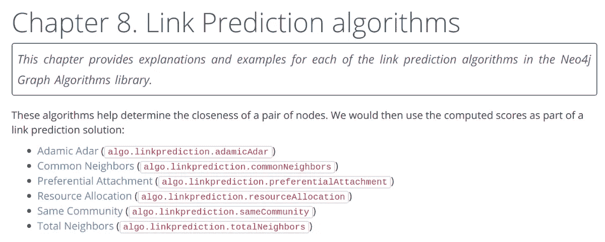

Link Predictions in the Neo4j Graph Algorithms Library

在第一篇[帖子](https://medium.com/neo4j/link-prediction-with-neo4j-part-1-an-introduction-713aa779fd9)中，我们学习了链接预测度量，如何在 Neo4j 中应用它们，以及如何在机器学习分类器中用作特征。我们还了解了在处理图形时拆分训练和测试数据集的挑战。

在本帖中，我们将应用我们在引用数据集中学到的东西。我们将**使用 scikit-learn 和链接预测算法来预测未来的合作关系**。

Amy Hodler 和我在上周的 Neo4j 在线会议上展示了如何应用本文中描述的方法，所以你也可以观看视频。

Link Prediction Online Meetup

如果你还在等待书面版本，那就让我们开始吧！

# 导入引用数据集

我们将使用来自 [DBLP 引文网络](https://aminer.org/citation)的数据，其中包括来自各种学术来源的引文数据。我写了一篇博文解释了如何导入完整的数据集，但是在这篇博文中，我们将关注来自一些软件开发会议的数据。

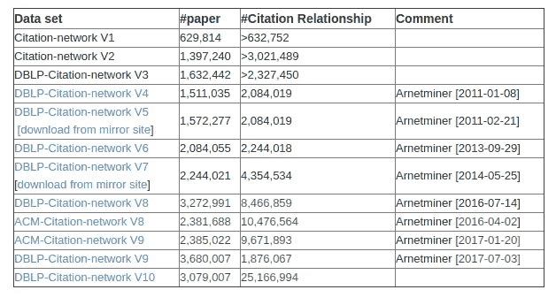

Citation Networks

我们可以通过运行以下 Cypher 语句来导入该数据子集。只要在 Neo4j 浏览器中启用了多语句编辑器，就可以一次性运行所有语句:


```
// Create constraints
CREATE CONSTRAINT ON (a:Article) ASSERT a.index IS UNIQUE;
CREATE CONSTRAINT ON (a:Author) ASSERT a.name IS UNIQUE;
CREATE CONSTRAINT ON (v:Venue) ASSERT v.name IS UNIQUE;// Import data from JSON files using the APOC library
CALL apoc.periodic.iterate(
  'UNWIND ["dblp-ref-0.json", "dblp-ref-1.json", "dblp-ref-2.json", "dblp-ref-3.json"] AS file
   CALL apoc.load.json("[https://github.com/mneedham/link-prediction/raw/master/data/](https://github.com/mneedham/link-prediction/raw/master/data/)" + file)
   YIELD value WITH value
   RETURN value',
  'MERGE (a:Article {index:value.id})
   SET a += apoc.map.clean(value,["id","authors","references", "venue"],[0])
   WITH a, value.authors as authors, value.references AS citations, value.venue AS venue
   MERGE (v:Venue {name: venue})
   MERGE (a)-[:VENUE]->(v)
   FOREACH(author in authors | 
     MERGE (b:Author{name:author})
     MERGE (a)-[:AUTHOR]->(b))
   FOREACH(citation in citations | 
     MERGE (cited:Article {index:citation})
     MERGE (a)-[:CITED]->(cited))', 
   {batchSize: 1000, iterateList: true});
```

下图显示了数据导入 Neo4j 后的样子:

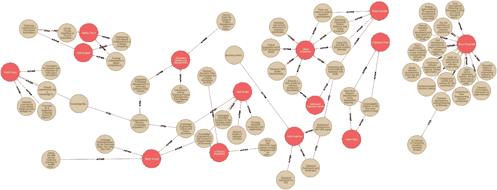

Diagram showing Citation Network in Neo4j

# 构建合著者图表

数据集不包含描述他们合作的作者之间的关系，但我们可以根据找到的多人撰写的文章来推断它们。

下面的 Cypher 语句在至少合作过一篇文章的作者之间创建了一个`CO_AUTHOR`关系:

```
MATCH (a1)<-[:AUTHOR]-(paper)-[:AUTHOR]->(a2:Author)
WITH a1, a2, paper
ORDER BY a1, paper.year
WITH a1, a2, collect(paper)[0].year AS year, 
     count(*) AS collaborations
MERGE (a1)-[coauthor:CO_AUTHOR {year: year}]-(a2)
SET coauthor.collaborations = collaborations;
```

我们在已经合作的作者之间只创建一个**关系，即使他们已经合作了多篇文章。我们在这些关系上创建了几个属性:**

*   一个`year`属性，表示作者合作的第一篇文章的出版年份
*   一个`collaborations`属性，指示作者合作了多少篇文章

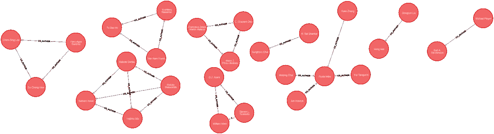

Diagram showing co-authorsin Neo4j

现在我们已经有了合著者图表，我们需要弄清楚如何预测作者之间未来的合作。

为此，我们将构建一个二元分类器，因此我们的下一步是创建训练和测试图。

# 训练和测试数据集

正如在第一篇文章中提到的，我们不能随意将数据分成训练和测试数据集，因为这可能导致数据泄漏。

当您的训练数据之外的数据被无意中用于创建您的模型时，可能会发生数据泄漏。这在处理图形时很容易发生，因为我们的训练集中的节点对可能连接到测试集中的节点对。

相反，我们需要将我们的图分成训练和测试子图，幸运的是，我们的引用图包含我们可以分割的时间信息。我们将通过拆分特定年份的数据来创建训练和测试图。

但是我们应该在哪一年分手呢？我们来看看合著者合作的第一年的分布情况:

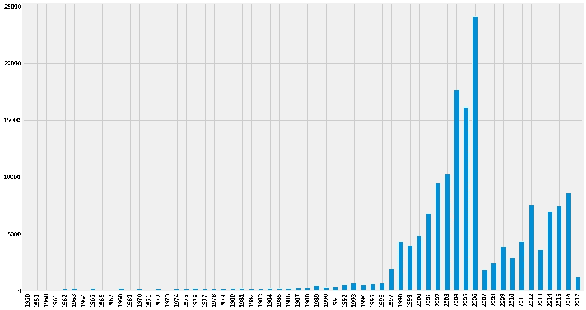

Chart showing distribution of year of collaboration

看起来 2006 年是拆分数据的好年份，因为它将为我们的每个子图提供合理数量的数据。我们将把 2005 年及更早的所有合作者作为我们的训练图，而从 2006 年开始的所有合作者作为测试图。

让我们基于该年在图表中创建明确的`CO_AUTHOR_EARLY`和`CO_AUTHOR_LATE`关系。以下代码将为我们创建这些关系:

*列车子图*

```
MATCH (a)-[r:CO_AUTHOR]->(b) 
WHERE r.year < 2006
MERGE (a)-[:CO_AUTHOR_EARLY {year: r.year}]-(b);
```

*测试子图*

```
MATCH (a)-[r:CO_AUTHOR]->(b) 
WHERE r.year >= 2006
MERGE (a)-[:CO_AUTHOR_LATE {year: r.year}]-(b);
```

这种分裂在早期图表中留给我们 81，096 个关系，在后期图表中留给我们 74，128 个关系。这是 52 比 48 的比例。这比我们通常在测试图中看到的数值百分比要高，但是应该没问题。

这些子图中的关系将作为我们训练和测试集中的**正例**，但是我们也需要一些**反例**。需要反面的例子，这样我们的模型就可以学习区分应该有链接的节点和不应该有链接的节点。

正如在链接预测问题中经常出现的情况一样，负面例子比正面例子多得多。反例的最大数量等于:

```
# negative examples = (# nodes)² - (# relationships) - (# nodes)
```

即节点数的平方，减去图中的关系，减去自身关系。

我们不是使用几乎所有可能的节点对，而是使用彼此相距 2 到 3 跳**的节点对。这将为我们提供更多可管理的数据。**

我们可以通过运行以下查询来生成这些对:

```
MATCH (author:Author)
WHERE (author)-[:CO_AUTHOR_EARLY]-()
MATCH (author)-[:CO_AUTHOR_EARLY*2..3]-(other)
WHERE not((author)-[:CO_AUTHOR_EARLY]-(other))
RETURN id(author) AS node1, id(other) AS node2
```

这个查询返回了 4389478 个负面例子，而 81096 个正面例子，这意味着我们有 **54 倍于**的负面例子。


Imbalanced data

因此，我们仍然有很大的类别不平衡，**这意味着预测每对节点都不会有链接的模型将非常准确。**

为了解决这个问题，我们可以对正样本进行上采样，或者对负样本进行下采样。我们将采用下采样方法。

## py2neo，熊猫，scikit-学习

在这篇文章的剩余部分，我们将用 Python 处理 [py2neo](https://py2neo.org/v4/) 、 [pandas](https://pandas.pydata.org/) 和 [scikit-learn](https://scikit-learn.org/stable/) 库。

[py2neo](https://py2neo.org/v4/) 驱动程序使数据科学家能够**轻松地将 Neo4j 与 Python 数据科学生态系统中的工具集成**。我们将使用这个库对 Neo4j 执行 Cypher 查询。

**pandas** 是一个开源的、BSD 许可的库，为 Python 编程语言提供了高性能、易于使用的数据结构和数据分析工具

**scikit-learn** 是一个流行的机器学习库。我们将使用这个库来构建我们的机器学习模型。

我们可以从 PyPi 安装这些库:

```
pip install py2neo==4.1.3 pandas sklearn
```

一旦我们安装了这些库，我们将导入所需的包，并创建一个数据库连接:

```
from py2neo import Graph
import pandas as pdgraph = Graph("bolt://localhost", auth=("neo4j", "neo4jPassword"))
```

## **构建我们的训练和测试集**

我们现在可以编写以下代码来创建一个包含基于**早期图**的正面和反面例子的测试数据帧:

```
# Find positive examples
train_existing_links = graph.run("""
MATCH (author:Author)-[:CO_AUTHOR_EARLY]->(other:Author)
RETURN id(author) AS node1, id(other) AS node2, 1 AS label
""").to_data_frame()# Find negative examples
train_missing_links = graph.run("""
MATCH (author:Author)
WHERE (author)-[:CO_AUTHOR_EARLY]-()
MATCH (author)-[:CO_AUTHOR_EARLY*2..3]-(other)
WHERE not((author)-[:CO_AUTHOR_EARLY]-(other))
RETURN id(author) AS node1, id(other) AS node2, 0 AS label
""").to_data_frame()# Remove duplicates
train_missing_links = train_missing_links.drop_duplicates()# Down sample negative examples
train_missing_links = train_missing_links.sample(
    n=len(train_existing_links))# Create DataFrame from positive and negative examples
training_df = train_missing_links.append(
    train_existing_links, ignore_index=True)
training_df['label'] = training_df['label'].astype('category')
```

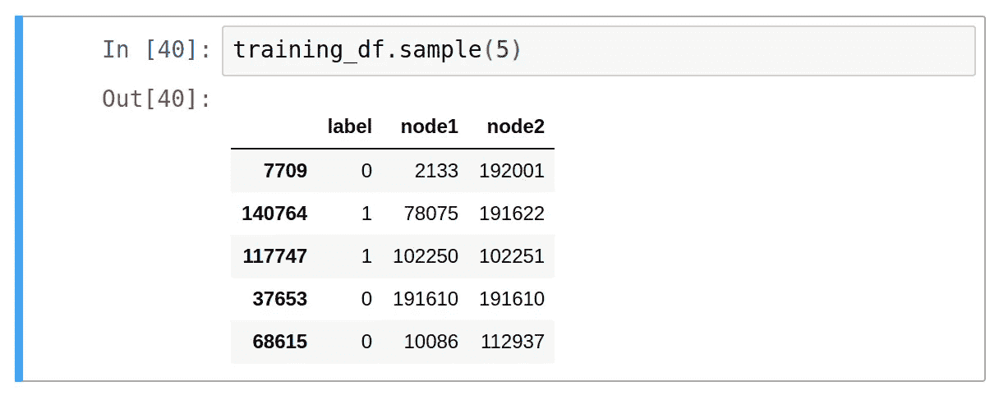

Sample of the training DataFrame

现在我们将做同样的事情来创建一个测试数据帧，但是这次我们只考虑**后期图**中的关系:

```
# Find positive examples
test_existing_links = graph.run("""
MATCH (author:Author)-[:CO_AUTHOR_LATE]->(other:Author)
RETURN id(author) AS node1, id(other) AS node2, 1 AS label
""").to_data_frame()# Find negative examples
test_missing_links = graph.run("""
MATCH (author:Author)
WHERE (author)-[:CO_AUTHOR_LATE]-()
MATCH (author)-[:CO_AUTHOR_LATE*2..3]-(other)
WHERE not((author)-[:CO_AUTHOR_LATE]-(other))
RETURN id(author) AS node1, id(other) AS node2, 0 AS label
""").to_data_frame()# Remove duplicates 
test_missing_links = test_missing_links.drop_duplicates()# Down sample negative examples
test_missing_links = test_missing_links.sample(n=len(test_existing_links))# Create DataFrame from positive and negative examples
test_df = test_missing_links.append(
    test_existing_links, ignore_index=True)
test_df['label'] = test_df['label'].astype('category')
```

现在是时候创建我们的机器学习模型了。

# 选择机器学习算法

我们将创建一个随机森林分类器。这种方法非常适合，因为我们的数据集将由强特征和弱特征混合组成。虽然弱特征有时会有所帮助，但随机森林方法将确保我们不会创建过度适合我们的训练数据的模型。

我们可以用下面的代码创建这个模型:

```
from sklearn.ensemble import RandomForestClassifierclassifier = RandomForestClassifier(n_estimators=30, max_depth=10, 
                                    random_state=0)
```

现在是时候**设计一些特征**来训练我们的模型了。

特征提取是一种从大量数据和属性中提取出一组有代表性的数值，即特征的方法。然后将其用作输入数据，这样我们就可以区分学习任务的类别/值。

> 请记住，如果您想在这篇文章的下一部分试用代码示例，您需要确保您已经按照本系列文章的第[篇文章中所述设置了 Neo4j 开发环境。](https://medium.com/neo4j/link-prediction-with-neo4j-part-1-an-introduction-713aa779fd9)

# 生成链接预测要素

我们将首先使用链接预测函数创建一些要素

```
def apply_graphy_features(data, rel_type):
    query = """
    UNWIND $pairs AS pair
    MATCH (p1) WHERE id(p1) = pair.node1
    MATCH (p2) WHERE id(p2) = pair.node2
    RETURN pair.node1 AS node1,
           pair.node2 AS node2,
           algo.linkprediction.commonNeighbors(
               p1, p2, {relationshipQuery: $relType}) AS cn,
           algo.linkprediction.preferentialAttachment(
               p1, p2, {relationshipQuery: $relType}) AS pa,
           algo.linkprediction.totalNeighbors(
               p1, p2, {relationshipQuery: $relType}) AS tn
    """
    pairs = [{"node1": pair[0], "node2": pair[1]}  
             for pair in data[["node1", "node2"]].values.tolist()]
    params = {"pairs": pairs, "relType": rel_type}

    features = graph.run(query, params).to_data_frame()
    return pd.merge(data, features, on = ["node1", "node2"])
```

此函数执行一个查询，该查询从提供的数据帧中提取每对节点，并计算:

*   共同邻居(cn)
*   优先附件(pa)，以及
*   邻居总数(tn)

对于每一对。这些措施在第一篇文章中被定义为[。](https://medium.com/neo4j/link-prediction-with-neo4j-part-1-an-introduction-713aa779fd9)

我们可以将它应用到我们的训练和测试数据帧中，如下所示:

```
training_df = apply_graphy_features(training_df, "CO_AUTHOR_EARLY")
test_df = apply_graphy_features(test_df, "CO_AUTHOR")
```

对于训练数据帧，我们仅基于早期的图表计算这些指标，而对于测试数据帧，我们将跨整个图表计算它们。

我们仍然可以使用整个图表来计算这些特征，因为图表的演变取决于它在整个时间内的样子，而不仅仅是基于 2006 年及以后发生的事情。

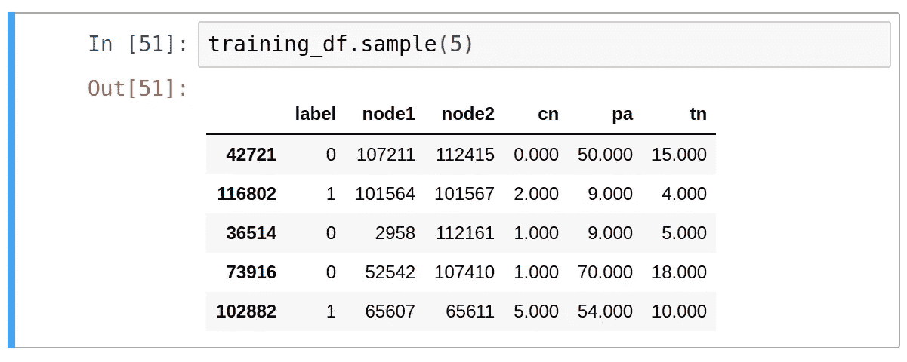

Sample of the training DataFrame

现在我们准备训练我们的模型。我们可以用下面的代码做到这一点:

```
columns = ["cn", "pa", "tn"]X = training_df[columns]
y = training_df["label"]
classifier.fit(X, y)
```

我们的模型现在已经训练好了，但是我们需要评估它。

# 评估我们的模型

我们要计算它的准确度、精确度和召回率。下图摘自[奥莱利图算法书](https://www.oreilly.com/library/view/graph-algorithms/9781492047674/)，解释了这些指标是如何计算的。

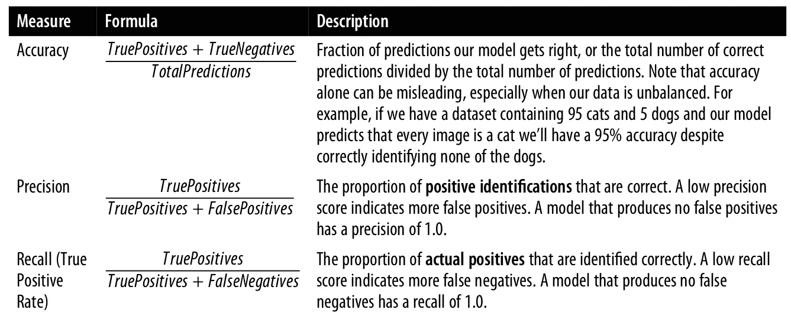

Accuracy measures

scikit-learn 内置了我们可以用于此的函数。我们还可以返回模型中使用的每个特性的重要性。

以下函数将对此有所帮助:

```
from sklearn.metrics import recall_score
from sklearn.metrics import precision_score
from sklearn.metrics import accuracy_scoredef evaluate_model(predictions, actual):
    accuracy = accuracy_score(actual, predictions)
    precision = precision_score(actual, predictions)
    recall = recall_score(actual, predictions)

    metrics = ["accuracy", "precision", "recall"]
    values = [accuracy, precision, recall]    
    return pd.DataFrame(data={'metric': metrics, 'value': values})def feature_importance(columns, classifier):        
    features = list(zip(columns, classifier.feature_importances_))
    sorted_features = sorted(features, key = lambda x: x[1]*-1)

    keys = [value[0] for value in sorted_features]
    values = [value[1] for value in sorted_features]
    return pd.DataFrame(data={'feature': keys, 'value': values})
```

我们可以通过运行以下代码来评估我们的模型:

```
predictions = classifier.predict(test_df[columns])
y_test = test_df["label"]evaluate_model(predictions, y_test)
```

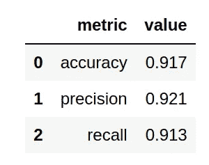

Accuracy, Precision, Recall

我们在各方面都有很高的分数。现在，我们可以运行以下代码来查看哪个功能发挥了最重要的作用:

```
feature_importance(columns, classifier)
```

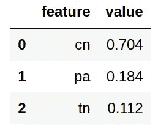

Feature Importance

我们可以在上面看到，公共邻居(cn)是我们模型中的主要特征。Common neighbors 向我们返回了一个作者拥有的未闭合合著三角形的数量，因此这可能并不令人惊讶。

现在，我们将添加一些由图形算法生成的新功能。

# 三角形和聚集系数

我们将从在测试和训练子图上运行[三角形计数](https://neo4j.com/docs/graph-algorithms/current/algorithms/triangle-counting-clustering-coefficient/)算法开始。该算法返回每个节点形成的三角形数量，以及每个节点的聚类系数。节点的聚类系数表示其邻居也是相连的可能性。

我们可以在 Neo4j 浏览器中运行以下 Cypher 查询，以在我们的列车图上运行该算法:

```
CALL algo.triangleCount('Author', 'CO_AUTHOR_EARLY', { 
  write:true,
  writeProperty:'trianglesTrain', 
  clusteringCoefficientProperty:'coefficientTrain'});
```

和下面的 Cypher 查询来在测试图上运行它:

```
CALL algo.triangleCount('Author', 'CO_AUTHOR', { 
  write:true,
  writeProperty:'trianglesTest', 
  clusteringCoefficientProperty:'coefficientTest'});
```

我们现在在节点上有 4 个新属性: *trianglesTrain* 、*系数 Train* 、 *trianglesTest* 和*系数 Test* 。现在，让我们在以下函数的帮助下，将这些添加到我们的训练和测试数据帧中:

```
def apply_triangles_features(data,triangles_prop,coefficient_prop):
    query = """
    UNWIND $pairs AS pair
    MATCH (p1) WHERE id(p1) = pair.node1
    MATCH (p2) WHERE id(p2) = pair.node2
    RETURN pair.node1 AS node1,
    pair.node2 AS node2,
    apoc.coll.min([p1[$triangles], p2[$triangles]]) AS minTriangles,
    apoc.coll.max([p1[$triangles], p2[$triangles]]) AS maxTriangles,
    apoc.coll.min([p1[$coefficient], p2[$coefficient]]) AS minCoeff,
    apoc.coll.max([p1[$coefficient], p2[$coefficient]]) AS maxCoeff
    """

    pairs = [{"node1": pair[0], "node2": pair[1]}  
          for pair in data[["node1", "node2"]].values.tolist()] params = {"pairs": pairs,
              "triangles": triangles_prop,
              "coefficient": coefficient_prop}

    features = graph.run(query, params).to_data_frame()
    return pd.merge(data, features, on = ["node1", "node2"])
```

这些度量与我们迄今为止使用的不同，因为它们不是基于节点对计算的，而是特定于节点的度量。

我们不能简单地将这些值作为 *node1Triangles* 或 *node1Coeff* 添加到我们的数据帧中，因为我们不能保证节点对中节点的顺序。我们需要想出一个不可知论的方法

我们可以通过取值的平均值、值的乘积，或者通过计算最小值和最大值来实现这一点，就像我们在这里所做的那样。

我们可以将该函数应用于数据帧，如下所示:

```
training_df = apply_triangles_features(training_df, 
  "trianglesTrain", "coefficientTrain")
test_df = apply_triangles_features(test_df, 
  "trianglesTest", "coefficientTest")
```

现在我们可以训练和评估:

```
columns = [
    "cn", "pa", "tn", 
    "minTriangles", "maxTriangles", "minCoeff", "maxCoeff"
]X = training_df[columns]
y = training_df["label"]
classifier.fit(X, y)predictions = classifier.predict(test_df[columns])
y_test = test_df["label"]display(evaluate_model(predictions, y_test))
```

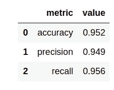

Accuracy, Precision, Recall

这些功能非常有用！我们的每项指标都比最初的模型提高了大约 4%。哪些功能最重要？

```
display(feature_importance(columns, classifier))
```

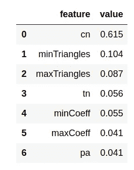

Feature Importance

公共邻域仍然是最有影响力的，但三角形功能也增加了一些价值。

# 概括起来

这篇文章已经比我预期的时间长了很多，所以我们就到此为止，但是肯定还有一些练习留给读者。

## 工程更多功能

你能想到我们可以添加的任何其他功能来帮助我们创建一个更高精度的模型吗？也许其他社区检测，甚至中心算法可能会有所帮助？

## 扩展对链接预测的支持

目前，图算法库中的链接预测算法仅适用于单部图。单部图是指两个节点的标号相同的图。这些算法基于节点的拓扑结构，如果我们试图将它们应用于具有不同标签的节点，这些节点将可能具有不同的拓扑结构，这意味着这些算法不会工作得很好。

我们正在考虑添加适用于其他图形的链接预测算法版本。如果你有什么特别想看的，请在 [GitHub 问题](https://github.com/neo4j-contrib/neo4j-graph-algorithms/issues)上告诉我们。

# 接下来呢？

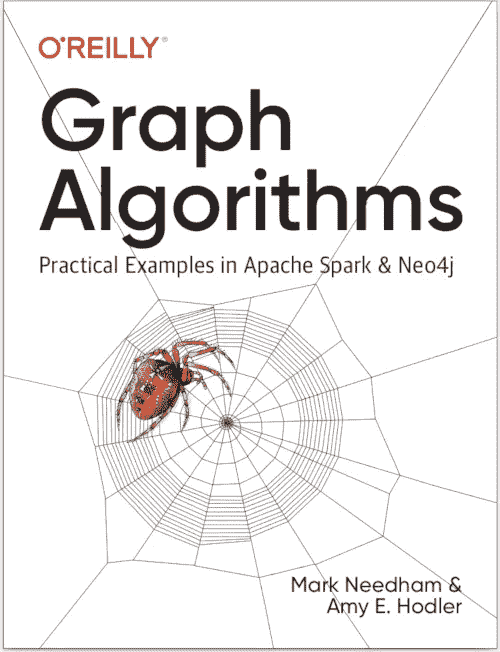

如果你觉得这篇博文很有趣，你可能会喜欢我和艾米·霍德勒在过去 9 个月里写的《奥莱利图算法》一书。我们正处于最后的审查阶段，它应该在未来几周内可用。

您可以注册从 Neo4j 网站获得免费的电子版，网址:[**neo4j.com/graph-algorithms-book**](https://neo4j.com/graph-algorithms-book/)

威尔·里昂和我还在与 Neo4j 一起开发一个新的关于**数据科学的在线培训课程，请关注[在线培训](https://neo4j.com/graphacademy/online-training/)页面，了解详细信息。**