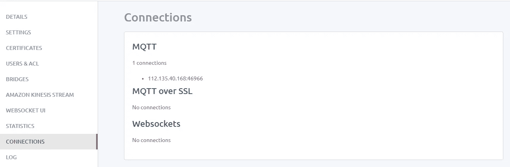

# 使用 MQTT 将 Python 应用程序与您的 Android 设备链接起来

> 原文：<https://towardsdatascience.com/link-python-applications-with-your-android-device-using-mqtt-c8e2c80f6a61?source=collection_archive---------18----------------------->


# 跨平台通信和 MQTT 协议

在计算机科学中，两个不同系统之间的数据共享或通信是很常见的事情。开发系统时，可以设计两个同构系统之间的通信。此外，完全不同的系统可能也需要共享信息。例如，一个由 [Arduino](https://www.arduino.cc/en/Guide/Introduction) 平台驱动的简单传感器可能需要向运行 Android 或苹果 iOS 的智能手机发送信息。为了实现跨平台通信，可以声明和使用一组通用的通信规则。这样的规则集被称为[通信协议](https://www.techopedia.com/definition/25705/communication-protocol)。在这篇文章中，让我们来看看一个简单的跨平台通信协议；MQTT。

MQTT 代表 MQ 遥测传输。它是一个简单的消息协议，是为低带宽设备设计的。本质上，MQTT 被设计成一个[物联网](https://internetofthingsagenda.techtarget.com/definition/Internet-of-Things-IoT)消息传递协议。如果你有兴趣了解更多关于 MQTT 的信息，请随时访问他们的官方[网站](http://mqtt.org/)和 [FAQ 页面](http://mqtt.org/faq)。

# 可用的 MQTT 服务

正如开头提到的，MQTT 是一种通信协议。MQTT 协议由几个服务提供者作为服务来实现和提供。有免费的、付费的和有限的 MQTT 服务提供者。访问[这个](https://diyprojects.io/8-online-mqtt-brokers-iot-connected-objects-cloud/#.XdpcK-gzbIU) DIY 项目页面，看看一些 MQTT 服务的本质。

在本文中，我们将使用一个名为 [CloudMQTT](https://www.cloudmqtt.com/) 的 MQTT 服务提供者。CloudMQTT 中有不同的付费计划和一个免费计划。免费计划是一项非常受限制的服务。不过出于教育和兴趣目的，还是用 CloudMQTT 的免费计划‘可爱的猫’吧。

# 在 CloudMQTT 设置免费数据通道

首先，进入[https://www.cloudmqtt.com/](https://www.cloudmqtt.com/)并登录。您可以使用您的 google 帐户或 GitHub 帐户进行身份验证。然后，您必须创建一个新的实例。实例是托管在云上的消息代理对象。

提供实例的名称。添加一些标签。现在，选择免费的“可爱的猫”计划。


选择数据中心。请注意，您可能需要更改数据中心，并检查它是否正常工作。这是地区原因。根据您所在的区域，您将拥有一个正常工作的数据中心。


选择数据中心后，将创建您的实例。将会看到以下用户界面。在那里，您可以访问实例、设置、web-socket UI、活动连接和一些其他功能和信息的一般详细信息。


web-socket UI 选项卡使您能够发送和接收关于主题的消息。主题是实例内部的消息传递通道。一个实例中可以有多个主题。注意，为了在 web-socket UI 上发送关于特定主题的消息，您不必预先创建主题。只需将主题和消息指定为字符串并发送。该消息将被接收并显示在已接收消息表中。下图显示了在“测试/测试”主题上发送字符串“这是一条消息”后的结果。


# 创建 Android 应用程序

让我们讨论一下在云上创建的 MQTT 实例如何服务于我们的跨平台通信需求。为了演示，让我们创建一个 Android 应用程序，它通过 CloudMQTT 实例与一个简单的 python 程序通信。

在本帖中，我们将使用 [Android Studio](https://developer.android.com/studio) 。Gradle 将被用作构建工具。

在 Android studio 中创建新的 Android 项目。然后将下面的依赖项添加到`build.gradle`(项目)文件中。该依赖项将添加一个 MQTT 客户端产品，它能够处理 MQTT 消息传递，同时您可以专注于您的应用程序及其业务模型。

```
repositories {
    maven {
        url "https://repo.eclipse.org/content/repositories/paho-snapshots/"
    }
}
```

另外，将以下依赖项添加到`build.gradle` (App)文件中。

```
dependencies {
    compile 'org.eclipse.paho:org.eclipse.paho.client.mqttv3:1.1.0'
    compile 'org.eclipse.paho:org.eclipse.paho.android.service:1.1.1'
}
```

执行 Gradle Sync，您就可以在您的 android 项目中使用 MQTT 客户端了。

你的应用需要以下权限。您可以通过向`AndroidManifest.xml`文件添加以下权限来提供权限。确保在`application`标签开始之前添加以下代码行(在`application`标签之外)。

```
<uses-permission android:name="android.permission.INTERNET" />
<uses-permission android:name="android.permission.ACCESS_NETWORK_STATE"/>
<uses-permission android:name="android.permission.WAKE_LOCK"/>
```

另外，注册由导入的 MQTT 客户机提供的 MQTT 服务。在关闭`application`标签之前添加下面一行代码(在`application`标签内)。

```
<service android:name="org.eclipse.paho.android.service.MqttService" />
```

现在我们已经准备好编写代码来连接 MQTT 实例。让我们通过创建下面的`MQTTHelper.java`类来简化我们的生活。注意，我已经将这个类包含在包`helpers`中，你可以根据需要在另一个包中创建你的`MQTTHelper`类。

> 重要提示:将端口`11111`更改为实例详细信息中指定的端口号。此外，相应地更改用户名和密码。您可以设置任何客户端 ID 和主题。

题目已经定为`sensor/+`。这表示任何名称为“sensor/”后跟任何字符串的主题正在被监听。比如`sensor/temperature`、`sensor/humidity`、……..所有的都被监听了。

在您的一个活动中创建一个`TextView`元素。我在我的`MainActivity`中创建了`dataReceived`元素。那么活动:`MainActivity`的 java 代码如下。

每当一条消息到达指定的主题时，就会显示在指定的`TextView`元素上。让我们快速测试一下。转到 web-socket UI，在`sensor/<something>`下发送任何消息。你应该可以在手机应用程序上看到你刚刚发送的消息。请注意，您必须将消息发送到您的移动应用程序设置为要收听的主题之一。在这篇文章中，是以`sensor/`开头的任何话题。web-socket UI 将如下所示。


您可以通过访问 Connections UI 来验证您与 MQTT 实例的连接。下图显示了 MQTT 与移动应用程序的连接。



# 写一个简单的 Python 程序

现在，您的移动应用程序上有了一个工作的 MQTT 客户机，您希望监听由另一个平台发送的消息。在这篇文章中，让我们用一个简单的 python 程序来连接移动应用程序。即使我们说 python 程序要与移动应用程序对话，它也不是直接通信。消息将通过 CloudMQTT 消息代理发送。整体架构如下。


在编写我们的 python 程序之前，我们必须用 python 安装 paho MQTT 客户端库。注意，移动应用程序中使用了相同的 MQTT 客户端。使用 pip 安装相应的库。

```
pip install paho-mqtt
```

python 程序非常简单。我就把代码留在下面吧。

```
import paho.mqtt.client as mqtt

mqttc = mqtt.Client("client1", clean_session=False)
mqttc.username_pw_set("#User", "#password")
mqttc.connect("#Server", #port, 60)# Set a stopping condition or just press ctrl+C to quit.
while(True):
    inp = input()
    mqttc.publish("sensor/temp", payload=inp, qos=0)
```

确保在 python 脚本中指定所有 MQTT 实例细节。此外，可以在 python 程序中的任何地方随意使用这个简单的 MQTT 客户机`publish`方法调用。请注意，您发布的消息将在 web-socket UI 和移动应用程序上可见。

# 我还能连接什么？

消息代理并不局限于 Python 和 Android 之间。您可以用几个可用的 MQTT 客户端库连接其他平台。在[文档](https://www.cloudmqtt.com/docs/ruby.html)中，点击您平台上偏好的语言，找到最合适最稳定的客户端。目前有 Ruby，Python，Node.js，Java，Go，。NET，NodeMCU 和 PHP 客户端正式可用。做一点研究，你可能会找到其他语言的客户。

希望你喜欢并利用了这篇文章。android 应用程序的代码可以在[这个](https://github.com/chathuranga95/mqtt-listener) GitHub 仓库中找到。