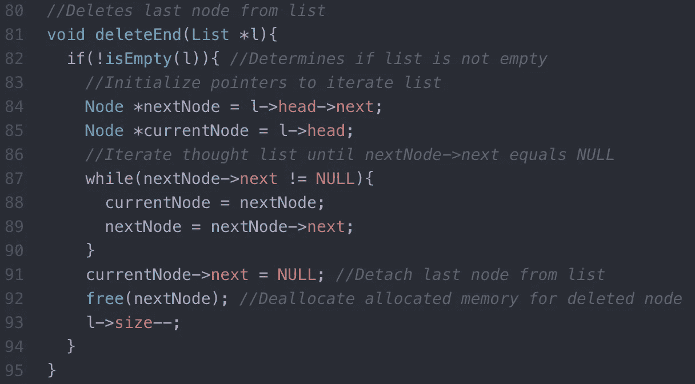

# 链表实现指南

> 原文：<https://towardsdatascience.com/linked-list-implementation-guide-16ed67be18e4?source=collection_archive---------24----------------------->

# 介绍

在本指南中，我将解释如何实现一个链表。如果你不知道什么是链表，我推荐你阅读我的另一个博客，在这里找到*，在那里我详细解释了什么是链表以及它是如何工作的。对于这个博客，我将重点讨论实现。*

# *实施指南*

*下图演示了链表的实现。虽然该演示是用 C 语言编写的，但是所示的过程和步骤适用于使用任何编程语言实现链表。*

## *必需的库和结构定义*

*下面的图 1 包括所需的库，定义了在整个演示过程中常用的两个函数，并详细说明了节点和链表的结构。节点被定义为包含一个整数(数据)和一个指向下一个节点的指针。同样，一个列表包含一个表示列表大小的整数和一个指向列表中第一个节点的指针(head)。函数 initList 将头指针初始化为空，并将列表的大小初始化为零，因为最初列表中没有节点。函数 *isEmpty* 确定一个列表是否为空。*

**

*Figure 1: Require libraries and structure/function definitions*

## *将节点添加到列表中*

**insertFront* 函数接受两个参数:一个链表和一个要插入到列表中的值。图 2 中的第 30 行为一个节点分配内存，并初始化一个指针指向分配的空间。如果成功分配了内存，该函数会将列表的大小增加 1，并在将新节点插入列表之前确定列表是否为空。如果列表为空，列表的头指针指向新节点，新节点的下一个指针指向 null。否则，新节点的 next 指针指向链表头所指向的节点，然后链表头指针更新指向新节点。*

**

*Figure 2: Function to insert node to the front of a linked list*

## *将节点追加到列表*

*函数接受两个参数:一个链表和一个插入到列表末尾的值。图 3 中的第 49 行为一个节点分配内存，并初始化一个指针指向分配的空间。如果成功分配了内存，该函数会将列表的大小增加 1，并在将新节点插入列表之前确定列表是否为空。如果列表为空，则通过更新列表的头指针指向新节点，将新节点插入到列表中。否则，初始化指针以遍历列表。指针遍历列表，直到指向最后一个节点。一旦找到最后一个节点，该节点的 next 指针就会更新，指向新节点。*

**

*Figure 3: Function to insert node to the end of a linked list*

## *从列表前面删除节点*

*函数 *deleteFront* 接受一个参数:一个链表。该函数首先确定列表是否为空。如果列表不为空，那么函数初始化一个指针指向列表中的第一个节点。然后更新列表的头指针，指向列表中的下一个节点，如果列表中没有其他节点，则为 null。然后，使用之前初始化的指针从内存中移除第一个节点。最后，列表的大小减一。*

**

*Figure 4: Function to remove first node from linked list*

## *从列表末尾删除节点*

**deleteEnd* 函数接受一个参数:一个链表。该函数首先确定列表是否为空。如果不为空，则初始化两个指针。一个指针(currentNode)指向第一个节点，而另一个指针(nextNode)指向下一个节点，或者如果列表中只有一个节点，则为 null。nextNode 指针用于遍历链表，直到指向最后一个节点，currentNode 指针指向倒数第二个节点。然后，currentNode 的 next 指针被更新为 null，nextNode 的指针用于从内存中删除最后一个节点。最后，列表的大小减一。*

**

*Figure 5: Function to remove last node from linked list*

## *在所需位置插入节点的函数*

**insertNodeAtLocation* 函数接受三个参数:一个链表、一个位置和值。该函数的目的是在所需位置插入一个节点。例如，如果所需位置是 3，数据值是 5(insertNodeAtLocation(list，3，5))，那么函数将创建一个数据值为 5 的节点，并将创建的节点作为列表中的第三个节点。为了满足函数的要求，第一步是通过检查输入位置的值是否等于或大于 1 但小于列表大小加 1 来确定输入位置是否有效。如果位置有效，该函数将检查所需位置的值是否为 1，然后调用图 2 所示的 *insertFront* 函数。否则，列表的大小增加 1，创建一个计数器来跟踪列表中的当前位置，为新节点分配内存，并初始化一个指针以遍历列表。一旦指针指向其位置正好在期望位置之前的节点(节点 A ),新节点的 next 指针被更新以指向当前跟随节点 A 的节点。然后，节点 A 的 next 指针被更新以指向新节点。*

**

*Figure 6: Function to insert a node at a desired location in the linked list*

## *用于删除具有指定值的节点的函数*

*函数接受两个参数:一个列表和一个值。该函数首先确定列表是否为空。如果不为空，该函数将初始化两个指针(currentNode 和 prevNode)。最初，currentNode 指向列表的头部，而 prevNode 指向 null。然后 *removeNode* 函数检查当前节点的数据是否等于输入值。如果它们相等，则调用图 4 所示的 *deleteFront* 函数。否则，prevNode 指针更新为指向 currentNode，currentNode 更新为指向下一个节点。然后，指针遍历列表，直到 currentNode 等于 null。如果在迭代 currentNode 的数据的任何一点等于输入的值，列表的大小减少一，prevNode 的下一个指针更新为指向 currentNode 后面的节点，currentNode 用于在函数终止之前从内存中删除已删除的节点。如果输入的值在列表中找不到，该函数会向控制台输出“列表中找不到值”。*

**

*Figure 7: Function to remove first node in list containing specified value*

## *打印链接列表*

*函数接受一个参数:一个链表。该函数首先初始化一个指针，该指针将用于遍历列表。如果列表为空，函数将向控制台输出“列表为空”。否则，这些函数输出列表中的节点数，以及列表中每个节点的数据值。*

**

*Figure 8: Function to print the value of each node in the list*

## *主要功能*

**主*函数是执行 C 程序时运行的函数。如图 9 所示，使用上面定义的函数初始化链表，并从列表中插入/删除节点。*

**

*Figure 9: The main function*

*执行时，main 函数输出如下内容。*

**

*Figure 10: The output from the main function*

# *结论*

*总之，链表是一种非常酷的结构化数据的方式。如前所述，如果你想了解链表如何工作或何时使用它们，请查看我的另一个博客[***这里***](https://medium.com/@krohnhermannacosta/linked-lists-vs-arrays-78746f983267) 。*