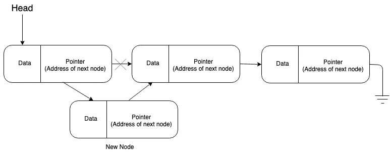
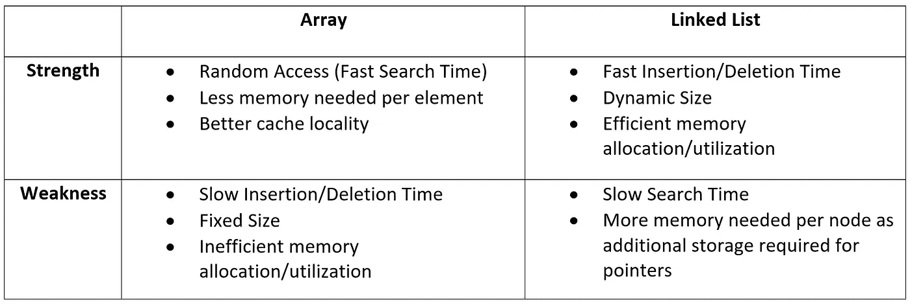

# 链表与数组

> 原文：<https://towardsdatascience.com/linked-lists-vs-arrays-78746f983267?source=collection_archive---------5----------------------->

# 介绍

有许多不同类型的数据结构可以在计算机程序中实现，例如数组和链表。每种类型的数据结构都有其优点和缺点。由于这些原因，在设计、优化和扩展程序时，理解不同类型的数据结构的优缺点是很重要的。

# 数组

让我们从定义一个数组开始。简而言之，数组本质上是一种数据结构，类似于相同数据类型的值列表。数组的另一个特性是数组元素存储在连续的内存位置。此外，数组具有固定的大小，这是在初始化时定义的。根据这些属性，您能看出数组的优点和缺点吗？

# 阵列的优势

## ***搜索时间:***

如前所述，数组将元素存储在连续的内存位置。这意味着可以通过向数组的基值或第一个元素的位置添加偏移量来访问任何元素。下面的数字更详细地说明了我的意思。

Figure 1: Demo program to illustrate consecutive memory locations

Figure 2: Output of program in Figure 1

虽然图 2 中的内存地址看起来相隔四个，但实际上它们是连续的。这意味着，只要通过向第一个元素的地址添加偏移量来知道元素的索引，就可以定位数组中的任何元素。由于搜索数组中的第二个或最后一个元素没有时间差，所以数组具有恒定的搜索次数或大 O(O(1))，这非常快。基本上，最好的运行时间复杂度是 O(1)。

# 数组的缺点

## 浪费的内存:

数组的缺点之一是内存可能会被浪费。为了解释这一点，我将描述一个场景。作为一名程序员，你并不总是知道分配多少内存。例如，您正在构建一个应用程序，它将要求用户输入内容，然后将这些内容存储在一个数组中。因为您不知道用户将输入多少，所以您用一百万个索引初始化一个数组，因为您认为一百万个输入对任何用户来说都足够了。如果用户只向数组中输入十万个元素会怎样？然后，90%的分配空间被浪费。

## 缓慢的插入/删除时间:

数组的插入和删除时间很慢。让我们从关注插入开始。要将元素插入到数组的前面或中间，第一步是确保数组中有空间容纳新元素，否则需要调整数组的大小。下一步是通过将每个元素移动到所需的索引之后来为新元素留出空间。同样，对于删除，在删除一个元素后需要进行移位。这意味着数组的插入时间是 n 的大 O(O(n))，因为 n 个元素必须移位。然而，从数组末尾插入和删除是 O(1)。

# 链接列表

链表是收集类似数据的另一种方法。然而，与数组不同，链表中的元素不在连续的内存位置。链表由使用指针相互连接的节点组成。下面的图 3 展示了一个链表。

Figure 3: Diagram of singly linked list structure

如图 3 所示，单链表由一个头和一组节点组成。请注意，有许多类型的链表，如单向链表和双向链表，但现在我们将集中讨论单向链表。为了解释单链表是如何工作的，我必须首先定义一个指针。指针是保存另一个变量或结构地址的变量。在图 3 中，head 是一个指针，它包含链表上第一个节点的地址。head 变量允许计算机定位内存中的第一个节点并访问其数据。一旦定位了起始位置(第一个节点)，就很容易遍历链表，因为每个节点都包含一个指向下一个节点的指针。

# 链表的优点

## 更好地利用内存:

从内存分配的角度来看，链表比数组更有效。与数组不同，链表的大小不是预先定义的，允许链表在程序运行时增加或减少大小。这是可能的，因为要插入或删除链表，指针需要相应地更新。

通常，在链表中插入一个节点需要在新节点初始化后更新指针。图 4-6 描述了如何在链表的开头、中间或结尾插入节点。

Figure 4: Diagram of inserting a node to the beginning of a linked list

Figure 5: Diagram of inserting a node in the middle of a linked list

Figure 6: Diagram of appending a node to a linked list

从链表中删除比插入更容易。唯一的步骤是更新指针。图 7-9 展示了删除链表开头、中间或结尾节点的过程。

Figure 7: Diagram of deleting first node from linked list

Figure 8: Diagram of deleting node from the middle of linked list

Figure 9: Diagram of deleting last node from linked list

如上图所示，在链表中插入和删除非常简单。此外，链表结构防止了内存浪费，因为节点是在初始化时插入到链表中的。

## 快速插入/删除时间:

如图 4 所示，在链表的开头或结尾插入一个新节点需要花费恒定的时间(O(1))，因为唯一的步骤是初始化一个新节点，然后更新指针。同样，如果有一个尾指针(类似于头指针)，插入到链表的末尾也将是 O(1)。然而，插入到链表的中间需要线性时间(O(n))，因为在插入节点之前需要迭代 n 个元素才能到达正确的位置。类似地，删除链表开头和结尾的节点需要恒定的时间，而删除链表中间的节点需要线性时间。

# 链表的缺点

## 较慢的搜索时间:

链表的搜索时间比数组慢，因为不允许随机访问。与可以通过索引搜索元素的数组不同，链表需要迭代。这意味着，如果您想要获得第十个节点上的数据，可以使用 head 指针来获得第一个节点，可以使用第一个节点上的指针来获得第二个节点，依此类推，直到到达第十个节点。这意味着在搜索一个节点时必须迭代的节点越多，搜索时间就越长。这意味着链表的搜索时间是线性时间或 n 的大 O(O(n))。

# 结论

总之，有许多不同的数据结构。每种数据结构都有优缺点，根据任务的不同会影响性能。今天，我们探讨了两种数据结构:数组和链表。数组允许随机访问，每个元素需要的内存较少(不需要指针空间)，但插入/删除操作和内存分配效率较低。相反，链表是动态的，具有更快的插入/删除时间复杂度。然而，链表具有较慢的搜索时间，并且指针需要列表中每个元素的额外内存。下面的图 10 总结了数组和链表的优缺点。

如果你有兴趣学习如何实现链表，可以看看我的链表指南 [***这里***](https://medium.com/@krohnhermannacosta/linked-list-implementation-guide-16ed67be18e4) 。

Figure 10: Summary of strengths and weaknesses of arrays and linked list