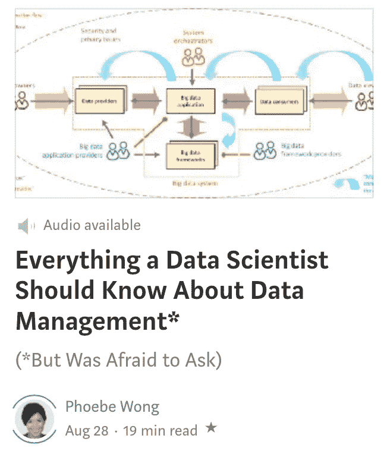
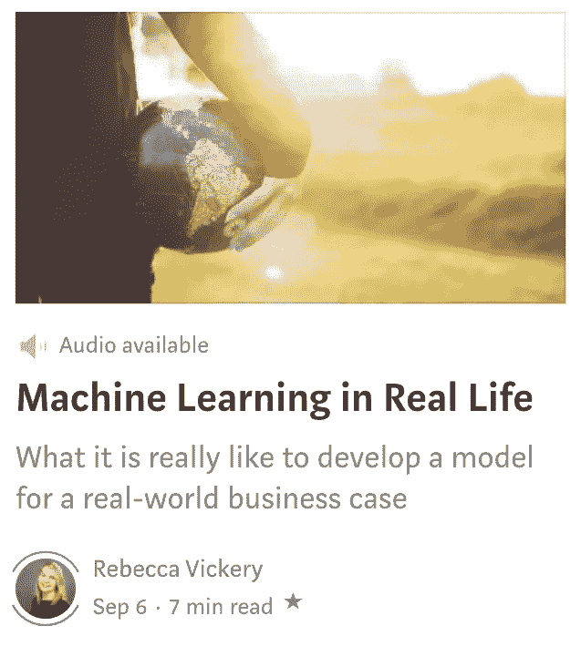
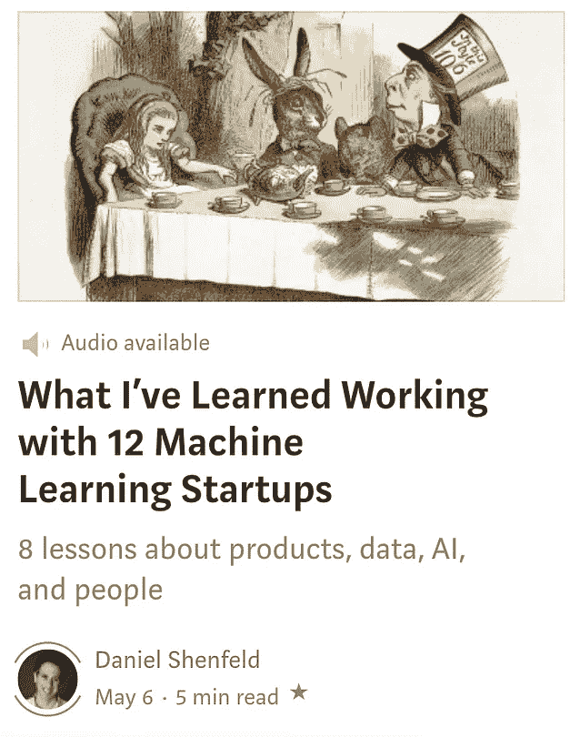

# 听听我们的叙述文章

> 原文：<https://towardsdatascience.com/listen-to-our-narrated-articles-779e436b4491?source=collection_archive---------31----------------------->

## 在您的时间表上方便地收听我们的一些最佳内容

我们的使命是为每个人提供最好的内容。我们热衷于以最适合你的方式让你接触到创新的概念和想法。从我们的[播客](https://towardsdatascience.com/podcast/home)到我们的[时事通讯](https://towardsdatascience.com/newsletters/home)到我们的[出版物](https://towardsdatascience.com)本身，我们一直在努力以各种方式与你们分享前沿概念。

[我们现在正致力于通过提供一些我们最好的文章的便捷音频解说来让您的生活更加美好](https://towardsdatascience.com/narrated/home)。

我们选择的叙述性文章包括由我们的专业叙述者团队精心策划的内容。听听迈克尔·邦纳、杰纳·康纳利、埃里克·麦克法登和爱丽丝·伊里扎里在你度过每一天时为你带来的这些惊人的概念。

方便的时候听听，了解一些数据科学、机器学习、人工智能、编程等领域最不可思议的想法。

## 示例:

[https://towardsdatascience.com/narrated/home](https://towardsdatascience.com/narrated/home)

我们也让我们的作者提出他们自己的录音，就像丹尼尔在这里做的一样。将您的完整音频以 mp3 格式发送到 publication@towardsdatascience.com。

如果您对我们如何改进本部分有任何想法，请随时发送您的反馈。

谢谢！