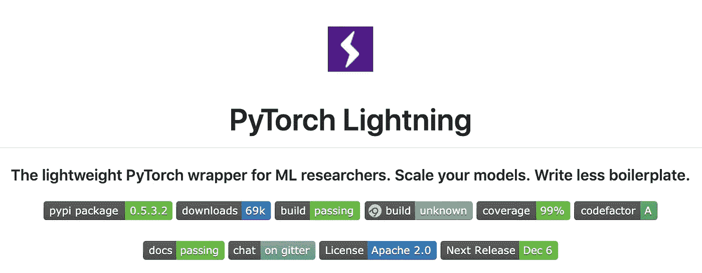
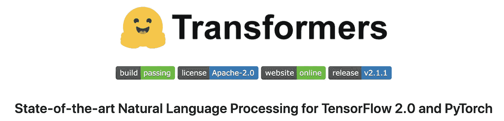

# Lit BERT: NLP 迁移学习的三个步骤

> 原文：<https://towardsdatascience.com/lit-bert-nlp-transfer-learning-in-3-steps-272a866570db?source=collection_archive---------10----------------------->

[BERT](https://arxiv.org/pdf/1810.04805.pdf) (Devlin 等人，2018)可能是最流行的迁移学习的 NLP 方法。由 [Huggingface](https://github.com/huggingface/transformers) 实现的这个 API 提供了很多不错的特性，并抽象出了漂亮 API 背后的细节。

[PyTorch Lightning](https://github.com/williamFalcon/pytorch-lightning) 是一个轻量级框架(实际上更像是重构你的 PyTorch 代码)，它允许任何使用 [PyTorch](https://pytorch.org/) 的人，如学生、研究人员和制作团队，轻松扩展深度学习代码，同时使其可复制。它还通过教练标志提供 42+高级研究功能。

Lightning 没有在 PyTorch 上添加抽象，这意味着它可以很好地与其他伟大的软件包一起使用，比如 Huggingface！在本教程中，我们将使用他们的 BERT 实现在 Lightning 中执行微调任务。

在本教程中，我们将分三步进行 NLP 的迁移学习:

1.  我们将从 huggingface 库导入 BERT。
2.  我们将创建一个[照明模块](https://pytorch-lightning.readthedocs.io/en/latest/LightningModule/RequiredTrainerInterface/)，它使用 BERT 提取的特征进行微调
3.  我们将使用[灯光训练器](https://github.com/williamFalcon/pytorch-lightning)训练 BertMNLIFinetuner。

# 现场演示

如果您更愿意在实际代码中看到这一点，[复制这个 colab 笔记本！](https://colab.research.google.com/drive/1DovlWenVCuXZ-EZT66wc3GVHZqREyblV)

# 微调(又名迁移学习)

如果你是一名试图改进 [NYU 胶水](https://gluebenchmark.com/)基准的研究人员，或者是一名试图理解产品评论以推荐新内容的数据科学家，你正在寻找一种方法来提取一段文本的表示，以便可以解决不同的任务。

对于迁移学习，通常有两个步骤。您使用数据集 X 来预训练您的模型。然后，您使用该预训练模型将该知识带入求解数据集 b。在这种情况下，BERT 已经在图书语料库和英语维基百科上接受了预训练[【1】](https://arxiv.org/pdf/1810.04805.pdf)。下游任务是你关心的解决胶合任务或分类产品评论。

预训练的好处是，我们在下游任务中不需要太多数据就能获得惊人的结果。

# 用 PyTorch 闪电微调

一般来说，我们可以使用以下抽象方法对 PyTorch Lightning 进行微调:

对于迁移学习，我们在 lightning 模块中定义了两个核心部分。

1.  预训练模型(即:特征提取器)
2.  finetune 模型。

您可以将预训练模型视为特征提取器。这可以让您以一种比布尔或一些表格映射更好的方式来表示对象或输入。

例如，如果您有一个文档集合，您可以通过预先训练的模型运行每个文档，并使用输出向量来相互比较文档。

微调模型可以任意复杂。它可能是一个深度网络，也可能是一个简单的线性模型或 SVM。

# 用 BERT 微调

Huggingface

在这里，我们将使用一个预训练的 BERT 来微调一个名为 MNLI 的任务。这实际上只是试图将文本分为三类。这是照明模块:

在这种情况下，我们使用 huggingface 库中预先训练的 BERT，并添加我们自己的简单线性分类器，将给定的文本输入分类到三个类别之一。

然而，我们仍然需要定义验证循环来计算我们的验证准确性

以及计算我们测试精度的测试回路

最后，我们定义将要操作的优化器和数据集。该数据集应该是您试图求解的下游数据集。

完整的 lightning 模块看起来像这样。

# 摘要

在这里，我们学习了在 LightningModule 中使用 Huggingface BERT 作为特征提取器。这种方法意味着您可以利用一个真正强大的文本表示来做如下事情:

1.  情感分析
2.  对聊天机器人的建议回复
3.  使用 NLP 构建推荐引擎
4.  [改进谷歌搜索算法](https://www.blog.google/products/search/search-language-understanding-bert/)
5.  …
6.  为文档创建嵌入以进行相似性搜索
7.  任何你能创造性地想到的东西！

你也看到了 [PyTorch Lightning](https://github.com/williamFalcon/pytorch-lightning/) 与包括 [Huggingface](https://github.com/huggingface/transformers) 在内的其他库的配合有多好！