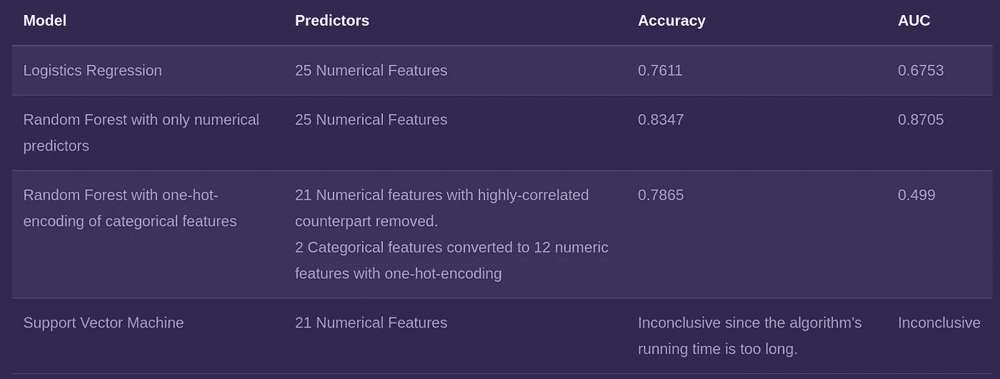

# 使用机器学习和谷歌地图实时预测交通事故风险

> 原文：<https://towardsdatascience.com/live-prediction-of-traffic-accident-risks-using-machine-learning-and-google-maps-d2eeffb9389e?source=collection_archive---------3----------------------->

## 在这里，我描述了使用 *scikit-learn、* Google Maps API、Dark Sky API、Flask 和 PythonAnywhere 创建和部署交互式交通事故预测器。

Source: [unsplash](https://unsplash.com/photos/ZWXx6uERI6M)

交通事故非常普遍。如果你像我一样生活在一个杂乱无章的大都市，你可能听说过、目睹过、甚至参与过其中。由于交通事故频繁发生，交通事故是全球死亡的主要原因，每年缩短数百万人的生命。因此，能够预测交通事故或事故易发区域的发生的系统能够潜在地挽救生命。

交通事故预测虽然困难，但并非不可能。事故不会以纯粹随机的方式出现；它们的发生受多种因素的影响，如驾驶员的身体状况、车型、驾驶速度、交通状况、道路结构和天气。研究历史事故记录将有助于我们理解这些因素和道路事故之间的(潜在因果)关系，这反过来将允许我们建立一个事故预测器。

幸运的是，有几个这样的事故记录是公开的！例如，英国政府公布了自 2002 年以来该国交通事故的详细记录。**有了这个数据集，我和我的队友们已经创建并部署了一个** [**机器学习模型**](https://kteo7.pythonanywhere.com/) **，它可以高精度地预测大伦敦地区何时何地可能发生事故。**

> 在这篇文章中，我将带你完成这个项目的过程。完整的代码可以在我的 [GitHub 库](https://github.com/meraldoantonio/AccidentPredictor)中找到，而实时模型可以在这个[网站](https://kteo7.pythonanywhere.com/)中访问。

 [## 道路交通事故

### 在这个项目中，我们建立了一个机器学习模型，预测在不同地点的 RTAs 的概率…

kteo7.pythonanywhere.com](https://kteo7.pythonanywhere.com/) 

# 目标

在开始这个项目之前，我们为自己设定了一个明确的目标:**我们希望创建一个任何人都可以轻松访问的交互式交通事故预测器。**我们认为实现这一目标的最佳方式是在网站上部署一个训练有素的预测器。这个预测网站应该能够做到以下几点:

*   允许用户输入出发地和目的地(两者都必须在大伦敦)，并找到连接两者的最佳驾驶路线。
*   允许用户选择他们计划进行旅行的日期/时间，并确定在该时间窗口内沿线特别容易发生事故的区域。

下图描述了我们为实现这一目标而采取的步骤。我将在接下来的章节中详细阐述它们。

Steps in this project

# 数据收集

确定了目标后，我们开始寻找必要的数据。以下是我们最终选择的两个数据集:

## 卡格尔

**我们在这个项目中使用的主要数据集是英国政府发布的详细事故记录，并在** [**Kaggle 上托管。他的数据集包含了 2000 年至 2014 年间发生在英国的 160 万起交通事故的细节。它由 33 列组成，记录了事故的地点、时间、严重程度以及各种气象和交通背景等细节。在这个项目中，我们仅限于分析 2012 年至 2014 年大伦敦地区的交通事故。**](https://www.kaggle.com/daveianhickey/2000-16-traffic-flow-england-scotland-wales/version/8)

## 黑暗的天空

我们认为天气是道路事故中一个特别重要的因素。尽管前面提到的 Kaggle 数据集包含了气象信息，但我们认为这还不够。使用 Kaggle 数据集的`weather_condition`列有两个问题:

*   **它假设天气全天不变。如果你去过伦敦，你就会知道为什么这个假设是有问题的——那里的天气变化非常频繁！**
*   **它只包含历史天气记录(显然！).**为了使用`weather_condition`作为*未来*事故的预测器，我们需要一种方法来获得天气*预报*。

由于这些原因，**我们决定转而利用美国一家专门从事天气预报的公司** [**【黑暗天空】**](https://kteo7.pythonanywhere.com/darksky.net) **提供的气象数据。黑暗天空每半小时提供一次过去的记录和未来的天气预报，这完全符合我们的目的。**

# 数据处理

## DBSCAN 聚类

在研究数据集时，我们发现伦敦几乎每条街道都曾是事故现场。这是有道理的——伦敦是一个繁忙的城市，交通事故(包括小事故)经常发生。下图是使用 Tableau 创建的，在伦敦地图上叠加了事故地点(红点)。注意整个城市是如何沐浴在红色之中！

The city of London. Each red spot indicates an accident between 2012 and 2014\. As we can see, London is full of (historical) car accidents!

尽管全市都发生过事故，但有些地区比其他地区更容易发生事故。为了系统地识别这些事故热点，我们将上述事故地点分组。我们将一个聚类定义为一个横截面为 25 米的区域，其中在两年时间窗口内至少发生了 14 起事故。

我们使用 DBSCAN 算法来执行这种聚类。**选择 DBSCAN 是因为它的速度、发现任意形状簇的能力以及对异常值的鲁棒性。**落在聚类之外*的事故点被视为异常值，并从我们随后的分析中排除。*

A depiction of how DBSCAN works

DBSCAN 聚类步骤发现了 473 个事故热点。下面是使用地理分析软件 ArcGIS 对这些热点进行的可视化处理。我们可以看到热点集中在伦敦的主要道路上，如 A11 和 A13。

Accident hot spots in London

## 负采样

此时，我们有数百个事故热点。我应该澄清一件事——这些热点并非 100%的时候都容易发生事故。例如，伦敦主干道沿线的事故多发点在高峰时段可能很危险，但在安静时段相对安全。另一方面，急转弯中的热点在阳光明媚的日子里可能是相当无害的，但在下雪或下雨的日子里可能会变得致命。

因此，我们的下一个任务是找出这些热点在什么条件下被“激活”。通过这种方式，**我们的项目现在变成了一个经典的二元分类问题:我们需要找出能够“激活”热点的因素组合(例如天气、时间等)。**

然而，我们此时的数据还不足以创建一个分类模型！训练分类器需要正样本和负样本，但我们只有正样本(即目标标签为 1 的记录)。**因此，我们需要一种生成阴性样本(即“非事故”记录)的方法**。

先前已经描述了使用阳性样品产生阴性样品。我们遵循*袁等人* **所描述的方法，实质上，该方法需要为聚类中的每个阳性样本随机生成三个阴性样本。**例如，如果我们有一个位于 Abbey Road 的聚类，其中发生了 15 起事故，我们将随机合成该地点的 45 条非事故记录。除了它们的位置，这些阴性样本的其他预测特征，如非事故事件的日期和时间，是随机选择的。小心谨慎，以免这些随机合成的阴性样品与真正的阳性样品不一致。

# 探索和观察

在研究我们清理过的数据集时，我们发现了一些有趣的现象。一些更有趣的观察结果详述如下。

***哪些月份最容易发生道路交通事故？***

上面的热图显示了所有日历月中一周内每天发生的事故数量。我们可以看到，9 月至 12 月是事故发生频率相对较高的月份。这是伦敦秋季的几个月，其特点是低温、多雾和多雨。与直觉相反，寒冷的冬季一月和二月发生的事故较少。这可能表明人们更不愿意在这段时间开车。

***一天中的什么时候最容易发生道路交通事故？***

上面的热图显示了一周中每天每小时发生的交通事故数量。我们观察到，不出所料，大多数事故发生在早上 8 点到 9 点的早高峰时间和下午 3 点到 7 点的晚高峰时间(紫色块)。星期五尤其糟糕。

***每起事故涉及多少辆车？***

上面的条形图显示了基于涉及车辆数量的事故分布。它表明大多数事故涉及一辆或两辆汽车。这在直觉上是有意义的；大多数事故都是由于汽车偏离道路和/或两辆汽车相撞而发生的。

***哪些区的交通事故发生率最高？***

上面的条形图显示了伦敦不同行政区发生的事故数量。我们看到威斯敏斯特位居第一，泰晤士河畔的金斯敦交通事故最少，排在最后。下面的地图以不同的方式展示了同样的信息:它用较暗的紫色突出了容易发生事故的行政区。

# 监督学习

有了前面提到的预处理步骤，我们终于准备好进入建模阶段了！我们按照 70:30 的比例将数据集分为训练和测试数据集。

Python 的 *scikit-learn* 库用于模型训练和评估。我们尝试了常见的分类模型，如 SVM、逻辑回归和随机森林。使用准确度和受试者工作特征曲线下面积(AUC-ROC)来测量和比较模型的相对性能。下表总结了我们建模步骤的结果。

我们发现，在我们测试的模型中，表现最好的模型是仅根据数字特征训练的随机森林。这是我们为部署选择的模型，我将在下面描述这个过程。

# 部署

然后，我们使用 Python web 框架 Flask 将我们的 *scikit-learn* 模型打包成一个 web 应用程序。该网站的前端显示是基于一个取自网站 HTML5UP 的免费模板构建的。所有的 html、javascript 和 CSS 代码都集成到 Flask 应用程序中。

然后，PythonAnywhere(一个专注于 Python 的 web 托管服务)将该应用程序发布到网上。你可以在[kteo7.pythonanywhere.com](http://kteo7.pythonanywhere.com)访问网站。以下是网站截图:

现在我想提供 Flask 应用程序工作的更多细节。

在前端，有字段，用户可以输入他们选择的起点和终点。这些文本字段配备了提供自动完成功能的 Google Places API。还有一个下拉菜单，用户可以选择日期/时间(可以是过去、现在或未来 48 小时内)。

一旦输入完成，一个`POST`请求就会被发送到后端框架。这里，这些输入充当函数`call_google`的参数。**给定出发地和目的地，该函数将调用 Google Maps API，返回连接两地的最佳行驶路线。**更具体地说，该函数返回路线的*航路点*的纬度和经度，这些航路点是沿路线有规律间隔的点。

纬度和经度作为另一个名为`calc_distance.` **的功能的输入。该功能从这些航路点“画”出半径为 50 米的假想圆，并检查是否有任何事故热点落在这些航路点内。**

对于落入圆圈内的每个星团，另一个函数`call_darksky`向黑暗天空 API 发出请求。**该函数将返回指定时间内该地点的天气预报。**

利用天气数据以及日期/时间信息，**最终预测功能将对感兴趣的热点在所选天气/时间下是否被“激活”进行二元预测。**这些预测然后被发送到前端，前端将在屏幕上显示它们。

下面的 gif 展示了我们的交互模型。在这里，我选择了一个未来的日期和时间(10 月 12 日星期六下午 6 点)，选择了一个起点(海德公园)和一个终点(国王十字车站)。我们可以看到，该模型选择了一条穿过 Gloucester Place 和 A501 的路线，并将这两条道路之间的繁忙交叉路口标记为潜在的事故地点。

同样，你可以在[kteo7.pythonanywhere.com](http://kteo7.pythonanywhere.com)访问这个模型。我鼓励你在它仍然活跃的时候(它将一直活跃到 2020 年初)尝试一下。

*注:除非另有说明，以上所有图片和动画均属本人所有。*

如果你对这篇文章有任何意见或者想联系我，请随时通过 [LinkedIn](https://www.linkedin.com/in/meraldo/) 给我发一个联系方式。另外，如果你能通过我的推荐链接[成为一名中级会员来支持我，我将非常感激。作为一名会员，你可以阅读我所有关于数据科学和个人发展的文章，并可以完全访问所有媒体上的故事。](https://medium.com/@meraldo.antonio/membership)

*这个项目是“数据和可视化分析”课程的一部分，我在佐治亚理工学院攻读分析硕士学位时选修了该课程。特别感谢我在这个项目中的队友*——*katan nya，Roger，Siew Lee 和 Yeok！你们太棒了。*