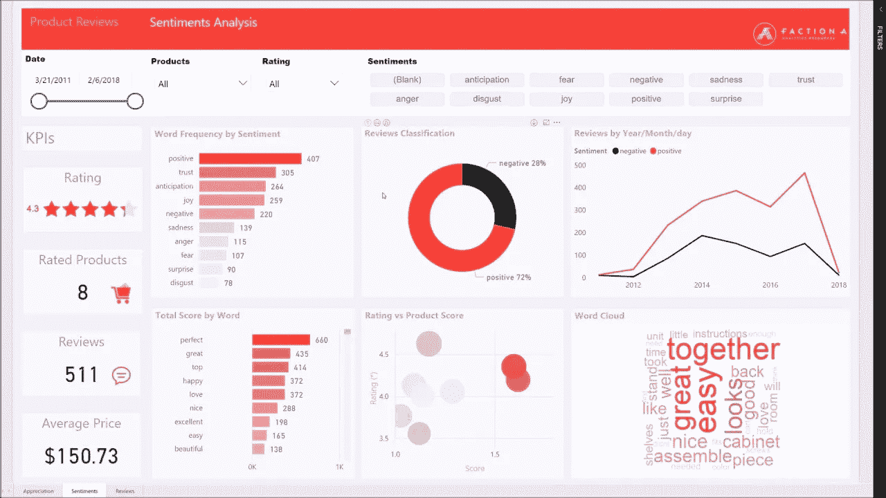
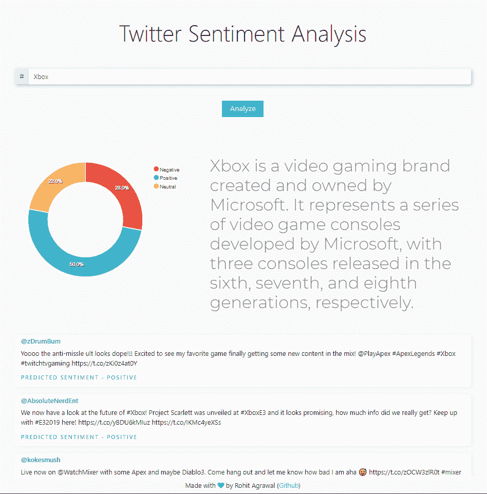
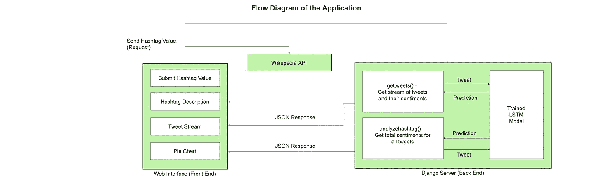

# 使用 Tweepy、Keras 和 Django 对 Twitter 数据进行实时情感分析

> 原文：<https://towardsdatascience.com/live-sentiment-analysis-on-twitter-data-using-tweepy-keras-and-django-99c344e90488?source=collection_archive---------4----------------------->


Photo by [Marten Bjork](https://unsplash.com/@martenbjork?utm_source=medium&utm_medium=referral) on [Unsplash](https://unsplash.com?utm_source=medium&utm_medium=referral)

欢迎来到这篇关于在推特上进行实时情绪分析的教程。我相信你一定遇到过复杂的仪表板，上面有大量的图表和数字正在被处理，看起来就像科幻电影一样，令人敬畏。这就是我们的目标。



Some Complex looking dashboard

虽然我们的最终结果不会像这样广泛，但是，它会教你如何进行必要的数据连接，这样你就可以使它像你想要的那样复杂。你可以继续把它作为一个 SaaS 业务或一个移动应用程序，赚一些钱。我们的结果会是这样的:



Our Result

> 它将对任何标签及其相关上下文进行实时分析，并在新推文出现时向您展示，同时附上一份情感。

够兴奋了吧？很好，我们开始吧。本文分为三个部分:

1.  制作模型
2.  制作 UI 界面(前端)
3.  制作后端，获取实时数据，连接一切



# 1.模特的东西

虽然情感分析在自然语言处理中是一个非常常见的话题，但我现在只简要介绍一下模型架构，但稍后我会就此写一篇单独的帖子。

我使用了[感知 140 数据集](https://www.kaggle.com/kazanova/sentiment140)进行训练，它包含大约。160 万条推特。在通过规范化清理文本并删除以' @ '开头的用户标签后，我使用了`gensim` 包的 *Word2Vec* 函数在整个语料库上训练它。由于语料库相当庞大，我有足够的数据来训练相当准确的嵌入，否则，我会使用预训练的矢量器。

```
#Test word embeddings
w2v_model.most_similar("hate")[('suck', 0.5254894495010376),
 ('stupid', 0.509635865688324),
 ('hat', 0.479534387588501),
 ('ugh', 0.4475134015083313),
 ('dislike', 0.44565698504447937),
 ('despise', 0.43604105710983276),
 ('fuck', 0.4104633331298828),
 ('annoy', 0.4004197418689728),
 ('ughh', 0.3961945176124573),
 ('fml', 0.39270931482315063)]
```

接下来，我使用了`keras` *标记器*将输入数据转换成标记，并添加填充符以使所有输入长度相同。这是 NLP 中数据准备的标准过程。最后，我把准备好的数据传进了一个 LSTM 网络。

```
predict("@Nintendo I love your games!"){'score': 0.820274293422699}
```

最终的准确率竟然在 **78.4%** 左右，目前来看已经足够好了。整个实现是[这里是](https://github.com/agrawal-rohit/twitter-sentiment-analysis-web-app/blob/master/Twitter%20Sentiment%20Analysis.ipynb)

```
ACCURACY: 0.784396875
LOSS: 0.45383153524398806
```

最后，我保存了模型(作为一个. h5 文件)和经过训练的 Keras Tokenizer(作为一个. pkl 文件),以便以后在服务器脚本的推理过程中使用它们。您可以在此下载培训文件

> **注意:**我实现了另一个模型，使用 1D 卷积代替 LSTM 网络进行比较，结果提供了几乎相似的结果。对于好奇的学习者，你可以在这里找到这个实现。

# 2.UI 前端的东西

我使用了 **ReactJS** 来构建接口。这是一个 Javascript 框架，通过创建组件并像乐高积木一样重用它们来促进**模块化设计**。每个组件都有其生命周期，因此如果某个组件的数据发生变化，只有该组件会刷新。这减轻了浏览器的负担，并减少了更新信息之间的延迟。

我不打算详述我是如何制作这个网站的，因为它只是基本的 CSS 和 Javascript，因此你可以直接研究[库](https://github.com/agrawal-rohit/twitter-sentiment-analysis-web-app/tree/master/react-frontend)中的代码。然而，如果你有任何疑问，请在下面留下你的回复，我会很乐意为你解答。

## 你只需要知道

我们有一个名为`**state**` 的变量，它属于网站，这里的任何变化都会刷新组件。

```
this.state = {
            hashtag: "",
            options: {
                colors: ['#F7464A', '#46BFBD', '#FDB45C'],
                labels: ['Negative', 'Positive', 'Neutral'],
                plotOptions: {
                pie: {
                  donut: {
                    labels: {
                      show: true
                    }
                  }
                }
              }
            },
            series: [44, 55, 41],
            tweets: [],
            hashtag_desc: ""
        }
```

`**hashtag**`包含输入字段的值，`**options**`值属于饼图的一些选项。我们只对一个功能感兴趣:

*   该函数在被调用时会将一个 **GET 请求**连同`**hashtag**` 值一起发送到我们位于‘http://localhost:8000/analyzehashtag’的服务器。它需要以下形式的 JSON 响应:

```
{
...
data: {
    positive: 43,
    negative: 23,
    neutral: 12
    }
...
}
```

*   该函数还向公共维基百科 API 发送一个 **GET 请求**，以及`**hashtag**` 值，以获取一些关于它的简短信息。
*   最后，该函数将另一个 GET 请求连同`**hashtag**` 值一起发送到我们位于‘http://localhost:8000/gettweets’的服务器。它需要以下形式的 JSON 响应:

```
{
    "results": [
        {
            "text": "Is it possible to wirelessly project my laptop                   to my #Xbox? #XboxOne [https://t.co/KMuSoD2C5j](https://t.co/KMuSoD2C5j)",
            "username": "Xbox_One_Reddit",
            "label": "Neutral",
            "score": 0.5679275393486023
        },
        {
            "text": "This year's #E3 had some big #XBOX news for the gaming industry. A glimpse at the future with Scarlet its Next Gen console, promising 4K &amp; 8K gaming, and of course the franchise that started it all... #Halo Infinite announced!\n\nWhich was you favorite?? #E32019 #XboxE3 #Gaming [https://t.co/tykdIYezmr](https://t.co/tykdIYezmr)",
            "username": "NrdRnx",
            "label": "Positive",
            "score": 0.9130105972290039
        },
        {
            "text": "DOMED 💀 #apex #apexlegends #apexlegendsxbox #apexlegendsclips #apexlegendscommunity #apexlegendsplays #playapex #controllergang #xbox #mixer #twitch [https://t.co/itERG2vpaD](https://t.co/itERG2vpaD)",
            "username": "gle_oh",
            "label": "Negative",
            "score": 0.26629960536956787
        },
        ...
    ]
}
```

这些数据用于填充处理实时 tweets 的组件。

# 3.后端的东西

最后，我们进入这篇文章的核心。对于后端，我们将使用 Django 来创建它。

> 注意:如果你没有后端开发经验，我推荐用 Flask 代替 Django。Flask 对用户非常友好，你可以在几分钟内创建和我在这里做的一样的东西。我使用 Django 是因为我发现部署更容易一些，而且它很容易扩展到更复杂的应用程序。

你可以谷歌如何创建 Django 项目，或者跟随他们文档中给出的教程。完成后，它应该具有以下文件夹结构:

```
│   .gitattributes
│   db.sqlite3
│   manage.py
│
├───main_app
│   │   admin.py
│   │   apps.py
│   │   config.py
│   │   models.py
│   │   Sentiment_LSTM_model.h5
│   │   tests.py
│   │   tokenizer.pickle
│   │   twitter_query.py
│   │   views.py
│   │   __init__.py
│   │
│   ├───migrations
│   │
│   └───__pycache__
│           admin.cpython-36.pyc
│           config.cpython-36.pyc
│           models.cpython-36.pyc
│           views.cpython-36.pyc
│           __init__.cpython-36.pyc
│
└───twitter_django
    │   settings.py
    │   urls.py
    │   wsgi.py
    │   __init__.py
    │
    └───__pycache__
            settings.cpython-36.pyc
            urls.cpython-36.pyc
            wsgi.cpython-36.pyc
            __init__.cpython-36.pyc
```

(而不是`**main_app**` 和`**twitter_django**`，它们将是您选择的应用程序的名称)

Django 用“视图”的概念来封装负责处理用户请求和返回响应的逻辑。因此，我们收到的对服务器的任何请求都将在这里处理。我们使用`**urls.py**` *:* 来连接视图

当我们在一个特定的 URL 端点接收到一个请求时，比如说“/gettweets”，它触发指定的函数——在本例中是“views.gettweets”。功能的逻辑写在`**views.py**` *中。*

注意这几行:

```
global graph
graph = tf.get_default_graph()
model = load_model('main_app/Sentiment_LSTM_model.h5')
```

如果没有图表，您就无法运行您的模型来获得预测(因为 Tensorflow 的工作方式)。如果你试着跑，' model.predict(..)'而没有指定图形，您将得到一个错误。因此，当你试图使用你的模型时，不要忘记加上:

```
with graph.as_default():            
    prediction = model.predict(...)
```

## 十二岁

如果你想从 Twitter 获取数据，Tweepy 就像是一个包。你可以使用`pip.`来安装它，你所需要的只是一些独特的密钥。这些密钥可以通过在 [Twitter 开发者网站](https://developer.twitter.com/en.html)注册一个应用程序来获得。

一旦完成，我们可以将`tweepy` 初始化为:

```
# Twitter
auth = tweepy.OAuthHandler(consumer_key,consumer_secret)
auth.set_access_token(access_token, access_token_secret)
api = tweepy.API(auth,wait_on_rate_limit=True)
```

现在要获取 tweets，我们可以调用 Cursor 函数。我们使用了一个定制的搜索标签(从前端接收)并收集了相同的 tweets。

> **注意:**我使用`*“ -filter:retweets”*`是为了只获得唯一的推文，否则，由于不同的转发频率，情感标签可能会有偏差。

```
tweepy.Cursor(api.search,q="#" + request.GET.get("text") + " -filter:retweets",rpp=5,lang="en", tweet_mode='extended').items(100)
```

## 制作一个 REST API

我们的服务器有两个重要的功能:

1.  `**analyzehashtag()**` —接受标签值，使用 tweepy 获得该标签的大量 tweets，并对每个 tweepy 执行情感分析。最后，通过简单地统计观察结果，计算积极、消极和中性推文在特定标签中的分布。

```
def analyzehashtag(request):    
positive = 0    
neutral = 0    
negative = 0    
for tweet in tweepy.Cursor(api.search,q="#" + request.GET.get("text") + " -filter:retweets",rpp=5,lang="en", tweet_mode='extended').items(100):        
    with graph.as_default():            
    prediction = predict(tweet.full_text) 
           if(prediction["label"] == "Positive"):    
        positive += 1       
           if(prediction["label"] == "Neutral"):
           neutral += 1
        if(prediction["label"] == "Negative"):
            negative += 1
    return JsonResponse({"positive": positive, "neutral": neutral, "negative": negative});
```

2.`**gettweets()**`**—这与第一个函数类似，但它不是计算分布，而是收集更少数量的推文并返回每个推文的结果。这样我们可以实时显示我们的模型的熟练程度，并检查它是否符合我们的常识。**

```
def gettweets(request):
    tweets = []
    for tweet in tweepy.Cursor(api.search,q="#" + request.GET.get("text") + " -filter:retweets",rpp=5,lang="en", tweet_mode='extended').items(50):
        temp = {}
        temp["text"] = tweet.full_text
        temp["username"] = tweet.user.screen_name
        with graph.as_default():
            prediction = predict(tweet.full_text)
        temp["label"] = prediction["label"]
        temp["score"] = prediction["score"]
        tweets.append(temp)
    return JsonResponse({"results": tweets});
```

**现在，为了让我们的前端能够访问这些函数，我们将把这些函数作为 API。使用 **Django REST 框架**可以很容易地做到这一点。**

**只需使用`pip install djangorestframework`安装，并在每个功能前添加`[@api_view](http://twitter.com/api_view)([“GET”])`。(因为我们在这里只使用了 2 个 GET 请求，所以我在这里只使用 GET)。**

**不要忘记在`settings.py`文件中添加以下内容。**

```
INSTALLED_APPS = [
    'django.contrib.admin',
    'django.contrib.auth',
    'django.contrib.contenttypes',
    'django.contrib.sessions',
    'django.contrib.messages',
    'django.contrib.staticfiles',
    'rest_framework',
    'corsheaders',
    'main_app'
]
```

# **结论**

**使用`python manage.py runserver`运行服务器，享受洞察“人们对新选举的反应”，或者“人们喜欢赛博朋克 2077 预告片中的基努·里维斯客串吗”。发疯吧！**

**我的 GitHub 上有完整的代码和安装说明。如果你愿意，可以去看看。再见**

**[](https://github.com/agrawal-rohit?tab=repositories) [## agrawal-rohit —概述

### 拥有 3 年以上项目工作经验的初级数据科学家和软件开发人员。高度熟练的机器…

github.com](https://github.com/agrawal-rohit?tab=repositories)**