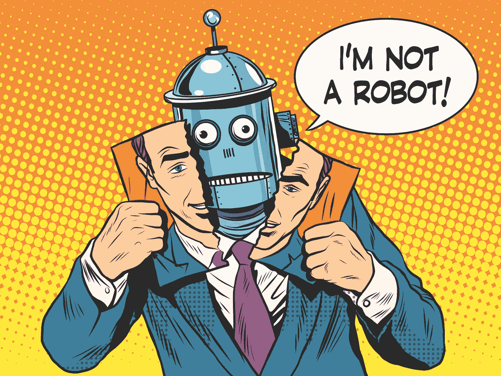
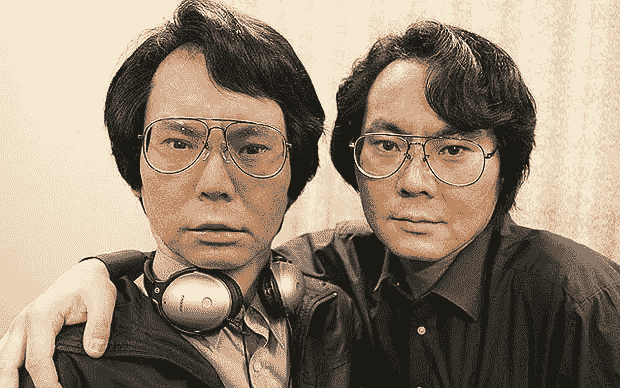

# 生活在机器人社会——一位世界领先的机器人专家的观点

> 原文：<https://towardsdatascience.com/living-in-a-robot-society-a-perspective-of-a-world-leading-robotocist-51175fb455e3?source=collection_archive---------26----------------------->

## 与日本[大阪大学](https://en.wikipedia.org/wiki/Osaka_University)智能机器人实验室主任石黑浩教授的 15 分钟。

> **我们谈到了他在制作机器人版本时学到的关键知识，与技术融合的意义，以及他对 HBO 著名剧集《西部世界》的看法。**

***你的愿景是什么？***

> 我的动机是了解人类是什么。我对自己和人类社会非常感兴趣。我认为我们作为人类在这个世界上生存的目的就是思考人类。我们总是试图了解自己，这是在这个世界上生存的最重要的动力。

在我的案例中，通过使用计算机技术、机器人技术和机器人技术，我正在接近这些问题。

***这是你建造人形或安卓机器人的原因，是为了在建造这些机器人的过程中了解我们自身的人性吗？***

一旦我们创造了一个非常像人类的机器人，我们就可以把它附加到更重要的人性上，比如现在。我们在互相交谈，这是一次交谈，但交谈的真正意义是什么。

可能要进行一次谈话，我们需要思考一些事情，但是思考什么，对吗？有那么多模棱两可，不为人知的话。我想通过使用机器人来理解每一个对我们人类来说模糊但非常重要的概念。这就是我们实验室正在做的事情。

***你说思维，就是说意识。你对意识有自己的定义吗？***

意识是，思维，情感，欲望等等。这些概念是无法明确区分的。

我没有自己最初的定义，但是在研究中，我们基本上考虑三个层次，三层意识。首先是唤醒水平，然后是现象水平，最后是进入水平。

> 现象学的层次是感受性。例如，当我们看到日落时，我们被感动了。我们被日落的美景所感动。
> 
> 在进入层面，我们可以考虑自己，我们可以感受自己。

这些层是紧密耦合的，我们不能分解它们。同时，这些意识水平与意图、欲望和情绪密切相关。

***身体、大脑、思想之间有什么联系？***

这对我们来说是非常重要的课题之一。本来我已经把 android 系统开发成了一个遥操作的 Android。这意味着如果我们通过互联网交谈，机器人可以像我一样行动。每个人都可以很容易地接受机器人身体作为他或她自己的身体。所以，我们实际上不需要身体和大脑之间的紧密联系。如果我们有一个机器人身体，我们的大脑可以接受机器人身体作为我们自己的身体，如果大脑可以控制身体的话。这是一个非常有趣的现象。

当我想到您构建的 Geminoid 时，您在这个过程中有哪些重要的见解？你学到了什么？

> 最重要的教训是，实际上，我不能接受我的第一个双子星座是我自己；但是其他人，学生和我的工作人员说这和我自己是一样的。

这意味着，我们不能对自己有客观的看法。我们不知道我们的脸、声音和行为。我发现人类基本上不可能有客观的观点。

这是我最感兴趣的发现。

***因为我们有偏见，所以我们感知自己的世界和周围的人……***

我们可以感知世界，但我们不能直接观察自己，我们需要使用镜子和录音机。一旦我们使用录音机，看着镜子，那就不同于我自己的辨认了。录制的声音听起来像另一个人。原则上，我们不能对自己有客观的看法和理解。

接下来，你可能想让 Geminoid 能够与人交流和互动，在这一点上，它变得更加复杂。

我们还没有研究人格，但是在研究人格之前，我们需要发展与他人对话的能力和功能。对话式自主机器人非常困难。现在，我们将重点放在对话功能上，我们采取了许多方法，如聊天机器人方法或更高级的非正式讨论。我们关注的是基于意图和欲望的更深层次的对话。

什么时候我会和 Geminoid 说话，而我不能确定我是在和你说话还是和你的机器人版本说话？

也许以后吧！我们正在越来越多地改进机器人。还没有！

***你怎么看待从技术上拔掉插头？你认为这重要吗？你认为这在未来会变得不那么重要吗？***

我认为思考人性是非常重要的，但从根本上说，我们人类有两种进化方式。

> 一个是基因；另一个是技术。因为科技，我们可以成为人类。如果我们不想使用技术，我们想成为猴子。我们不能把技术和我们人类分开。人类是使用技术和工具的动物。我们需要研究两个方面，人类的动物方面和人类的技术方面。但更重要的是，我们可以利用新技术开发更好的能力，这就是人类进化的方式。

***需要克服的最大的坎是什么？***

如果我们看看智能手机，一个国家无法用智能手机技术开发实用系统，iPhones 和其他智能手机是世界商业产品。他们需要有一个大市场来拥有一个更强大和更便宜的设备。对于机器人，我们需要有更多的技术。机器人需要在智能手机上添加执行器和传感器，然后我们才能拥有一个机器人。

在这种情况下，我们需要一个对社会产生更大影响的更大的市场。否则，我们就无法进行大规模生产，机器人也会非常昂贵。这是机器人社会最困难的一面。

***让我们接触一下* *乌托邦和反乌托邦的场景。你更积极还是更消极？***

我不能说这是好是坏，因为未来就是未来。

> 我们总能在那里找到快乐。开心和不开心是相对的。

更重要的是扩展我们的能力和生存。如果我们开发更多的技术，我们将有更多的机会在这个世界和这个宇宙中生存。这对我们人类来说是最重要的事情。乌托邦和反乌托邦只是相对的尺度。如果你能享受与否，那取决于你。

***一种观点是在我们的大脑中实现微芯片，以跟上机器人……***

> 这是自然的。技术是进化中非常重要的一部分。看看我们现在在做什么，每个人都继续使用他们的智能手机，这几乎就像一个植入物。

***你有什么个人的技巧或者日常做的套路来想出新点子吗？***

我总是试着去想很多事情。这是一种内在的声音。所以总有人在我脑中说话。当我在浴室洗澡的时候，当我用吹风机的时候，总会有一些想法冒出来。如果我摸我的头，我可以进入我大脑中的中性状态，然后会有一些想法出现。

保持大脑的中立状态是非常重要的。也许这类似于心理化。对我来说很简单，我只需要用一个吹风机，然后我就可以精神化了。

想象一下，以你现在所拥有的知识和经验，2018 年你将年满 18 岁。你会怎么做？你会获得什么技能？

尽管如此，我还是会做同样的事情。我目前的动机是了解我自己、人类和社会。这是一个很根本的基本的东西。我也会这么做，但我可能会接受更多的挑战。我可能会开另一家公司。如果我年轻，我可以接受更多的挑战。

我认为我年轻的时候是一名优秀的程序员。如果我现在 18 岁，我会连接到软件世界，自己开发人工智能。

***所以，技术技能与哲学、艺术、心理学等诸多领域的结合……***

但是最有效的方法是建设性的方法。创造一个有意识的代理人。在那之后，我们可以谈论心理学、哲学等等，但是没有代理人，我们无法进行讨论。我称这种方法为“建设性方法”。

***你知道西部世界系列吗？***

是的。我不喜欢这个想法，它是完全错误的。如果我们杀死一个类似人类的机器人，那就是谋杀。我们没有那么疯狂，所以方法完全错误。

***有什么可以推荐的电影？***

两百周年纪念人，由罗宾·威廉姆斯扮演。我喜欢那部电影。活了两个世纪的人。

喜欢这篇文章吗？这是另一个

 [## 我们需要去人性化的人工智能吗？

### 领先的人工智能专家乔安娜·布赖森就过度拟人化人工智能、偏见和安全人工智能的系统设计进行了采访。

medium.com](https://medium.com/omdena/do-we-need-to-dehumanize-artificial-intelligence-78d2f28c24fb) 

> ***关于作者:***
> 
> ***迈克尔·布哈特是一位 AI 旅行企业家(40 多个国家)。他帮助*** [***AI 爱好者通过真实世界的项目***](https://medium.com/omdena) ***获得动手技能。除了艾禾关于思维转变、冥想技巧和旅行者身体锻炼的博客。***
> 
> ***在***[***LinkedIn***](https://www.linkedin.com/in/michael-burkhardt-809557a0/)***，*** [***中***](https://medium.com/@michael.burkhardt) ***和***[***insta gram***](https://www.instagram.com/michaelburkhardt_/?hl=de)***。***