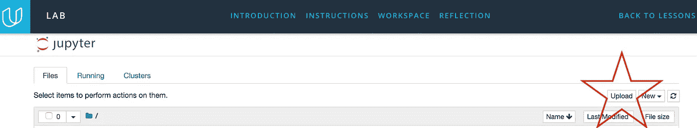

# 加载&%$*#检查点！

> 原文：<https://towardsdatascience.com/load-that-checkpoint-51142d44fb5d?source=collection_archive---------23----------------------->

## 成功的 Udacity 项目检查点加载的提示和技巧


Photo by [Vidar Nordli-Mathisen](https://unsplash.com/@vidarnm?utm_source=medium&utm_medium=referral) on [Unsplash](https://unsplash.com?utm_source=medium&utm_medium=referral)

加载那个检查点有问题吗？

我也是。

成为 Udacity 脸书 AI PyTorch 挑战赛的一员真是太棒了，一路上我学到了很多。完成最后的挑战后，我想分享一些技巧和诀窍，这些技巧和诀窍使我能够成功地将深度学习图像分类器项目的检查点提交到 Udacity 工作区。

最重要的是，遵循实验室的指示！我希望你知道这一点，但我把它放在这里以防万一…

## 保存您的检查点

如果您正在尝试在实验室中加载检查点，我假设您已经保存了检查点，但您确实需要保存检查点，因为这是您将在实验室中加载的内容！Torch.save 在这里非常方便。例如，这里有一个可能的检查点:

```
checkpoint = {'input_size': 2208,
              'output_size': 102,
              'epochs': epochs,
              'batch_size': 64,
              'model': models.densenet161(pretrained=True),
              'classifier': classifier,
              'scheduler': sched,
              'optimizer': optimizer.state_dict(),
              'state_dict': model.state_dict(),
              'class_to_idx': model.class_to_idx
             }

torch.save(checkpoint, 'checkpoint.pth')
```

只装你需要的东西。你可能不需要我在这个检查点加载的所有信息，但是我把上面的一个作为例子，这样你可以看到一些选项。在实验室中加载检查点之前，应该完成检查点保存。

确保您知道您的检查点保存在哪里，以便您可以将该文件上传到 Udacity 工作区！

## 在 Colab 工作？

如果您正在使用 Google Colab，并且将您的 Google Drive 安装到您的笔记本上([这里有一篇很棒的文章，如果您刚刚开始使用 Colab 并且不知道我在说什么](/getting-started-with-google-colab-f2fff97f594c)，您可以通过运行以下命令将您的检查点直接移动到您的 Google Drive 中:

```
model_save_name = 'classifier.pth'
path = F"/content/gdrive/My Drive/{model_save_name}" 
torch.save(model.state_dict(), path)
```

请确保文件路径正确无误！

*如果您决定将您的检查点保存到您的 Google Drive，您实际上可以将它从那里移动到 Udacity 的工作区，方法是转到您的 Google Drive，获取可共享的链接文件，并找到您的文件 ID。您只需要文件 ID:它将是“id=”后面的一长串字母和数字。然后转到 Udacity 实验室笔记本运行

```
!pip install gdown==3.6.0
```

安装 gdown。那就跑

```
ckpt_file_id = "YOUR-FILE-ID-GOES-HERE"
```

(确保用您的实际文件 ID 替换“YOUR-FILE-ID-GOES-HERE ”!)

最后

```
!gdown [https://drive.google.com/uc?id={](https://drive.google.com/uc?id={1kX4IwGUB88x9CTHAfhsAz7PljqnKZdEp)ckpt_file_id}
```

这将下载您的文件并将其放在 Udacity 实验室中。

## 在 Udacity 工作区中

如果您没有使用 Google Drive，那么当您到达实验室时，您需要点击“上传”按钮，上传您的检查点文件。确保它一直到 100%,否则你可能会得到一个损坏的文件。



以下是您提交项目所需的重要信息:

你需要加载你的参数。我从

```
ckpt = torch.load('checkpoint.pth')
ckpt.keys()
```

这样我就可以快速看一下我的钥匙。然后我运行我的进口。

```
from collections import OrderedDictimport torch
import torch.nn as nn
from torchvision import models
import os
from torchvision import datasets, transforms
```

这里有一个非常重要的细节:如果您还没有定义图像大小，请运行以下命令:

```
image_size = 224
# Values you used for normalizing the images. Default here are for
# pretrained models from torchvision.
norm_mean = [0.485, 0.456, 0.406]
norm_std = [0.229, 0.224, 0.225]
```

之后，您可以创建一个检查点加载函数，并使用它来加载模型。

```
def load_checkpoint(filepath):
    checkpoint = torch.load(filepath, map_location='cpu')
    model = checkpoint['model']
    model.classifier = checkpoint['classifier']
    model.load_state_dict(checkpoint['state_dict'], strict=False)
    model.class_to_idx = checkpoint['class_to_idx']
    optimizer = checkpoint['optimizer']
    epochs = checkpoint['epochs']

   for param in model.parameters():
        param.requires_grad = False

    return model, checkpoint['class_to_idx']model, class_to_idx = load_checkpoint('/home/workspace/checkpoint.pth')
```

你看到上面写着

```
map_location='cpu'
```

和

```
strict=False
```

?

你想包括那些！

不是开玩笑。Udacity 的工作空间没有连接 GPU，因此您需要确保指定了 CPU。您还希望使用“strict=False ”,以避免遇到任何不必要的版本兼容性问题。

仔细检查分类器的文件路径。正如你在上面看到的，我的是

```
model, class_to_idx = load_checkpoint('/home/workspace/checkpoint.pth')
```

你真的需要有正确的道路！如果你看一下测试单元上面的说明，几乎可以肯定你的文件路径应该是什么样子。Udacity 真的希望你成功，所以一定要认真看说明书！

## 最后

将所有内容放入一个单元格中！将每一行代码放入提供的测试单元中。许多学生在做了一个简单的改变后，最终成功提交了项目。去做吧！

现在测试代码并开始您的项目！这个项目是严格的通过/失败，所以如果你通过了，你就完成了！恭喜你！！！


现在去庆祝吧！


Photo by [Jayson Hinrichsen](https://unsplash.com/@jayson_hinrichsen?utm_source=medium&utm_medium=referral) on [Unsplash](https://unsplash.com?utm_source=medium&utm_medium=referral)