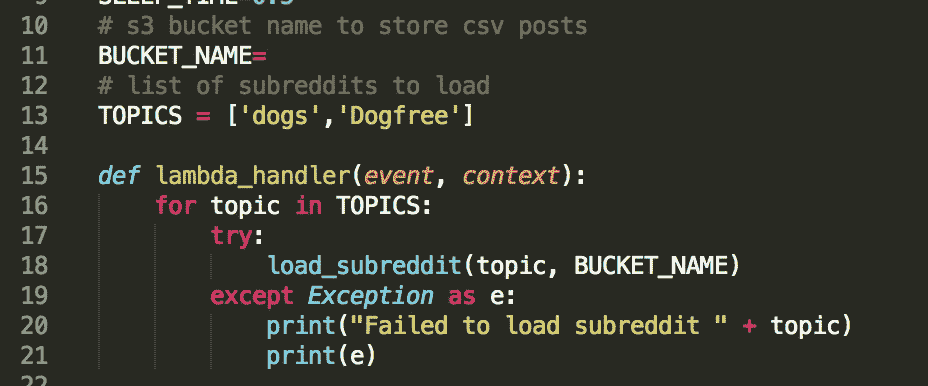
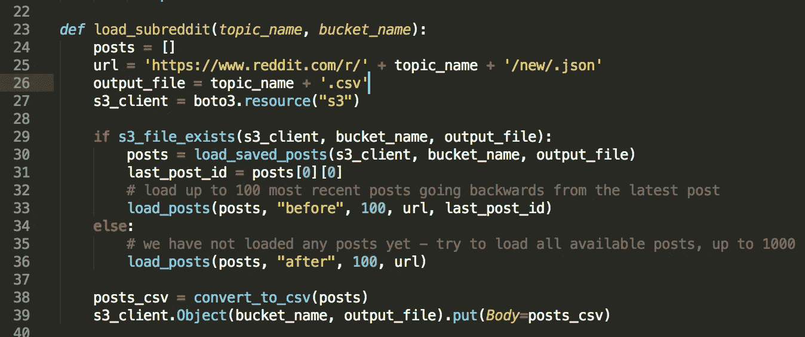
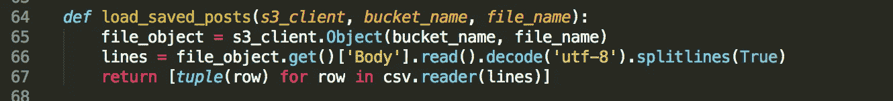
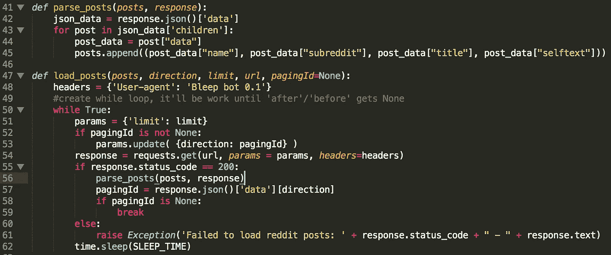

# 使用 AWS Lambda 和 CloudWatch 事件加载 Reddit 帖子

> 原文：<https://towardsdatascience.com/loading-reddit-posts-using-aws-lambda-and-cloudwatch-events-9edb03ba4c14?source=collection_archive---------18----------------------->

上个月，我完成了 Reddit 分类项目，通过抓取 Reddit 网站收集数据，然后建立了一个二元分类器来识别给定帖子的来源。现在，当我有一些空闲时间时，我决定检查一下那个项目，并做一些改进。之前，我使用 cron 在 AWS EC2 实例上运行 python 脚本。但这次我决定探索更多的 AWS 服务，并将该脚本转换为由 CloudWatch 触发的 Lambda。

那么，我们开始吧。我们将创建一个 AWS lambda，它将使用 Reddit api 加载 Reddit 帖子，并将它们存储到 S3 桶中。

首先，我们定义一个 bucket 名称和一个要加载的主题列表。然后我们定义一个 lambda 的主方法——“lambda _ handler”，它接受两个参数——事件和上下文。这个方法是我们 lambda 的一个入口点，CloudWatch 会每隔 15 分钟触发一次。该方法将遍历主题列表，并为每个主题加载 reddit 帖子。如果出现异常，我们会捕获它，记录下来，然后继续下一个主题。



接下来，让我们看看加载 reddit 帖子的 main 方法。首先，我们检查一个 csv 文件与以前加载的职位已经存在于 S3。如果是这样，我们将这些帖子加载到一个列表中。我们从列表中提取最后保存的帖子的 id，使用“before”参数继续加载该 id 之后的所有新帖子。如果在 S3 没有现存的文件，这意味着我们还没有加载任何帖子。在这种情况下，我们将使用“after”参数通过 Reddit api 加载所有可用的帖子。你可以点击这个链接阅读更多关于如何使用 Reddit api 的内容:[https://www.reddit.com/dev/api/](https://www.reddit.com/dev/api/)它解释了如何使用“之前”/“之后”参数进行分页。最后，我们将所有帖子转换为 csv 字符串，并保存到 S3。



以下是我们如何从 S3 加载保存的帖子。我们使用 AWS boto3 客户端访问 S3。我们从 S3 读取一个文件，将它分割成单独的行，并将它们传递给 python csv 阅读器库。然后我们使用列表理解将每个解析的行转换成一个元组。



下面是使用 python 请求库加载帖子并从 json 响应中提取必填字段的方法。load_posts 方法使用 while 循环来持续加载 reddit 帖子。首先，它将 pagingId 作为 None 传递，以加载第一页。之后，它从加载的页面中提取下一个 pagingId，并将其与下一个请求一起传递。它一直这样做，直到 pagingId 变成 None。意味着 reddit api 没有剩下任何页面。



你可以在我的 [Github](https://github.com/achernyshova/Reddit-NLP-Classification/tree/master/AWS) 上找到完整的代码

现在，当我们准备好 lambda 代码后，我们需要创建一个 zip 文件来部署到 AWS。当我第一次尝试在 AWS 上运行这段代码时，它不起作用，因为 lambda 没有 requests python 库。结果是，在将 lambda 脚本部署到 AWS 之前，我们必须将所有必需的依赖项和 lambda 脚本一起添加到档案中。让我们在 cmd 中运行以下命令:

```
$ **mkdir lambda**
$ **cd lambda**
$ **pip install --target ./ requests .**  //install requests library
$ **zip -r ../reddit_lambda.zip .**   //archive the folder
$ **cd ..**
$ **zip -g reddit_lambda.zip reddit_lambda.py**  //add lambda script
```

这将创建一个名为 reddit_lambda.zip 的归档文件，其中包含请求依赖项和我们的 lambda 脚本。

现在我们将练习使用 AWS Cli 部署我们的 lambda 函数，并每隔 15 分钟触发一次。准备好在命令行中运行许多命令。

首先，我们必须为我们的 lambda 创建一个名为 *reddit_lambda_role* 的执行角色:

```
$ **cat lambda_assume_role_policy.json**
{
 "Version": "2012-10-17",
 "Statement": [{
     "Effect": "Allow",
     "Principal": {
         "Service": "lambda.amazonaws.com"
     },
     "Action": "sts:AssumeRole"
 }]
}
$ **aws iam create-role --role-name reddit_lambda_role --assume-role-policy-document file://lambda_assume_role_policy.json**
```

这个假设策略文档允许角色由我们帐户中的任何 lambda 假设。目前这个角色没有权限——这意味着即使 lambda 假设它没有权限做任何有用的事情，比如访问 S3 来保存对象。要解决这个问题，让我们创建一个策略:

```
**$ cat lambda_role_policy.json** {
 "Version": "2012-10-17",
 "Statement": [{
   "Effect": "Allow",
   "Action": [
    "s3:GetObject",
    "s3:PutObject",
    "s3:PutObjectAcl",
    "s3:GetObjectAcl"
   ],
   "Resource": "arn:aws:s3:::**your-bucket-name**/*"
  },{
   "Effect": "Allow",
   "Action": [
    "logs:CreateLogStream",
    "logs:PutLogEvents"
   ],
   "Resource": "arn:aws:logs:eu-west-1:**your-account-id**:*"
  },{
   "Effect": "Allow",
   "Action": "logs:CreateLogGroup",
   "Resource": "*"
  }]
}$ **aws iam create-policy --policy-name reddit_lambda_policy --policy-document file://lambda_role_policy.json**
```

这个名为 *reddit_lambda_policy* 的策略授予访问 S3 的权限，以加载和保存文件，并将日志保存到 CloudWatch。现在，让我们将此策略附加到一个角色:

```
$ **aws iam attach-role-policy --role-name reddit_lambda_role --policy-arn arn:aws:iam::*your-account-id*:policy/reddit_lambda_policy**
```

现在让我们在 AWS 中创建一个名为 *RedditLoader* 的 lambda:

```
$ **aws lambda create-function --region us-east-1 --function-name RedditLoader --zip-file fileb://reddit_lambda.zip --role arn:aws:iam::*your-account-id*:role/reddit_lambda_role --handler reddit.lambda_handler --timeout 900 --runtime python3.7**
```

此时，您可以转到 AWS 控制台，打开 lambda 部分并手动运行这个 Lambda。它应该能够加载 reddit 帖子，并将其存储在 S3。但是我们的目标是使用 CloudWatch 事件每 15 分钟触发一次这个 lambda。

让我们创建一个名为 *RedditLoadingRule* 的预定事件规则:

```
$ **aws events put-rule --name RedditLoadingRule --schedule-expression 'rate(15 minutes)'**
```

现在，我们向 lambda 添加由规则中的事件触发的权限:

```
$ **aws lambda add-permission --function-name RedditLoader --statement-id RedditScheduleEvent --action 'lambda:InvokeFunction' --principal events.amazonaws.com --source-arn arn:aws:events:us-east-1:*your-account-id*:rule/RedditLoadingRule**
```

向我们的规则添加一个目标，以便它知道每 15 分钟触发什么:

```
$ **aws events put-targets --rule RedditLoadingRule --targets "Id": "1","Arn":"arn:aws:lambda:us-east-1:*your-account-id*:function:RedditLoader"**
```

仅此而已。现在，CloudWatch 将每隔 15 分钟发送一个事件，触发我们的 lambda。

所有的 AWS 命令可能看起来令人生畏，但是实际上一旦你学会了如何通过 AWS cli 使用基本命令，你将很快适应只使用 cli 与 AWS 交互。这是一项非常好的技能，可以打开强大自动化的大门。

在下一篇文章中，我们将看看如何使用 SageMaker 来训练和部署使用我们来自 S3 的 reddit 帖子的模型。