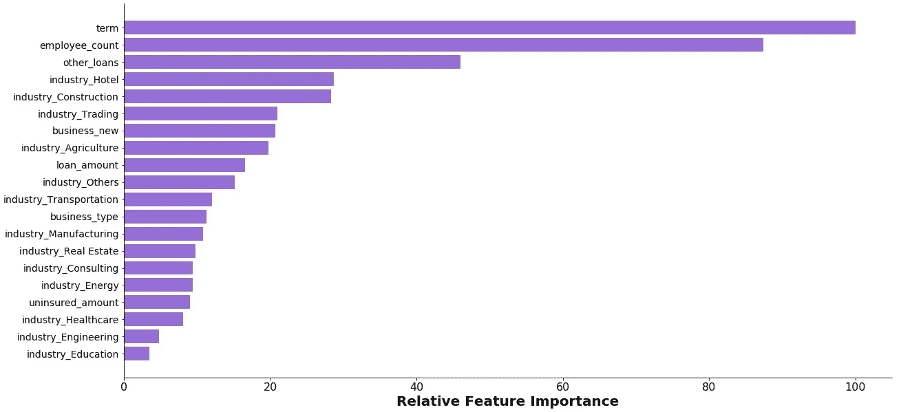
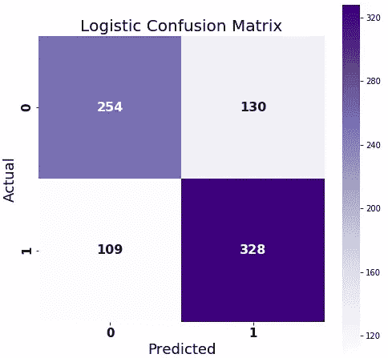
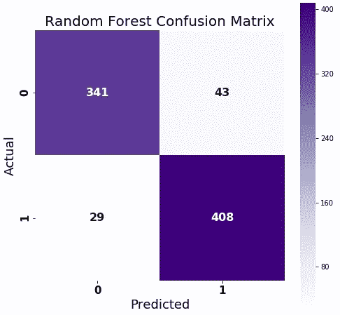

# 小企业银行贷款违约预测

> 原文：<https://towardsdatascience.com/loan-default-prediction-for-small-industries-bank-21da431f7a28?source=collection_archive---------22----------------------->

Photo: [https://thelendersnetwork.com/minimum-credit-score-needed-personal-loan/](https://thelendersnetwork.com/minimum-credit-score-needed-personal-loan/)

银行贷款给公司，以换取还款承诺。有些人会拖欠贷款，因为某些原因无法偿还。银行维持保险以减少他们在违约时的损失风险。保险金额可以覆盖全部或部分贷款金额。

对于这项任务，银行希望根据公司的财务信息预测哪些公司会拖欠贷款。提供的数据集由贷款相关信息组成，如贷款金额、期限和州。此外，还有公司信息，如员工数量、运营部门等。

**目标**

为了预测一家公司是否会拖欠贷款，我尝试了两种不同的机器学习算法:逻辑回归和随机森林。这项作业的指示是使用准确性作为评估标准。然而，在这种情况下，精确性是至关重要的，因为我们希望将贷款违约的可能性降至最低。

**见解/探索性数据分析**

快速浏览一下数据就能发现一些真知灼见:
1 .贸易公司是最大的客户群
2。较小的公司更容易违约。贷款期限不影响违约的可能性。拖欠贷款的客户只有一半多

有了这些信息，我开始清理数据，并使用洞察力生成新的特征。目标是预测违约状态，0 表示没有违约，1 表示违约。

**型号**

为了确定哪些信息对于模型的良好运行是必不可少的，我查看了特征的重要性，并重复了特征工程的步骤。

逻辑回归是我的首选模型，因为它的时间复杂度低。该模型的**准确率约为 70%** 。这也意味着 13% (109/821)的客户没有进行任何还款，但预计不会违约，也就是假阳性。

随机森林是我的下一个模型。它的初始准确度分数是 99%，但是当引入看不见的数据时(验证是 90%)，过度拟合将导致较差的预测。调整模型后，最终模型的**精度为 94%** ，不再过度拟合。维奥拉。我们设法将假阳性的数量从 13%降低到 3%。

**结论**

没有一种方法可以确定客户是否会停止还款。但是，贷款期限、行业、公司规模等因素都会影响他们的还款能力

这个项目的代码可以在我的 Github 上找到。如果你愿意联系，可以通过 [LinkedIn](https://www.linkedin.com/in/kelseyhenghy/) 联系我。