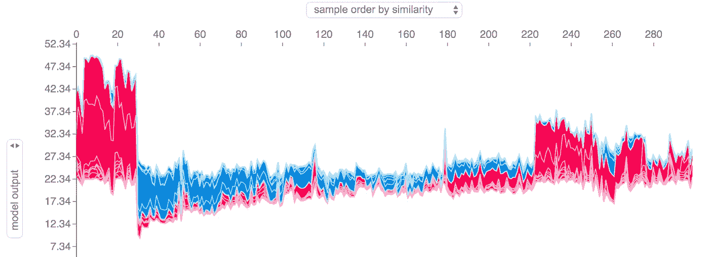
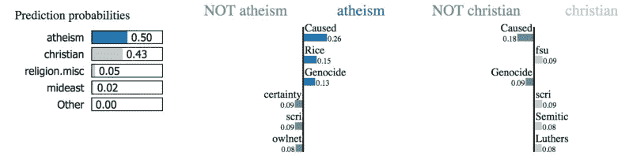
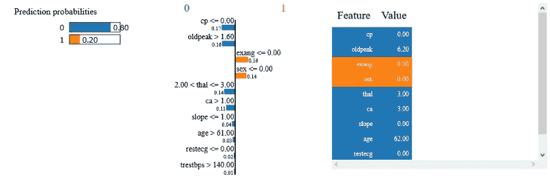
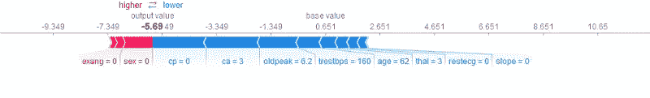
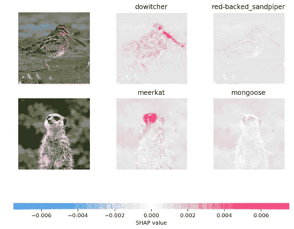

# 局部模型解释:介绍

> 原文：<https://towardsdatascience.com/local-model-interpretation-an-introduction-90d039fbef8d?source=collection_archive---------17----------------------->

本文是我关于模型可解释性和可解释人工智能系列文章的延续。如果你还没有读过前两篇文章，我强烈推荐你去读一读。

本系列的第一篇文章，[《机器学习模型解释入门》，](/introduction-to-machine-learning-model-interpretation-55036186eeab)涵盖了模型解释的基础知识。第二篇文章，[‘动手全球模型解释’，](/hands-on-global-model-interpretation-3bb4264732b5)详细介绍了全球模型解释，以及如何使用 Python 将其应用于现实世界的问题。

在本文中，我们将通过深入到本地模型解释来继续我们离开的地方。首先，我们将看看什么是局部模型解释，以及它可以用于什么。然后，我们将深入研究两种最流行的方法的理论，Lime(局部可解释模型不可知解释)和 Shapley 值，并应用它们来获得关于[心脏病数据集](https://www.kaggle.com/ronitf/heart-disease-uci)上的个体预测的信息。

# 什么是局部模型解释？

局部模型解释是一套旨在回答以下问题的技术:

*   模型为什么做出这个具体的预测？
*   这个特定的特征值对预测有什么影响？

使用我们的领域专业知识，结合使用本地模型解释获得的知识，我们可以对我们的模型做出决定，比如它是否适合我们的问题，或者它是否没有按照预期发挥作用。

目前，使用本地模型解释变得越来越重要，因为公司(或个人)必须能够解释他们模型的决策。尤其是当它被用于需要大量信任的领域时，如医药或金融。

# LIME(局部可解释的模型不可知解释)

尽管被广泛采用，机器学习模型仍然主要是黑箱。然而，理解预测背后的原因在评估信任时非常重要，如果一个人计划根据预测采取行动，或者在选择是否部署新模型时，信任是最基本的。— [里贝罗、马尔科·图利奥、萨梅尔·辛格和卡洛斯·盖斯特林。“我为什么要相信你？”](https://arxiv.org/abs/1602.04938)。

Figure 2: [Lime Example](https://github.com/marcotcr/lime)

## 概念和理论

Lime，局部可解释模型不可知，是一种局部模型解释技术，使用局部代理模型来近似底层黑盒模型的预测。

局部代理模型是可解释的模型，如线性回归或决策树，用于解释黑盒模型的单个预测。

Lime 通过从感兴趣的数据点生成新的数据集来训练代理模型。它生成数据集的方式因数据类型而异。目前 Lime 支持文本、图像和表格数据。

对于文本和图像数据，LIME 通过随机打开或关闭单个单词或像素来生成数据集。对于表格数据，LIME 通过单独置换每个要素来创建新样本。

LIME 学习的模型应该是黑盒模型的良好局部近似，但这并不意味着它是良好的全局近似。

## 优势

LIME 是分析预测的好选择，因为它可以用于任何黑盒模型，无论是深度神经网络还是 SVM。此外，LIME 是唯一适用于表格、文本和图像数据的解释技术之一。

## 不足之处

感兴趣的数据点的邻域的定义非常模糊，这是一个很大的问题，因为这意味着您必须为大多数应用程序尝试不同的内核设置。

此外，解释可能不稳定，这意味着对非常接近的数据点的解释可能变化很大。

关于 LIME 和可解释人工智能的更多信息，一般来说，请查看 Christoph Molnar 的优秀书籍 T2 的可解释机器学习。

## 示例和解释

Lime 可以在 Python 中与 [Lime](https://github.com/marcotcr/lime) 和 [Skater](https://github.com/oracle/Skater) 包一起使用，这使得 LIME 与流行的机器学习库(如 [Scikit Learn](https://scikit-learn.org/stable/) 或 [XGBoost](https://xgboost.readthedocs.io/en/latest/) )的模型一起使用变得非常容易。在这篇文章中，我将研究[心脏病数据集](https://www.kaggle.com/ronitf/heart-disease-uci)，一个简单的分类数据集。

为了分析像心脏病数据集这样的表格数据集的预测，我们需要创建一个 LimeTabularExplainer。

现在，我们可以使用 explain _ instace 方法来解释单个预测。

Figure 3: Lime Output

这里我们可以清楚地看到哪些特征值影响了预测。对于该数据点，cp 和 oldpeak 值对预测的负面影响最大。

有关如何使用 Lime 的更多示例，请查看自述文件中的[“教程和 API”部分](https://github.com/marcotcr/lime#tutorials-and-api)。

# 沙普利值

沙普利值是一种根据玩家对总支出的贡献将支出分配给玩家的方法。但是这和机器学习有什么关系呢？

## 概观

在机器学习的情况下，“游戏”是对数据点的预测任务。“增益”是预测减去所有实例的平均预测，而“玩家”是数据点的特征值。

Shapley 值是一个特性值在所有可能的联合中的平均边际贡献。这是一种解释单个预测的极好方法，因为它不仅给出了每个特征值的贡献，而且这些贡献的大小也是正确的，这与 LIME 等其他技术不同。

要获得更多关于 Shapley 值及其计算方法的信息，请务必查看 Christoph Molnar 的书[“可解释的机器学习”](https://christophm.github.io/interpretable-ml-book/)的 [Shapley 值部分](https://christophm.github.io/interpretable-ml-book/shapley.html)。

## 优势

当使用 Shapley 值时，预测和平均预测在实例的特征值之间公平分布。这使得 Shapley 值非常适合需要精确解释的情况。此外，Shapley 值是唯一有坚实理论支持的局部解释方法。

## 不足之处

Shapley 值需要大量的计算时间。大多数情况下，只有近似解是可行的。另一个缺点是，您需要访问数据来计算 Shapley 值。这是因为您需要数据来替换感兴趣的部分实例。只有创建看起来像真实数据实例的数据实例，才能避免这个问题。

## 示例和解释

我们可以使用由 Scott Lundberg 创建的优秀的 [shap (SHapley 附加解释)包](https://github.com/slundberg/shap)在 Python 中使用 Shapley 值。

shap 包可用于多种模型，如树或深度神经网络，以及不同类型的数据，包括表格数据和图像数据。

要对心脏病数据集使用 shap，我们可以创建一个 TreeExplainer，它可以解释像随机森林一样的树模型的预测，然后使用 shap_values 和 force_plot 方法来分析预测。

在图像中，我们可以看到每个特征值如何影响预测。在这种情况下，预测值为 0，这意味着患者没有心脏病。最重要的特征值是 cp=0 和 ca=3。这由箭头的长度表示。

# 结论

局部模型解释是一套试图帮助我们理解机器学习模型的个体预测的技术。LIME 和 Shapley 值是理解个体预测的两种技术。

Lime 非常适合快速查看模型正在做什么，但是在一致性方面有问题。Shapley value 提供了一个完整的解释，这使得它比 Lime 更精确。

这就是这篇文章的全部内容。如果你有任何问题或者只是想和我聊天，请在下面留下评论或者在社交媒体上联系我。如果你想获得我博客的持续更新，请确保在 Medium 上关注我，并[加入我的时事通讯](http://eepurl.com/gq-u4X)。