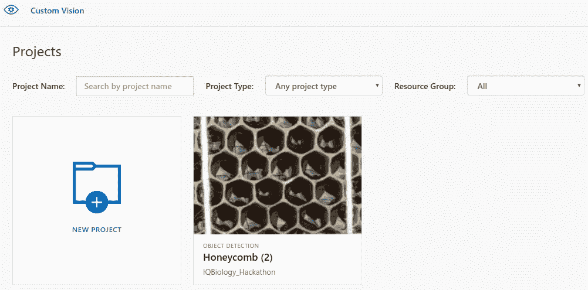
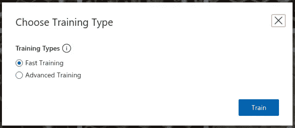

# 使用自定义视觉人工智能中的对象检测来定位和识别蜂窝单元

> 原文：<https://towardsdatascience.com/locating-and-identifying-honeycomb-cells-using-object-detection-in-custom-vision-ai-9b314532791b?source=collection_archive---------33----------------------->

由[智商生物项目](http://iqbioreu.uprrp.edu/index.php/program/)在 [UPR-RP](http://www.uprrp.edu/) 举办的[智商黑客马拉松](https://sites.google.com/a/upr.edu/iq-hackathon/)参赛

Photo by [Scott Hogan](https://unsplash.com/@nwfandi?utm_source=medium&utm_medium=referral) on [Unsplash](https://unsplash.com?utm_source=medium&utm_medium=referral)

从 7 月 31 日到 8 月 1 日，波多黎各有一场黑客马拉松，由[跨学科定量生物学项目](http://iqbioreu.uprrp.edu/index.php/program/)在波多黎各[大学里约皮得拉斯校区](http://www.uprrp.edu/) (UPRRP)主办。黑客马拉松在波多黎各 Bayamon 的一个合作空间 [Engine 4](https://engine-4.com/) 举行。

Hackathon Flyer

黑客马拉松的重点是寻找跨学科和定量(IQ)生物学问题的创造性解决方案。

我和[Alejandro Armas](https://www.linkedin.com/in/armasalejandro/)([Alejandro Armas](https://medium.com/u/9adc9b6f0534?source=post_page-----9b314532791b--------------------------------))[Carlos Navea](https://www.linkedin.com/in/carlos-navea/)和 [Giovanni Cortes](https://www.linkedin.com/in/giovanni-cortes-339983189/) 一起参加了这次黑客马拉松，他们都是 IQ 生物学暑期实习的聪明参与者。我们的团队名称是“蜂巢”。我们得到了 UPRRP 大学计算机科学系副教授雷米·梅里特教授的指导。

我们解决了两个问题:

*   通过 webapp 简化研究人员的数据输入。
*   使用对象检测自动蜂窝单元识别和计数。

本文主要讨论后者。

我们为黑客马拉松实现的代码可以在 https://github.com/alejandroarmas/PRhacks 的 GitHub 上找到。用于准备物体检测数据的代码在`mlTool`文件夹中。

# 问题陈述

波多黎各大学蜜蜂研究人员的一些职责是拍摄蜂窝并记录与蜂窝相关的各种变量，例如:蜂窝中有多少花蜜，有多少蜜蜂，有多少花粉，有多少幼虫，有多少密封的巢(容纳蜂蜜)，有多少蛹。由于计算这些的任务过于繁重，研究人员记录了这些近似值(例如，5%的蜂巢有蜂蜜)。

Types of honeycomb cells. Glossy cells contain nectar. Sealed cells contain honey.

对于黑客马拉松，我们选择使用对象检测来解决计数问题。通过对象检测，我们可以自动识别不同类型的细胞并进行计数，以便研究人员可以记录这些细胞的准确数据。

对象检测是深度学习和计算机视觉的一个分支，涉及自动识别图像中感兴趣的项目，并确定围绕它们的矩形边界框(bbox)的坐标。然后可以使用坐标画出边界框。

Object detection example. ([source](/beginners-guide-to-object-detection-algorithms-6620fb31c375))

# 数据注释

One of the images taken by the researchers. We did not annotate it completely due to time constraints.

在机器学习(ML)和深度学习(DL)中，对数据进行注释或标记意味着将其标记为属于某一类。当使用对象检测时，这意味着确定围绕图像中感兴趣区域的矩形的坐标(或者在使用注释工具时围绕感兴趣区域绘制矩形)，并保存矩形的坐标和该区域所属的类。我们希望 ML 或 DL 模型从带注释/标签的数据中学习，并用这些注释/标签预测新数据。

One labeled cell.

我们在研究人员使用名为 [labelImg](https://github.com/tzutalin/labelImg) 的开源标记工具拍摄的蜂窝图像中标记了花蜜和空细胞，该工具将注释保存到 XML 文件中。

LabelImg’s GUI.

我们只关注 nectar 和 empty 类，以便在实现解决方案之前不要花太多时间来注释数据，还因为它们是我们注释的蜂巢中最丰富的单元。最理想的情况是，我们应该标记所有的种类:密封的、空的、花蜜的、蜜蜂的、蛹的、幼虫的和花粉的。

Preview of one of the label XML files. Bounding box coordinates are within the <object> tags.

**注**:在黑客马拉松期间，我们将花蜜细胞标记为蜂蜜细胞。

Oops.

我们认为光泽细胞有蜂蜜，而事实上它们有花蜜(从观看[这个](https://www.youtube.com/watch?v=6LOhkHHpnHU)视频中发现)。文章的其余部分将保持原来的约定，因为它反映了黑客马拉松结束之日的现实。通过在注释(XML)文件中找到单词“honey”的所有实例并用单词“nectar”替换它们，可以很容易地修复注释。我们将在未来的工作中实现这一修复。

# 数据预处理

## 阅读标签

使用 labelImg 创建的注释以 XML 格式保存在名为`labeled_data`的文件夹中。我们开发代码是为了以一种更容易使用的格式存储这些标签。

我们的代码遍历了`labeled_data`中的所有 XML 文件，其中保存了图像及其 XML 注释。然后，它使用库`BeautifulSoup`访问 XML 中每个边界框的相关信息。然后，它将信息存储到 dataframe 中，其中每行对应一个边界框，列的标题为:image(图像的相对路径)、label(边界框的标记)、xmin(左 x 点)、xmax(右 x 点)、ymin(顶部 y 点)和 ymax(底部 y 点)。

Diagram example of an image with a bbox. xmin, xmax, ymin and ymax define all edges of the bbox.

Code for reading in annotations from all XML files in labeled_data folder and storing them into a dataframe.

在黑客马拉松中，我们标注了 562 个“蜂蜜”单元格和 619 个“空”单元格。

用于读取使用 labelImg 创建的标签的代码存在于 GitHub repo 的`mlTool`文件夹中，作为一个名为`read_labels.ipynb`的 Jupyter 笔记本。

## 从大图像创建小图像

研究人员拍摄的图像非常大，分辨率很高。例如，之前显示的照片的宽度为 4608 像素，高度为 3456 像素。

Original image properties.

对象检测模型最适合大量较小的图像，因此我们决定从大图像中创建较小的 300 x 300 像素图像。让我们称这些更小的图像为“块”。我们只保留包含至少一个边界框的块。

Separate each image into many 300 x 300 px images, and adjust bounding boxes to the new dimensions.

可以从原始图像中提取 192 个大小为 300×300 px 的块。90 个组块包含边界框。

# 目标检测模型

由于时间限制，我们使用了 Azure 的自定义视觉 AI 来快速训练一个对象检测模型。

我们无法确定在在线 GUI 中导入已经标记的数据来训练对象检测模型的方法，所以我们选择使用 API。

## 以自定义视觉可接受的格式保存标签

自定义视觉人工智能期望标记的数据是一种特殊的格式。左上点和右下点在 0 和 1 之间标准化。

This is the one thing that made us not start training the model before the hackathon finish time.

这些是文档中的规范:

> 这些区域在标准化坐标中指定边界框，并且坐标以左、上、宽、高的顺序给出。([来源](https://docs.microsoft.com/en-us/azure/cognitive-services/custom-vision-service/python-tutorial-od))

Code for extracting chunks from images present in the labeled_data folder.

左相当于 xmin，右相当于 ymin。我们通过减去 xmax 和 xmin 得到一个边界框的宽度，通过减去 ymax 和 ymin 得到它的高度。

将标签保存为 custom vision AI 接受的格式的代码存在于 GitHub repo 的`mlTool`文件夹中，作为标题为`image_chunks.ipynb`的 Jupyter 笔记本。

## 创建对象检测模型

我们使用定制的 vision AI Python 库`azure-cognitiveservices-vision-customvision`连接到 Python 中的 API，创建一个项目，并将图像和边界框导入到项目中。我们通过访问在线界面验证了它的工作原理。

We added 619 bounding boxes belonging to the ‘empty’ class, and 562 belonging to the ‘honey’ class.

Custom Vision projects home screen.

View when Honeycomb project is selected.

模型在 90 幅大小为 300×300 像素的图像上进行训练。58 幅图像包含“空”类的边界框，53 幅图像包含“蜜”类的边界框(一幅图像可能包含不止一个类)。

Image count per tag in Custom Vision AI interface.

在点击和查看图像时，我们能够在视觉上确认我们正确地将标签转换为 Custom Vision AI 接受的格式。

View when an image is clicked. Bounding boxes and their labels are present.

这方面的代码存在于一个名为`Azure_Model.ipynb`的 Jupyter 笔记本的`mlTool`文件夹中的存储库中。

## 火车

为了训练我们在 Custom Vision AI 中设置的模型，我们访问了 [customvision.ai](https://www.customvision.ai/) ，登录到我们的帐户，进入我们使用 API 创建的项目，并选择右上角名为“训练”的绿色按钮。

Click the green button titled “Train” in order to train the model.

出现一个模式窗口，要求在两种培训类型之间进行选择:快速培训和高级培训。选择高级培训可以选择培训的小时数，但会产生费用。我们选择了快速培训，以避免收费并快速获得结果。

We chose fast training due to time constraints. For better performance, choose advanced training.

快速训练花了几分钟。

## 表演

默认情况下，Custom Vision AI 将基于 50%的概率阈值和 30%的重叠阈值显示模型的性能。这些值可以用可用的刻度盘来修改。

By default, probability threshold is 50% and overlap threshold is 30%. Changing these changes the scores.

使用默认的概率和重叠阈值，该模型的准确率为 48%，召回率为 31.9%，mAP 为 43.0%。

Visual representation of scores. Precision is 48%, recall is 31.9%, and mAP is 43%.

自定义视觉人工智能还提供了每类得分的性能。在“蜂蜜”类上，该模型的准确率为 55.9%，召回率为 24.8%，平均准确率为 50.6%。在“空”类上，它的准确率为 41.2%，召回率为 48.3%，A.P .为 35.5%。

Performance per tag. Performed better in identifying the ‘honey’ class.

“蜂蜜”类比“空”类得分更高。“空的”班级比“有蜂蜜的”班级的回忆率高。

这些分数可以通过更多的数据(图像和注释)和更多的迭代来提高。重要的是下次不要让感兴趣的区域未被标记，因为模型可能会因此而混淆(它会认为这是背景噪声)。

## 预测

我们对用于训练的蜂巢图像的一个微小片段进行了截图，并通过点击自定义视觉 AI 界面右上角的按钮“快速测试”并上传截图来对其进行预测。

We clicked on the button titled ‘Quick Test’ in order to get the predictions for an image.

Predictions with default probability threshold of 15%.

该模型仅预测了图像中总共约 27 个蜂房中的 4 个蜂房，其概率超过 15%。

我们将概率阈值降低到 2%,出现了更多正确的边界框。正确边界框的数量从 4 个增加到 19 个。这意味着大多数预测的蜂蜜细胞的概率低于 15%。

Predictions at 2% probability threshold. Most predicted honey cells have probabilities below 15%.

# 结果和结论

对于黑客马拉松，我们注释了一小部分数据，处理了注释和图像，以自定义视觉 AI 接受的格式保存了注释，并使用自定义视觉 AI 训练了一个对象检测模型

通过 90 幅大小为 300 x 300 像素的图像，619 个用于“空”类的边界框，562 个用于“蜜”类的边界框，并且在仅一次迭代的训练之后，Custom Vision AI 实现了 48%的精度、31.9%的召回率和 43%的 mAP。对于“蜂蜜”类，定制视觉人工智能的准确率为 55.9%，召回率为 24.8%，平均准确率(A.P .)为 50.6%。对于“空”类，Custom Vision AI 的准确率为 41.2%，召回率为 48.3%，A.P .为 35.5%。

由于训练数据包含未标记的感兴趣对象，模型的性能受到阻碍。这些分数将随着完全标记的数据、附加数据和更多的训练迭代而提高。

由于蜂窝的性质，大多数边界框在某种程度上重叠。重叠的边界框可能会导致性能问题。我们应该考虑语义分割。

# 经验教训

如果你希望为黑客马拉松实现深度学习解决方案，我建议你在电脑上安装/设置一个对象检测架构，并在黑客马拉松之前学习如何使用它，这样一旦你标记了数据，你就可以快速使用它。SSD、 [MaskRCNN](https://github.com/matterport/Mask_RCNN/releases) 和 YOLO 是很好的开源对象检测架构。

至少一名团队成员应该专注于编写图像处理的代码，而其他成员则专注于为概念证明添加足够的数据。应该为数据注释定义一个时间限制和最小数量的注释，以免将注释时间延长太久。

蜂窝图像应该被裁剪成较小的片段，以确保所有单元都被标记，从而防止混淆模型。

# 后续步骤

为了继续并改进该项目，我们需要:

*   标记更多图像
*   可能选择不同的标注工具
*   考虑语义分割
*   选择不同的对象检测架构，如 SSD 或 MaskRCNN
*   更多时代的训练模型
*   评估模型性能并加以改进
*   创建一个 API 来服务模型
*   将模型整合到研究人员可以轻松使用的应用程序中
*   合并数据库

感谢您的阅读！

# 参考

1.  [维基百科:蜂巢](https://en.wikipedia.org/wiki/Honeycomb)
2.  Youtube:福克斯总统参观蜜蜂研究实验室
3.  [中级:目标检测算法入门指南](/beginners-guide-to-object-detection-algorithms-6620fb31c375)
4.  [定制视觉 AI](https://www.customvision.ai/)
5.  [Henk Boelman:使用微软定制视觉进行物体检测](https://www.henkboelman.com/object-detection-with-microsoft-custom-vision/)
6.  [快速入门:使用自定义视觉 Python SDK 创建对象检测项目](https://docs.microsoft.com/en-us/azure/cognitive-services/custom-vision-service/python-tutorial-od)
7.  [2019 年语义分割指南](https://heartbeat.fritz.ai/a-2019-guide-to-semantic-segmentation-ca8242f5a7fc)