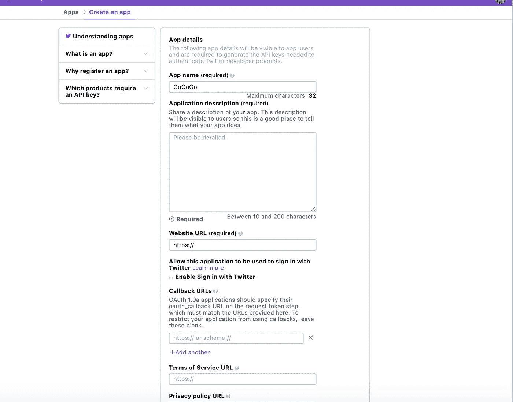
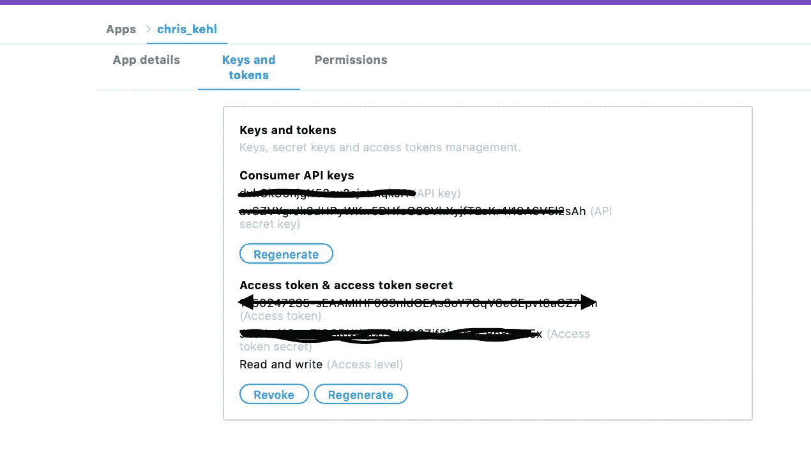
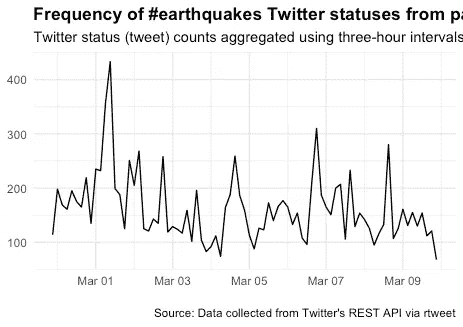
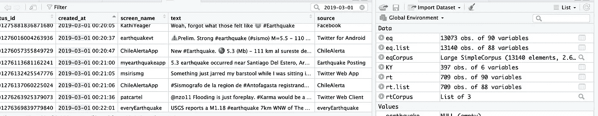
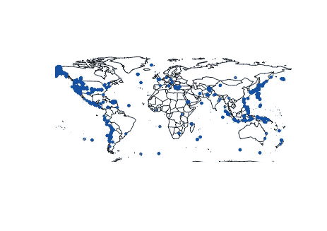

# 通过社交媒体定位自然灾害

> 原文：<https://towardsdatascience.com/locating-natural-disasters-through-social-media-feeds-with-r-7c8d3f078750?source=collection_archive---------17----------------------->


每天每时每刻我们都在利用数据。例如，现在当我写这篇文章时，我让网飞流从我观看的节目中检索和收集数据。我看着我在当地克罗格商店买的那瓶金峰减肥茶。为了获得我的燃料积分，我刷了一张卡，记录了我昨天的购物记录，包括那瓶茶。我的苹果 iphone 就坐在我旁边，等着我拿起来记录我的屏幕时间。我的特灵暖通空调恒温器就在我坐的椅子上方，监控着我家的舒适度。即使在我睡觉的时候，我的 fitbit 和 sleep number bed 也会监控我的睡眠模式。

大多数被挖掘的数据是为了个人健康和舒适，或者是企业向我们定制营销其产品的一种方式。数据还可以用于监测和预测地震、森林火灾、恶劣天气等自然灾害。2019 年 3 月 5 日，田纳西州 Maynardville 外仅 4 英里处发生了 3.4 级地震，这是一个我们通常不太听说地震的地区。这次地震发生在被称为南阿巴拉契亚地震带的断层线上，该地震带从阿拉巴马州东北部延伸到田纳西州东部和弗吉尼亚州西南部。这种情况启发我进入 Twitter API，把过去 9 天中所有与包含#地震的推文相关的推文拉下来。在这个故事中，我将提供使用 rStudio 和 R 编程语言下载 Twitter 数据的步骤。

如果你还没有下载 Twitter 数据的必要密钥，第一步就是创建一个账户。为此，请遵循以下步骤。

登录[https://developer.twitter.com](https://developer.twitter.com)网站。注册并创建一个帐户。拥有帐户后，请创建一个应用程序。



填写所有细节，创建一个应用程序名称，我用我的谷歌账户【https://myaccount.google.com/[的网址](https://myaccount.google.com/)。一旦你准确地填写这个，你就会收到你的钥匙。您需要提供一个电子邮件地址，以便 Twitter 可以验证您的地址。



请注意，这是我接收关键信息的地方，我用这些信息从 API 中提取数据。一旦我们得到了我们需要的密钥，我们就可以开始用 r 写代码了。

```
## install rtweet from CRAN
## install dev version of rtweet from github
devtools::install_github("mkearney/rtweet")# Install the following packages
install.packages(c("ROAuth", "plyr, stringr", "ggplot2","wordcloud"),dependencies=T)# hit enter and this is what you will see.
Restarting R session...> install.packages(c("ROAuth", "plyr, stringr", "ggplot2", "wordcloud"), dependencies = T)
Error in install.packages : Updating loaded packages
> install.packages(c("ROAuth", "plyr, stringr", "ggplot2", "wordcloud"), dependencies = T)
Warning in install.packages :
  package ‘plyr, stringr’ is not available (for R version 3.5.1)
trying URL '[https://cran.rstudio.com/bin/macosx/el-capitan/contrib/3.5/ROAuth_0.9.6.tgz'](https://cran.rstudio.com/bin/macosx/el-capitan/contrib/3.5/ROAuth_0.9.6.tgz')
Content type 'application/x-gzip' length 76740 bytes (74 KB)
==================================================
downloaded 74 KBtrying URL '[https://cran.rstudio.com/bin/macosx/el-capitan/contrib/3.5/ggplot2_3.1.0.tgz'](https://cran.rstudio.com/bin/macosx/el-capitan/contrib/3.5/ggplot2_3.1.0.tgz')
Content type 'application/x-gzip' length 3622365 bytes (3.5 MB)
==================================================
downloaded 3.5 MBtrying URL '[https://cran.rstudio.com/bin/macosx/el-capitan/contrib/3.5/wordcloud_2.6.tgz'](https://cran.rstudio.com/bin/macosx/el-capitan/contrib/3.5/wordcloud_2.6.tgz')
Content type 'application/x-gzip' length 229178 bytes (223 KB)
==================================================
downloaded 223 KB
```

现在我们将加载我们的库。注:当我加载我的库时，我把光标放在我想要加载的每个库之后，然后按回车键。

```
## load the package libraries
library(rtweet)
library(ROAuth)
library(plyr)
library(ggplot2)
library(wordcloud)
library(tm)# hit enter and you should see this
The downloaded binary packages are in
 /var/folders/fc/s97j11jn495g6l0k1ds7x2540000gn/T//RtmpbxuZuS/downloaded_packages
> ## load the package libraries
> library(rtweet)
> library(ROAuth)
> library(plyr)
> library(stringr)
Warning message:
package ‘stringr’ was built under R version 3.5.2 
> library(ggplot2)
> library(wordcloud)
Loading required package: RColorBrewer
> library(tm)
Loading required package: NLPAttaching package: ‘NLP’The following object is masked from ‘package:ggplot2’:annotate
```

接下来我将安装 devtools 包，如果它还没有安装的话。

```
## install devtools package if it's not already
if (!requireNamespace("devtools", quietly = TRUE)) 
  install.packages("devtools")# You should get something like this below
installing the source package ‘devtools’trying URL '[https://cran.rstudio.com/src/contrib/devtools_2.0.1.tar.gz'](https://cran.rstudio.com/src/contrib/devtools_2.0.1.tar.gz')
Content type 'application/x-gzip' length 388953 bytes (379 KB)
==================================================
downloaded 379 KB* installing *source* package ‘devtools’ ...
** package ‘devtools’ successfully unpacked and MD5 sums checked
** R
** inst
** byte-compile and prepare package for lazy loading
** help
*** installing help indices
*** copying figures
** building package indices
** installing vignettes
** testing if installed package can be loaded
* DONE (devtools)The downloaded source packages are in
 ‘/private/var/folders/fc/s97j11jn495g6l0k1ds7x2540000gn/T/RtmpbxuZuS/downloaded_packages’
```

好了，是时候检索 Twitter API 密钥了。我们将把它们放在 R 代码中，以便从 API 中访问和检索数据。

```
## access token method: create token and save it as an environment 
# Note put in your API, not the info below, it will not work.create_token(
  app = "chris_kehl",
  consumer_key = "dvkGkS6njqwiethinrg74bdt",
  consumer_secret = "av6ZVYgrJk8dHPqTrnTwirng",
  access_token = "12538373736-sEAAMIHF069nldOEAs3CY87eCEpvt8a4RCD9m",
  access_secret = "J5TEGT6rDtenrye9d2O6ZifSjwiAECRp8o9R5x")# hit enter and you will get this> ## access token method: create token and save it as an environment variable
> create_token(
+   app = "chris_kehl",
+   consumer_key = "dvkGkS6njqwiethinrg74bdt",
+   consumer_secret = "av6ZVYgrJk8dHPqTrnTwirng",
+   access_token = "12538373736-sEAAMIHF069nldOEAs3CY87eCEpvt8a4RCD9m",
+   access_secret = "J5TEGT6rDtenrye9d2O6ZifSjwiAECRp8o9R5x")
<Token>
<oauth_endpoint>
 request:   [https://api.twitter.com/oauth/request_token](https://api.twitter.com/oauth/request_token)
 authorize: [https://api.twitter.com/oauth/authenticate](https://api.twitter.com/oauth/authenticate)
 access:    [https://api.twitter.com/oauth/access_token](https://api.twitter.com/oauth/access_token)
<oauth_app> chris_kehl
  key: dvkGkS6njqwiethinrg74bdt   
  secret: <hidden>
<credentials> oauth_token, oauth_token_secret
```

是时候检索包含#地震信息的 twitter 数据了。

```
## search for 18000 tweets using the rstats hashtag
eq.list <- search_tweets(
  "#earthquake", n = 18000, include_rts = FALSE
)# output will be something like this> ## search for 18000 tweets using the rstats hashtag
> eq.list <- search_tweets(
+   "#earthquake", n = 18000, include_rts = FALSE
+ )
Downloading [===================================>-----]  88%
>
```

为了进行分析，我们将对刚刚检索到的数据进行格式化。

```
# Create a Corpus
eqCorpus <- Corpus(VectorSource(eq.list$text))# set up stemming
eqCorpus <- tm_map(eqCorpus, stemDocument)# output will be something like this> # Create a Corpus
> eqCorpus <- Corpus(VectorSource(eq.list$text))
> # set up stemming
> eqCorpus <- tm_map(eqCorpus, stemDocument)
Warning message:
In tm_map.SimpleCorpus(eqCorpus, stemDocument) :
  transformation drops documents
```

现在让我们来绘制过去九天中收到的推文。

```
## plot time series of tweets
ts_plot(eq.list, "3 hours") +
  ggplot2::theme_minimal() +
  ggplot2::theme(plot.title = ggplot2::element_text(face = "bold")) +
  ggplot2::labs(
    x = NULL, y = NULL,
    title = "Frequency of #earthquakes Twitter statuses from past 9 days",
    subtitle = "Twitter status (tweet) counts aggregated using three-hour intervals",
    caption = "\nSource: Data collected from Twitter's REST API via rtweet"
  )# Output will look like this 
> ## plot time series of tweets
> ts_plot(eq.list, "3 hours") +
+   ggplot2::theme_minimal() +
+   ggplot2::theme(plot.title = ggplot2::element_text(face = "bold")) +
+   ggplot2::labs(
+     x = NULL, y = NULL,
+     title = "Frequency of #earthquakes Twitter statuses from past 9 days",
+     subtitle = "Twitter status (tweet) counts aggregated using three-hour intervals",
+     caption = "\nSource: Data collected from Twitter's REST API via rtweet"
+   )
```

我们要分析的情节是:



我们可以分析我们的频率图，看看我们有什么类型的活动。正如所指出的那样，田纳西州在 2019 年 3 月 5 日发生了地震，我们的峰值有所增加，但没有 3 月 1 日那么多。



我们可以搜索检索到的数据，看到一些震级为 5.5、5.3 级的地震活动。通过滚动数据，我们可以看到从阿根廷一直延伸到阿拉斯加的地震。我们现在将绘制最活跃推文的经度和纬度。

```
## create lat/lng variables using all available tweet and profile geo-location data
eq <- lat_lng(eq.list)## plot state boundaries
par(mar = c(0, 0, 0, 0))
maps::map("world", lwd = .90)## plot lat and lng points onto world map
with(eq, points(lng, lat, pch = 20, cex = .75, col = rgb(0, .3, .7, .75)))
```

我们运行我们的代码，看到我们的世界图。



从我们的图中，我们可以看到来自加利福尼亚和田纳西的活动。这是大多数 twitter 信息的来源。我们可以查看检索到的数据来分析地震的严重程度。

## 概括起来

我们可以使用数据来分析任何事情，从谁在网飞上传什么内容，到我们的 iphone 用户每天看屏幕的时间。但是，如果我们可以分析推文来拯救生命，或者向有需要的人提供必要的资源，那又会怎么样呢？在这个故事中，我们通过绘制推特的频率和世界地图上的点来分析地震活动。我们可以通过图中所示的推文频率来分析进一步调查的必要性。我们可以使用我们的示例代码来分析其他灾难，例如叙利亚难民危机、与俄罗斯入侵克里米亚有关的公众情绪，以及监视恶劣天气期间发生的情况。可能性是无穷的，只要把#地震改成#救命！，#克里米亚，#下一场灾难。也许我们可以用这些数据来拯救生命，或者创造改变。请跟随我来到 https://www.medium.com/@chris.kehl 的第二部分。