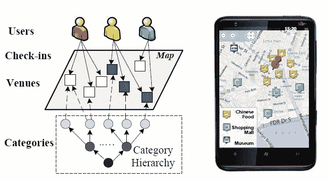
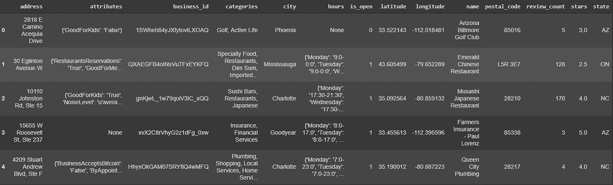
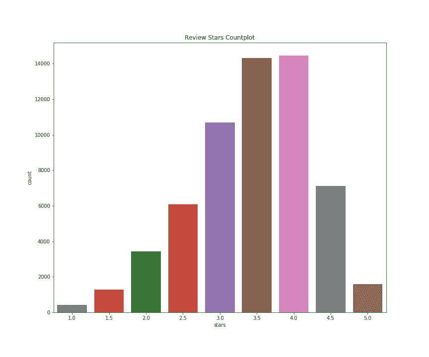
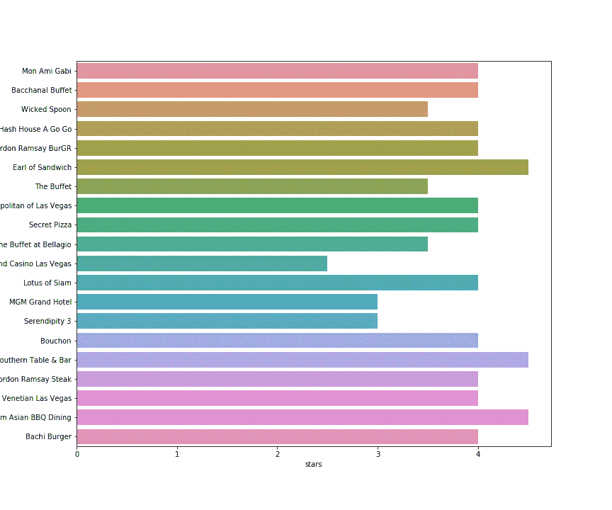
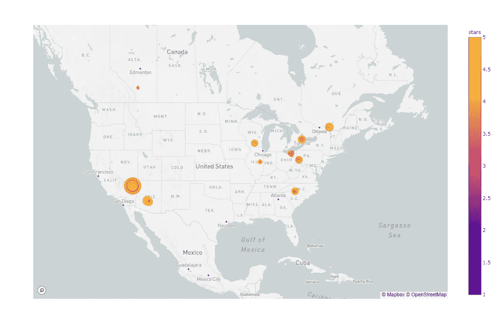
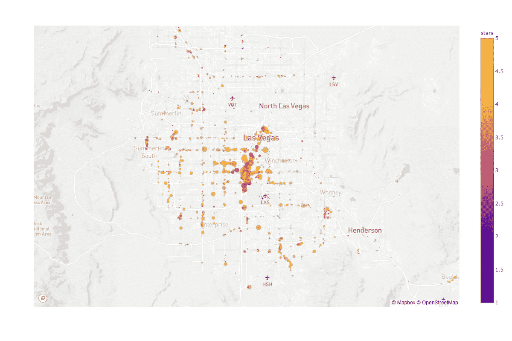
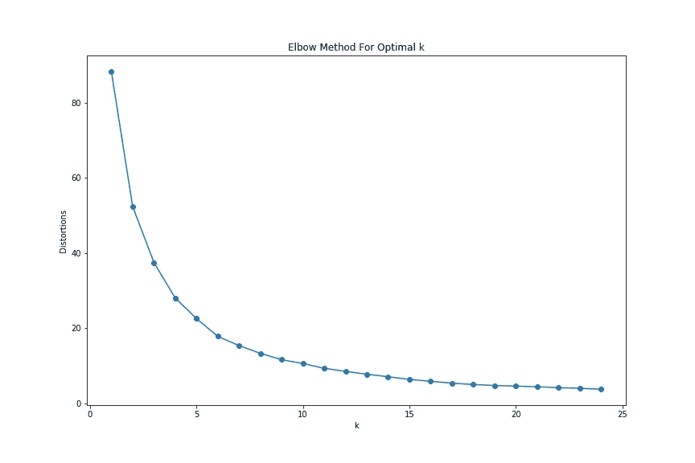
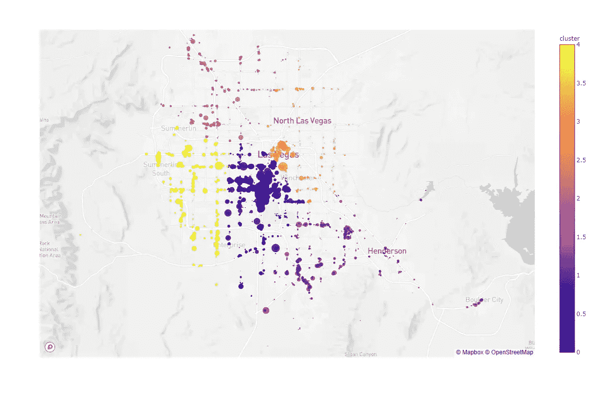
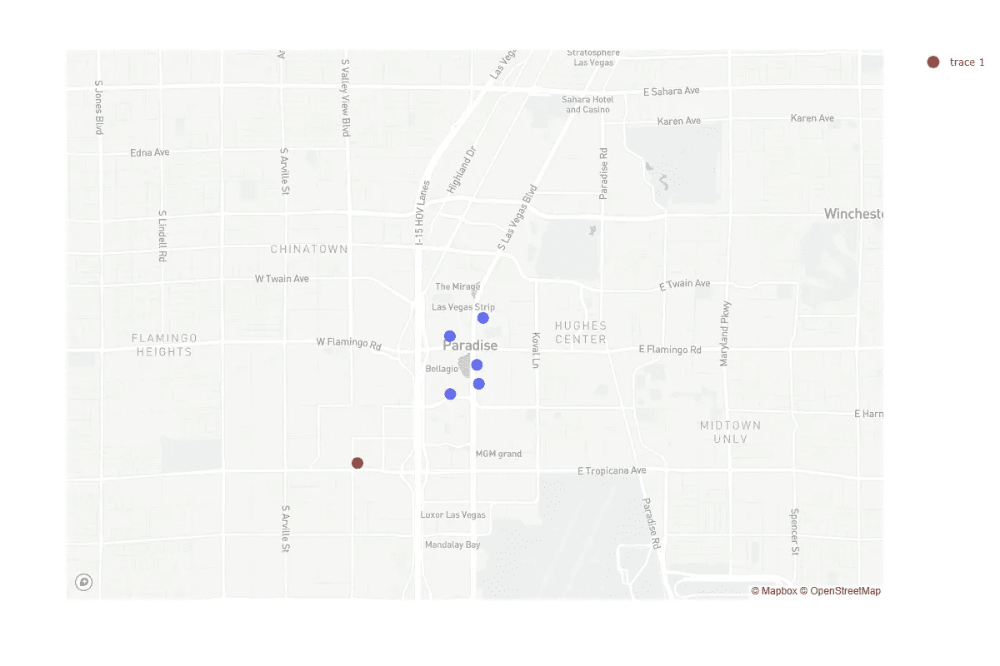
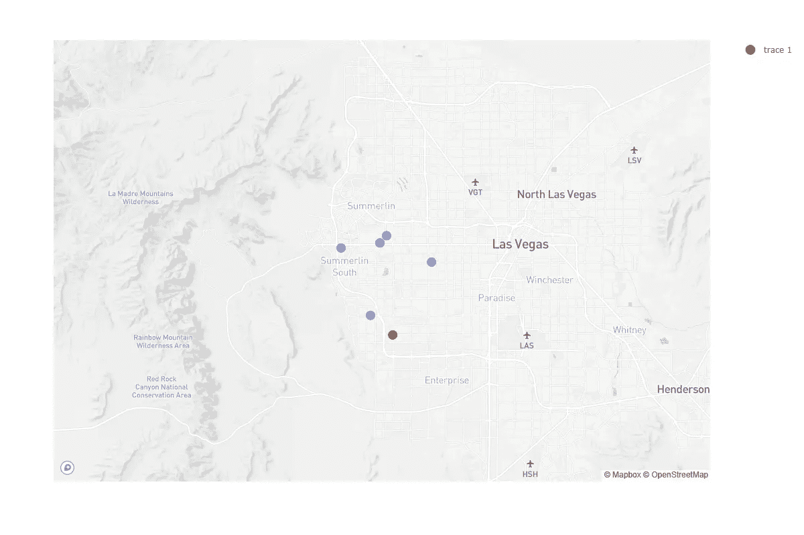

# 基于位置的推荐

> 原文：<https://towardsdatascience.com/location-based-recommendations-bb70af7b1538?source=collection_archive---------7----------------------->

## 使用机器学习创建基于位置的推荐器。

Location-based recommendation — Source [Microsoft](https://www.microsoft.com/en-us/research/publication/location-based-and-preference-aware-recommendation-using-sparse-geo-social-networking-data/).

推荐系统在不同的应用中被广泛用于预测用户对产品或服务的偏好或评级。在过去的几分钟或几个小时里，你很可能在网上遇到过某种类型的推荐系统或与之互动过。甚至这篇文章可能已经被媒体或其他渠道通过推荐系统推荐给你了。

这些推荐系统可以有不同的类型，其中最突出的包括基于内容的过滤和协同过滤。在本文中，我们将研究基于位置的推荐，其中我们特别关注地理位置，以便利用用户的位置提供更相关的推荐。

为了说明基于位置的推荐器的关键方面，我们将使用 K-Means 算法和来自 Kaggle 的 [Yelp 数据集](https://www.kaggle.com/yelp-dataset/yelp-dataset)来执行一个简单的基于位置的推荐。这些数据来自 JSON 文件，可以很容易地用 pandas 读取。

下表显示了数据集的前 5 行。在该表中，业务坐标可用于每个业务的评级星和评论数。

Yelp Dataset

## 探索性数据分析(EDA)和预处理

在本节中，我们将探索和预处理数据集。该数据集包含 yelp 用户的评论，并包括许多类别。为了简化我们对推荐模型的分析和解释，我们将把重点放在餐馆上，您可以随意选择您感兴趣的任何其他类别。

我们首先通过过滤包含单词“餐馆”的所有企业来创建餐馆数据框架。然后，我们绘制餐厅的星级分布图，从 1 到 5。该图清楚地显示，大多数餐厅都有 4.0 或 3.5 星，而只有一小部分餐厅有 5.0 星。

Stars — Countplot

让我们还基于`review_count`和`stars`的组合创建一个排序的数据框架，并可视化数据集中的前 20 家餐馆。

这里的选择是不仅根据`**stars**`对餐馆进行排序，还根据餐馆有多少评论进行排序。这是数据集中排名前 20 的餐厅的图表。

Top 20 restaurants — Fix the plot

最后，在我们进入 K-Means 聚类和基于位置的推荐之前，让我们也探索一下这些餐馆的位置，并想象成一张地图。我们将使用 Plotly Express 库，它提供了一种灵活而简单的方法来绘制带有漂亮底图的地理数据。

正如您在下面的地图中所看到的，该数据集并不完整，仅包含美国和加拿大的几个城市。

Map of the Restaurants in the dataset

为了定制我们的推荐系统，我们将只关注内华达州的拉斯维加斯，它在这个数据集中拥有最多的餐馆。

我们为拉斯维加斯的所有餐馆创建了一个缩放地图。下面你可以看到拉斯维加斯所有餐馆的地图。地图的颜色基于餐厅的星级数，而大小则表示该特定餐厅的评论数。正如你所看到的，高等级的餐馆聚集在市中心。

## k 均值聚类

在执行 K-Means 聚类算法之前，让我们首先确定数据集中的最佳聚类数。这里我们使用一种叫做肘法的技术。

肘方法有助于我们确定合适的聚类数。这并不能给出准确的聚类数，但可能有助于选择聚类数。从下图可以看出，它有多个弯头。

Elbow method K-Means Clustering

借助于肘方法，我们选择 5 个聚类，并在坐标上执行 K-Means 聚类算法。我们还在`lasVegas`数据帧中填充了一个新列。

最后，我们根据 K-Means 算法创建了一个聚类散点图。该图清楚地显示了具有 5 个聚类的算法的输出。

K-Means clustered points

## 基于位置的推荐

在这一节中，我们将把 K-means 聚类和餐馆评级结合在一起，根据用户的位置推荐餐馆。让我们首先创建一个基于评论数和星级数的 LasVegas 餐馆分类数据框架。我们称之为数据帧`top_restaurants_lasVegas.`

我们准备创建一个基于用户位置推荐餐馆的功能。我们创建了一个基于用户位置推荐餐馆的功能。

这里，我们的函数将获取纬度和经度以及数据帧。该函数首先预测坐标属于哪个聚类，并将数据帧进一步限制到该聚类，并返回该聚类中的前 5 家餐馆。

这个函数很简单，只需要坐标，但我们可以进一步发展，接受其他输入，如地址或邮政编码。这需要一些地理编码应用程序，所以现在这足以说明基于位置的推荐的威力。在使用我们的推荐函数之前，让我们创建一个测试数据框架。

现在，我们可以使用我们的推荐功能，将数据框架中的任何用户作为输入，来测试我们简单的基于位置的推荐的功能。记住这个测试数据只是为了方便，推荐函数直接接受任何给定的坐标。

对于第一个用户，K-Means 算法预测该聚类，并提取该聚类的前 5 家餐馆并推荐它们。红点是用户位置，蓝点是推荐餐厅。

User 1 Red and Recommended Restaurants Blue

让我们再举一个例子，在这个例子中是用户 3。同样，我们的“推荐餐馆”功能预测该用户所属的聚类，并找出该聚类中的前 5 家餐馆。

## 结论

在本教程中，我们使用 Yelp 数据集演示了 python 基于位置的推荐。我们用餐馆展示了一个基于位置的推荐应用程序。我们的推荐系统使用基于餐馆坐标的 K-Means 聚类，并且只考虑餐馆的评级(评级数量和星级)来推荐餐馆。我们也可以考虑餐馆的类型来定制推荐。这也可以进一步发展，以纳入其他输入方法，如地址或邮政编码。最后，我们的推荐没有明确考虑用户和推荐餐馆之间的距离，尽管 K-means 聚类限制了推荐餐馆的范围。

本教程的笔记本可以在这个 Github 资源库中找到。

 [## shaka som/基于位置的建议

### 推荐系统在不同的应用中被广泛用于预测用户的偏好或评级…

github.com](https://github.com/shakasom/location-based-recommendations/blob/master/README.md)