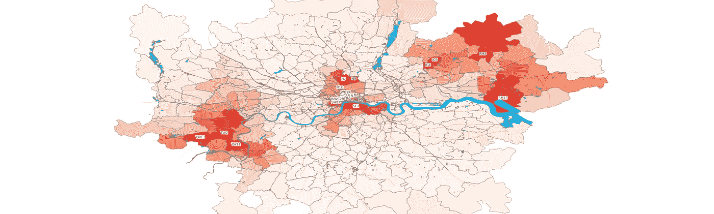
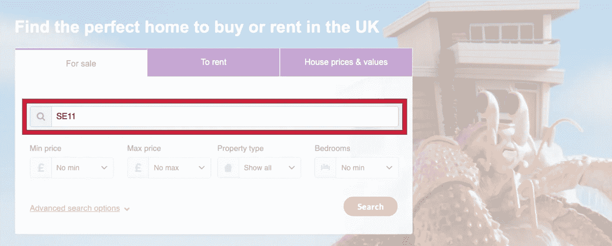
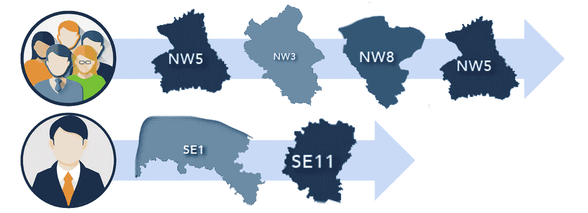
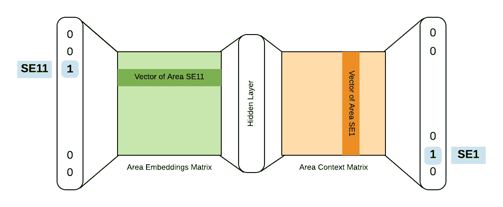
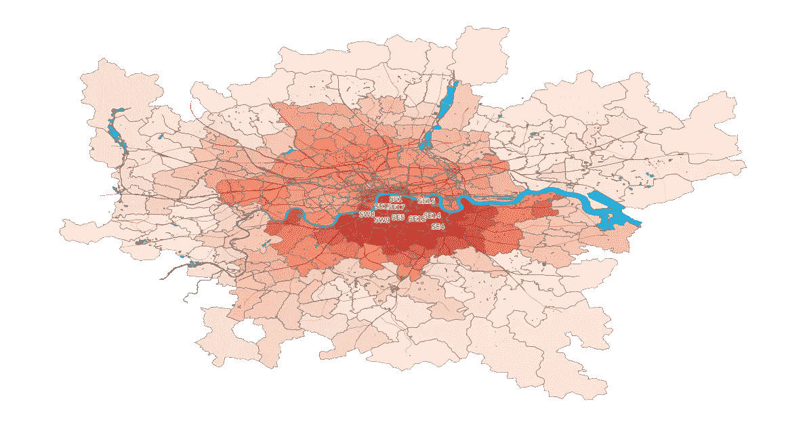
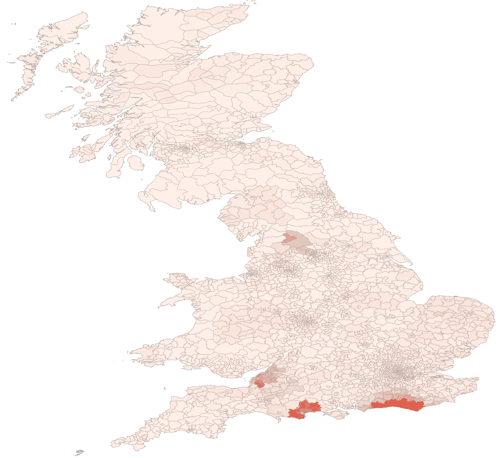
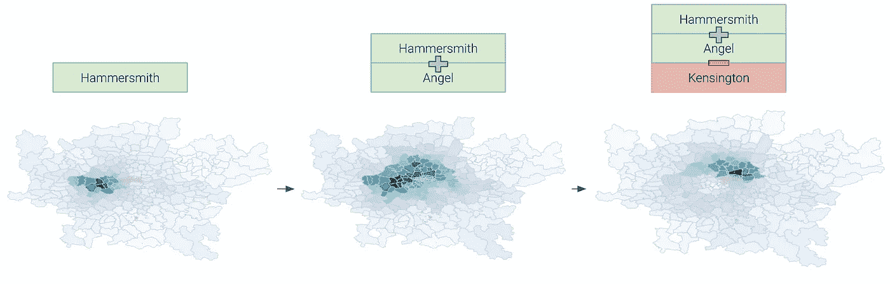
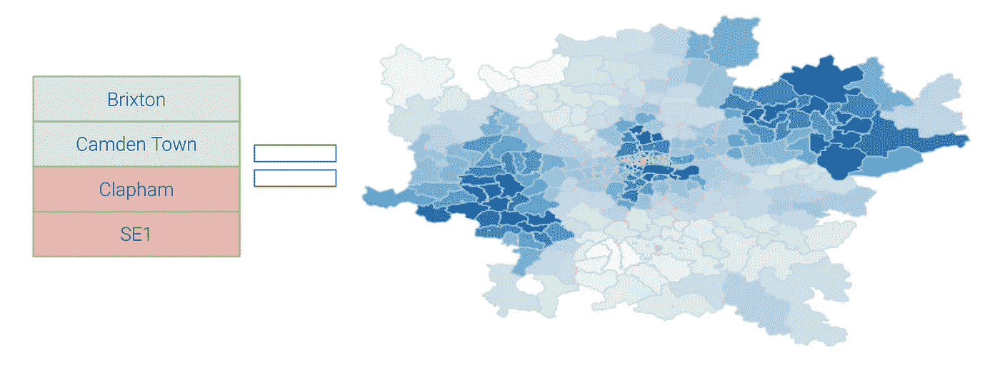

# 位置位置位置

> 原文：<https://towardsdatascience.com/location-location-location-ec2cc8a223b1?source=collection_archive---------16----------------------->



## 如何使用机器学习和一点黑魔法来创建地理区域嵌入？

Zoopla.co.uk 之旅主要集中在地理区域:这是 Zoopla 搜索的唯一强制输入。消费者在他们的 Zoopla 搜索中引用了许多独特的地理区域，准确地说是去年的 32，237 个**。**

强烈希望更好地了解所有这些领域，并围绕**区域发现**和**区域比较**等领域打造更好的产品。但是你如何描述和比较 32237 个地理区域呢？一个地区的哪些特征是相关的，你如何以可靠和可比较的方式收集所有这些数据？不可能的！或者是？

数据科学可以将机器学习和一点黑魔法应用于许多问题。我们的解决方案:让我们直接从 Zoopla 的搜索数据中提取一个区域的相关特征及其值。

我们所需要学习的任何地理区域的描述是一个惊人的简单的数据点。消费者在 Zoopla 搜索中引用的地理区域序列。



zoopla.co.uk property search

使用 Zoopla 搜索的消费者有不同的需求和优先考虑。他们还对不同的地理区域以及他们是否适合租房或买房有所了解。消费者以他们在搜索中参考地理区域的顺序来表达这种知识。**搜索序列不是随机的，因此我们可以在机器学习的帮助下提取区域描述。**



Zoopla.co.uk area search sequences (pixabay )

我们部署的模型被称为 **Skip-Gram** ，这是一个试图预测搜索序列的神经网络。该模型使用机器学习来学习区域的**描述(称为嵌入)和搜索序列(上下文矩阵)内区域**的**上下文。**

区域描述(嵌入)包含区域的可负担性或交通联系等信息。一个区域的上下文描述了一个区域与其他区域相比如何基于消费者在他们的搜索序列中表达的需求和目标。

综上所述，Skip-Gram 模型根据**目标区域描述和消费者搜索环境**预测 Zoopla 搜索中的区域顺序，例如年轻的专业人士或有孩子的家庭。



Area Skip-Gram Model

我们用超过 1 亿多个独特的搜索序列来训练神经网络。如下图所示，区域嵌入本身就很有用。此外，嵌入是一种非常有用的方法，可以对分类变量进行编码，以便在其他模型中使用，例如 Zoopla 的推荐引擎。在另一篇博客文章中有更多关于如何构建推荐引擎的内容。

# 结果:

该模型允许我们根据相似性来比较区域，例如，这是伦敦 out 代码与 SE11 的相似性，用于**租赁**一处房产:



area similarity to London SE11 for renting a property

这张地图显示了**购买**房产的类似地区:



Great Britain area similarity to Brighton for buying a property

伯恩茅斯地区与布莱顿非常相似，这并不奇怪:例如，这两个城市都有大型大学。滨海韦斯顿也一样。这三个地区都有通往伦敦的像样的铁路。布拉德福德地区可能是一个更令人惊讶的结果，但布拉德福德也有一所大学，并因靠近利兹和曼彻斯特而获得了额外的相似性。

# 区域数学的乐趣！

因为机器学习模型给了我们客观的区域数学描述，没有什么能阻止我们做一些区域数学！



搜索哈默史密斯+安吉尔-肯辛顿，我们会看到肖尔迪奇、哈克尼、霍克斯顿和伦敦机场。

另一个例子:有哪些地区与布里克斯顿和卡姆登镇相似，但与克拉彭和 SE1 不同？**这种比较是对中产阶级化、支付能力和交通联系的玩弄。**



肯特郡是一个直观的结果。西部的费尔瑟姆和特威肯汉姆是正在经历大规模中产阶级化的廉价地区。东边的 Rainham 被认为是梅德韦镇中最负盛名的，像布里克斯顿和卡姆登镇一样有当地的感觉，并且有极好的交通联系。罗姆福德也有很好的联系，并经历了大量的重新开发，预计跨铁路的到来。

# 信用和来源:

伦敦外部代码形状文件可从位于 https://data.london.gov.uk/[的伦敦数据存储中获得](https://data.london.gov.uk/)，铁路和河流的形状文件可从 OpenStreetMap.org 获得，并可从[http://download . geofabrik . de/Europe/great-Britain/England/greater-London . html](http://download.geofabrik.de/europe/great-britain/england/greater-london.html)下载

英国邮政编码形状文件可以从[https://www.opendoorlogistics.com/data/](https://www.opendoorlogistics.com/data/)和

*   包含皇家邮政数据皇家邮政版权和数据库权利 2015
*   包含国家统计数据皇冠版权和数据库权利 2015。

所有图像都是用 [GeoPandas](http://geopandas.org/) 创建的，并由-NC-SA 4.0 授权 [CC，代码如下:](https://creativecommons.org/licenses/by-nc-sa/4.0/)

```
import geopandas as gpd
import matplotlib.pylab as plt
import matplotlib.patheffects as PathEffectssimilarity_scores = compute_cosine_similarities(area_embedding_vectors, se11_embedding_vector)geo_df_outcodes = gdp.read_file("path/to/out-code-shapefile.shp")
geo_df_railways = gdp.read_file("path/to/osm-shape-files/gis_osm_railways_free_1.shp")
geo_df_water = gdp.read_file("path/to/osm-shape-files/gis_osm_water_a_free_1.shp")geo_df_outcodes.join(similarity_scores).plot(
     column="score", cmap='Reds', linewidth=0.8, ax=ax, alpha=0.8,
     edgecolor='0.5', vmin=0, vmax=1, ax=ax
)
geo_df_railways.plot(alpha=1, edgecolor='0.2', ax=ax, color='black', linewidth=0.1)
geo_df_water.plot(alpha=1, edgecolor='0.5', ax=ax, color='deepskyblue', linewidth=0.8)labels = similarity_scores.nlargest(10, "score").reset_index()['name'].to_list()similarity_scores.apply(
    lambda x: ax.annotate(
        s=x.name, xy=x.geometry.centroid.coords[0], ha='center'
    ).set_path_effects([PathEffects.withStroke(linewidth=2,    
          foreground='w')]
    ) if x.name in labels else None,
    axis=1
)plt.axis('off')
```


Jan 是公司数据转型方面的成功思想领袖和顾问，拥有将数据科学大规模应用于商业生产的记录。他最近被 dataIQ 评为英国 100 位最具影响力的数据和分析从业者之一。

**在 LinkedIn 上连接:**[**【https://www.linkedin.com/in/janteichmann/】**](https://www.linkedin.com/in/janteichmann/)

**阅读其他文章:**[**https://medium.com/@jan.teichmann**](https://medium.com/@jan.teichmann)