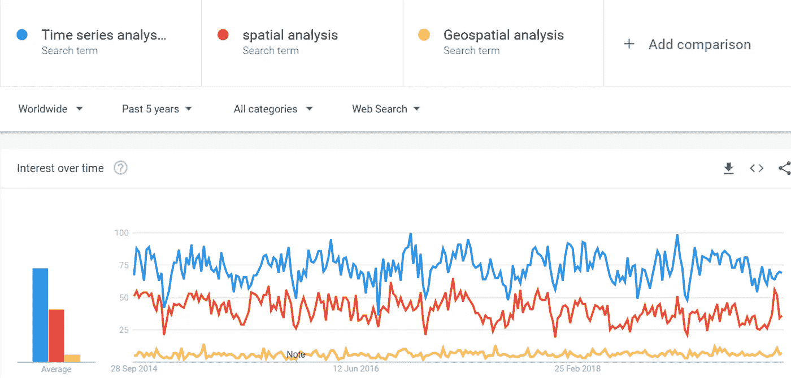

# 位置，位置，位置！在数据科学中

> 原文：<https://towardsdatascience.com/location-location-location-in-data-science-fa9ebc046c95?source=collection_archive---------29----------------------->

## 我们如何接受数据科学中的位置组件？它只是数据集中的另一列吗？或者空间是特殊的。

Photo by [NASA](https://unsplash.com/@nasa?utm_source=medium&utm_medium=referral) on [Unsplash](https://unsplash.com?utm_source=medium&utm_medium=referral)

位置，位置，位置！

你已经听过很多次了。这是房地产界的一个普遍说法。这也适用于数据科学吗？我们如何接受数据科学中的位置组件？它只是数据集中的另一列吗？或者空间是特殊的。

位置数据(大数据)无处不在，因为我们每天都在创建海量的地理数据，从推文和地理标记图像到智能手机跟踪服务。然而，在数据科学中，位置组件并没有深入融入主流。在本文中，我强调了这些松散集成的位置数据科学的一些方面，以及建立紧密集成系统的潜力。

## 时间序列与位置数据

要意识到我们将位置视为数据科学中的一个补充栏目，只需看看 Kaggle 平台。

为了说明我的观点，让我们来比较两个密切相关的概念:空间和时间。我猜你已经熟悉时间序列分析了。它通过分析一段时间内的序列或预测未来值来提取信息。

> 即使在空无一物的空间里，时间和空间依然存在。肖恩·卡罗尔

我们都更喜欢数据和事实，所以我在 Kaggle 中搜索了这三个词:“时间序列”、“地理”和“地理空间”。结果一点也不意外。

截至 2019 年 10 月 27 日，在 Kaggle 中搜索时间序列将返回 430 个数据集和 1149 个笔记本。

Time series Kaggle

另一方面，地理搜索产生了几乎相同的数据集编号 391，但看看笔记本和竞赛结果。与时间序列中的 1149 个笔记本相比，包含地理单词的笔记本只有 45 个，如下所示。

你可能会说这些结果不具有普遍性或者有点狭隘，毕竟 Kaggle 只是数据科学项目的一个平台。因此，我查看了谷歌趋势，结果显示了类似的模式——地理数据分析覆盖范围更少，时间序列分析更多，如下所示。

Google Trends

越来越清楚的是，位置数据只是数据集中的另一列，我们通常谨慎地处理它，或者从我们的分析中完全删除它。让我们看看这种超然的原因。

## 断开位置数据科学

空间数据科学不仅产生漂亮的数据可视化，即地图，而且产生大量的空间思维视角。通过空间分析获得的洞察力为许多应用提供了丰富且无与伦比的洞察力。然而，一些挑战阻碍了将位置组件完全纳入数据科学。

尽管位置数据很重要，但我们今天看到数据科学和地理空间组件之间的融合较少。这是为什么呢？

除了一些例外，空间部分在主流数据科学中大多被忽略。一个很好的例子是，位置组件是如何嵌入深度学习应用程序中的，而无需关注空间方面。即使是卫星图像中的大多数深度学习应用，一旦我们将它们输入神经网络，也会失去空间部分。

此外，位置分析和数据科学**有很大的重叠，但在很长一段时间内没有联系**。一个早期的例子是约翰·斯诺的霍乱分析。随着 1854 年伦敦霍乱的爆发，约翰·斯诺绘制了死亡的地理位置图，并在两个水源发现了一群死亡病例。可以说，这是最早记录的数据科学和数据分析案例之一。

空间数据科学教授吕克·安瑟林最近将这种脱节称为**“空间怀疑主义”。**他反映说，大数据和机器学习社区中的许多人仍然不相信将空间视角紧密集成到数据科学中的重要性，就像 John snow 的霍乱分析一样。

另一个主要障碍是由于历史文物。处理地理数据在计算上很困难，但现在不再是这样了。如今，空间数据库的主流集成以及操作大地理信息的工具已经出现。例如，谷歌的 BigQuery 就包含了 GIS 功能。

此外，很少有应用程序和项目从简单的位置整合到数据科学中，转向完全集成的地理数据科学。Spatial Hadoop 和最近发布的[Cu spatial](https://github.com/rapidsai/cuspatial)——使用 NVIDIA [RAPIDS](https://rapids.ai/index.html) DataFrame 库在 GPU 上加速——只是一些进步。

## 走向地理数据科学

地理数据科学是明确关注数据科学的位置(空间)部分的学科。它带来了数据科学领域中特定于地理数据的理论、概念和应用。我们都知道东西在哪里以及如何进入它们的重要性，这影响到从商业物流、运输、气候变化到与选址决策相关的一切。

我认为是时候超越数据科学和位置组件之间的脱节了。我们需要认识到，将数据可视化为地图并不等同于空间数据科学。正如贾维尔·德·拉·托雷上周在空间数据科学会议上所说，是时候从在地图上可视化数据转向使用地图分析数据了。

我对空间数据科学充满热情，如果你喜欢讨论空间数据科学，可以在 Twitter 上通过@shakasom 与我联系。