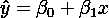
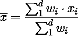

# 黄土

> 原文：<https://towardsdatascience.com/loess-373d43b03564?source=collection_archive---------2----------------------->

## 使用局部回归平滑数据

Photo by [Vinícius Henrique](https://unsplash.com/@x_vinicius?utm_source=medium&utm_medium=referral) on [Unsplash](https://unsplash.com?utm_source=medium&utm_medium=referral)

如果你对一个物理现象产生的数据进行采样，你会得到噪音。测量信号的传感器会将噪声添加到信号中，或者噪声是产生数据的过程固有的随机性。最近，我不得不处理一个由汽车引擎产生的噪音数据流，并需要找出一种方法来过滤噪音。由于信号产生过程的物理性质，采样频率不是恒定的，因此排除了任何基于频率的噪声滤波技术。我需要找到一种方法来滤除噪声，并重建信号以供进一步处理。

为了从测量的噪声中恢复信号，我们必须首先对噪声是如何产生的做一些假设。从统计学的角度来说，这意味着我们必须假设噪声的某种分布，即噪声产生的数学描述。最常见的假设包括根据[高斯分布](https://en.wikipedia.org/wiki/Gaussian_noise)产生的随机噪声、将噪声添加到信号中的加性模型，以及独立于 ***x*** 的误差项，如下所示:

Additive noise

顺便提一下，这与线性回归模型通常假设的噪声模型完全相同。这里的噪声模型是这样的:

The linear regression noise model

从某种意义上说，通过将模型拟合到您的数据，您正在尝试从通过数据方差实现的测量噪声中恢复潜在信号。

那么，我应该用线性回归来平滑信号吗？如果信号本身可以用一个线性函数来建模，这个函数可能包含非线性项，那么答案是肯定的。但在这个特定的场景中，我将处理一个高度非线性的信号，它反映了一个配送工具的日常操作:大量的平坦周期夹杂着可变长度的纯粹疯狂周期。用单一的线性回归模型处理整个信号是不可能的。但是…

如果我不使用同一模型处理整个信号，而是使用同一类型的不同模型来平滑信号的小区域和局部区域，会怎么样？为什么不把这个想法进一步发展，为我们需要平滑的每个点考虑一个专门的模型呢？

# 考虑当地情况

看我的锦囊妙计，发现一个老朋友:[黄土](https://en.wikipedia.org/wiki/Local_regression) *—局部加权运行线平滑器*。这是非参数平滑器，尽管它的核心使用线性回归。与任何平滑器一样，该算法的思想是从噪声样本中恢复固有信号。

那么黄土是怎么起作用的呢？让我们从一个像下面这样的噪声信号开始。

Noisy signal

这是一个合成生成的正弦波，带有附加的高斯噪声。正弦波以红色绘制，而噪声样本显示为蓝点。为了模拟不规则采样的信号，从均匀分布中随机采样 ***x*** 值，并适当缩放。使用添加了高斯噪声的正弦函数来计算相应的 ***y*** 值。

那么我们如何从蓝点到红线的近似值呢？首先，将红线视为一个有序的等间距 ***x*** 值序列，在本例中位于 **0** 和 **2π** 之间。对于这些值中的每一个，选择采样点的适当邻域，并将它们用作线性回归问题的训练集。使用生成的模型，估计您的点的新值。让我们更详细地探讨一下这个想法

# 黄土背后的理念

该算法以逐点方式估计潜在函数。对于 ***x*** 的每一个值，我们通过使用其相邻的采样(已知)值来估计 ***f(x)*** 的值。这非常类似于 [*KNN*](https://en.wikipedia.org/wiki/K-nearest_neighbors_algorithm) 算法，其中 ***k*** 、窗口大小是可调参数，并且在这种特定情况下，将确定所得估计的平滑度。从某种意义上来说， ***k*** 就是你的偏向 *vs* 。方差旋钮。 ***k*** 的大值将导致更高的偏差，而低值将导致更高的方差。

第一步是收集我们想要估算的*的值 ***x*** 。姑且称这些***x’***和***y’***。通过给黄土算法输入***【x’***，并使用采样的 ***x*** 和*y 值，我们将获得一个估计值***【y’***。从这个意义上说，黄土是一种非参数算法，必须使用所有数据集进行估计。**

**既然我们有了***x’***，我们必须使用简单的[欧几里德距离](https://en.wikipedia.org/wiki/Euclidean_distance)找到它的 ***k*** 最近邻。让我们把产生的有序集称为 *D* 。**

**下一步将集合 ***k*** 距离的集合 *D* 转换为有序集合 *W* ，该集合包含稍后将在线性回归过程中使用的权重。使用专门的权重函数来计算这些权重，该权重函数根据其到***x’***的距离来为*的每个 ***k*** 邻居分配重要性。***

# **权重函数**

**使用三次函数计算距离权重:**

****

**Tri-cubic weighting function**

**该函数看起来像一顶帽子，仅在 **-1** 和 **1** 之间有正值。在这个区间之外，函数为零。该函数如下所示:**

****

**Graph of the tri-cubic weight function**

**由于该函数仅对-1*<****x****<*1 有正的结果，我们必须通过将距离除以在 *D* 中观察到的最大值来归一化距离。更具体地说，**

****

**Weighting function**

**在这里，我们将 ***d(x，x')*** 表示为*x***k***最近邻之一与 ***x'*** 之间的距离。标准化的效果是距离越大，权重越低。在极端情况下，与最大距离对应的点的权重为零，距离为零的点的权重可能最高，为 1。这就是“ *locality* ”效果是如何实现的，方法是为最接近我们想要计算预测的位置的训练数据分配更高的重要性。***

**顺便提一下，你可能会发现这个函数与[三次核](https://en.wikipedia.org/wiki/Kernel_(statistics)#Kernel_functions_in_common_use)函数有惊人的相似之处。这些函数之间的规模差异(70/81)与核函数必须在其域上积分的要求有关，而这里的要求是宽松的。**

**我们现在准备使用简单的加权线性回归来计算估计值，该回归使用来自 *D* 的 ***x*** 值以及相应的 ***y*** 值进行训练。**

# **线性回归**

**线性回归是监督机器学习方法的基础。很有可能，你开始了你的 ML 之旅，学习这种方法的内部原理，考虑到波特兰家庭的物理特征，你可能试图计算出他们的销售价格。或者完全是别的原因，但你知道该怎么做，不是吗？**

**碰巧的是，线性回归的一个特殊版本，加权线性回归，是黄土的核心。对于我们开始估计的每个点(***【x’***)，黄土算法必须建立一个线性回归模型，该模型将计算相应的输出(***【y’***)，使用***【k】******【x’***的最近邻居和一组对其重要性进行评级的权重。**

**局部线性回归通常模拟低维多项式、直线或二次多项式。**

****

**The first-degree regression equation**

****

**The second-degree regression equation**

**加权线性回归是一个已知的问题，在网上有大量的记录。由于要解决的问题的典型低维数，我们将求助于闭合形式的正规方程进行参数估计。在未加权的情况下，这些方程是:**

****

**Normal equations for linear regression**

**Were *beta* 是线性参数的向量，X 是包含所有 X 个观测值的矩阵，排列如下:**

****

**The X matrix**

**具体地说，这个矩阵用 ***n*** 维数和 ***m*** 观测值对样本建模。请注意，我在矩阵的第一列中包含了截距项。对于我们对二次多项式建模的情况，这个矩阵实际上是:**

****

**Second-degree X matrix**

**一旦我们有了β向量，就可以使用下面的等式来计算新的值 ***y*** :**

****

**将这一概念扩展到使用权重实际上非常简单，正常方程只需要一个额外的项:**

****

**Weighted normal equation**

**这里，权重矩阵 *W* 在对角线上具有所有计算的权重，所有其他元素被设置为零。不幸的是，正如您将在实现的 Python 代码中看到的，矩阵方法可能有点慢。如果您坚持一级模型，可以使用更简单的数学方法采取替代方法:**

****************

**看起来很复杂，但通过使用向量的内积来消除显式求和，实现要简单得多。批注注: ***d*** 代表 *D* 中的项数，实际上是 ***k*** 。**

**继续编码。**

# **Python 库**

**您可以在 [StatsModels](https://www.statsmodels.org/dev/generated/statsmodels.nonparametric.smoothers_lowess.lowess.html) Python 包中找到这个平滑器的实现。通读方法文档，您会看到 **lowess** 函数返回一个与两个输入数组( ***x*** 和 ***y*** )维数相同的数组。这意味着只有观察值是平滑的，所以如果你需要中间的任何其他值，你将不得不以某种方式对它们进行插值。但是事情不应该是这样的。**

# **Python 实现**

**对于本文，我开发了一个基于 [NumPy](https://www.numpy.org/) 的新实现，它利用了它的矢量化特性，代码可以在这个 [GitHub 库](https://github.com/joaofig/pyloess)中找到。开发代码时考虑了矢量化，函数中只有一个循环来确定最接近值的索引。让我们浏览一下代码，看看它是如何工作的。**

**三次加权函数是完全矢量化的，它处理 ***x*** 值的数组。首先，输出数组 ***y*** 被创建为与输入数组 ***x*** 具有相同的维数。接下来，创建一个索引数组来加强函数的定义域，最后，计算函数本身。请注意，索引数组在输入和输出数组中都使用。我的第一种方法是使用 [Numba](http://numba.pydata.org/) 对代码进行矢量化，但是后来我意识到这种方法具有相同的性能，并且消除了不必要的编译。**

**初始化时，两个输入数组都必须归一化，以避免[失去重要性](https://en.wikipedia.org/wiki/Loss_of_significance)(也称为灾难性消除)的问题。这是通过重新调整到 0 和 1 之间的间隔来完成的。**

**在包含最小距离窗口的索引的索引数组的帮助下，从距离数组计算权重。**

**该索引数组在下一个函数中计算:**

**为了计算到***【x’***的最小总距离的范围，我们首先确定距离数组中最小距离的索引。知道索引必须是连续的，我们可以使用这个初始索引作为一个不断增长的索引列表的根。当最小索引位于距离数组的极值时，函数顶部的测试只处理边缘情况。下面的循环增加了索引列表，从最小距离的索引开始，根据需要在左侧和右侧添加项目，并保持列表自然排序，插入到左侧并追加到右侧。注意循环次数限制为**kT7*-1*。****

**现在，我们进入代码的核心。估算 f(x)的函数可用于两种模式:矩阵模式或统计模式。在矩阵模式下，可以指定多项式次数，但性能会较低。统计代码更快，但只能模拟线条。**

**该功能从标准化输入 ***x*** 值开始，并计算其与所有训练值的距离。距离数组与训练数据具有相同的维数。接下来，找到最小距离范围并计算相应的权重。注意权重数组有 ***k*** (窗口大小)项。最后，训练回归，并使用上述任一方法计算*的估计值。请注意，如果您想要使用多项式回归，代码将使用“矩阵模式”。***

***最后，这里有一个如何使用代码的示例(数据值取自 [NIST](https://www.itl.nist.gov/div898/handbook/pmd/section1/dep/dep144.htm) ):***

***请注意，除了训练数据中的值，您还可以提供 ***x*** 的值。***

**以下是对与第一个图表相同的数据使用平滑函数的示例:**

****

**Interpolated function in black**

**您可以使用 [GitHub repo](https://github.com/joaofig/pyloess) 中的配套笔记本来玩这个图表。**

# **结论**

**我们已经讨论了使用黄土局部回归模型的基本原理，并揭开了它如何工作的面纱。开发并展示了一个 Python 实现，它大量使用了 NumPy 库及其矢量化特性。请自行使用 GitHub 资源库中的代码，并在评论中告诉我您的想法。**

**感谢您的宝贵时间！**

# **笔记**

1.  **我在[1]中找到了这个定义。作者没有提到“LOWESS”一词。**

# **参考**

**[1] Gareth，J. Witten，D. Hastie，T. Tibshirani，R. (2013 年)。*统计学习介绍及在 R* 中的应用。纽约:施普林格**

**[2]阿尔佩登，E. (2014 年)。*机器学习入门*。第三版。麻省剑桥:麻省理工学院出版社。**

**[3]斯塔默，J. (2017)。 *StatQuest:对数据拟合曲线，又名 lowess，又名黄土*， [YouTube](https://www.youtube.com/watch?v=Vf7oJ6z2LCc) 。**

** [## joo Paulo Figueira-数据科学家- tb.lx by 戴姆勒卡车和公共汽车| LinkedIn

### 查看 joo Paulo Figueira 在全球最大的职业社区 LinkedIn 上的个人资料。圣保罗列出了 1 份工作…

www.linkedin.com](https://www.linkedin.com/in/joao-paulo-figueira/)**