# 日志——K-均值聚类的距离测量方法指南

> 原文：<https://towardsdatascience.com/log-book-guide-to-distance-measuring-approaches-for-k-means-clustering-f137807e8e21?source=collection_archive---------7----------------------->

## 在本指南中，我试图介绍 K-Means 聚类中可以使用的不同类型和特征的距离


让我们从集群的简单介绍开始。聚类是将数据点分成若干组的任务，使得同一组中的数据点比其他组中的数据点更类似于同一组中的其他数据点。简而言之，目标是**隔离具有相似特征的群体，并将他们分配到集群中**。

K-Means 聚类是众多聚类算法中的一种。背后的想法是**定义集群，使集群内的总变化(称为集群内总变化)最小化。** K-means 算法可以总结如下:

```
1\. Specify the number of clusters(k) to be created.2\. Select randomly k objects from the data-set as the initial cluster centers or means.3\. Assign each observation to their closest centroid, based on the specified distance[the type of distance is what we will be exploring in this article, in the above case it is Euclidean] between the object and the centroid.4\. For each of the k clusters update the *cluster centroid* by calculating the new mean values of all the data points in the cluster. The centroid of a *K-th* cluster is a vector of length *p* containing the means of all variables for the observations in the *K-th* cluster; *p* is the number of variables.5\. Iteratively minimize the total within sum of square. That is, iterate steps 3 and 4 until the cluster assignments stop changing or the maximum number of iterations is reached.
```


K — Means Clustering visualization [[source](https://en.wikipedia.org/wiki/K-means_clustering#/media/File:K-means_convergence.gif)]

在 R 中，我们通过下式计算 K 均值聚类:

```
Kmeans(x, centers, iter.max = 10, nstart = 1, method = "euclidean")where
x        > Data frame
centers  > Number of clusters
iter.max > The maximum number of iterations allowed
nstart   > How many random sets of center should be chosen
method   > The distance measure to be usedThere are other options too of calculating kmeans clustering but this is the usual pattern.
```

有不同的距离计算方法像 ***欧几里德、最大值(切比雪夫距离)、曼哈顿、汉明、堪培拉、皮尔逊、abspearson、abscorrelation、spearman 或 kendall*** *。*那么如何选择使用哪一个呢？

# **数据点之间的距离测量**

这些方法分为两组，一组基于捕获**几何间距**，另一组依赖于**相关性。**我们将逐一了解。

## G 几何分离

**欧几里得，曼哈顿&最大值(*切比雪夫*)距离**

*首先，这一部分的很多材料都是从*[*divingintodatascience 现在的离线页面*](http://www.divingintodatascience.com/) *中引用的，这个网站已经帮了大忙了。*

闵可夫斯基距离是一种度量，它告诉我们空间中两点之间的距离。现在闵可夫斯基距离有不同的顺序，我们将很快看到它的含义，我们也将看到为什么我谈论它，而不是欧几里德和其他距离。

2 点 *p* 和 *q* 的闵可夫斯基距离的通用公式:

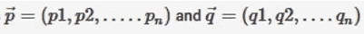

由下式给出:

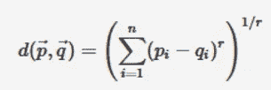

Minkowski distance

**闵可夫斯基距离通常与 *r* 一起使用，r 为 1 或 2，分别对应于曼哈顿距离和欧几里德距离。在 *r 达到无穷大*的极限情况下，我们得到切比雪夫距离。**

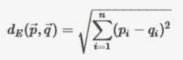

Euclidean distance

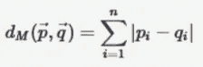

Manhattan distance

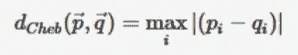

Maximum(Chebychev) distance

更容易理解的方法是下图

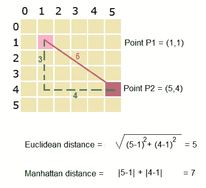

Euclidean(green) vs Manhattan(red)

曼哈顿距离通过**聚合每个变量之间的成对绝对差**来捕捉两点之间的距离，而欧几里德距离通过**聚合每个变量中的平方差**来捕捉两点之间的距离。因此，**如果两个点在大多数变量上接近，但在其中一个变量上差异更大，欧几里德距离将夸大这种差异，而曼哈顿距离将对此不屑一顾，因为它受其他变量的接近程度的影响更大**。**切比雪夫距离计算一对数据点特征之间的最大绝对差异。**

曼哈顿距离应该给出更稳健的结果，而欧几里德距离可能会受到异常值的影响。这同样适用于闵可夫斯基距离公式中“p”的较高值。**随着 p 值的增加，距离度量变得更容易失去稳健性，少数维度中的异常值开始支配距离值。**

如果我们使用这些不同的距离度量而不是默认的欧几里德距离度量来画一个**‘圆’**，可以观察到它们之间的差异。我们知道**圆**是一个与给定点(圆心)等距的点的轨迹。**现在，如果我们使用曼哈顿或切比雪夫距离度量来测量点与中心的距离，我们实际上得到的是“正方形”而不是通常的“圆形”圆。**

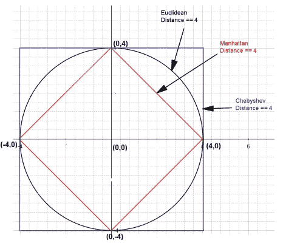

**堪培拉距离**

这是曼哈顿距离的加权版本。它测量一对数据点特征之间的绝对分数差之和，当两个坐标最接近零时，它对微小的变化非常敏感。

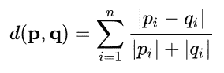

Canberra distance

**海明距离**

对于分类变量(男性/女性，或小型/中型/大型)，如果两个点属于同一类别，我们可以将距离定义为 0，否则为 1。如果所有的变量都是分类的，那么您可以使用**汉明距离来计算错配的数量。**
您还可以将分类变量扩展为指示变量，每个变量对应一个级别。
如果类别是有序的(如小/中/大),使得一些类别比其他类别彼此“更接近”,那么您可以将它们转换成数字序列。例如，(小/中/大)可能映射到(1/2/3)。然后，您可以使用欧几里得距离或其他距离来表示定量数据。

**马氏距离**

我们可以将从一个点到其相应聚类中心的 Mahalanobis 距离视为其欧几里得距离除以该点方向上的方差的平方根。Mahalanobis 距离度量优于 Euclidean 距离度量，因为它允许聚类的结构具有一定的灵活性，并且考虑了变量之间的方差和协方差。

**当您使用欧几里德距离时，您假设分类具有同一性协方差。在 2D，这意味着你的集群是圆形的。显然，如果数据中自然分组的协方差不是单位矩阵，例如在 2D，聚类具有椭圆形状的协方差，那么在欧几里得上使用马氏性将是更好的建模。**

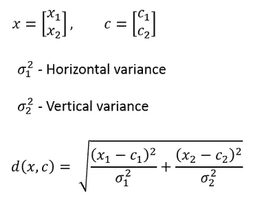

Mahalanobis distance for a two dimensional vector with *no covariance*

## **基于相关性的距离**

**如果两个对象的特征高度相关，则基于相关性的距离认为这两个对象是相似的，即使观察到的值在几何距离上可能相距很远。当两个物体完全相关时，它们之间的距离为 0。如果您想要识别具有相同总体轮廓的观察集群，而不管它们的大小，那么您应该使用*基于相关性的距离*作为相异度量。**

如果选择了欧氏距离，则具有高特征值的观测值将被聚类在一起。这同样适用于具有低特征值的观测值。

**皮尔逊相关距离**

Pearson correlation **测量两个简档之间的线性关系**的程度。**皮尔逊相关分析法是最常用的方法**。它也称为参数相关性，取决于数据的分布。该距离基于皮尔逊相关系数，该系数是根据样本值及其标准差计算的。**相关系数** ' **r** '取值范围从–1(大的负相关)到+1(大的正相关)。

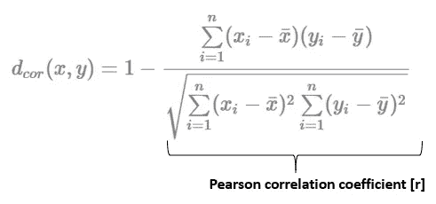

Pearson correlation distance

这一距离还有其他一些变化:

1.  **绝对皮尔逊相关距离:**在这个距离中，使用皮尔逊相关系数的绝对值；因此，相应的距离位于 **0 和 1 之间。**
2.  **非中心相关距离:**除了在非中心相关的表达式中样本均值被设置为零之外，这与皮尔逊相关相同。不居中相关系数在**–1 和+1** 之间；因此距离在 **0 和 2** 之间。
3.  **绝对无中心相关距离:**这与绝对皮尔逊相关相同，除了在无中心相关的表达式中样本均值被设置为零。不居中相关系数在 **0 和+1** 之间；因此，距离在 **0 和 1 之间。**

**艾森余弦相关距离**

这是皮尔逊相关性的一个特例，其中 *x* 和 *y* 都被零取代:

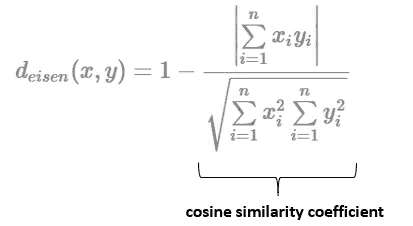

**斯皮尔曼&肯德尔相关距离**

**两个变量之间的 Spearman 相关性等于这两个变量的等级值之间的 Pearson 相关性；皮尔逊相关性评估线性关系，而斯皮尔曼相关性评估单调关系(无论是否线性)。**如果没有重复的数据值，当每个变量都是另一个变量的完美单调函数时，就会出现+1 或-1 的完美 Spearman 相关性。

直观地说，当观察值具有相似的(或相同的相关性为 1) [等级](https://en.wikipedia.org/wiki/Ranking_(statistics))(即观察值在变量内的相对位置标签:第一、第二、第三等)时，两个变量之间的 Spearman 相关性会很高。)在两个变量之间，当观察值在两个变量之间具有不同的(或者对于 1 的相关性完全相反的)等级时为低。

**Kendall tau 等级距离**是计算两个等级列表之间成对不一致的数量的度量。距离越大，两个列表越不相似。Kendall tau distance 也称为**冒泡排序距离**，因为它等于[冒泡排序](https://en.wikipedia.org/wiki/Bubble_sort)算法将一个列表与另一个列表按相同顺序放置所需要的交换次数。

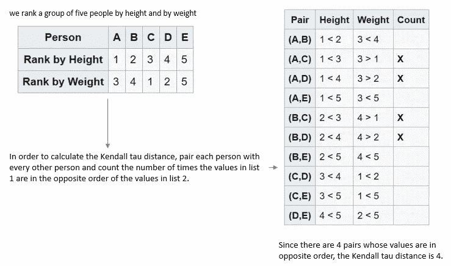

**斯皮尔曼系数对连续和离散序数变量都适用。斯皮尔曼的ρ和肯德尔的τ都可以表述为一个更** [**一般相关系数**](https://en.wikipedia.org/wiki/Rank_correlation#General_correlation_coefficient) **的特例。**

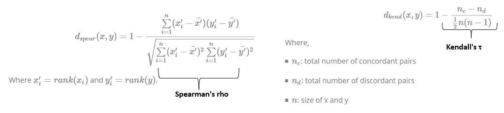

# 关于 k-均值聚类的几点建议

1.  距离测量的值与测量的尺度密切相关。因此，变量通常在测量观察间差异之前进行缩放。当变量以不同的标度测量时(例如:千克、千米、厘米……)，这是特别推荐的；否则，所获得的相异度将受到严重影响。**标准化使得四种距离测量方法——欧几里得、曼哈顿、相关和艾森——比使用非转换数据更相似。**注意，**当数据被标准化后，皮尔逊相关系数&欧氏距离之间存在函数关系。**
2.  **k-means 适用于连续变量。不应该使用混合类型的数据。**当您的数据包含混合类型的变量时，您可以尝试使用**高尔距离。**这里有高尔距离[的概述。](https://stats.stackexchange.com/a/15313/)

# **没有最佳距离度量。**

对于给定的数据集，只有最佳距离度量。距离度量**的选择将**影响您的聚类，但这取决于数据集和目标，哪种距离度量最适合您的特定应用。

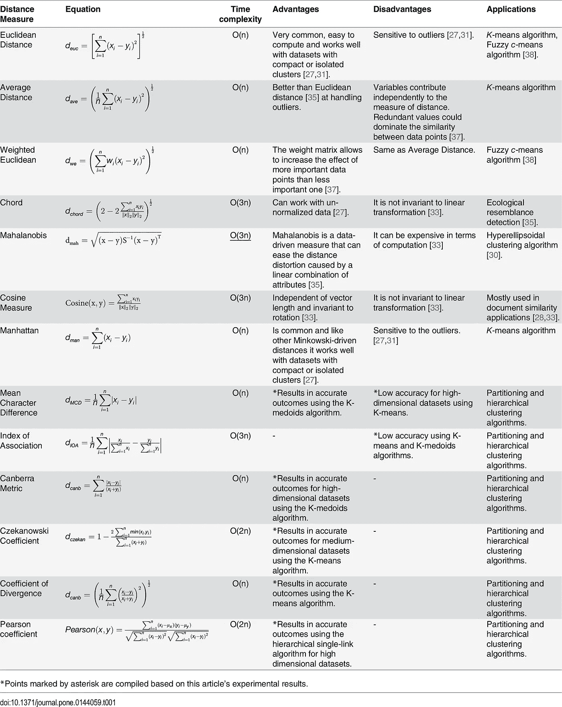

[Similarity Measures for continuous data](https://journals.plos.org/plosone/article?id=10.1371/journal.pone.0144059)

# 参考

1.  [https://pdfs . semantic scholar . org/B3 B4/445 CB 9a 2 a 55 fa 5d 30 a 47099335 B3 f 4d 85 DFB . pdf](https://pdfs.semanticscholar.org/b3b4/445cb9a2a55fa5d30a47099335b3f4d85dfb.pdf)
2.  [https://www . data novia . com/en/lessons/clustering-distance-measures/](https://www.datanovia.com/en/lessons/clustering-distance-measures/)
3.  [https://stats . stack exchange . com/questions/81481/why-does-k-means-clustering-algorithm-use-only-euclidean-distance-metric](https://stats.stackexchange.com/questions/81481/why-does-k-means-clustering-algorithm-use-only-euclidean-distance-metric)
4.  [https://arxiv.org/ftp/arxiv/papers/1405/1405.7471.pdf](https://arxiv.org/ftp/arxiv/papers/1405/1405.7471.pdf)
5.  [https://stats . stack exchange . com/questions/130974/how-to-use-both-binary-and-continuous-variables-together-in-clustering](https://stats.stackexchange.com/questions/130974/how-to-use-both-binary-and-continuous-variables-together-in-clustering)
6.  维基百科(一个基于 wiki 技术的多语言的百科全书协作计划ˌ也是一部用不同语言写成的网络百科全书ˌ 其目标及宗旨是为全人类提供自由的百科全书)ˌ开放性的百科全书
7.  [http://www.divingintodatascience.com/](http://www.divingintodatascience.com/)