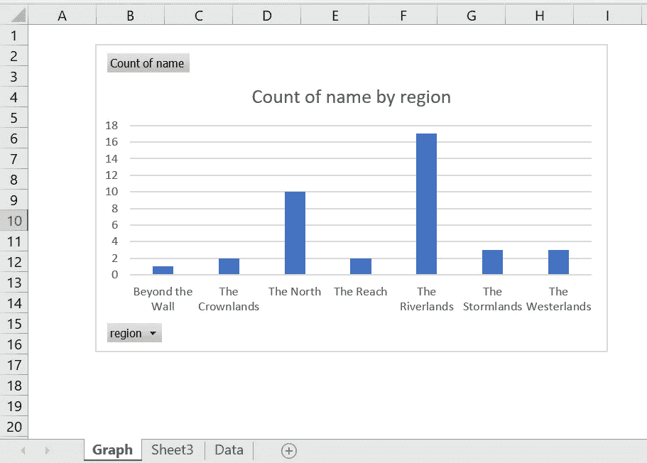
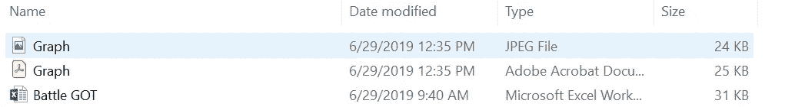
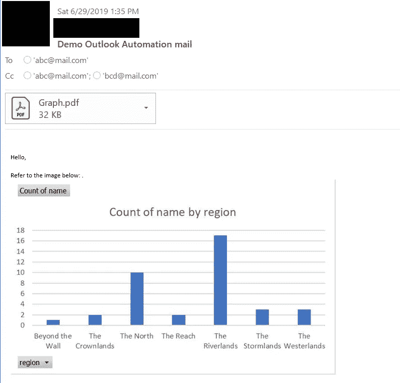

# 日志——通过 Python 实现 Excel 和 Outlook 电子邮件交付自动化指南

> 原文：<https://towardsdatascience.com/log-book-guide-to-excel-outlook-email-delivery-automation-via-python-ca905cbf3f89?source=collection_archive---------14----------------------->

## 本文分为两个部分，第一部分处理从 excel 生成图像/PDF，下一部分将它附加到 outlook 电子邮件中并发送出去。它在宏和处理不同的邮箱方面也有额外的好处。

在我们的日常活动中，我们经常会遇到发送大量邮件的任务，这个项目就是这种需求的产物。

首先，我们将记下这个自动化过程所需的步骤，然后尝试自动化其中的每个步骤。这种自动化所需的步骤如下:

```
1\. Generate image/pdf from an excel.
2\. Create an email with the image/pdf as an attachment.
3\. Send out the emails from outlook.
```

这看起来很简单，让我们开始吧。从现在开始，试着把重点放在代码上，我会在最后附上一个 GitHub 要点。

## 步骤 1 —图像/PDF 创建

我们有一个 excel 包含了 GOT 所有战役的数据，还有一个简单的图表显示了各地区的战役数量。在这一步中，我们的目标是从 excel 中创建下图的 PDF/图像。你可以从[这里](https://drive.google.com/open?id=1Y5Z7K-p9Ybxztwp7v9DjMa3-gHY3xs2P)下载 excel。



Graph which we will copy as image

首先，我们将连接到 Excel 应用程序并加载我们的工作表，Python 有许多选项来本地创建常见的 Microsoft Office 文件类型，包括 Excel、Word 和 PowerPoint。然而，在某些情况下，使用纯 python 方法来解决问题可能太困难了。幸运的是，python 拥有名为 [**pywin32**](https://github.com/mhammond/pywin32) 的“Python for Windows Extensions”包，可以让我们轻松访问 Window 的组件对象模型(COM)并通过 Python 控制微软应用。

```
xlApp = win32.DispatchEx('Excel.Application')
wb = xlApp.Workbooks.Open(file_location + filename)
ws = wb.Worksheets('Graph') **# name of the sheet in which graph is present.**
```

完成后，我们将给出想要转换为图像的工作表部分的单元格引用。图像功能由 **PIL** 包提供。以下代码将单元格引用作为图像复制到剪贴板并保存。您可以使用“质量”参数调整图像质量，请注意，图像质量仅适用于 JPEG 类型的文件。默认图像质量设置为 75，当您增加或减少该值时，图像的大小也会改变。具体可以参考 PIL 图书馆的[官方文档。](https://pillow.readthedocs.io/en/5.1.x/handbook/image-file-formats.html#jpeg)

```
win32c = win32.constants
ws.Range("B2:I16").CopyPicture(Format=win32c.xlBitmap) **# give the cells for which you need the image**
img = ImageGrab.grabclipboard()
img.save(file_location + 'Graph.jpeg',quality=55) **# image quality and file size is directly linked**
```

到目前为止，我们已经保存了我们的形象。现在，如果你想将图像转换成 pdf 格式，你可以使用 **img2pdf** 库。下面的代码读取上面保存的图像，并将其保存为 PDF 格式。如果你需要的只是一张图片，你可以跳过这一步。

```
**#storing pdf path**
 pdf_path = file_location + "Graph.pdf"**#opening image**
 image = Image.open(image_path)**#converting into chunks using img2pdf**
 pdf_bytes = img2pdf.convert(image.filename)**#opening or creating pdf file**
 file = open(pdf_path, "wb")**#writing pdf files with chunks**
 file.write(pdf_bytes)**#closing image file**
 image.close()**#closing pdf file**
 file.close()
```

完成这一步后，我们有一个图像和一个 PDF:



Image & PDF created

> 我们理想地完成了第一步，但我想补充一点小奖励。通常，我们有一个基于宏的 excel，而不是常规的 excel，需要在拍摄图像之前运行宏来刷新数据，这也是可能的。您只需要知道要运行的宏的名称。下面的代码将打开 excel 运行指定的宏并保存 excel。

```
xlApp = win32.DispatchEx('Excel.Application')
wb = xlApp.Workbooks.Open(file_location + filename)**# Give the proper macro name**
xlApp.Application.Run("Module.Macroname")
wb.Save()
wb.Close()
xlApp.Application.Quit()
```

## 步骤 2—创建电子邮件

我们将使用与 excel 相同的 [**pywin32**](https://github.com/mhammond/pywin32) 包来连接 Outlook。

```
outlook = win32.Dispatch('outlook.application')
```

> T4:这是另一笔奖金。当配置了多个电子邮件 id 时，通常需要从特定的 outlook 邮箱发送邮件，我们将在下一步处理这个问题。如果您想从默认邮箱发送邮件，可以跳过这一步。以下代码将遍历您所有已配置的帐户，当它找到“abc@mail.com”时，将从那里发送邮件。但是请注意，如果它没有获得指定的邮件 id，它将只从默认 id 发送邮件。

```
sendfromAC = *None
for* oacc *in* outlook.Session.Accounts:
**#give the mail id from which you want to send**
    *if* oacc.SmtpAddress == "abc@mail.com": 
        sendfromAC = oacc
        *break* ##----------------------------------------------------------------

mail = outlook.CreateItem(0)

*if* sendfromAC:
    mail._oleobj_.Invoke(*(64209, 0, 8, 0, sendfromAC))
##----------------------------------------------------------------
```

我们的 outlook 对象已经创建，现在我们将添加**到/CC** / **主题**和**附件**。对于附件部分，我将展示 2 件事情，**将 PDF 文件**作为文件附在邮件中，**将图片**嵌入邮件正文中。这应该涵盖 2 个用例。

```
mail.To = 'abc@mail.com'
mail.Cc = 'abc@mail.com;bcd@mail.com'
mail.Subject = 'Demo Outlook Automation mail'
```

**附上 PDF:**

```
mail.Attachments.Add(file_location + "Graph.pdf")
```

**嵌入邮件正文:**

为了在邮件正文中嵌入图像，我们首先需要将它作为普通附件附加，然后将其作为 HTML 邮件正文的一部分嵌入。以下部分处理附加图像和设置属性，以便 outlook 可以正确处理图像。我们很快会谈到嵌入部分。

```
attachment1 = mail.Attachments.Add(file_location + 'Graph.jpeg')
attachment1.PropertyAccessor.SetProperty("http://schemas.microsoft.com/mapi/proptag/0x3712001F", "Graph")

mail.HTMLBody = "<HTML lang='en' xmlns='http://www.w3.org/1999/xhtml' xmlns:o='urn:schemas-microsoft-com:office:office'> " \
                + "<head>" \
                + "<!--[if gte mso 9]><xml> \
                        <o:OfficeDocumentSettings> \
                        <o:Allowjpeg/> \
                        <o:PixelsPerInch>96</o:PixelsPerInch> \
                        </o:OfficeDocumentSettings> \
                    </xml> \
                    <![endif]-->" \
                + "</head>" \
                + "<BODY>"
```

接下来，我们必须创建电子邮件正文。您可以将邮件正文设置为**普通文本格式**或 **HTML 格式**。我个人更喜欢 HTML 正文格式，因为它给了我很多控制电子邮件应该如何显示，而不是让 Outlook 来判断。下面的代码非常明显，它将设置邮件正文，最后的 **'cid:Graph'** 部分将在邮件正文中嵌入附加的图像。

```
mail.HTMLBody = mail.HTMLBody + "<BR>Hello,<b> </b>" \
                + "<BR><BR> Refer to the image below: </b> ."\
                + "<html><body></body></html>"
```

## 步骤 3 —发送邮件

现在我们已经准备好了邮件对象，剩下的就是发送邮件了。这将使用简单的命令来完成:

```
mail.Send()
```

万岁！！



Sent Mail

完整的 GitHub 要点补充如下:

## 已知问题

## 问题 1

很少会出现脚本无法连接到 excel 的问题。错误是这样的:

```
module 'win32com.gen_py.00020813-0000-0000-C000-000000000046x0x1x9' has no attribute 'CLSIDToClassMap'
```

解决方案是从这个[堆栈溢出 URL](https://stackoverflow.com/questions/52889704/python-win32com-excel-com-model-started-generating-errors) 中派生出来的

这些步骤是:

```
1\. **Delete the entire gen_py folder**, in my case it was present in this path: C:\Users\'user_name'\AppData\Local\Temp\gen_py folder2\. **Rerun the script**, the above caches will be regeneratedResolving step 2 often results in Issue 2, which has to be resolved in turn.
```

## 问题 2

这个问题比问题 1 更常见，运行几天后，代码会抛出一个错误:

```
File  "C:/Users/'user_name'/PycharmProjects/Mailer/mailDispatcher.py",  line 64, in MailDispatcher  ws.Range("A1:AF25").CopyPicture(Format=win32c.xlBitmap) File "C:\Users\'user_name'\PycharmProjects\mail\venv\lib\site-packages\win32com\client\__init__.py",  line 178, in __getattr__ raise **AttributeError(a)**

**in the** *xlApp = win32.DispatchEx('Excel.Application')* **line.**
```

这个解决方案是通过一种试凑法得出的。这些步骤是:

```
1\. Replace **xlApp = win32.DispatchEx('Excel.Application')** with **xlApp = win32.gencache.EnsureDispatch('Excel.Application')** *[This is already added in code.]*2\. Run the code for once, this will result **in a mail with corrupted attachments.**3\. **Undo changes of Step 1.**4\. Run the code again, now everything should work.
```

我真的不知道是什么导致了这些问题，广泛的谷歌搜索没有任何有价值的东西。看起来像是某种缓存损坏。

## 参考资料:

[https://www . ka ggle . com/mylesoneill/game-of-thrones # battles . CSV](https://www.kaggle.com/mylesoneill/game-of-thrones#battles.csv)

https://pbpython.com/windows-com.html

太多[堆栈溢出](https://stackoverflow.com/)问题