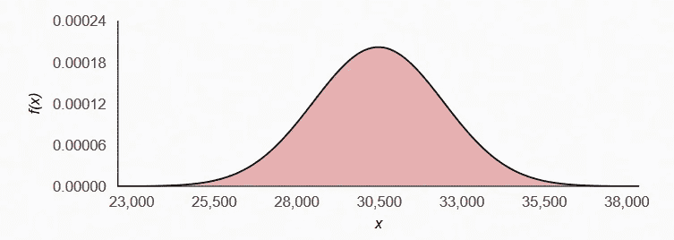
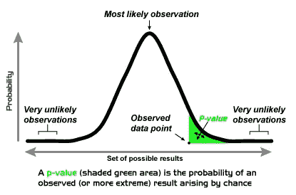
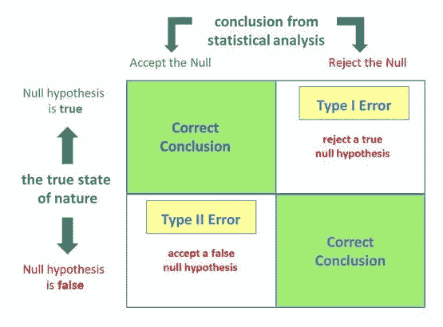
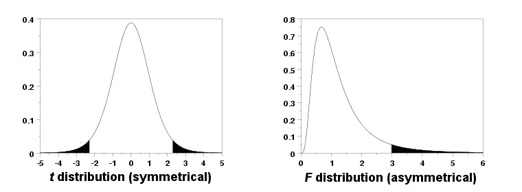
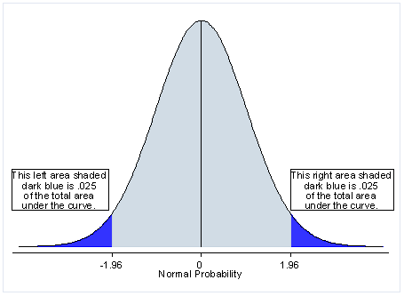
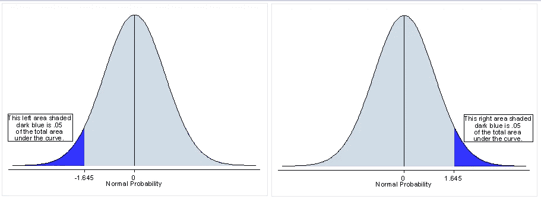
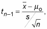
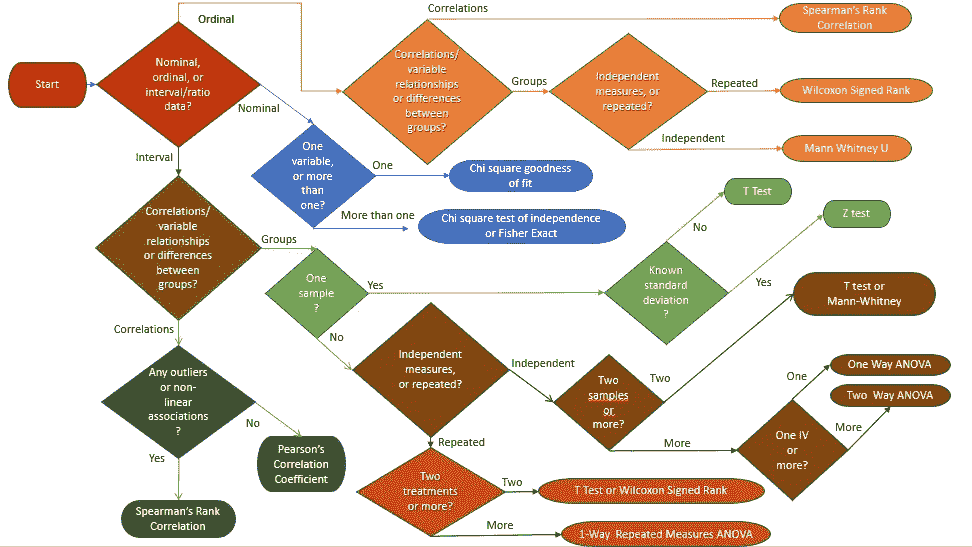

# 日志——假设检验指南

> 原文：<https://towardsdatascience.com/log-book-guide-to-hypothesis-testing-802b1980d0b8?source=collection_archive---------11----------------------->

## 这是假设检验指南。我试图用一个循序渐进的例子来涵盖理论和实际实现的基础。


对于我们所做的任何研究，我们基本上都是在试图回答一个问题或假设。回答这种问题/假设的一种方法叫做**假设检验**或**显著性检验**。

# 假设检验的结构

假设检验的作用是**提供一条路径**，我们可以沿着这条路径有效地检验或证明我们的问题/假设。以下是进行假设检验时通常遵循的步骤:

```
1\. Define the **research hypothesis** for the study.2\. Explain how you are going to **operationalize** (that is, **measure** or **operationally define**) what you are studying and set out the **variables** to be studied.3\. Set out the **null** and **alternative hypothesis** (or more than one hypothesis; in other words, a number of hypotheses).4\. Set the **significance level**.5\. Make a **one** or **two-tailed prediction**.6\. **Select** an appropriate **statistical test** based on the variables you have defined and whether the distribution is normal or not.7\. **Run** the **statistical tests** on your data and **interpret** the **output**.8\. **Reject** or **fail to reject** the **null hypothesis**.[Source](https://statistics.laerd.com/statistical-guides/hypothesis-testing-2.php)
```

可能会有一些变化，但在大多数情况下，这是遵循的结构。

# 一个例子

## 研究假设

一家公司需要为他们的销售人员购买公司汽车。他们联系了当地的福特经销商，询问 2007 款福特探险者 4X4 XLT 的价格。经销商表示，这款车在马里兰州的平均价格(μ)为 29，995 美元。现在，在购买之前，该公司想确认这是不是真的。

## 使用于操作

该公司对马里兰州的 20 家福特经销商进行了随机抽样，发现平均价格为 30，474.80 美元，样本的标准偏差为 1，972.59 美元。

```
+------------------------+---+--------+
| [www.academyford.com](http://www.academyford.com)    |   | 27,595 |
+------------------------+---+--------+
| [www.advantageford.com](http://www.advantageford.com)  |   | 30,250 |
+------------------------+---+--------+
| [www.appleford.com](http://www.appleford.com)      |   | 32,705 |
+------------------------+---+--------+
| [www.bobbellford.com](http://www.bobbellford.com)    |   | 28,485 |
+------------------------+---+--------+
| [www.crouseford.com](http://www.crouseford.com)     |   | 31,295 |
+------------------------+---+--------+
| [www.darcars.com](http://www.darcars.com)        |   | 30,075 |
+------------------------+---+--------+
| [www.diehlsford.com](http://www.diehlsford.com)     |   | 30,505 |
+------------------------+---+--------+
| [www.hagertownford.com](http://www.hagertownford.com)  |   | 30,820 |
+------------------------+---+--------+
| [www.hillsford.com](http://www.hillsford.com)      |   | 25,995 |
+------------------------+---+--------+
| [www.hindersford.com](http://www.hindersford.com)    |   | 32,830 |
+------------------------+---+--------+
| [www.huntford.com](http://www.huntford.com)       |   | 31,875 |
+------------------------+---+--------+
| [www.koonsford.com](http://www.koonsford.com)      |   | 32,285 |
+------------------------+---+--------+
| [www.norrisford.com](http://www.norrisford.com)     |   | 32,580 |
+------------------------+---+--------+
| [www.pittsvilleford.com](http://www.pittsvilleford.com) |   | 28,915 |
+------------------------+---+--------+
| [www.plazaford.com](http://www.plazaford.com)      |   | 29,940 |
+------------------------+---+--------+
| [www.prestonford.com](http://www.prestonford.com)    |   | 31,720 |
+------------------------+---+--------+
| [www.ramseyford.com](http://www.ramseyford.com)     |   | 30,265 |
+------------------------+---+--------+
| [www.shafferford.com](http://www.shafferford.com)    |   | 32,555 |
+------------------------+---+--------+
| [www.towsonford.com](http://www.towsonford.com)     |   | 31,580 |
+------------------------+---+--------+
| [www.watertownford.com](http://www.watertownford.com)  |   | 27,226 |
+------------------------+---+--------+
```



## 无效假设和替代假设

为了进行假设检验，我们需要将我们的研究假设表述为无效的替代假设。零假设和替代假设是关于人群中发生的差异或影响的陈述。我们将使用我们的样本来测试哪个陈述(即零假设或替代假设)最有可能(尽管从技术上来说，我们针对零假设来测试证据)。

*零假设本质上是“魔鬼代言人”的立场。也就是说，它假设我们试图证明的任何事情都没有发生。*

**零假设(₀ **):****

```
The null hypothesis states that our company believes that the average cost of a 2007 Ford explorer is more than or equal to the quoted $29,995 price from the local Ford Dealership. μ >= 29995
```

**替代假设(H** ᴀ **):**

```
Our alternate must be the opposite of the null hypothesis therefore that the average price is not greater then the quoted price from the local Ford dealership. μ < 29995
```

## 显著性水平

统计显著性的**水平**通常表示为所谓的***p*-值**。根据我们稍后选择的统计测试，我们将计算观察样本结果的概率(即*p*-值)**，假设零假设为真**。

在进一步讨论之前，让我们先用简单的方法来理解 P 值的含义:

> **P 值**

美国统计协会给出的定义:

*在统计假设检验中，p 值或概率值或渐近显著性是给定统计模型的概率，当零假设为真时，统计汇总(如两个比较组之间的样本均值差异)将与实际观察结果相同或比实际观察结果更大。* 在学术文献中，p 值被定义为如果零假设为真，数据至少**与观察到的**一样极端的概率。“至少和观察到的一样极端”——这是什么意思？

为了回答这个问题，让我们用一枚硬币做一个实验。
我的一个朋友给了我一枚硬币，并声称它很特别。我决定测试一下。我的无效假设是:*“硬币正常”*。然后我扔了 20 次硬币。我有 18 个头和 2 条尾巴。

通常，当扔硬币时，期望是 50%正面和 50%反面，所以我期望 10 正面+ 10 反面的结果是最常见的，其次是 9 正面+ 11 反面和 11 正面+ 9 反面的结果。18 头+ 2 尾的结果到了概率曲线的外围(也就是更极端)。**p 值是观察结果加上所有“更极端”结果的概率(本例中:19 头+ 1 尾和 20 头+ 0 尾)，用阴影“尾面积”**表示。

通常，统计学家会计算一个**双尾 p 值**(我们稍后会谈到这一点)，所以我们取了图表的两个极端，即 18 个尾+ 2 个头，19 个尾+ 1 个头和 20 个尾+ 0 个头**也包括在内。**



**P 值=数据至少与观察到的数据一样极端的概率= [[ *p (18 头 2 尾)+ p (19 头 1 尾)+ p (20 头 0 尾)*]+[*P(18 尾+ 2 头)+ p (19 尾+ 1 头)+ p (20 尾+ 0 头)]] = 0.0004*
** [[]]代表每条尾**

获得这样一个结果的机会是如此之小，如果硬币是正常的。因此，我拒绝零假设，并接受硬币是特殊的。

**在大多数分析中，0.05 的α被用作显著性的截止值，我们也将在我们的案例中这样做，即如果 p 值小于 0.05，我们将拒绝零假设。**

> **类型 1 &类型 2 错误**



[source](https://www.simplypsychology.org/type_I_and_type_II_errors.html)

## **理解第一类错误**

第一类错误——通常称为“假阳性”——发生在假设检验中，当**零假设为真但被拒绝时。**简单地说，当测试人员验证了统计上的显著差异时，即使没有差异，也会发生这种情况。*第一类错误的例子是，当我们推断上面的硬币是特殊的时候，它实际上是正常的，而我们得到 18 个正面和 2 个反面只是运气不好。*

类型 1 错误的概率为“α”,与您设置的置信度相关。置信度为 95%的测试意味着有 5%的几率出现 1 类错误。**这也是我们面临的风险，5%的机会可能对我们不利。**

## **理解第二类错误**

第二类错误被称为“假阴性”**，当零假设为假，并且我们随后未能拒绝它**时，这些错误就会发生。*第二类错误的例子是，如果上面的硬币实际上是特殊的，但我们未能拒绝它是正常的。*

## **单尾或双尾测试**

我们常常不得不决定我们的统计检验应该是单尾检验还是双尾检验(也分别称为“定向”和“非定向”检验)。那么，这两者到底有什么区别呢？首先，了解术语“尾巴”在上下文中的含义可能会有所帮助。

尾部是指您正在进行的特定分析的检验统计分布的末端。例如，t 检验使用 t 分布，方差分析使用 f 分布。**检验统计量的分布可以有一个或两个尾部，这取决于其形状**(见下图)。图中分布的黑色阴影区域是尾部。像 t 和 z 分布这样的对称分布有两个尾部。像 f 分布和卡方分布这样的非对称分布只有一个尾部。这意味着方差分析和卡方检验等分析没有“单尾对双尾”选项，因为它们所基于的分布只有一个尾。



但是如果我们正在进行一个双尾分布的 t 检验呢？现在我们必须决定是单尾还是双尾测试最适合你的研究。

我们使用 0.05 的显著性水平，**一个双尾测试分配一半的α用于测试一个方向的统计显著性，另一半α用于测试另一个方向的统计显著性**。这意味着. 025 在我们的测试统计分布的每一个尾部。



**单尾检验为检测效应提供了更大的能力，因为整个权重只分配给一个方向**，正因为如此，每当你对效应的方向有一个假设时，可能会有使用单尾检验的诱惑。但在这样做之前，我们必须考虑错过另一个方向的效果的后果。



**当使用双尾检验时，不管假设的关系的方向如何，我们都会检验两个方向上关系的可能性。**

例如，我们可能希望使用 t 检验将样本的平均值与给定值 *x* 进行比较。我们的零假设是平均值等于 *x* 。**如果平均值明显大于 *x* 并且平均值明显小于 *x* ，则双尾测试将同时进行测试。**如果检验统计量位于其概率分布的前 2.5%或后 2.5%，导致 p 值小于 0.05，则认为平均值与 *x* 显著不同。

但是在我们的例子中，零假设表明我们公司认为 2007 年福特探险者的平均成本大于或等于当地福特经销商的报价 29，995 美元。我们没有兴趣看它是否低于报价，**这就是为什么我们将使用单尾检验。**

现在我们有了 P 值和单/双尾检验的概念，我们将假设的显著性水平设置为 0.05，作为拒绝真假设的风险，即 1 型错误。我们选择 0.05 作为我们的显著性水平，因为传统上 0.05 用于消费者研究时确定显著性水平。

## **统计测试**

如果你按照下面的图表(查看底部的图表一次)选择测试是很容易的，因为我们不知道整个人口的标准偏差(我们只有性病)。戴夫。对于我们的样本)我们必须使用 t 检验。

*当使用一个总体均值的检验统计量时，* ***在两种情况下，您必须使用 t 分布而不是 Z 分布。*** *第一种情况是* ***样本量很小*** *(低于 30 左右)，第二种情况是当总体标准差、* ***σ未知*** *时，你必须使用样本标准差 s 来估计它。在这两种情况下，你都没有更可靠的信息来作为你的结论的基础，所以你必须通过使用 t 分布来为此付出代价*

涉及 t 分布的总体均值假设检验称为 t 检验。在这种情况下，检验统计量的公式为:



其中 t ₙ ₋₁是具有 n-1 个自由度的 t 分布的值。

总结我们目前掌握的所有数据:

```
+===========+====================+
| 29,995.00 | hypothesized value |
+-----------+--------------------+
| 30,474.80 | mean Data          |
+-----------+--------------------+
|  1,972.59 | sample std. dev.   |
+-----------+--------------------+
|   441.085 | std. error         |
+-----------+--------------------+
|        20 | n                  |
+-----------+--------------------+
|        19 | degrees of freedom |
+-----------+--------------------+
```

**从上式计算 t 值→ 1.087772。p 的对应值为 0.145151。**

你可以找到许多在线表格和计算器来计算 p 值和 t 值。

**p 值大于α 0.05。在这种情况下，我们无法拒绝零假设。当这种情况发生时，我们说这个结果没有统计学意义。换句话说，我们有理由相信，我们观察到的数据可以单独用偶然来解释。通过解释测试结果，我们证明了无效假设。**

# 测试类型

下面的流程图描述了你可以做哪些类型的测试来确认/拒绝你的零假设。我怎么也找不到这张图表的参考文献，我早就把它保存起来了。请让我知道，如果你能找到参考，我将非常乐意添加它。

根据你的数据类型、抽样方法和假设类型，你必须选择合适的测试。每个测试的过程都与我们在这里展示的相似。如果你想知道上述不同类型测试的细节和用例，有 9 种类型的测试已经在[这个链接](https://www.machinelearningplus.com/statistics/statistical-significance-tests-r/)中描述了，以及它们相应的 R 代码。真的很有帮助。



Flowchart to determine the type of statistical test to be done

# **参考文献:**

*   [https://statistics . laerd . com/statistical-guides/hypothesis-testing . PHP](https://statistics.laerd.com/statistical-guides/hypothesis-testing.php)
*   [https://dzone.com/articles/what-is-p-value-in-layman-terms](https://dzone.com/articles/what-is-p-value-in-layman-terms)
*   [https://www . students 4 best evidence . net/p-value-in-plain-English-2/](https://www.students4bestevidence.net/p-value-in-plain-english-2/)
*   [https://upload . wikimedia . org/Wikipedia/en/0/00/P-value _ graph . png](https://upload.wikimedia.org/wikipedia/en/0/00/P-value_Graph.png)
*   [https://www . machine learning plus . com/statistics/statistical-significance-tests-r/](https://www.machinelearningplus.com/statistics/statistical-significance-tests-r/)
*   [https://www.abtasty.com/blog/type-1-and-type-2-errors/](https://www.abtasty.com/blog/type-1-and-type-2-errors/)
*   [https://www . dummies . com/education/math/statistics/how-to-use-the-t-test-to-handle-small-samples-and-unknown-standard-deviations/](https://www.dummies.com/education/math/statistics/how-to-use-the-t-test-to-handle-small-samples-and-unknown-standard-deviations/)
*   [https://www . thoughtco . com/the-difference-between-alpha-and-p-values-3126420](https://www.thoughtco.com/the-difference-between-alpha-and-p-values-3126420)
*   [https://brain mass . com/statistics/hypothesis-testing/hypothesis-testing-real-life-example-117671](https://brainmass.com/statistics/hypothesis-testing/hypothesis-testing-real-life-example-117671)
*   [https://www . statistics solutions . com/should-you-use-a-one-tailed-test-or-a-two-tailed-test-for-your-data-analysis/](https://www.statisticssolutions.com/should-you-use-a-one-tailed-test-or-a-two-tailed-test-for-your-data-analysis/)
*   [https://stats . idre . UCLA . edu/other/mult-pkg/FAQ/general/FAQ-one-tailed-and-two-tailed-tests 之间的区别是什么/](https://stats.idre.ucla.edu/other/mult-pkg/faq/general/faq-what-are-the-differences-between-one-tailed-and-two-tailed-tests/)