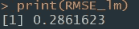
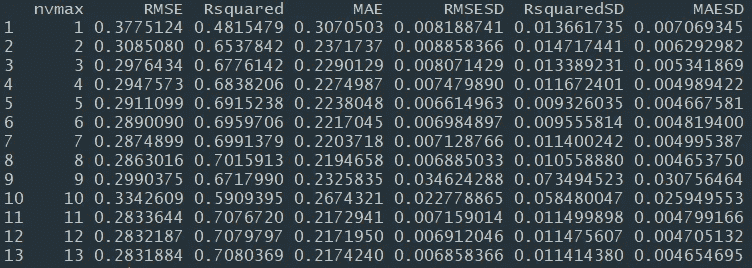

# 日志——R 中线性和多项式回归实用指南

> 原文：<https://towardsdatascience.com/log-book-practical-guide-to-linear-polynomial-regression-in-r-e0ed2e7f8031?source=collection_archive---------10----------------------->

## 这是 r 中线性和多项式回归的实用指南。我试图用 King County 数据集涵盖理论和实际实现的基础。

我在数据科学领域的旅程中相对来说还是个新手，这篇文章算是对我所做主题的一个注解。这些可能对其他爱好者有所帮助。

请注意，这些是我的学习笔记，有些部分是从其他来源引用的。我在所有帮助过我的资料的末尾都给出了详细的参考。

## **回归方程**

简单的线性回归精确地估计当 X 改变一定量时 Y 将改变多少。有了相关系数，变量 X 和 Y 可以互换。通过回归，我们尝试使用线性关系(即直线)从 X 预测 Y 变量:

Y = b0 + b1 X


符号 b0 称为截距(或常数)，b1 表示 x 的斜率，二者都以系数形式出现在 R 输出中。Y 变量被称为响应变量或因变量，因为它依赖于 X。X 变量被称为预测变量或自变量。机器学习社区倾向于使用其他术语，称 Y 为目标，X 为特征向量。

**拟合值和残差**

回归分析中的重要概念是拟合值和残差。一般来说，数据不会正好落在一条线上，因此回归方程应该包括一个明确的误差项:


拟合值也称为预测值，通常用(Y-hat)表示。这些由以下公式给出:


其中 b0 & b1 表示系数是估计的还是已知的。

**多元线性回归**

当有多个预测值时，该等式可以简单地扩展以适应它们:


我们现在有了一个线性模型，而不是直线，即每个系数与其变量(特征)之间的关系是线性的。我们将有一个平面，它将通过“中间”的采样点，如下图所示。二维是一条线，三维是一个平面，N 是一个超平面。


**现在我们对什么是线性回归有了一个概念，我们将通过不同类型回归模型的细节来预测非常受欢迎的 King County 住房数据集的价格。您可以从** [**这里**](https://drive.google.com/file/d/18bAZnwswJGxzalGmeJ_ou1we_ofMM-5k/view?usp=sharing) **下载数据集。目标是我们使用不同的模型来定义一个平面，该平面以低错误率最适合我们的数据。随着新数据的出现，该平面/线将用于预测结果。**

## **郡王房产数据**

在开始分析之前，请确保您已经安装并加载了以下 R 包:

```
library(doParallel)
library(‘randomForest’)
library(MASS)
library(readr)
library(ggplot2)
library(corrplot)
library(mlbench)
library(Amelia)
library(plotly)
library(reshape2)
library(caret)
library(caTools)
library(dplyr)
library(moments)
```

## **探索性数据分析**

使用回归的一个例子是估计房屋的价值。郡估税员必须估计房子的价值，以达到估税的目的。房地产消费者和专业人士会咨询 Zillow 等热门网站，以确定一个合理的价格。以下是来自华盛顿州金县(西雅图)的几行住房数据，来自住房数据框:

```
house <- read.csv(“C:/personal/kc_house_data.csv”)
head(house)
```


数据集本身由 21，613 个具有 19 个特征的示例组成[不考虑 id 和日期列]。其特点是:


现在，如果你注意到这些数据，你会发现很少有值是被分类的，比如海滨、风景、条件、等级等等。现在还有一个对邮政编码变量进行分组的空间，因为邮政编码本身并不定义任何东西，但是房子的价格取决于位置。如果你知道一些邮政编码属于城镇的豪华区，那么你可以把它们分成邮政编码组 1，下一个是邮政编码组 2，依此类推。我们不会在这里这样做，因为我们不知道哪个邮政编码区属于城镇的哪个部分。但是我们有 lat 和 long 值，所以我们将使用它们。但是如果你想了解更多关于将数据转换成分类值的信息，你可以参考这个[链接](http://www.sthda.com/english/articles/40-regression-analysis/163-regression-with-categorical-variables-dummy-coding-essentials-in-r/)。通常使用*电平*命令来完成。

**缺失值**

您可以使用以下命令检查丢失的数据:

```
missmap(house,col=c(‘yellow’,’black’),y.at=1,y.labels=’’,legend=TRUE)
```

根据该图，没有缺失值。


现在，我们将删除 id 列和日期列(所有信息仅在一年内收集)。

```
house <- house[,-c(1,2)]
```

**相关预测因子**

在多元回归中，预测变量通常是相互关联的。**相关性**是一个问题，因为**独立变量**应该是**独立的**，如果两个变量相关，那么这意味着你基本上多次使用几乎相同的特性。这将给出不正确的结果。一旦你找到了相关变量，你就可以保留一个，去掉另一个。

如果删除高度相关的属性，许多方法会执行得更好。您可以使用以下命令检查相关变量:

```
corrplot(cor(house),type=”upper”,method=”color”,addCoef.col = “black”,tl.col = “black”, number.cex = 0.6,mar=c(0,0,0,0))
```


现在我们知道了哪些变量对是相关的，我们可以选择保留哪些变量对，删除哪些变量对:

```
[sqft_living, grade] : 0.76 , will keep sqft_living
[sqft_living, sqft_above] : 0.88 , will keep sqft_living
[sqft_living, sqft_living15] : 0.76 , will keep sqft_living
[sqft_lot, sqft_lot15] : 0.72 , will keep sqft_lot
```

因此，我们删除了 grade、sqft_above、sqft_living15 和 sqft_lot15，因为它们所携带的信息已经由其他变量提供了。

```
house <- house[,-c(10,11,18,19)]
```

**维度**

如果您想**减少数据集的维度**，您可以应用**脱字符**包中的函数 *nearZeroVar* 。它诊断相对于样本数具有一个或很少唯一值的预测值，并且最常见值的频率与第二常见值的频率之比很大。截至目前，我们不会这样做，因为我们还有 14 个功能。

虽然我会从数据集中删除邮政编码，因为位置数据包含在纬度和经度中。

```
house <- house[,-c(13)]
```

**偏斜度**

接下来，我们将尝试分析数字变量的偏斜度。进行偏斜度检查是为了使数据正常，这是线性回归的假设之一。有些人建议[这里](https://www.researchgate.net/post/What_is_the_acceptable_range_of_skewness_and_kurtosis_for_normal_distribution_of_data)偏斜度的可接受值范围在(-2，2)之间。因此，我们检测哪些变量不在此范围内，并将使用对数函数对它们进行转换[我们不会转换分类数据]。

```
apply(house, 2, skewness, na.rm =TRUE)
```


将所需数据转换为日志:

```
house$price <- log(house$price)
house$sqft_lot <- log(house$sqft_lot)
```

可以在下面两个直方图中检查转换前后偏斜度的差异:


## **数据建模**

现在我们已经完成了 EDA，我们将从从其他变量预测销售价格的目标开始。首先，我们将采用所有变量/特征来制作我们的模型；参数 *na.action=na.omit* 导致模型删除缺少值的记录。

使用 70/30 分割将加载的数据集分成训练集和验证集。现在，我们有了一个用于训练模型的训练数据集和一个稍后用于测量模型性能的验证集。

```
set.seed(1000)
i <- sample(2, nrow(house), replace=TRUE, prob=c(0.7, 0.3))
trainData <- house[i==1,]
testData <- house[i==2,]
model_lm <- lm(price ~ bedrooms + bathrooms + sqft_living + sqft_lot + floors +waterfront+ view + sqft_basement + condition + yr_built + lat + long, data = trainData)
summary(model_lm)
```


正如我们可以看到运行我们的线性模型的总结，决定系数(或 R 平方)是好的。从我们创建的线性回归模型中可以预测结果中 70.8%的方差。

接下来，我们将分析我们模型的 RMSE(或均方根误差)。

```
prediction_lm <- predict(model_lm, testData, type=”response”)
model_lm_output <- cbind(testData, prediction_lm)
# RMSE value
RMSE_lm <- sqrt(mean((model_lm_output$price — model_lm_output$prediction_lm)^2,na.rm=TRUE))
print(RMSE_lm)
```



正如我们在上面看到的，我们的 RMSE 是 0.28。它衡量模型预测的价格和实际价格之间的差异。数值越低越好。我们的接近 0，所以这是一个很好的指标。

**现在我们有了一个基本模型，我们需要了解模型的性能:**

从数据科学的角度来看，最重要的性能指标是均方根误差，即 RMSE。 **RMSE** 是预测值的均方误差的平方根:


您可以通过以下方式计算上述模型中的 RMSE

```
RMSE_house_lm <- sqrt(mean(residuals(house_lm)^2))
```

这衡量了模型的整体准确性，并且是将其与其他模型(包括使用机器学习技术拟合的模型)进行比较的基础。

与 RMSE 相似的是剩余标准误差，或称 **RSE** 。在这种情况下，我们有 p 个预测值，RSE 由下式给出:

```
MSE_house_lm <- (mean(residuals(house_lm)^2))
```


唯一的区别是分母是自由度，而不是记录数。在实践中，对于线性回归，RMSE 和 RSE 之间的差异非常小，特别是对于大数据应用。

在我们的例子中，观察到的价格值平均偏离预测价格约 202700 个单位。这对应的误差率 *202700/mean(房价)= 37.5%* ，偏高。

**残差平方和** (RSS)是残差平方和:

```
rss <- sum(residuals(fit)^2)
```

**残差标准差** (RSE)是(RSS /自由度)的平方根:

```
rse <- sqrt( sum(residuals(fit)^2) / fit$df.residual )
```

您将在软件输出中看到的另一个有用的度量是决定系数，也称为 **R 平方统计量**。R-squared 的范围从 0 到 1，用于测量模型中数据的变化比例。它主要用于回归的解释性应用，在这种情况下，您需要评估模型与数据的拟合程度。公式是:


分母与 y 的方差成比例，R 的输出也报告调整后的 R 平方，它针对自由度进行调整；这在多元回归中很少是显著不同的。

在我们的例子中，R2 为 0.69，这是可以的。

除了估计的系数，R 还报告了系数的标准误差(SE)和 t 统计量:


t 统计量(及其镜像 p 值)测量系数的“统计显著性”程度，即超出预测值和目标变量随机排列可能产生的范围。t 统计值越高(p 值越低)，预测值越显著。

**警告**

除了 t 统计量之外，R 和其他软件包通常会报告 p 值(R 输出中的 Pr(>|t|)和 F 统计量。数据科学家通常不会过多参与这些统计数据的解释，也不会过多参与统计显著性的问题。数据科学家主要关注 t 统计，将其作为是否在模型中包含预测因子的有用指南。较高的 t 统计值(p 值接近 0)表示模型中应保留某个预测值，而非常低的 t 统计值则表示可能会删除某个预测值。

我们可以从线性模型的图示中得到一些启示:

```
# Graphic representation
par(mfrow=c(2,2))
plot(model_lm)
```


现在我们如何阅读这些图表？

*   **残差与拟合值**:由于残差随机分布在零附近，因此不应有强模式和异常值。正如我们在图中看到的，我们所有的残差都分布在(-1，1)内，接近于 0。
*   **正态 Q-Q** :残差应该正态分布在对角线周围，就像我们的例子中发生的那样。
*   **缩放位置**:与第一个图类似，但是 Y 轴上的残差被缩放。不应该有任何强烈的模式，因为它发生在这种情况下，虽然我们有一个平滑的正对角线
*   **残差 vs 杠杆**:检测异常值很有用。在我们的例子中，似乎我们的图不包含任何超出不连续红线(库克距离)的异常值。看看 Cook 的距离值:任何大于 1 的值都表示可能影响模型的情况。在统计学中， **Cook's distance** 或 **Cook's *D*** 是执行最小二乘回归分析时对数据点影响的常用估计。在实际的普通最小二乘分析中，库克距离可以以几种方式使用:指示特别值得检查有效性的有影响的数据点；或者指示设计空间中能够获得更多数据点的区域。

一些教科书告诉你，库克距离大于 1 的点被认为是有影响的。其他文本给你的阈值是 4/ *N* 或 4/(*N*—*k*—1)，其中 *N* 是观察值的个数， *k* 是解释变量的个数。约翰·福克斯在他关于回归诊断的小册子中，在给出数字阈值时相当谨慎。他建议使用图形，并更仔细地检查“D 值远大于其余值”的点。根据 Fox 的说法，阈值应该只是用来增强图形显示。在我们的数据中，我们可以看到至少有两点值得注意。

```
cooksd <- cooks.distance(model_lm)
# Plot the Cook’s Distance
sample_size <- nrow(trainData)
plot(cooksd, pch=”*”, cex=2, main=”Influential Obs by Cooks distance”) # plot cook’s distance
text(x=1:length(cooksd)+1, y=cooksd, labels=ifelse(cooksd>0.1, names(cooksd),””), col=”red”) # add labels
```


使用上面的命令和图形，我们可以获得异常数据的行号，如果您手动检查这些数据，您会看到这些数据中存在差异(一个人有 33 间卧室)，让我们看看如果我们删除这些会发生什么:

```
#try to remove the top x outliers to have a look
top_x_outlier <- 2
influential <- as.numeric(names(sort(cooksd, decreasing = TRUE)[1:top_x_outlier]))
house2 <- house[-c(15871,12778), ]
```

再次运行该模型，我们得到了下面的 RMSE，它比之前的结果略有改进:


**按重要性排列特征**

很难猜测我们的模型中包括哪些特征，因为我们不知道选择哪些特征，我们在初始模型中采用了所有特征。通过建立模型，可以从数据中估计特征的重要性。像决策树这样的方法有一个内置的机制来报告可变的重要性。对于其他算法，可以使用对每个属性进行的 ROC 曲线分析来估计重要性。然后，varImp 用于估计变量重要性，并打印和绘制出来。

```
# prepare training scheme
control <- trainControl(method=”repeatedcv”, number=10, repeats=3)
# train the model
model <- train(price~., data=trainData, method=”lm”, preProcess=”scale”, trControl=control)
# estimate variable importance
importance <- varImp(model, scale=FALSE)
# summarize importance
print(importance)
# plot importance
plot(importance)
```


运行上面的命令后，我们可以看到模型认为重要的特性。

**功能选择**

自动特征选择方法可用于利用数据集的不同子集构建许多模型，并识别构建精确模型所需的和不需要的那些属性。

由 caret R 包提供的一种流行的自动特征选择方法被称为递归特征消除或 RFE。

以下示例提供了数据集上 RFE 方法的示例。在每次迭代中使用随机森林算法来评估模型。该算法被配置成探索所有可能的属性子集。本例中选择了所有 13 个属性，尽管在显示不同属性子集大小的图中，我们可以看到只有 6 个属性给出了几乎相当的结果。

现在，RFE 算法的问题是运行需要大量的时间(我说的是 10-12 个小时)，为了减少时间，我们可以利用集群(减少到近 2 个小时，在此期间尝试检查您的任务管理器)。

要使用多个工作线程调整预测模型，需要使用一个单独的函数来“注册”并行处理技术，并指定要使用的工作线程数量。例如，要在同一台机器上使用带有五个内核的 [doParallel](http://cran.r-project.org/web/packages/doParallel/index.html) 包，需要加载并注册该包(检查一次任务管理器，您会注意到不同之处):

```
library(doParallel)
cl <- makePSOCKcluster(5)
registerDoParallel(cl)
control <- rfeControl(functions=rfFuncs, method=”cv”, number=10)
# run the RFE algorithm, once the cluster cl is built then the algorithm is by default run in parallel.
results <- rfe(house[,2:19], house[,1], sizes=c(1:19), rfeControl=control)
# summarize the results
print(results)
# list the chosen features
predictors(results)
# plot the results
plot(results, type=c(“g”, “o”))
# once the job is done, stop the cluster
stopCluster(cl)
```


根据上述模型输出，以下 6 个变量产生最低的 RMSE:

```
“lat” “long” “sqft_living” “sqft_lot” “yr_built” “view”
```


如果您注意到在 RFE 和 varIMP 方法中选择的特征有一点不同，不同的方法将选择不同的特征子集。就像没有最好的模型一样，可能没有“最好的”特性集。

**交叉验证**

现在，如果你已经注意到我们正在使用 *method='CV'* ，那么接下来我们将看看这个 CV 代表什么。经典的统计回归度量(R2、F 统计和 p 值)都是“样本”度量，它们应用于用于拟合模型的相同数据。直观地说，您可以看到，将一些原始数据搁置起来，而不是用它来拟合模型，然后将模型应用于搁置(维持)数据，以查看它的效果，这是很有意义的。通常，您会使用大部分数据来拟合模型，并使用一小部分数据来测试模型。这种“样本外”验证的想法并不新鲜，但直到更大的数据集变得更加普遍，它才真正站稳脚跟；对于小型数据集，分析师通常希望使用所有数据并拟合最佳模型。但是，使用维持样本会使您受到一些不确定性的影响，这些不确定性仅仅是由小型维持样本的可变性引起的。如果您选择不同的维持样本，评估会有多大的不同？

交叉验证将维持样本的概念扩展到多个连续的维持样本。基本 k 倍交叉验证的算法如下:

```
1\. Set aside 1/k of the data as a holdout sample.
2\. Train the model on the remaining data.
3\. Apply (score) the model to the 1/k holdout, and record needed model assessment metrics.
4\. Restore the first 1/k of the data, and set aside the next 1/k (excluding any records that got picked the first time).
5\. Repeat steps 2 and 3.
6\. Repeat until each record has been used in the holdout portion.
7\. Average or otherwise combine the model assessment metrics.
```

将数据分为定型样本和维持样本也称为折叠。

## **逐步回归**

在我们的问题中，许多变量可以在回归中用作预测因子。有一种称为逐步回归的方法，它可以从模型中依次添加或删除特征，并检查模型的性能。

请注意，train()函数[caret package]提供了一个简单的工作流来使用 leaps 和 MASS 包执行逐步选择。它有一个名为 method 的选项，可以采用以下值:

*   “leapBackward”，用**向后选择**拟合线性回归
*   “前向”，用**前向选择**拟合线性回归
*   “leapSeq”，用**逐步选择**拟合线性回归。

您还需要指定调整参数 nvmax，它对应于要合并到模型中的最大预测值数量。

例如，您可以在 1 到 5 之间改变 nvmax。在这种情况下，该函数从搜索不同大小的不同最佳模型开始，直到最佳 5 变量模型。也就是说，它搜索最佳单变量模型，最佳双变量模型，…，最佳五变量模型。

我们将使用 10 重交叉验证来估计 5 个模型的平均预测误差(RMSE)。RMSE 统计指标用于比较 5 个模型，并自动选择最佳模型，其中最佳定义为最小化 RMSE 的模型。

逐步回归对于包含多个预测变量的高维数据非常有用。其他替代方法是惩罚回归(岭和套索回归)和基于主成分的回归方法(PCR 和 PLS)。

```
## THIS IS FOR STEPWISE REGRESSION
set.seed(123)
# Set up repeated k-fold cross-validation
train.control <- trainControl(method = “cv”, number = 10)
# Train the model
step.model <- train(price ~., data = trainData[,1:14],method = “leapSeq”,tuneGrid = data.frame(nvmax = 1:13),trControl = train.control)step.model$results
step.model$bestTune
summary(step.model$finalModel)
```



有 7 个变量的 RMSE 几乎和我们一开始发现的有更多变量的那个相似。

增加更多的变量，并不一定意味着我们有一个更好的模型。统计学家使用奥卡姆剃刀原理来指导模型的选择:*在所有条件相同的情况下，应优先使用更简单的模型，而不是更复杂的模型。*

包括额外的变量通常会减少 RMSE，增加 R2。因此，这些不适合帮助指导模型选择。20 世纪 70 年代，日本杰出的统计学家 Hirotugu Akaike 开发了一种叫做 AIC (Akaike 的信息标准)的指标，对在模型中添加术语进行惩罚。在回归的情况下，AIC 具有以下形式:

*AIC = 2P + n log(RSS/n)*

其中 p 是变量的数量，n 是记录的数量。目标是找到最小化 AIC 的模型；多 k 个额外变量的模型被罚 2k。

**AIC、BIC 和锦葵 CP**

AIC 的公式似乎有点神秘，但事实上它是基于信息论的渐近结果。AIC 有几种变体:

AICc:针对小样本量进行修正的 AIC 版本。

BIC 或贝叶斯信息标准:类似于 AIC，但在模型中加入了额外的变量，惩罚力度更大。

锦葵 Cp:由科林·锦葵开发的 AIC 的变体。

数据科学家通常不需要担心这些样本内指标之间的差异或它们背后的基本理论。

我们如何找到最小化 AIC 的模型？一种方法是搜索所有可能的模型，称为所有子集回归。这在计算上是昂贵的，并且对于具有大量数据和许多变量的问题是不可行的。一个有吸引力的替代方法是使用逐步回归，我们在上面学过，这种方法连续增加和减少预测因子来找到降低 AIC 的模型。更简单的是向前选择和向后选择。在正向选择中，您从没有预测值开始，然后逐个添加它们，在每一步添加对贡献最大的预测值，当贡献不再具有统计显著性时停止。在向后选择或向后排除中，从完整的模型开始，去掉不具有统计显著性的预测因子，直到剩下一个所有预测因子都具有统计显著性的模型。

逐步方法的问题在于，它们基于模型中的其他变量来评估变量的拟合度。有人用穿衣服的比喻来形容这个问题。如果一个逐步回归方法正在选择你的衣服，它会根据已经选择的衣服决定你应该穿什么衣服。

惩罚退化在精神上类似于 AIC。模型拟合方程结合了一个约束，该约束由于太多的变量(参数)而对模型不利，而不是显式地搜索一组离散的模型。惩罚回归不是像逐步选择、向前选择和向后选择那样完全消除预测变量，而是通过降低系数(在某些情况下接近于零)来施加惩罚。常见的惩罚回归方法有**岭回归**和**拉索回归。**

逐步回归和所有子集回归是评估和调整模型的样本内方法。这意味着模型选择可能会过度拟合，并且在应用于新数据时可能表现不佳。避免这种情况的一种常见方法是使用交叉验证来验证模型。在线性回归中，过度拟合通常不是主要问题，因为对数据施加了简单的(线性)全局结构。对于更复杂类型的模型，特别是响应局部数据结构的迭代过程，交叉验证是一个非常重要的工具。

## **山脊和套索回归**

*本节摘自本文* [*优析 vidhya 文章，*](https://www.analyticsvidhya.com/blog/2016/01/complete-tutorial-ridge-lasso-regression-python/) *要了解更多关于脊和套索回归背后的数学请做浏览链接。*

正则化有助于解决机器学习中的过拟合问题。简单的模型将是一个非常糟糕的数据概括。同时，由于过度拟合，复杂模型在测试数据中可能表现不佳。我们需要在简单模型和复杂模型之间选择合适的模型。正则化有助于选择首选的模型复杂性，以便模型更好地预测。正则化无非是在目标函数中增加一个惩罚项，并使用该惩罚项来控制模型的复杂性。它可以用于许多机器学习算法。岭和套索回归都使用 L2 和 L1 正则化。

岭和套索回归是强大的技术，通常用于在存在“大量”要素的情况下创建简约的模型。这里的“大”通常意味着两种情况之一:

1.  大到足以增强模型过度拟合的*趋势(低至 10 个变量就可能导致过度拟合)*
2.  大到足以*导致计算挑战*。对于现代系统，这种情况可能会出现在数百万或数十亿个特征的情况下

尽管山脊线和套索看起来似乎是为了一个共同的目标而工作，但它们的内在属性和实际使用情况却大相径庭。如果您以前听说过它们，您一定知道它们通过惩罚特征系数的大小以及最小化预测和实际观测之间的误差来工作。这些被称为“正则化”技术。关键区别在于他们如何给系数分配惩罚:

1.  **岭回归:**

*   执行 L2 正则化，即添加相当于系数大小的**平方的惩罚**
*   最小化目标= LS Obj + α *(系数的平方和)

**2。拉索回归:**

*   执行 L1 正则化，即添加相当于系数大小的**绝对值的惩罚**
*   最小化目标= LS Obj + α *(系数绝对值之和)

注意，这里的“LS Obj”指的是“最小二乘目标”，即没有正则化的线性回归目标。

现在我们对岭和套索回归的工作原理有了一点了解，让我们试着通过比较它们来巩固我们的理解，并试着欣赏它们的具体用例。我还会将它们与一些替代方法进行比较。让我们从三个方面来分析这些问题:

**1。关键区别**

*   **脊:**它包括模型中的所有(或没有)特征。因此，岭回归的主要优点是系数收缩和降低模型复杂性。
*   **套索:**除了收缩系数，套索还执行特征选择。一些系数变得恰好为零，这相当于从模型中排除了特定的特征。

传统上，像**逐步回归**这样的技术被用来执行特征选择和制作简约的模型。但是随着机器学习的进步，脊和套索回归提供了非常好的选择，因为它们提供了更好的输出，需要更少的调整参数，并且可以在很大程度上自动化。

**2。典型使用案例**

*   **脊:**主要用于*防止过配合*。因为它包括所有的特征，所以它在过高的特征的情况下不是很有用，比如以百万计，因为它会带来计算上的挑战。
*   **Lasso:** 因为它提供了*稀疏解*，所以它通常是#特征数以百万计或更多的建模案例的首选模型(或该概念的某种变体)。在这种情况下，获得稀疏解具有很大的计算优势，因为可以简单地忽略具有零系数的特征。

不难看出为什么逐步选择技术在高维情况下变得非常难以实施。因此，套索提供了一个显著的优势。

**3。存在高度相关的特征**

*   **岭:**即使存在高度相关的特征，它通常也能很好地工作，因为它会将所有特征包括在模型中，但系数将根据相关性在它们之间分配。
*   **Lasso:** 从高度相关的特征中任意选择一个特征，将其余特征的系数降为零。此外，所选择的变量随着模型参数的变化而随机变化。与岭回归相比，这种方法通常不太有效。

除了脊和套索，弹性网格是另一种结合了 L1 和 L2 正则化的有用技术。它可以用来平衡脊和套索回归的利弊。我鼓励你进一步探索它。

现在让我们在数据集上尝试岭套索回归:

```
#Ridge Regression Modeltr.control <- trainControl(method=”repeatedcv”, number = 10,repeats = 10)
lambdas <- seq(1,0,-.001) #Tuning Parameter
set.seed(123)
ridge_model <- train(price~., data=trainData,method=”glmnet”,metric=”RMSE”,maximize=FALSE,trControl=tr.control,tuneGrid=expand.grid(alpha=0,lambda=lambdas))
ridge_model$results
varImp(ridge_model)
ridge_preds <- predict(ridge_model,newdata = testData)
model_rrm_output <- cbind(testData, ridge_preds)
RMSE_rrm <- sqrt(mean((model_rrm_output$price - model_rrm_output$ridge_preds)^2,na.rm=TRUE))print(RMSE_rrm)
```


接下来，我们将尝试套索回归，看看我们是否能从中获得更好的输出。

```
#Lasso Regression Modelset.seed(123)
lasso_model <- train(price~., data=trainData,method=”glmnet”,metric=”RMSE”,maximize=FALSE,trControl=tr.control,tuneGrid=expand.grid(alpha=1,lambda=c(1,0.1,0.05,0.01,seq(0.009,0.001,-0.001), 0.00075,0.0005,0.0001)))varImp(lasso_model)
lasso_preds <- predict(lasso_model,newdata = testData)
model_lrm_output <- cbind(testData, lasso_preds)RMSE_lrm <- sqrt(mean((model_lrm_output$price - model_lrm_output$ridge_preds)²,na.rm=TRUE))print(RMSE_lrm)
```


请记住 RMSE 分数，我们将使用它来进一步比较模型性能。

## **加权回归**

统计学家出于各种目的使用加权回归；特别是，它对于复杂调查的分析非常重要。数据科学家可能会发现加权回归在两种情况下很有用:

*   当不同的观测值以不同的精度测量时，采用逆方差加权。
*   以聚集形式对数据进行分析，使得权重变量对聚集数据中每行代表的原始观察值进行编码。

例如，对于住房数据，旧的销售数据不如最近的销售数据可靠。

既然我们已经尝试了不同的线性回归模式，我们可以转向其他方法，看看我们是否可以进一步降低 RMSE。

## **非线性回归**

在某些情况下，结果和预测变量之间的真实关系可能不是线性的。

有不同的解决方案来扩展线性回归模型以捕捉这些非线性效应，包括:

*   **多项式回归**。这是建模非线性关系的简单方法。它将多项式项或二次项(平方、立方等)添加到回归中。
*   **样条回归**。用一系列多项式段拟合平滑曲线。界定样条线段的值称为**节点**。
*   **广义可加模型** (GAM)。通过自动选择结来拟合样条模型。

假设您怀疑响应和预测变量之间的非线性关系，无论是通过先验知识还是通过检查回归诊断。多项式项可能不够灵活，无法捕捉这种关系，而样条项需要指定节点。广义加性模型(GAM)是一种自动拟合样条回归的技术。因此，我们接下来将在我们的数据上尝试 GAM。

## **广义可加模型**

如果你绘制价格与纬度的关系图，你会发现多项式曲线比直线拟合得更好，你可以对其他变量进行同样的分析，并检查它们的行为。

```
plot(house$lat,house$price)
```


下面的回归曲线拟合得更好:

```
thegam<-gam(price ~ s(lat),data=trainData)
plot(thegam, residuals=TRUE,shade.col=”gray80")
```


对我们的数据运行 GAM，我们有:

```
library(mgcv)lm_gam <- gam(price ~ bedrooms + bathrooms + s(sqft_living) + sqft_lot + floors +waterfront+ view + s(sqft_basement) + condition + yr_built + s(lat) + s(long),data=trainData)prediction_lm <- predict(lm_gam, testData, type=”response”)model_lm_output <- cbind(testData, prediction_lm)# RMSE value
RMSE_lm <- sqrt(mean((model_lm_output$price-model_lm_output$prediction_lm)²,na.rm=TRUE))print(RMSE_lm)
```

术语 s(sqfttoliving)告诉 gam 函数找到样条术语的“最佳”节点。


你可以看到 RMSE 分数比正常回归要好。

## ***随机森林***

随机森林是一种能够执行回归和分类任务的算法。在回归的情况下，它通过在训练时构建大量决策树并输出作为各个树的平均预测的类来操作。我们将在后面详细研究随机森林算法。

正如我们之前在线性模型中所做的那样，我们将数据集分为训练集和验证集。之后，我们定义模型中包含的变量并运行它。请注意，我们将采用该模型中的所有变量:

```
library(randomForest)set.seed(2000)tree_rf <- price ~ bedrooms + bathrooms + sqft_living + sqft_lot + floors + condition + grade + sqft_above + yr_built + zipcode + lat + long + sqft_living15 + sqft_lot15model_rf <- randomForest(tree_rf, data=trainData, ntree=100,proximity=T, do.trace=10)varImpPlot(model_rf)
plot(model_rf, main = “”)# Making predictions
prediction_rf <- predict(model_rf, testData)
model_rf_output <- cbind(testData, prediction_rf)# RMSE
RMSE_rf <- sqrt(mean((model_rf_output$price - model_rf_output$prediction_rf)²,na.rm=TRUE))
```


正如我们在上面看到的，随机森林模型的 RMSE 是 0.18。RMSE 值是迄今为止我们看到的最低值。

## ***渐变助推***

梯度推进是解决机器学习问题的最有力的技术之一。这是一种集成学习算法，它结合了几个基本估计量的预测，以提高单个估计量的鲁棒性。作为随机森林，它也是一个树分类器模型。稍后我们将了解更多关于 GBM 的内容。

以下代码对我们的数据运行 GBM:

```
fitControl <- trainControl(method = “cv”, number = 50)tune_Grid <- expand.grid(interaction.depth = 2, n.trees = 500, shrinkage = 0.1, n.minobsinnode = 10)set.seed(825)tree_gbm <- price ~ bedrooms + bathrooms + sqft_living + sqft_lot + floors + condition + grade + sqft_above + yr_built + zipcode + lat + long + sqft_living15 + sqft_lot15model_gbm <- train(tree_gbm, data = trainData, method = “gbm”, trControl = fitControl, verbose = FALSE)print(model_gbm)
prediction_lm <- predict(model_gbm, testData, type=”response”)
model_lm_output <- cbind(testData, prediction_lm)# RMSE value
RMSE_lm <- sqrt(mean((model_lm_output$price-model_lm_output$prediction_lm)²,na.rm=TRUE))print(RMSE_lm)
```


这也不错，但不如随机森林结果好。总结到目前为止我们在本文中看到的所有模型的结果:


结果很明显随机森林赢了。但是请注意，RF 并不一定每次都表现得更好，对于不同的数据集，不同的模型会优于 RF，我们的工作是找到、调整和使用提供最佳结果的模型。

这篇文章很长，但希望你能从中有所收获。请仔细阅读下面的参考资料，它们包含了我在这里无法捕捉到的主题的更多细节。下次见。

***引用:***

*   [https://ccapella . github . io/post/predicting-king-county-USA-house-prices/](https://ccapella.github.io/post/predicting-king-county-usa-house-prices/)
*   [https://www . ka ggle . com/anwarmohammad/housing-prices-prediction-using-r-an war/code](https://www.kaggle.com/anwarmohammad/housing-prices-prediction-using-r-anwar/code)
*   [https://stats . stack exchange . com/questions/110999/r-confused-on-residual-terminals](https://stats.stackexchange.com/questions/110999/r-confused-on-residual-terminology)
*   [https://stats . stack exchange . com/questions/22161/how-to-read-cooks-distance-plots](https://stats.stackexchange.com/questions/22161/how-to-read-cooks-distance-plots)
*   [https://topepo.github.io/caret/parallel-processing.html](https://topepo.github.io/caret/parallel-processing.html)
*   [http://www . sth da . com/English/articles/37-model-selection-essentials-in-r/154-stepwise-regression-essentials-in-r/](http://www.sthda.com/english/articles/37-model-selection-essentials-in-r/154-stepwise-regression-essentials-in-r/)
*   [https://courses . analyticsvidhya . com/courses/introduction-to-data-science-2？UTM _ source = blog&UTM _ medium = rideandlassegregationarticle](https://courses.analyticsvidhya.com/courses/introduction-to-data-science-2?utm_source=blog&utm_medium=RideandLassoRegressionarticle)
*   [http://www . sth da . com/English/articles/40-regression-analysis/162-nonlinear-regression-essentials-in-r-polynomial-and-spline-regression-models/](http://www.sthda.com/english/articles/40-regression-analysis/162-nonlinear-regression-essentials-in-r-polynomial-and-spline-regression-models/)
*   [https://www . analyticsvidhya . com/blog/2016/01/complete-tutorial-ridge-lasso-regression-python/](https://www.analyticsvidhya.com/blog/2016/01/complete-tutorial-ridge-lasso-regression-python/)

***书籍:***

*   统计学习及其应用导论
*   100 页的机器学习书籍——安德烈·布尔科夫
*   使用 r-Andy Field | Jeremy Miles | zo Field 发现统计数据
*   数据科学家实用统计学— Peter Bruce | Andrew Bruce
*   实用数据科学与 R-NINA ZUMEL | JOHN MOUNT