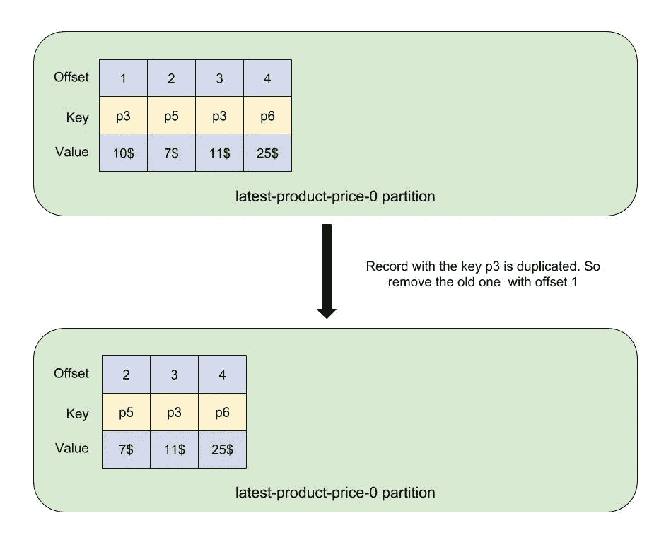
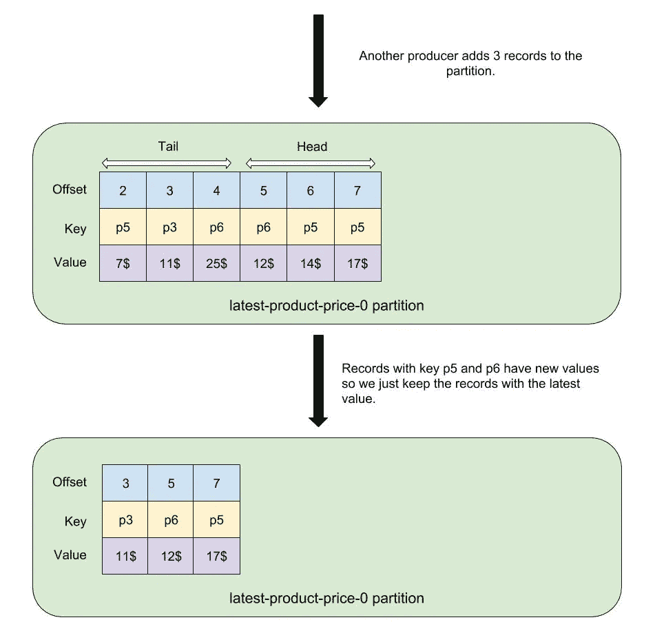
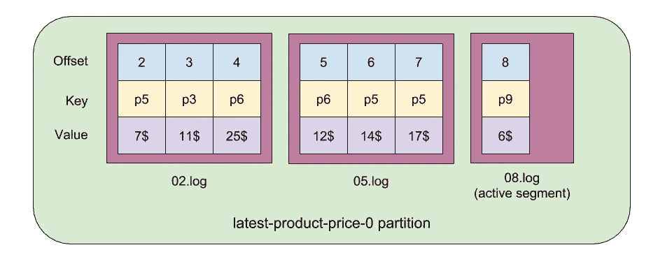
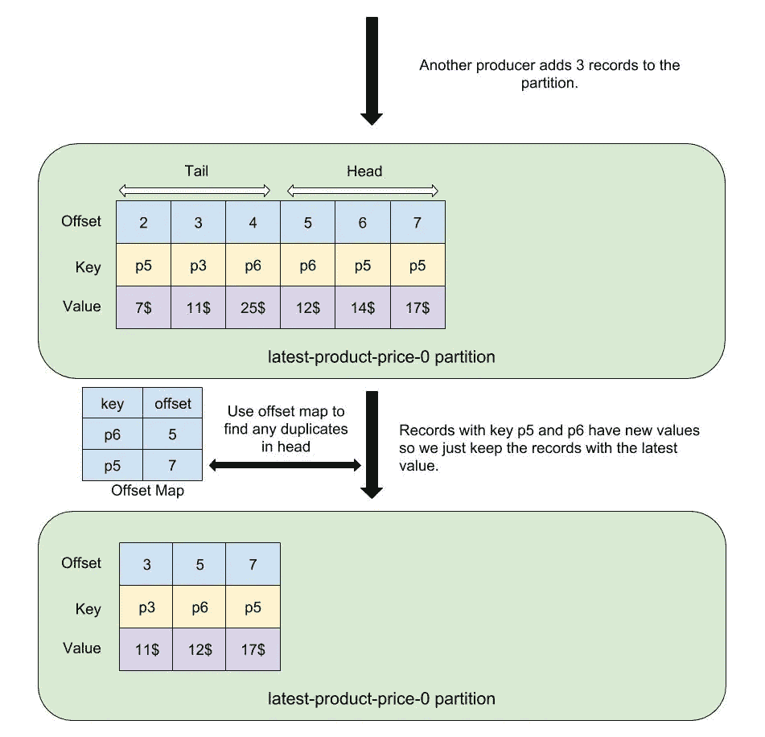

# Apache Kafka 中的日志压缩主题

> 原文：<https://towardsdatascience.com/log-compacted-topics-in-apache-kafka-b1aa1e4665a7?source=collection_archive---------1----------------------->

当我开始阅读 Kafka 文档时，尽管日志压缩主题似乎是一个简单的概念，但我并不清楚 Kafka 如何在文件系统中内部保存它们的状态。这个月我有时间阅读了更多关于这个特性的内容，我想和你分享我的理解。

# TL；速度三角形定位法(dead reckoning)

在这篇文章中，我将描述卡夫卡中的日志压缩主题。然后，我将向您展示 Kafka 如何在文件系统中内部保存这些主题的状态。

# 先决条件

我假设您已经熟悉 Apache Kafka 的基本概念，如代理、主题、分区、消费者和生产者。另外，如果您想运行示例命令，您必须运行一个 Kafka broker *和一个 Zookeeper 服务器。*

# 什么是日志压缩主题

卡夫卡的文献记载说:

> 日志压缩是一种机制，可以提供更细粒度的按记录保留，而不是更粗粒度的基于时间的保留。这个想法是有选择地删除具有相同主键的更新记录。这样可以保证日志中至少有每个键的最新状态。

为了简化这种描述，当分区日志中存在具有相同关键字的新版本时，Kafka 会删除任何旧记录。作为示例，考虑名为“最新产品价格”的日志压缩主题的以下部分:



正如您首先看到的，有两条带有键 p3 的记录。但是因为这是一个日志压缩的主题，Kafka 在一个后台线程中删除了旧的记录(在接下来的小节中会有更多的介绍)。现在假设我们有一个生产者向这个分区发送新记录。生产者产生 3 个记录，分别具有键 p6、p5、p5:



Kafka broker 中的一个后台线程再次删除了带有键 p5 和 p6 的旧记录。请注意，压缩日志由两部分组成:尾部和头部。Kafka 确保尾部分中的所有记录都有唯一的键，因为尾部分是在清理过程的前一个循环中扫描的。但是 head 部分可以有重复的值。

既然我们已经了解了什么是日志压缩主题，那么是时候使用`kafka-topics`工具来创建它们了。

# 创建日志压缩主题

创建一个压缩主题(我将详细描述所有配置):

```
kafka-topics --create --zookeeper zookeeper:2181 --topic latest-product-price --replication-factor 1 --partitions 1 --config "cleanup.policy=compact" --config "delete.retention.ms=100"  --config "segment.ms=100" --config "min.cleanable.dirty.ratio=0.01"
```

制作一些记录:

```
kafka-console-producer --broker-list localhost:9092 --topic latest-product-price --property parse.key=true --property key.separator=:
>p3:10$
>p5:7$
>p3:11$
>p6:25$
>p6:12$
>p5:14$
>p5:17$
```

注意，在上面的命令中，我用`:`分隔了键和值。现在消费题目:

```
kafka-console-consumer --bootstrap-server localhost:9092 --topic latest-product-price --property  print.key=true --property key.separator=: --from-beginning
p3:11$
p6:12$
p5:14$
p5:17$
```

如您所见，带有重复键的记录被删除。p5:14$记录没有被删除，我们将在描述清理过程时看到原因。但我们首先要看卡夫卡内部是如何储存信息的。

# 片段

分区日志是一种抽象，它允许我们轻松地消费分区内部的有序消息，而不必担心 Kafka 的内部存储。然而实际上，分区日志被 Kafka broker 分成了**段**。段是存储在文件系统中的文件(在数据目录和分区目录中)，它们的名称以`.log`结尾。在下图中，分区日志分为 3 个部分:



如您所见，我们有一个分区日志，它包含 7 条记录，分别位于 3 个独立的段文件中。一个段的第一个偏置称为该段的**基准偏置**。段文件名始终等于其基本偏移值。

分区中的最后一个段称为**活动段**。只有日志的活动段可以接收新生成的消息。我们将会看到卡夫卡在清理压缩原木的过程中是如何处理活动段的。

回到我们的例子，我们可以通过下面的命令查看我们的主题分区的段文件(假设您的 Kafka 数据目录是`/var/lib/kafka/data`):

```
ls /var/lib/kafka/data/latest-product-price-0/
00000000000000000000.index 00000000000000000006.log
00000000000000000000.log 00000000000000000006.snapshot
00000000000000000000.timeindex 00000000000000000006.timeindex
00000000000000000005.snapshot leader-epoch-checkpoint
00000000000000000006.index
```

`00000000000000000000.log`和`00000000000000000006.log`是该分区的段，`00000000000000000006.log`是活动段。

卡夫卡什么时候创造了一个新的片段？一种方法是在主题创建期间设置`segment.bytes`(默认为 1GB)配置。当您的分段大小变得大于该值时，Kafka 将创建一个新的分段。另一个选择是通过设置`segment.ms`，就像你之前看到的那样。使用该选项，当 Kafka 收到一个生产请求时，它将检查活动段是否比`segment.ms`值旧。如果它是旧的，那么它将创建一个新的段。在我们的命令中，我们设置`segment.ms=100` 来确保每 100 毫秒创建一个新的段。

有趣的是，当你设置`segment.ms=100`时，你可能会有更小的段。在清理过程(见下一节)之后，Kafka broker 将合并非活动段并从中创建一个大段。

有关 Kafka 的分段和内部存储的更多信息，您可以阅读[Kafka 的存储内部结构如何工作](https://thehoard.blog/how-kafkas-storage-internals-work-3a29b02e026)和[Kafka 存储内部结构实用介绍](https://medium.com/@durgaswaroop/a-practical-introduction-to-kafka-storage-internals-d5b544f6925f)文章。

# 洁化过程

在启动过程中，Kafka broker 会创建一些**清理线程**，负责清理压缩的日志(这些线程的数量可以通过`log.cleaner.threads` config 进行配置)。清洁线程会不断尝试在代理中找到最脏的日志，然后尝试清理它。对于每个日志，它按如下方式计算**脏比**:

```
dirty ratio = the number of bytes in the head / total number of bytes in the log(tail + head)
```

cleaner 线程然后选择具有最高**脏比**的日志。这个日志被称为最脏的日志，如果它的值大于`min.cleanable.dirty.ratio` config，它将被清除。否则，清洁线程将被阻塞数毫秒(可通过`log.cleaner.backoff.ms`配置)。

在找到最脏的日志后，我们希望找到可清理的日志部分。请注意，日志的某些部分是不可清除的，因此不会被扫描:

*   活动段内的所有记录。这就是为什么我们仍然在消费者中看到重复的 p5:14$记录。
*   如果您将`min.compaction.lag.ms`配置设置为大于 0，那么任何包含时间戳早于此配置的记录的段都不会被清除。不会对这些段进行压缩扫描。

现在我们知道了要压缩哪些记录。从日志中的第一条记录到第一条不可清除的记录。在本文中，为了简单起见，我们假设头中的所有记录都是可清除的。

请注意，我们知道日志尾部的每条记录都有一个唯一的键，因为重复的记录在上次清理中被删除了。只可能我们在 head 部分有一些记录，它们的键在日志中不是唯一的。为了更快地找到重复记录，Kafka 在 head 部分为记录创建了一个映射。回到我们的示例，偏移贴图结构如下所示:



如你所见，Kafka 创建了一个名为**偏移贴图**的结构，它为 head 部分中的每个关键点保存其对应的偏移。如果我们在头部有重复，卡夫卡使用最新的偏移。在上图中，键为 p6 的记录位于偏移量 5 处，p5 的最新偏移量为 7。现在，cleaner thread 检查日志中的每条记录，如果 offset map 中有任何记录具有相同的键，并且它的偏移量与 map 中的条目不同，就删除它(我们不想删除最新的记录)。

在压缩日志的清理过程中，不仅会删除重复的消息，而且 Kafka 还会删除值为 null 的记录。这些记录被称为**墓碑**。您可以通过设置`delete.retention.ms` 配置来延迟删除它们。通过设置此配置，Kafka 检查包含此记录的数据段的修改时间戳，如果修改时间早于配置值，则记录将被保留。

现在木头变得干净了。经过这个清洗过程，我们有了一个新的尾巴和一个新的头！为清理而扫描的最后一个偏移(在我们的例子中是旧头中的最后一个记录)是新尾的最后一个偏移。

Kafka 在数据目录的根目录下的一个名为`cleaner-offset-checkpoint`的文件中保存新头的起始偏移量。该文件用于日志的下一个清理周期。我们可以查看我们的主题检查点文件:

```
cat /var/lib/kafka/data/cleaner-offset-checkpoint
0
1
latest-product-price 0 6
```

如你所见，有三行。第一行是文件的版本(我认为是为了向后兼容)，第二行的值为 1，表示这一行之后有多少行(只有一行)，最后一行包含压缩日志主题的名称、分区号和这个分区的头偏移量。

# 结论

在本文中，我向您展示了什么是日志压缩主题，它们是如何存储的，以及 Kafka 如何定期清理它们。最后，我想指出的是，日志压缩非常适合于缓存场景，在这种场景中，您希望几乎实时地保存每条记录的最新值。假设您想在应用程序启动时构建缓存。您可以直接读取压缩的主题并构建您的缓存，因为 Kafka 按顺序读取消息，这比使用 SQL 数据库预热您的缓存要快得多。

你可以在 Martin Kleppmann [的文章《翻转数据库》中读到更多关于这种技术的内容。你可能还会发现我以前的文章](https://martin.kleppmann.com/2015/03/04/turning-the-database-inside-out.html)[使用 Kafka 和 Debezium](https://medium.com/@mousavi310/beat-cache-invalidation-in-asp-net-core-using-kafka-and-debezium-65cd1d80554d) 在 ASP.NET 内核中击败缓存失效很有用，它是这种技术的一个实现。

# 参考

[https://github.com/apache/kafka/](https://github.com/apache/kafka/)
https://thehoard . blog/how-kafkas-storage-internals-work-3a 29 b 02 e 026
[https://medium . com/@ durgaswaroop/a-practical-introduction-to-Kafka-storage-internals-d5b 544 f 6925 f](https://medium.com/@durgaswaroop/a-practical-introduction-to-kafka-storage-internals-d5b544f6925f)
[https://kafka.apache.org/documentation/](https://kafka.apache.org/documentation/)