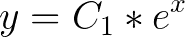
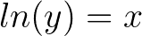
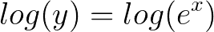
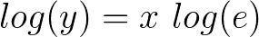
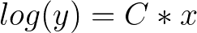
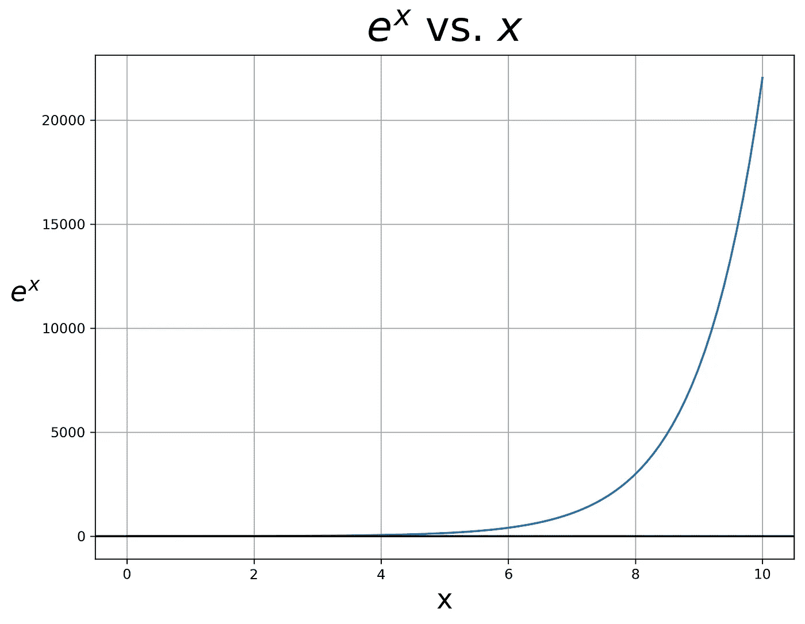
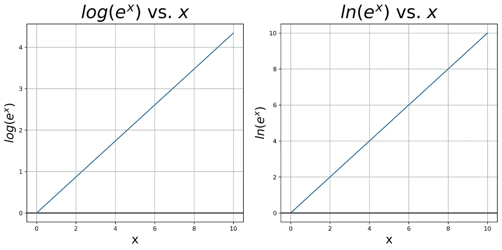
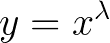

# 数据线性化的对数变换基础无关紧要

> 原文：<https://towardsdatascience.com/log-transformation-base-for-data-linearization-does-not-matter-22eb3c1463d0?source=collection_archive---------20----------------------->


Photo by [Janus Clemmensen](https://unsplash.com/@janusclemmensen?utm_source=unsplash&utm_medium=referral&utm_content=creditCopyText) on [Unsplash](https://unsplash.com/search/photos/log-tree?utm_source=unsplash&utm_medium=referral&utm_content=creditCopyText)

## 解释为什么对数基数在线性化数据时没有显著影响的简单推导

此演示的代码可在此处找到:

今天一位同事问了我一个简单的问题:

> "你如何找到最好的对数底数来线性变换你的数据？"

这实际上是一个棘手的问题，因为**没有最好的对数基数来线性转换你的数据**——不管对数的基数是多少，你取一个对数的事实都会使它线性化。

我的同事持怀疑态度，我想重温一下我的代数，所以让我们开始钻研数学吧！

# 前提

让我们假设你有指数数据。这意味着您的数据的形式类似于以下形式:



(1)

这意味着我们的数据是非线性的。线性数据可以说是我们可以建模的最佳数据形式，因为通过[线性回归](https://en.wikipedia.org/wiki/Linear_regression)，我们可以**通过查看目标变量**的系数，直接量化每个特征对目标变量的影响。线性回归是最好的模型类型，它给人类一种直观和定量的感觉，即该模型认为我们的因变量是如何受我们的自变量影响的，例如，与深度神经网络的黑盒相比。

# 衍生物

因为我们知道这里的基数是 *e，*我们可以通过取两边的自然对数来线性化我们的数据(忽略常数 C₁):



(2)

现在，如果我们绘制 *ln(y)* vs. *x* ，我们会得到一条直线。这很简单，但是如果我们不知道我们力量的基础是什么呢？我们可以试着取两边的对数(基数为 10):



(3)

但是看起来还不是线性的。但是，如果我们引入[对数幂法则](https://www.khanacademy.org/math/algebra2/exponential-and-logarithmic-functions/properties-of-logarithms/v/logarithm-of-a-power)呢？



(4)

但是 *log(e)* 是常数！因此，我们有:



(5)

**这意味着我们以 10 为基数的对数仍然与 x 成正比，只是比例因子 C 不同，在本例中是原始基数 *e* 的对数*。***

# 它看起来像什么？

我们也可以用一些 python 代码来可视化这一点！

```
import numpy as np
import matplotlib.pyplot as plt# Set up variables, x is 1-9 and y is e^x
x = list(np.linspace(1,10,100))
y= [np.exp(i) for i in x]# Plot the original variables - this is barebones plotting code, you  # can find the more detailed plotting code on my github!plt.plot(x,y)# Plot log base 10 of y
plt.plot(x,np.log10(y))# Plot log base e of y
plt.plot(x,np.log(y))
```



They are both linear, even though the logarithms have different bases (base 10 vs base e)!

两个对数之间唯一变化的是 y 刻度，因为斜率略有不同！重要的是**两者仍然与 x 成线性比例，因此在线性回归模型中具有相同的性能。**

# 结论

综上:**如果你有指数数据，可以做任意基数的对数变换，将数据线性化**。如果你对领域知识的基础有直觉，那么就使用正确的基础——否则就没关系了。

# 附注:其他转换

如果您的数据是 x 的某个未知λ次方的稍微不同的形式，会怎么样？



(6)

在这种情况下， [Box-Cox 变换](https://en.wikipedia.org/wiki/Power_transform#Box–Cox_transformation)将帮助您找到理想的幂来提升您的数据，以便将其线性化。我推荐用 [Sci-py 的实现](https://docs.scipy.org/doc/scipy/reference/generated/scipy.stats.boxcox_normmax.html#scipy.stats.boxcox_normmax)。

这一篇就讲到这里，感谢阅读！