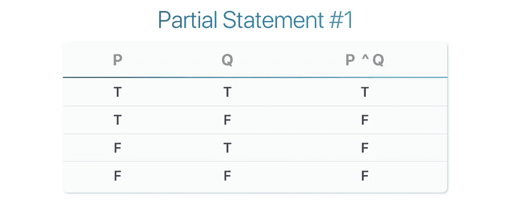
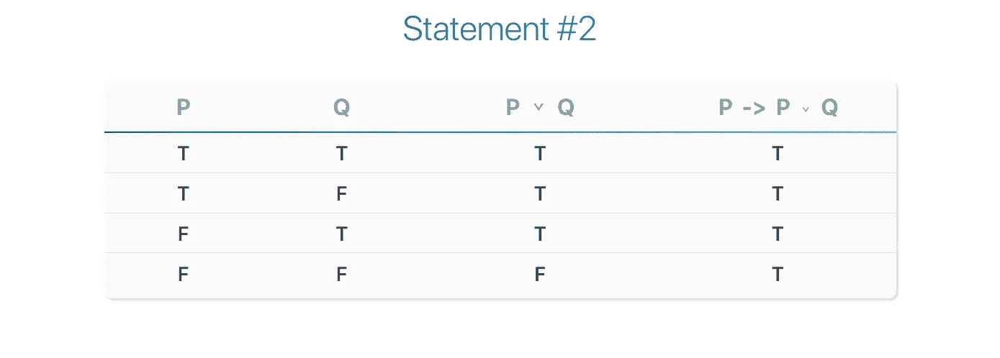
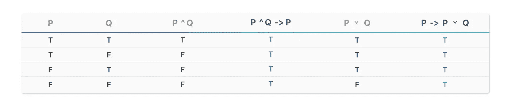

# 逻辑理论—等价性

> 原文：<https://towardsdatascience.com/logic-theory-equivalency-f5251af2b549?source=collection_archive---------22----------------------->

## 第四部分——使用真值表证明相等的陈述

Originally Published: [https://www.setzeus.com/](https://www.setzeus.com/)

本系列的第三部分以对真值表的初步理解而告终。我们看了两个独立的例子，映射出一个否定&一个暗示。然而，你可能已经意识到，虽然我们已经应用真值表来评估复合前提，我们还没有*证明*两个或更多陈述之间的任何等价性。

本文通过关注一个非常复杂的最终例子来扩展我们对真值表的了解。我们将直接比较两个复合前提*，以证明它们*在逻辑上等价*，而不是绘制出一个*单个*复合前提。具体来说，以下两种说法:*

**陈述#1: (P ^ Q) - > P**

**语句#2: P - > (P ⌄ Q)**

这一次我们将*而不是*为我们的两个前提提供进一步的上下文，就像我们在上一个例子中所做的那样——为什么？为了把不需要的观点讲清楚*。*创建真值表的过程*不*改变；我们严格关注源于每一个可能场景的个体真值&假值。

那么我们如何使用真值表来证明上述两者的等价性呢？

很简单，通过创建一个大规模的真值表来比较两个语句的最后两列。我们首先计算陈述#1 和陈述#2 各自的真值和假值；然后，之后，比较这些最终值，以证明(或证明)它们在逻辑上是等价的。

如果你想跳过，我们会在最后的真值表中清楚地看到这一点。不过现在，我们将从头开始。让我们来看看陈述 1。

## 构造语句#1

不要一次推导出(p ^ q)—>p 的所有*场景，让我们把它分成两个主要部分。忽略语句的隐含部分(- > P) &我们只剩下一个更容易处理的语句。有了两个前提&和一个连接词(连词/and)，我们可以推断出我们的部分语句#1 表总共需要三列&四行:*

Originally Published: [https://www.setzeus.com/](https://www.setzeus.com/)

如果你一直跟着做，上面的真值表是很简单的。我们在第一列和第二列简单地列出了两个前提(P，Q)所有可能的真值和假值，然后在第三列计算合取的真值和假值。回想一下，一个连词(P^Q)翻译成“P *和 Q* 为真”正如你在上面看到的，当 P & Q 都为真时，这种情况只发生在第一行*中。*

无可否认，推导语句#1 的结果列，即蕴涵(P ^ Q) -> P，要复杂得多。下面，我做了一些非常规的事情，复制并重新定位了一个列(P ),以使计算的含义更加清晰:

Originally Published: [https://www.setzeus.com/](https://www.setzeus.com/)

过多地阅读专栏标题很容易让人迷失方向。尽管有多个变量，但这仍然是一个简单的暗示，就像我们在上一篇文章中回顾的那样。试着忽略列标题&从左到右，一次一行地分析隐含的意思。

第一行陈述了前因和后果都保持*为真，*这意味着整体蕴涵也确实为真。然而，在第二行到第四行中，antecedent 为 false。从我们之前的文章中，我们证实了在*的任何*蕴涵中，一个错误的前因总是导致一个正确的蕴涵；因此，第二到第四行中的隐含值也都是*真*。

我们走吧！有了所有*真的最后一列，*语句#1 现在被完全评估。假设*的这一列为 true*作为一个等式的左边，现在我们需要检查右边。证明语句#1 在逻辑上等价于语句#2 现在是一条清晰的前进道路。我们将计算语句#2 &的值，如果它们都为*真，*那么完美，我们有一个匹配；如果它们不同，那么我们可以明确地断定它们不等价。

## 构造语句#2

第二次就容易多了。我没有在多个步骤中写出表格，而是快进到完成的陈述#2 真值表:

Originally Published: [https://www.setzeus.com/](https://www.setzeus.com/)

从计算列数开始，比上一个示例中的语句#1 表少一列——不要让这使您迷惑，这次我们只是选择了*而不是*重写列(P)。此外，请注意我们从陈述#1 中重复的任何其他列？*前提列(P) & (Q)的两个*都出现在语句# 1 &语句#2 中。最后但同样重要的是，看一下最后一列，这里的*确实*确认了所有*真实*值的另一列，**与语句#1 中的**完全相同。这最后一个观察回答了我们要回答的问题:由于两个语句在每个场景中都有相等的结果真/假值，我们可以无可争议地得出结论，它们*在逻辑上*是等价的。

# 最后

现在，这两种说法都推断出了它们最终的真值和假值，构建最终的真值表严格来说就是重新排列我们一路推导出来的列。如上所述，我们只需要写入我们的(P)和(Q)列*一次。*接下来，我们放入两个中间连接词，我们为两个语句分别计算了连接词(^) &析取词(⌄)。最后，我们有两个语句结果，用蓝色字母表示的两列，这是我们在比较语句逻辑上是否等价时唯一关心的两列。

通过第三个例子，我们最终应用了一个真值表来证明逻辑等价；当我们一点一点地建造它的时候，随着重复的曝光，这种需要会变得越来越少。理想情况下，当开始一个未来的问题时，我们至少会知道哪些列是必要的，以及如何安排它们——直接跳到上面抛光的真值表的结构。

如果你一直坚持到现在，那么恭喜你。虽然最后一个例子仅仅触及了逻辑证明的表面，但我们至少现在已经具备了在不久的将来进行更深入研究所需的基本理解。然而现在，在继续进行高级证明之前，我们将再次绕道一个名为 [*集合论*](https://en.wikipedia.org/wiki/Set_theory) 的迷人分支。照例评论，反馈&问题不胜感激。

***来源***

[逻辑:形式推理的理论](https://amzn.to/31wqm0D)
[数学的基础](https://amzn.to/2H3rb9E)