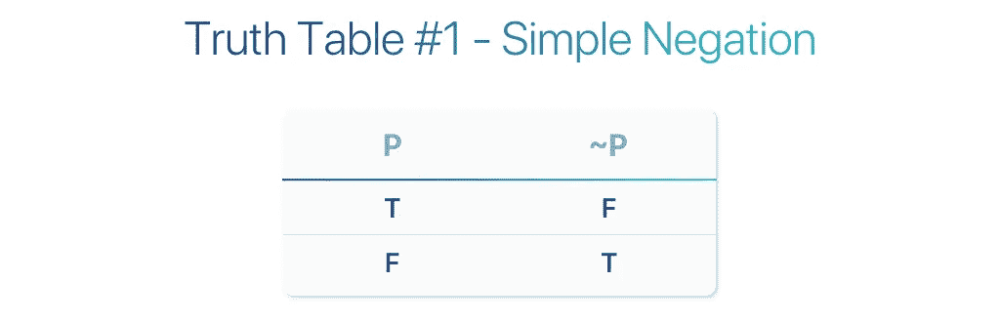
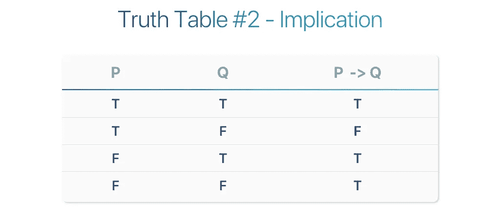
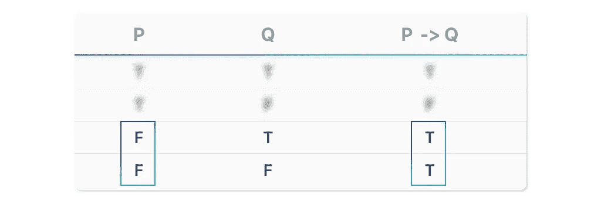

# 逻辑理论—真值表

> 原文：<https://towardsdatascience.com/logic-theory-truth-tables-de313f78a16a?source=collection_archive---------9----------------------->

## 第三部分——跨学科逻辑工具介绍

Originally Published On [https://www.setzeus.com/](https://www.setzeus.com/)

[现在已经掌握了逻辑理论的原理以及基本符号](https://medium.com/@jesus_notchrist/logic-theory-basic-notation-d8cf44cb297b)，是时候探索逻辑中的*等价*的概念了。具体来说，是什么让两个复合前提相等？

两个复合前提 X & Y 是 ***逻辑等价的*** 如果，对于组成 X & Y 的原始前提的真值的每个赋值，陈述 X & Y 具有相同的真值。

这是一个难以接受的定义，但我们关心的是这个定义的应用。为了实现这一点，我们将遍历多个越来越复杂的例子。不过，首先，让我们绕道了解一下我们的 Excalibur 这是逻辑学家证明逻辑等价的最简单、最强大的工具之一: [*真值表*](https://en.wikipedia.org/wiki/Truth_table) 。

# 真值表介绍

真值表是一种可视化工具，以具有行和列的图表的形式，显示复合前提的真或假。这是一种组织信息的方式，从提供的前提中列出*所有可能的场景*。让我们从最简单的例子开始，一个真值表描述了一个单一的前提操作:一个原始前提(P)的否定(~)

Originally Published On [https://www.setzeus.com/](https://www.setzeus.com/)

真值表总是从左向右读，第一列有一个原始前提。在上面的例子中，我们的原始前提( **P** )在第一列；而*的结果前提(* ***~P 的*** *)，*的后置否定，则构成了两列。

这里很容易想多了——不要忘记前提只是一个陈述，要么是真的，要么是假的。由于这个例子只有一个*单个*前提，我们只需要追踪两个结果；当 P 为真或为假时会产生两行。第一行描述，从左到右阅读，如果 P 为真，那么 P 的否定为假；第二行显示如果 P 已经为假，那么 P 的否定为真。

让我们继续看一个更复杂的例子，通过插入一个我们以前见过的连接词:蕴涵(->)。为了使这一点更容易理解，在建立真值表之前，让我们给我们的语句 P & Q 分配一些上下文:

灭霸打响指

**问:50%的生物消失了**

在看下面之前，考虑一下上面给出的细节。首先，因为我们有两个原始前提(P，Q)，我们知道我们至少需要*两列；此外，我们应该为带有隐含连接词(P - > Q)的结果前提做准备，这将需要另一列。共有**三列**。*

行呢？因为我们有两个前提，每个都可以为真或为假，为了说明*所有*可能的情况，我们总共需要 ***四个*行***(P . S——从这个观察可以得出一个简洁的推论:说明 N 个前提的真值表需要 N 行)*。现在让我们把这张表画出来&确保它是可以理解的:

Originally Published On [https://www.setzeus.com/](https://www.setzeus.com/)

逐行回顾上面的真值表。第一行证实了灭霸打了他的手指(P) & 50%的生物消失了(Q)。既然两个前提都成立，那么结果前提(蕴涵或条件)也成立:

Originally Published On [https://www.setzeus.com/](https://www.setzeus.com/)

第二排在理解上同样直接。这一次，P 仍然为真，然而 Q 现在为*假。*这里的解释是“灭霸掰着手指头，但是百分之五十的生物*做到了* ***而不是*** 消失。”既然我们开始证明这种暗示的有效性，那么前面的陈述把整个前提完全错误是有道理的:

Originally Published On [https://www.setzeus.com/](https://www.setzeus.com/)

最后两行有点反直觉。这里有一个捷径:我们只需要看第一列，就可以证明这个蕴涵是真的。在第三行和第四行中，先行前提(P)为*假—* ，这是我们所需要知道的，不考虑前提 Q 的值，以确定蕴涵为**真。**

Originally Published On [https://www.setzeus.com/](https://www.setzeus.com/)

为什么一个错误的前因总是导致一个正确的暗示？因为在我们逻辑陈述的宇宙中，既然前因没有发生，就不可能排除*所有*可能导致 q 的可能场景。例如，第 3 行说“灭霸*没有*折断他的手指，然而 50%的生物消失了”。嗯，据我们所知，流星、自然灾害、外星人入侵或无数其他活动可能导致了那次灭绝——在这些场景的任何一个场景中，不管是哪一个，这种暗示都是真实的，因为我们仍然无法证明当他打响指时会发生什么。

# 证明等价性

真值表是光滑、方便的逻辑跟踪图，不仅出现在数学中，也出现在计算机科学、电子工程和哲学中。符号可能会因您从事的行业而异，但基本概念是相同的。它们是一种多用途的跨学科工具——然而我们仅仅触及了它们效用的表面。

现在有了真值表，是时候证明多个复合前提之间的等价性了。在本系列的下一篇文章中，[我们将利用我们的复合知识来证明两个不同的复合前提，比如蕴涵式&反正，是相等的。](https://medium.com/@jesus_notchrist/logic-theory-equivalency-f5251af2b549)

***原载于***

[https://www.setzeus.com/](https://www.setzeus.com/)

***来源***

[逻辑:形式推理的理论](https://amzn.to/31wqm0D)
[数学的基础](https://amzn.to/2H3rb9E)