# 作为非线性分类器的逻辑回归

> 原文：<https://towardsdatascience.com/logistic-regression-as-a-nonlinear-classifier-bdc6746db734?source=collection_archive---------3----------------------->

*逻辑回归传统上被用作线性分类器，即当类别可以在特征空间中由线性边界分开时。但是，如果我们碰巧对决策边界的形状有更好的想法，这是可以补救的……*

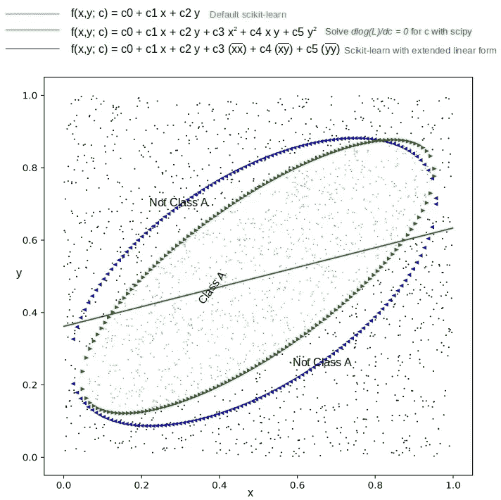

逻辑回归是已知的，并被用作线性分类器。它用于在特征空间中提出一个超*平面*，以将属于某一类的观察结果与不属于该类的*的所有其他观察结果分开。因此，判定边界是线性的。使用逻辑回归作为线性分类器的健壮和有效的实现是容易获得的(例如 scikit-learn)。*

虽然逻辑回归对观察值做出了核心假设，如 IID(每个观察值都独立于其他观察值，并且它们都具有相同的概率分布)，但线性决策边界的使用*不是*之一。线性决策边界是出于简化的原因而使用的，遵循禅宗的原则——当有疑问时就简化。在我们怀疑决策边界是非线性的情况下，用非线性模型制定逻辑回归并评估我们能做得多好可能是有意义的。这就是这篇文章的内容。这是提纲。我们在这里浏览一些代码片段，但是可以从 [github](https://github.com/ashokc/Nonlinear-Classification-with-Logistic-Regression) 下载重现结果的完整代码。

*   简要回顾似然函数的公式及其最大化。为了避免代数运算，我们在二维特征空间中坚持两个类。特征空间中的点[x，y]只能属于其中一类，函数 f (x，y；c) = 0 定义了决策边界，如下图 1 所示。

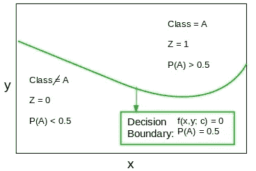

Figure 1\. The decision boundary f(x,y; c) = 0 in feature space, separates the observations that belong to class A from those that do not belong to class A. c are the parameters to be estimated.

*   考虑一个决策边界，它可以用特征变量的多项式表示，但在权重/系数中是线性的。这种情况适合使用 scikit-learn 的 API 在(线性)框架内建模。
*   考虑一个不能用多项式表示的一般非线性决策边界。在这里，我们靠自己找到最大化似然函数的模型参数。scipy.optimize 模块中有很好的 API 可以帮助我们。

# 1.逻辑回归

逻辑回归是从一组连续和/或分类的观察值中预测(回归到)离散结果的一种练习。每个观察值都是独立的，并且一个观察值属于该类的概率是相同的！)描述该观察的特征的函数。考虑一组 *n* 的观测值[ *x_i，y _ I；Z_i* 其中 *x_i，y_i* 是第*次*次观测的特征值。*如果第*个*个观测值属于该类，则 Z_i* 等于 1，否则等于 0。获得 *n* 个这样的观测值的可能性仅仅是分别获得每个观测值的概率 *p(x_i，y_i)* 的乘积。

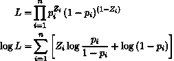

Equation 1\. Define the likelihood & log-likelihood functions

比率 *p/(1-p)* (称为优势比率)沿着决策边界将是 1，即 *p = 1-p* = 0.5。如果我们定义一个函数 *f(x，y；c)* 为:

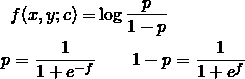

Equation 2\. f is the functional form for log(odds ratio)

然后 *f(x，y；c) =0* 将是决策边界。 *c* 是函数 *f* 中的 *m* 参数。根据 *f* 的对数似然为:

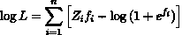

Equation 3\. Log-likelihood in terms of the data and parameters c. Ready to be maximized for the correct c

现在剩下要做的就是找到一组参数值 *c* ，使等式 3 中的 *log(L)* 最大化。我们可以应用最优化技术，或者为 *c* 求解耦合的非线性方程组*m*d log(L)/DC = 0。

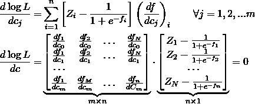

Equation 4 When LL is maximum, d log(L)/dc = 0 at that c value(s)

不管怎样，手里有了 *c* 就完成了 *f* 的定义，并允许我们找出特征空间中任意点的类别。这是坚果壳中的逻辑回归。

# 2.函数 f(x，y；c)

在等式 2 中， *f* 的任何函数都有效吗？肯定不会。随着 *p* 从 0 到 1， *log(p/(1-p))* 从 *-inf* 到 *+inf* 。所以我们需要 *f* 在两个方向上都是无界的。只要我们确保 *f* 的范围从 *-inf* 到 *+inf* ，那么 *f* 的可能性是无穷无尽的。

## 2.1 f(x，y；c)

选择线性形式，例如

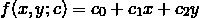

Equation 5\. The default linear form used in general (e.g. scikit-learn)

肯定会起作用，这导致传统的逻辑回归可用于 scikit-learn，这也是逻辑回归被称为*线性*分类器的原因。

## 2.2 f(x，y；c)

一个简单的扩展方程 5 是使用更高次的多项式。一个二阶方程简单来说就是:

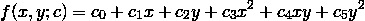

Equation 6\. A simple extension that lends itself to embed nonlinearities for linear logistic regression

请注意，上述公式与线性情况相同， *if* 我们将 *x、xy* 和 *y* 视为问题的三个附加独立特征。这样做的动机是，我们可以直接应用 scikit-learn 的 API 来获得 c 的估计值。然而，我们在结果部分看到，以这种方式获得的 *c* 不如直接求解等式 4 获得的 *c* 。至于为什么，这有点神秘。但是在任何情况下，用 scipy 中的模块求解方程 4 都很容易。方程 4 所需的导数简单地表示为

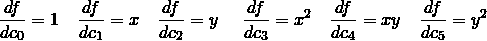

## 2.3，y；c)

像 *f(x，y；c) = sin(c_0x + c_2y) = 0* 不起作用，因为它的范围有限。但是下面会。

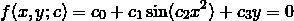

Equation 7\. A non-polynomial form for f

我们可以再次计算等式 4 的导数并求解其根，但有时更简单的方法是直接最大化等式 3 中的 *log(L)* ，这就是我们在接下来的仿真中要做的。

# 3.模拟

当 *f(x，y；c)* >小 _ 值)和那些不属于( *Z* = 1 当 *f(x，y；c)* < small_value)我们知道 *f(x，y；c)。*

训练和测试的数据各占 80/20。我们使用 scikit-learn 的 API 来比较我们想要比较的线性情况。

当选择求解 4 中的方程 *c* 或最大化方程 3 中的似然性时，我们使用 scipy.optimize 模块。下面代码片段中的 *LL* 和 *dLLbydc* 只是分别实现了等式 3 和 4。scipy 例程是为了最小化，所以我们在每种情况下否定符号，因为我们希望最大化可能性。

最后，我们求解 *c* ，从一个接近 0 的小的初始猜测开始。

# 4.结果

我们分别看多项式和其他一般情况。

## 4.1 f(x，y；c)= c0+C1 x+C2 y+C3 x+C4 x y+C5 y

我们得到一个椭圆作为以下 *c* 值的判定边界

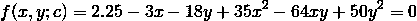

我们基于上述函数为每个类生成 1000 个数据点，并对这些数据应用逻辑回归，以查看它对决策边界的预测。

```
pipenv run python ./polynomial.py 1000 2.25 -3.0 -18.0 35.0 -64.0 50.0
```

下面的图 2 显示了不同方法获得的数据分布和决策界限。绿色三角形描绘的轮廓完美地分隔了数据，即 F1 值为 1。它是通过求解 c 的等式 4 获得的。红线是通过传统的逻辑回归方法获得的，显然是一条直线。考虑到非线性，它尽力做到最好，F1 得分为 0.5……蓝色三角形描绘的轮廓很有趣。它是通过在扩充的特征空间上应用传统的逻辑回归而获得的。也就是说，“x”、“x*y”和“y”被视为三个附加特征，从而*线性化* *f* 用于 scikit-learn。它的 F1 得分为 0.89，还不错。但是不完全清楚为什么它应该比求解 dlog(LL)/dc = 0 更差。


Figure 2\. The elliptical boundary separates the two classes. Solving dlog(LL)/dc = 0 yields the green contour that best matches the true decision boundary. The blue contour obtained solving the augmented linear form has over 10% error (why?) while the default application of logistic regression is 50% in error.

系数的实际值如下表 1 所示。c_0 换算成 1，这样我们就可以比较了。显然，求解 dlog(LL)/dc = 0 获得的系数最接近产生数据时使用的实际值。

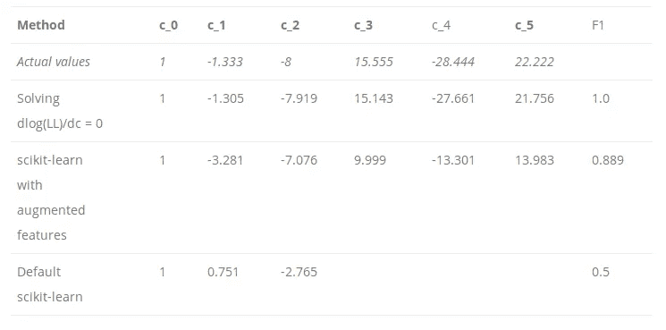

Table 1\. Coefficients obtained for the elliptic boundary

## 4.2 f(x，y；c) = c_0 + c_1 sin(c_2 x ) + c_3 y = 0

图 3 显示了运行模拟时的数据分布和预测边界

```
pipenv run python ./generic.py 1000 1.0 -1.0 1.0 -1.0
```

来自传统逻辑回归的直线获得 0.675 的 F1 分数，而 log(LL)的直接最小化获得满分。

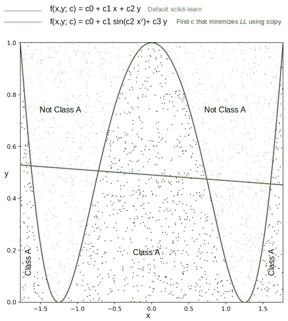

Figure 3\. The green line obtained by minimizing log(LL) perfectly separates the two classes.

下面的表 2 比较了模拟中获得的系数的值。有趣的是，C1 和 C2 的符号在实际值和最小化预测值之间是相反的。这很好，因为 sin(-k) = -sin(k)。

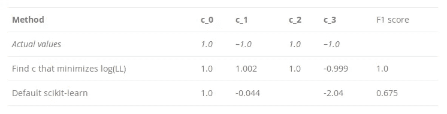

Table 2\. Coefficients obtained for the generic case

# 5.结论

传统上使用逻辑回归来提出将特征空间分成类别的超平面。但是，如果我们怀疑决策边界是非线性的，我们可以通过尝试 logit 函数的一些非线性函数形式来获得更好的结果。求解模型参数可能更具挑战性，但 scipy 中的优化模块会有所帮助。

*原载于 2019 年 3 月 13 日*[*xplordat.com*](http://xplordat.com/2019/03/13/logistic-regression-as-a-nonlinear-classifier/)*。*