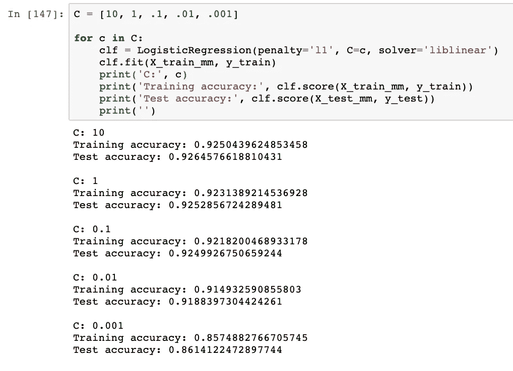

# 逻辑回归

> 原文：<https://towardsdatascience.com/logistic-regression-ca2d070a3eee?source=collection_archive---------12----------------------->

## 和 Scikit-learn 的实现

# 逻辑回归

## 理论

作为广义线性模型(GLM)家族的一员，逻辑回归在许多方面与线性回归相似(尽管名称容易混淆),用于具有两种可能结果的分类问题。

Sigmoid function: 1/(1+exp(-x))

逻辑回归对于分类问题很方便，因为它将 S 形逻辑(或 Sigmoid)函数拟合到数据，将线性方程压缩到 0–1 的输出范围。这个方便的范围允许逻辑回归对属于特定类别的数据点的概率进行建模，通常决策点的概率为. 5。

那么，这在数学上是什么样子的呢？sigmoid 函数如何挤掉线性方程？如您所知，为线性回归建模特征和目标变量之间的关系如下所示:

逻辑回归简单地采用该线性方程，并将其用作 sigmoid 函数的参数，以得出数据点属于特定类别(在下面的例子中，类别 1)的概率:

## 解读我们的模型

由于我们已经将线性模型压缩到一个概率范围内，每个特征的系数(或权重)不再以相加的方式影响输出。因此，为了解释我们的模型，我们可以将我们的 sigmoid 函数从输出范围 0-1 重新拉伸，通过将我们的概率转换为 log(odds)回到+/-无穷大。我们可以使用 logit 函数来实现这一点:

Where p is the probability of belonging to a class (i.e. class 1)

一旦在对数(赔率)尺度上，我们可以像解释线性方程一样解释我们的系数。假设所有其他特征和重量保持不变:

*   连续变量:每增加 1 个单位，对数(属于一个类别的概率)就增加一个系数
*   二进制离散变量:变量的存在使对数(属于一个类的几率)增加了系数的数量

## 最佳化

使用线性回归，我们通过最小化均方误差(MSE)找到最佳拟合线。然而，因为我们的线是在从-无穷大到+无穷大的对数(赔率)标度上，所以我们所有标记的观测值都具有+/-无穷大的值。发生这种情况是因为我们 100%确定我们的标签数据属于哪个类。因此，例如，属于类别 1 的观测值具有 Pr(y = 1) = 1。将它放入 logit 函数中会得到:

Example showing that labeled observations are +/-infinity on the logit scale

由于带标注的观测值的 y 值为+/-无穷大，因此无论数据的预期线是否拟合，残差的值都是+/-无穷大。没有合理的残差值，我们无法使用最小二乘法来优化我们的线。相反，逻辑回归使用最大似然优化。

为了找到我们的预期线的最大可能性，我们将观察值投影到对数(比值)标度上的线上(为每个观察值创建一个预期的对数-比值)，将对数(比值)转换为概率，并通过添加对数(每个数据点被分类为其标签的概率)来计算线的对数-可能性。然后，与最小二乘法类似，我们不断旋转对数(赔率)线并将数据投影到其上，将对数(赔率)转换为概率，并计算对数似然性。我们这样做，直到找到具有最大可能性的线。

为了更好地从概念上理解应用于逻辑回归的最大似然法，我推荐看看这个 [StatQuest](https://www.youtube.com/watch?v=BfKanl1aSG0) 视频。

# 用 Scikit-learn 实现

我有一些关于 Twitter 账号的数据，我会用逻辑回归来预测账号的真假。我每个 Twitter 账户的特点是:

*   追随者计数
*   以下计数
*   无论账户是否是私人的
*   媒体计数(推文数量)
*   账户持有人是否填写了个人资料
*   账户持有人是否提供外部 URL
*   以及这些的各种乘法组合

我将我的数据集分为训练集和测试集，并将连续变量转换为 0-1 的范围。我还处理了任何空值。所以，是时候看看我能否创建一个模型来预测一个账户是不是假的了。

第一步是导入 scikit-learn:

因为我有相当多的特征，并且我的直觉(在查看相关矩阵后)是不是所有的都有用，所以我选择 L1 正则化，这样特征可以被罚为 0。然而，我想调整超参数 C，以便正则化是有用的，但不会降低我的模型的准确性太多。

您会注意到，我的第一步是实例化一个 LogisticRegression 对象。在这里，我选择`'l1'`正则化，我的超参数`C=c`和我的求解器。对于机器学习算法的 scikit-learn 来说，这是一个非常标准的格式:你需要创建一个算法的对象，然后才能使它适合你的数据。

经过更多的测试后，我选择了 C=.1，因为我觉得它消除了我的一大部分功能(降低了我的模型复杂性),而没有对准确性做出太大的牺牲。

因为 scikit-learn 语法对于许多机器学习算法几乎完全相同，所以我倾向于使用这个函数来拟合分类模型:

View entire gist [here](https://gist.github.com/MsJacksonIYN/a881933a22f5fd8219fff49be33c1535)

因此，创建一个 LogisticRegression 对象并使用我的函数如下所示:

如你所见，我的测试准确率相当不错，达到了 92.5%。这意味着我的模型准确地分类了 92.5%的测试数据。为了找到我的特性的权重，我可以调用`lr.coef_`。将系数放入数据框并排序后，我们可以看到许多特征对我们模型的准确性并不十分有用。

绘制系数看起来像这样:

# 结论

逻辑回归是一种有用的分类算法，很容易用 scikit-learn 实现。正则化的逻辑回归也可以用于特征选择。

除了这里的代码片段，我所有的 Jupyter 笔记本都可以在我的 [Github](https://github.com/MsJacksonIYN/BotOrNot_Twitter) 上找到。

*任何理由请随意评论！我很乐意讨论你的想法。*

# 资源

【Josh Starmer 的 StatQuest:逻辑回归详情第一部分:系数

[可解释的 ML 书](https://christophm.github.io/interpretable-ml-book/logistic.html)

克里斯·阿尔邦

[百页机器学习书](http://www.themlbook.com/)