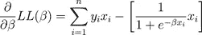

# 逻辑回归分类器

> 原文：<https://towardsdatascience.com/logistic-regression-classifier-2d4845916b35?source=collection_archive---------24----------------------->

Longleat Hedge Maze

***(下篇)***

***一步一步完成指南(概念性)***

在“逻辑回归”系列文章的第一篇文章[中，我们回答了以下问题:](https://medium.com/@caglarsubas/logistic-regression-classifier-8583e0c3cf9)

*   它使用和产生什么类型的数据(输入和输出)？
*   有哪些实验可以拿它在手？
*   它使用哪种决策/激活功能？
*   学习的目标如何写成一个等式？

这是系列文章的第二篇，我们将继续“优化目标”主题，并尝试完成下表中列出的所有剩余主题。

Index of the Article Series

# E.优化目标

# E.1 .获得梯度方程(微分)

## E.1.1 .硬币实验，“平均学习”

我们可以加入似然函数:

其中 *s* 为硬币实验成功(正面)发生的次数， *n-s* 为失败(反面)发生的次数，如下所示:

取联合似然函数的对数，我们得到对数似然:

它可以写成总和的形式:

取该函数相对于 *p* 的导数，并使其等于零，这将为我们带来最大化对数似然的 *p* 的最佳值。

分配求和运算:

乘以 *p(1-p)* 我们得到:

分布后，我们看到两个结果项相互抵消:

留给我们的是:

求解为 *p* :

看看我们如何证明在没有输入(解释变量)存在的情况下，'*平均值*'将带来最佳的估计性能(最大似然)。

## E.1.2 .信用评分实验，“随机学习”

像在一个真正的机器学习实验中一样考虑 xᵢ的情况怎么样？计算输入向量中每个观测值的“梯度/斜率”需要很长时间，并且当输入集合非常大时，通常是“内存不足”类型的操作。使用“随机”过程通过从数据集中随机选择特征向量并仅计算其梯度/斜率来弥补这种低效率。该过程重复选择随机数据点并比较它们的斜率，直到出现斜率收敛。这个过程以“随机梯度下降/上升——SGD/SGA”优化而闻名。SGD 算法的符号旅行如下图 1 所示。

*Figure-1: Gradient Descent Illustration*

要应用 SGD/SGA，我们需要回到“信用评分”实验，该实验具有下面给出的目标(联合似然)函数，并首先获得其梯度方程。

以下操作是寻找“信用评分”实验的目标函数的“梯度方程”的连续步骤。

*:联合对数似然函数*

**

****Step-2*** :取 log 将 *∏* 转换为 *∑**

**

****第三步*** :将 *P(yᵢ|xᵢ)* 替换为 *1/(1+e⁻ᶠ)**

**

****第四步*** :结合 wrt *yᵢ**

**

****第五步*** :合并方括号内的两个对数项*

**

****第六步*** :取消对数和指数函数*

**

****Step-7*** :我们要取偏导数的最终方程*

**

****第 8 步*** :偏导数*

**

*   **偏-1* :*

**

*   **部分-2* :*

**

*   **组合分音*:*

**

*   **用相应的条件概率(后验)项替换指数项*:*

**

*   **以 xᵢ为普通*:*

**

**给出对数似然梯度的最终形式(* ***梯度方程*** *)* 。*

*总之，我们的目标是找到参数 *β* 的最佳值，使“信用评分”实验的对数似然函数最大化。上述步骤为我们提供了对数似然的微分版本，预计它将在“梯度/斜率”为零的点处收敛到局部最大值/最小值。*

*因此，在常规的优化过程中[9]算法将尝试计算每个数据点的 *βᵢ* 向量 *xᵢ* 向量，这是一个“ *j×1* 维度的特征向量。由于计算所有系数在计算上是低效的，SGD/SGA 来到舞台上，牵着我们的手，走在目标/损失曲线[10]的底部或顶部。*

# *E.2 .寻找最大值-最小值*

*由于最终的“梯度方程”是“超越”形式，即包含非代数函数，如对数和指数，它不能直接求解(不存在封闭形式的解)。所以我们需要**迭代**逼近技术，例如；*

*   *梯度下降*
*   *牛顿-拉夫森方法*

*在机器学习中，我们通常在试图逼近目标函数的全局最大值或最小值时使用梯度下降技术，因为它相对于牛顿-拉夫逊法具有具体的优势。*

*Newton-Raphson 方法是一种求根算法[11],它利用函数的二阶导数知识(Hessian 矩阵)使函数最大化。当二阶导数[12]已知且易于计算时(如在逻辑回归中)，这可能会更快。然而，二阶导数的解析表达式通常是复杂或难以处理的，需要大量的计算。*

*另一方面，梯度下降仅使用一阶导数的知识来最大化/最小化函数。它简单地跟随从当前点到期望的山或洞的最陡下降。这就像在损失函数图中滚动一个球(如图 1 所示)，直到它停下来。由于梯度下降使用一阶导数，它被配置为寻找局部最大值/最小值，但我们需要得到全局最大值/最小值。为了解决这个问题，我们使用“随机”方法，随机计算损失曲线/超平面的不同点的梯度，并将所有局部最小值/最大值相互比较以获得全局值。这个过程如图 2 所示，其中 y 轴代表样本内误差(Eᵢₙ)'来自训练中的预测，x 轴代表在每一步 t 变化的权重/系数(βₜ)*

**

**Figure-2: Stochastic Gradient Descent Illustration**

*标准梯度下降算法定义如下，其中 *η* 是“*学习率*，*δ*代表梯度方程。*

**

*在上面的算法中，在当前点，人们采取与函数的梯度(或近似梯度)的负值成比例的步骤(学习速率)。相反，如果采取与梯度的正值成比例的步长，则接近该函数的局部最大值。这个过程被称为梯度上升。*

*更正式地说，我们应该注意到，当 Eᵢₙ(||βₜ-βₜ-₁||在我们做出步骤后开始不显示有意义的变化时，上述算法将收敛(中断)。*

*为了获得更多关于梯度下降算法的技术知识，最好阅读 [Avinash Kadimisetty](/gradient-descent-demystified-bc30b26e432a) 在《走向数据科学》中的帖子，并在 youtube 上观看 *3BLUE1BROWNSERIES* 频道的[视频](https://www.youtube.com/watch?v=IHZwWFHWa-w&t=463s)，这在我看来绝对是最有信息量的分享！除此之外，如果你想了解牛顿-拉夫森方法及其在逻辑回归中的应用，请观看 Youtube 上*百货*频道精心准备的[视频](https://www.youtube.com/channel/UC5_6ZD6s8klmMu9TXEB_1IA)。所有这些分享都列在文章末尾的参考文献列表中。*

# *F.进一步阅读*

*   ***Sigmoid vs. ReLu** :使用‘Sigmoid’作为激活函数，在训练模型时会带来一些弊端。例如，它的一阶导数不是单调的，如下所示。ReLu 是目前神经网络分类器最常用的激活函数。详细说明可以从[这里](/activation-functions-neural-networks-1cbd9f8d91d6)找到。*

**

*Figure-3: Derivative of Sigmoid Function*

**

**Figure-4: Sigmoid and ReLu Comparison**

*   *逻辑回归 vs .朴素贝叶斯:这实际上是理解“判别型”和“生成型”模型之间的区别。这里有一个简短而优雅的帖子。*

# *G.附录*

# *G.1 .脚注*

*[1]互补子群被称为“生成模型”，其成员包括“朴素贝叶斯”和“费希尔线性判别式”。*

*[2]因为它产生的曲线是连续的。但是“希格诺函数——符号(x)”不是，因为它是离散的。*

*[3]这导致了拟合过程中的“偏差”。噪声是数据产生过程的自然过程。因此，即使我们使用我们所有的数据集(使用平均假设集 *g_bar(x)* ，对于未知的目标函数，总有一个“近似”极限。*

*[4]由该比率产生的值将用于建立“评分等级”,这是“信用评分模型”建立过程的最后一部分。*

*[5]寻找问题的答案:“特征中一个单位的变化对目标的影响有多大？”*

*[6]例如随机梯度下降或二次规划*

*[7]朴素贝叶斯、集合树、SVM、神经网络等。*

*[8]或者最小化“对数似然函数”的负值将是一个棘手的动作，这取决于我们拥有的优化工具。如果目标是最小化，目标函数可以称为“损失/成本函数”。*

*[9]例如，一种“梯度下降”算法，它不是“随机地”工作，而是顺序地试图计算目标/损失函数曲线/超平面上的所有斜率。*

*[10]或者通常是如图 4 所示的超平面*

*[11]它被称为“求根方法”,因为它试图通过用线性函数 g 逼近 f’然后显式求解该函数的根来找到满足 f’(x)= 0 的点 x。g 的根不是*

*[12]帮助我们了解目标函数曲面的“凹度”。*

# *G.2 .参考*

*   *[https://www . cs . CMU . edu/~ mgormley/courses/10701-F16/schedule . html](https://www.cs.cmu.edu/~mgormley/courses/10701-f16/schedule.html)(第五讲)*
*   *[https://web . Stanford . edu/class/archive/cs/cs 109/cs 109.1166/pdf/40% 20 logistic regression . pdf](https://web.stanford.edu/class/archive/cs/cs109/cs109.1166/pdfs/40%20LogisticRegression.pdf)*
*   *[https://www.youtube.com/watch?v=mbyG85GZ0PI&t = 2s](https://www.youtube.com/watch?v=mbyG85GZ0PI&t=2s)*
*   *[http://kronosapiens . github . io/blog/2017/03/28/objective-functions-in-machine-learning . html](http://kronosapiens.github.io/blog/2017/03/28/objective-functions-in-machine-learning.html)*
*   *[https://towards data science . com/gradient-descent-de mysticed-BC 30 b 26 e 432 a](/gradient-descent-demystified-bc30b26e432a)*
*   *https://youtu.be/YMJtsYIp4kg*
*   *【https://newonlinecourses.science.psu.edu/stat414/node/191/ *
*   *[https://data science . stack exchange . com/questions/25444/advantages-of-monotonic-activation-functions-over-non-monotonic-functions-in-neu](https://datascience.stackexchange.com/questions/25444/advantages-of-monotonic-activation-functions-over-non-monotonic-functions-in-neu)*
*   *[https://stats . stack exchange . com/questions/253632/why-is-newtons-method-not-wide-used-in-machine-learning](https://stats.stackexchange.com/questions/253632/why-is-newtons-method-not-widely-used-in-machine-learning)*
*   *[https://stack overflow . com/questions/12066761/梯度下降和牛顿梯度下降的区别是什么](https://stackoverflow.com/questions/12066761/what-is-the-difference-between-gradient-descent-and-newtons-gradient-descent)*
*   *[http://www.wikizero.biz/index.php?q = ahr 0 CHM 6 ly 9 lbi 53 wtpcgvkaweub 3 jnl 3 DP a2 kvtgluzwfyx 2 nsyxnzawzpxi](http://www.wikizero.biz/index.php?q=aHR0cHM6Ly9lbi53aWtpcGVkaWEub3JnL3dpa2kvTGluZWFyX2NsYXNzaWZpZXI)*
*   *[https://en.wikipedia.org/wiki/Linear_classifier](https://en.wikipedia.org/wiki/Linear_classifier)*
*   *[https://en.wikipedia.org/wiki/Logistic_regression](https://en.wikipedia.org/wiki/Logistic_regression)*
*   *[https://www.youtube.com/watch?v=IHZwWFHWa-w&t = 463s](https://www.youtube.com/watch?v=IHZwWFHWa-w&t=463s)*
*   *[https://towards data science . com/activation-functions-neural-networks-1 CBD 9 F8 d 91d 6](/activation-functions-neural-networks-1cbd9f8d91d6)*
*   *[https://sebastianraschka . com/FAQ/docs/naive-Bayes-vs-logistic-regression . html](https://sebastianraschka.com/faq/docs/naive-bayes-vs-logistic-regression.html)*