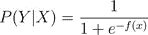

# 逻辑回归分类器

> 原文：<https://towardsdatascience.com/logistic-regression-classifier-8583e0c3cf9?source=collection_archive---------11----------------------->

Longleat Hedge Maze

***工作原理(下篇)***

***一步一步完成指南(概念性)***

逻辑回归是一种“统计学习”技术，被归类为专门用于“分类”任务的“监督”机器学习(ML)方法。在过去的二十年里，由于其卓越的发现违约者的能力，它获得了巨大的声誉，尤其是在金融领域。下面给出了逻辑回归和其他流行的线性分类器的一般使用模式。

Figure-1: Linear Classifiers and their Usage

当我们声明一个名称中包含“回归”一词的分类器被用于分类时，一个矛盾就出现了，但这就是为什么逻辑回归是神奇的:使用线性回归方程产生离散的二进制输出(图 2)。是的，它也属于 ML 方法的“判别模型”子组[1]，如支持向量机和感知器，它们都使用线性方程作为构建模块，并试图最大限度地提高训练集的输出质量。

*Figure-2: A Journey from Decision Function to Decision Boundary*

我们将按照给定的顺序在整篇文章中遵循下面的指南。从内容可以理解，这篇文章只是一个概念性的手册，旨在阐明逻辑回归分类器的技术工作流程。经过长时间的搜索和阅读，我意识到经验研究非常丰富，但机器学习实现的理论方面却非常匮乏。这也许就是为什么尤瓦尔·诺亚·哈拉里在他著名的“畅销书”书中写道:

> *“…事实上，现代化是一件非常简单的事情。整个契约可以用一句话来概括:人类同意放弃‘意义’来换取‘权力’……”*

通过本系列文章，我的目标是创建一个完整的指南，提供逻辑回归工作流中每个步骤的内在含义。

Index of the Article Series

这篇文章是“逻辑回归”系列文章的第一部分，我们将涵盖上述内容，直到“优化目标”主题。剩下的标题将会被即将到来的帖子填充。希望你喜欢…

# A.数据结构

输入 xᵢⱼ是长度为 *K* 的连续特征向量(xᵢ's)，其中 *j=1，…，k* 和 *i=1，…，n* 。因此，输入矩阵为 *X* ，其中包含 *N* 个输入(数据点)，每个包含 *K* 个特征。输入可以表示为矩阵 *X* ，如下所示。

并且输出 *yᵢ* 是离散的二元变量，因此 *y ϵ {0，1}* 。所以，我们可以假设 *yᵢ是概率参数为 pᵢ.的伯努利分布*

# B.试验设计

让我们做一个抛硬币的实验。假设硬币是公平的，那么它会给我们带来*同样可能的*正面和反面的结果。那就是'*后验*'的概率是:

其中 *X* 是输入矩阵，包含所有试验/观察及其特征。由于在这个“抛硬币”实验中不包括任何独立变量(特征)，我们的输入矩阵 *X* 只包括我们制作的轨迹，也就是说，它将是一个矢量“ *n×1* ”，其中 *x₁* 只是象征第一次试验，而不是具体的输入。

但是，如果我们用“信用评分”来代替实验，我们的结果仍然是离散的和二进制的(“默认”和“非”)，但是输入向量再次返回到矩阵，因为上面显示了一些特征！

在改变实验后，另一个期待我们的彻底改变是影响我们对硬币的公平性的'*不确定性。像不公平硬币一样，由于债务人的不同特征，信用拥有不同的违约机会。所以，我们的'*后验概率*'将不再是'*等概率*'了。*

# C.决策/激活功能

下图显示了最流行的“线性分类器”的决策功能，它们是感知器、线性回归和逻辑回归。在图表中，我们有许多符号，但不要担心，我们会用数学方法把它们全部弄清楚。暂且先给出它们的含义:wᵢ →权重/系数，s →回归函数，h →选择的分类器带来的假设集，θ → sigmoid/logistic 函数。(注:圆圈中的曲线代表所用激活函数的形状)

Figure-3: Activation Function Comparison for Three Linear Classifiers

前一部分描述的不公平带来了过程中的不确定性问题和预期的必要性。作为一种监督分类方法，**逻辑回归**帮助我们用一个可微分的【2】’*决策函数*收敛那些“不确定的”后验概率，如下图-4 所示。

Figure-4: *Logistic Sigmoid Activation Function*

这个函数称为'**逻辑函数**或' **sigmoid 函数**'，帮助我们将实值连续输入缩小到一个范围内 *(0，1)* ，这在处理概率时非常有用！借助于逻辑函数，我们可以写出如下的后验概率。

其中 *f(x)* 是一个由我们的特征( *xⱼ* )和它们相应的权重/系数( *βⱼ* )以线性形式组成的函数，如下所示。

其中 *x，β，f(x) ϵ Rᵏ* 和 *ε* 代表数据生成过程中不可避免的'*随机误差过程—噪声'*【3】。

通过使用上面的后验方程，我们可以将估计函数 *f(x)* 重写为如下所示的“*后验概率*”的形式。

这就是众所周知的“T4”概率比。当试图解释[5]线性回归函数 *f(x)* 的系数时，可以意识到它的有用性。

使用“对数”转换在 3 个主要方面帮助我们的学习机制:

1-它使值更加“规范化”(大值变小，反之亦然)。标准化(缩放)有助于我们达到更一致的(wrt 幅度)系数，即它们都不会以主导方式影响结果！

2-它使得内部的运算更容易执行(乘法→求和、除法→减法、指数→乘法)

3-它创建一个具有'*单调性*'的曲线/超平面(值序列)。单调递增或递减的函数:

*   可以由“优化解算器”[6]在时间上更有效地遍历，因为它们不包含“局部最小值/最大值”
*   因为对数函数的最优解将与原始函数的最优解相同。

不同基础(自然或其他)“对数函数”的曲线/表面可在下图 5 中找到。可以看到，都是'*单调*'和从同一点切割 *x 轴*(*log(1)= 0*)。在逻辑回归的情况下，我们无一例外地使用自然(10)作为对数函数的基础。

*Figure-5: Logarithmic Functions with various bases*

穿越 *x=1* (其中 *y=0* )有助于我们在解读‘事件’和‘非事件’(log odds)比率的方式上进行更多的逻辑转换。

所以，对于*P(Event)>P(no Event)*的情况，我们停留在函数的正侧，否则我们通过负侧。当在结果空间中标记观察时，这很有意义。

# D.目标函数

像其他机器学习分类器[7]一样，逻辑回归有一个'**目标函数**，它试图最大化实验[8]的'*似然函数*。这种方法被称为“最大似然估计——MLE ”,数学上可以写成如下形式。

在哪里

*   输出 *y → {0，1}* ，
*   *P(yᵢ|xᵢ)* 是后验概率，等于 *1/(1+e⁻ᶠ* 和
*   参数 *β* 是 *f : f(x)* 中“权重/系数”的向量

正如我们之前定义的。在根据参数 *β* 描述和优化该目标之前，最好进行“硬币”实验，以简化剩余的过程。因此，“抛硬币”问题的“**目标函数**可以写成下面的格式。

其中 *p* 为成功的可能性(设为 Head)， *yᵢ* 为独立伯努利随机变量( *y → {0，1}* )，内项为实验的'*联合似然分布*'函数。我们希望找到 *p* 的最佳值，以便最大化此功能。但是，我们如何决定最大化它将符合我们的主要目标，即获得高分类精度。在“线性回归”中执行的相同过程是明确的，因为选择 LSE 作为目标函数肯定且明显地带来预测( *yᵢ_hat* )和实际目标( *yᵢ* )之间的最短距离。

为了对逻辑回归的 MLE 情况获得同样的清晰性，我们需要以数字的方式接近它。为此，让我们在硬币实验的目标函数中为可能性 *p* 分配杂项值。这些可能性可能与已知的目标值 *yᵢ* 不一致。

Table-1: Effects of different ‘p’ and ‘y’ values on Likelihood Function

我们设计了 4 个例子，其中 2 个与目标没有不一致，即我们成功地进行了分类。因此，当我们比较似然函数回报时， *p* 相对于目标 *y* 的适当赋值会产生更高的似然性！这就是为什么我们选择最大化'*对数似然函数*'作为上述逻辑回归案例的目标。更正式地说，我们可以用下面给出的两个步骤来总结这个逻辑。

*   对于标记为' *1* 的样本，我们希望估计的 *p* 尽可能接近 1
*   对于标记为“0”的样本，我们希望估计 *(1-p)* 尽可能接近 1

# E.优化目标

# E.1 .获得梯度方程(微分)

## E.1.1 .硬币实验，“平均学习”

不要说得太多，让我们把文章的剩余部分留给第二个帖子，我会连续分享。所有的参考文献和脚注都将出现在第二篇，也可能是最后一篇文章中。希望你跟随…