# 使用 Python 实现机器学习中的逻辑回归

> 原文：<https://towardsdatascience.com/logistic-regression-explained-and-implemented-in-python-880955306060?source=collection_archive---------0----------------------->

## 了解逻辑回归是如何工作的，以及如何使用 python 和 sklearn 轻松实现它。

在统计学中，逻辑回归用于模拟某一类或某一事件的概率。在这篇文章中，我将更多地关注模型的基础和实现，而不是深入数学部分。


The value of weights b0 and b1 are updated at each iteration

这是这段视频的书面版本。如果你喜欢看视频。

逻辑回归与[线性回归](/linear-regression-using-gradient-descent-97a6c8700931)相似，因为两者都涉及根据给定的训练数据估计预测方程中使用的参数值。线性回归预测一些连续的因变量的值。而逻辑回归预测依赖于其他因素的事件或类别的概率。因此，逻辑回归的输出总是在 0 和 1 之间。由于这一特性，它通常用于分类目的。

# 逻辑模型

考虑一款具有 *x1、x2、x3 … xn* 功能的车型。让二进制输出由 *Y* 表示，它可以取值 0 或 1。
设 *p* 为 *Y = 1* 的概率，我们可以表示为 *p = P(Y=1)* 。
这些变量之间的数学关系可以表示为:

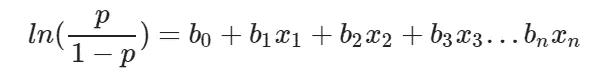

这里的术语*p/(1p)*被称为*几率*，表示事件发生的可能性。因此，*ln(p/(1p))*被称为*对数概率*，它只是用来将介于 0 和 1 之间的概率映射到一个介于(∞，+∞)之间的范围。术语 *b0，b1，b2…* 是我们将在训练期间估计的参数(或权重)。

这只是我们要做的事情背后的基本数学。我们对这个等式中的概率 p 感兴趣。因此，我们简化等式以获得 p 的值:

1.  LHS 上的对数项 *ln* 可以通过升高 RHS 作为 *e* 的幂来移除:

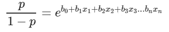

2.现在我们可以很容易地简化来获得 *p* 的值:

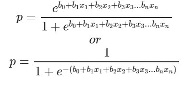

这实际上是在其他机器学习应用中广泛使用的 *Sigmoid 函数*的方程。*s 形函数*由下式给出:

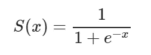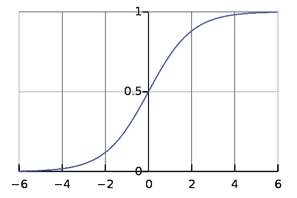

The sigmoid curve (Wikipedia)

现在我们将使用上面推导出的方程来进行预测。在此之前，我们将训练我们的模型，以获得导致最小误差的参数值 *b0，b1，b2…* 。这就是误差或损失函数的由来。

# 损失函数

损失基本上就是我们预测值的误差。换句话说，这是我们的预测值和实际值之间的差异。我们将使用 [L2 损失函数](https://afteracademy.com/blog/what-are-l1-and-l2-loss-functions)来计算误差。理论上你可以用任何函数来计算误差。该功能可以分解为:

1.  假设实际值为 yᵢ.让使用我们的模型预测的值被表示为ȳᵢ.找出实际值和预测值之间的差异。
2.  平方这个差值。
3.  计算训练数据中所有值的总和。

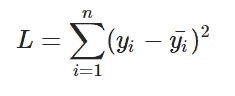

现在我们有了误差，我们需要更新我们的参数值来最小化这个误差。这是“学习”实际发生的地方，因为我们的模型正在根据它以前的输出更新自己，以便在下一步中获得更准确的输出。因此，随着每次迭代，我们的模型变得越来越精确。我们将使用*梯度下降算法*来估计我们的参数。另一种常用的算法是[最大似然估计](https://en.wikipedia.org/wiki/Maximum_likelihood_estimation)。

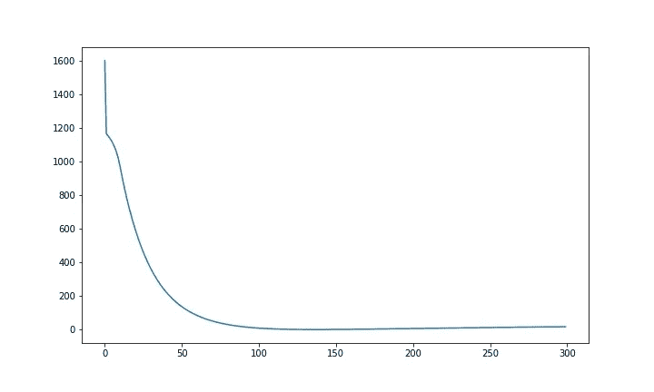

The loss or error on the y axis and number of iterations on the x axis.

# 梯度下降算法

你可能知道函数的偏导数在最小值时等于 0。所以梯度下降基本上就是用这个概念，通过最小化损失函数来估计我们模型的参数或者权重。[点击此处](https://www.youtube.com/watch?v=4PHI11lX11I)获得关于梯度下降如何工作的更详细的解释。
为了简单起见，在本教程的剩余部分，让我们假设我们的输出只依赖于单个特征 *x* 。因此，我们可以将等式改写为:

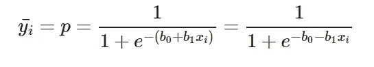

因此，我们需要使用给定的训练数据来估计权重 b0 和 b1 的值。

1.  最初让 b0=0，b1=0。设 L 为学习率。学习速率通过学习过程中每一步 b0 和 b1 值的更新量来控制。这里设 L=0.001。
2.  计算关于 b0 和 b1 的偏导数。偏导数的值会告诉我们损失函数离它的最小值有多远。这是衡量我们的权重需要更新多少才能达到最小或理想的 0 误差。如果您有多个特征，您需要计算每个权重 b0，b1 … bn 的偏导数，其中 n 是特征的数量。关于计算偏导数背后的数学的详细解释，请查看[我的视频。](https://youtu.be/l8VEth6leXA)

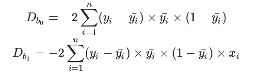

3.接下来，我们更新 b0 和 b1 的值:

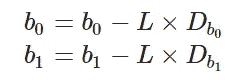

4.我们重复这个过程，直到我们的损失函数是一个非常小的值或者理想地达到 0(意味着没有错误和 100%的准确性)。我们重复这个学习过程的次数被称为迭代或时期。

# 实施模型

导入必要的库并在此下载数据集[。这些数据来自](https://drive.google.com/uc?id=15WAD9_4CpUK6EWmgWVXU8YMnyYLKQvW8&export=download) [kaggle](https://www.kaggle.com/rakeshrau/social-network-ads) ，描述了通过社交媒体上的广告购买的产品信息。我们将预测购买的*的价值*，并考虑一个单一特征*年龄*来预测购买的*的价值*。您也可以拥有多个特性。

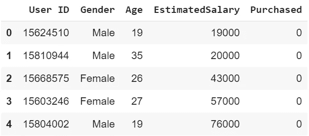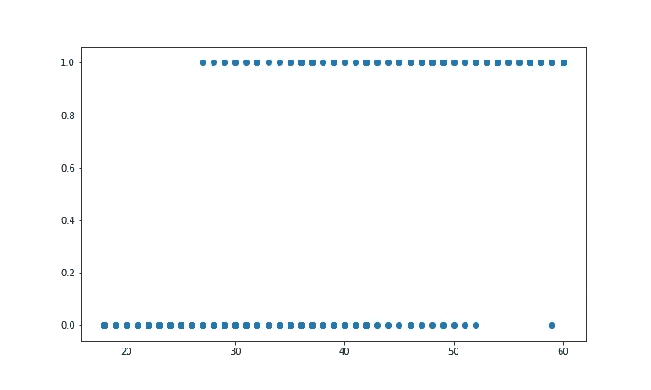

我们需要将我们的训练数据标准化，并将平均值移至原点。由于逻辑方程式的性质，这对于获得准确的结果是很重要的。这是通过*规格化*方法完成的。*预测*方法只需将权重值插入逻辑模型方程并返回结果。这个返回值就是所需的概率。

该模型被训练 300 个时期或迭代。在每次迭代中计算偏导数，并更新权重。你甚至可以计算每一步的损失，看看每一步它是如何趋近于零的。

由于预测方程返回一个概率，我们需要将其转换为二进制值，以便能够进行分类。为此，我们选择一个阈值，比如 0.5，所有高于 0.5 的预测值将被视为 1，其他值将为 0。您可以根据正在解决的问题选择合适的阈值。

这里，对于测试数据中的每个年龄值，我们预测产品是否被购买，并绘制图表。通过检查我们做出了多少正确的预测，并用它除以测试用例的总数，可以计算出准确性。我们的准确率似乎是 85%。

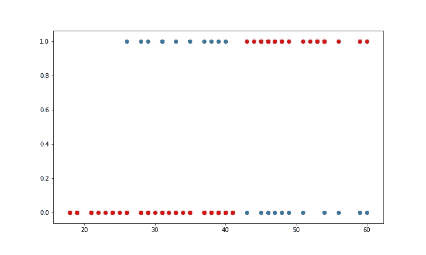

```
Accuracy = 0.85
```

# 使用 Sklearn 实现

库 sklearn 可用于使用 *LogisticRegression* 类在几行代码中执行逻辑回归。它还支持多种功能。它要求输入值为特定格式，因此在使用 *fit* 方法进行训练之前，已经对其进行了整形。

使用它的准确度是 86.25%，非常接近我们从头实现的模型的准确度！


```
Accuracy = 0.8625
```

因此，我们使用 python 从头开始轻松实现了一个看似复杂的算法，并将其与 sklearn 中做同样工作的标准模型进行了比较。我认为这里最关键的部分是梯度下降算法，以及学习如何在每一步更新权重。一旦你学会了这个基本概念，你就能够估计任何函数的参数。

[**点击这里**](https://colab.research.google.com/drive/1qmdfU8tzZ08D3O84qaD11Ffl9YuNUvlD) **查看谷歌合作实验室的完整代码和解释。您可以使用它来轻松地探索和研究代码。**

> *有问题吗？需要帮助吗？联系我！*

*电子邮件:adarsh1021@gmail.com*

*领英:*[*https://www.linkedin.com/in/adarsh-menon-739573146/*](https://www.linkedin.com/in/adarsh-menon-739573146/)

*推特:*[*https://twitter.com/adarsh_menon_*](https://twitter.com/adarsh_menon_)

**参考文献**

*   人工智能，现代方法—第 726、727 页
*   [https://machine learning mastery . com/logistic-regression-for-machine-learning/](https://machinelearningmastery.com/logistic-regression-for-machine-learning/)
*   [https://towards data science . com/logit-of-logistic-regression-understanding-the-fundamentals-f 384152 a 33d 1](/logit-of-logistic-regression-understanding-the-fundamentals-f384152a33d1)
*   [https://en.wikipedia.org/wiki/Logistic_regression](https://en.wikipedia.org/wiki/Logistic_regression)